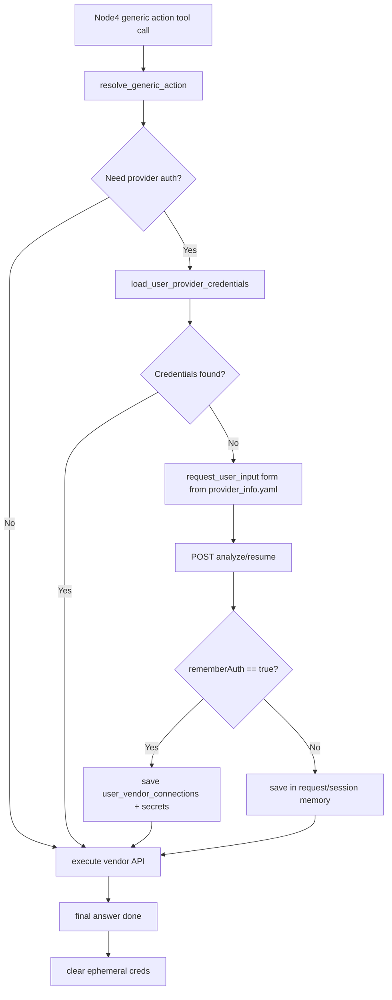

# SOC 厂商授权按需采集方案

## 目标
在 `soc-alert` 的 node4 执行具体厂商 API 前，自动完成以下流程：
- 先查用户是否已有该 `provider_code` 授权。
- 若无，发起 `request_user_input(kind=form)` 弹窗，字段来自 `provider_info.yaml` 的 `credential_fields`。
- 允许用户勾选“永久保存”。
- 恢复后拿到凭据并组装请求头/参数执行 API。

## 现状与切入点
- node4 的工具调用路径：`GenericQueryActionInput -> execute_generic_action() -> vendor handler`，核心在 `app/tools/soc_alert/action_adaptor/resolver.py`。
- 已有 HITL 通道：`request_user_input`（`app/tools/hitl_tools.py`）+ SSE 转换（`app/parsers/hitl_interrupt_sse.py`）+ `/analyze/resume`。
- Splunk 侧现有配置文件：`app/tools/soc_alert/api/splunk/provider_info.yaml`，已含 `provider_code` 与 `credential_fields`。
- 当前厂商 API 配置仍偏全局 `soc_alert_api_services.json`（`app/tools/soc_alert/api/flocks_config.py`），需改为“用户级授权优先”。

## 设计方案

### 1) Provider Registry（本地 YAML）
新增 `app/tools/soc_alert/api/provider_registry.py`：
- 扫描 `app/tools/soc_alert/api/**/provider_info.yaml`。
- 以 `provider_code` 建索引（禁止用 `name` 作为主键）。
- 暴露：
  - `get_provider(provider_code)`
  - `build_hitl_fields(provider_code)`：把 `credential_fields` 转成 `FieldSpec` 所需格式。
  - `resolve_auth_schema(provider_code)`：返回如何注入（header/query/body）等。

### 2) 用户授权存取服务
新增 `app/services/vendor_auth_service.py`：
- DB 持久层（local pg + supabase 兼容接口）
  - `get_active_connection(user_id, provider_code)`
  - `save_connection(user_id, provider_code, display_name, auth_type, metadata)`
  - `save_connection_secret(connection_id, plaintext_dict)`（沿用现有加密方式，写 `user_vendor_connection_secrets`）
- 会话临时层（仅本轮有效）
  - `set_ephemeral(session_id, request_id, provider_code, creds, ttl)`
  - `get_ephemeral(...)`
  - `clear_request_ephemeral(request_id)`

### 3) node4 执行前授权网关
在 `app/tools/soc_alert/action_adaptor/resolver.py` 增加“授权前置检查”包装：
- 在 `execute_generic_action()` 内、调用 `mapping.handler(**resolved.tool_input)` 前执行：
  1. 识别 `provider_code`（由 vendor 归一化结果映射）。
  2. 查 DB + ephemeral，若有则注入调用上下文。
  3. 若无则抛出标准化 `MissingProviderAuthInterrupt`（携带 provider_code、fields、prompt、request_id）。
- 在工具包装层捕获该异常并调用 `request_user_input(kind=form)`，触发中断。

### 4) Resume 数据协议（含“永久保存”）
利用现有 `/analyze/resume` 的 `resume: Any`：
- 约定 `resume` payload：
  - `provider_code`
  - `credentials`（按 `credential_fields.key`）
  - `remember_auth`（bool）
  - 可选 `display_name`
- `remember_auth=true`：写 DB（connection + secret）。
- `remember_auth=false`：仅写 ephemeral，生命周期到本次 request done/error/cancel。

### 5) 厂商 API 调用注入改造
以 Splunk 为先：
- 修改 `app/tools/soc_alert/api/splunk/api_splunk_tools.py` 当前 `svc.api_key` 模型。
- 改为接收“已解析好的授权对象”（如 username/password）并按 `provider_info.yaml.auth` 组装：
  - `Authorization: Basic base64(username:password)`
- 兼容 fallback：若无用户授权且允许全局配置，可继续读 `flocks_config`（可开关）。

### 6) 事件与前端对接
- 复用现有 `interruptKind=user_input_v1` + `parameter_request` SSE。
- 在 `hitl_interrupt_sse.py` 保持字段透传；新增“remember_auth”checkbox 对应参数（可用 `paramType=boolean`，若前端不支持则用 `choice` 退化）。

### 7) 安全与生命周期
- 永久保存：仅密文入库，日志严格脱敏。
- 临时保存：内存仅存 request/session 作用域，`done/error/cancel` 后清除。
- 增加并发保护：同一 `session_id + provider_code` 的并发中断去重（避免重复弹窗）。

### 8) 测试策略（TDD）
- `tests/test_provider_registry.py`
  - 读取 YAML、`provider_code` 唯一、字段映射正确。
- `tests/test_vendor_auth_service.py`
  - DB 持久与 ephemeral 读写、过期清理。
- `tests/test_soc_action_auth_interrupt.py`
  - 缺失授权触发中断，resume 后继续执行。
- `tests/test_soc_action_auth_persistence.py`
  - `remember_auth=true` 入库；`false` 不入库且请求结束清理。
- `tests/test_splunk_auth_injection.py`
  - Basic Header 组装正确，不再误用 Bearer。

## 关键文件改动清单
- 新增：`app/tools/soc_alert/api/provider_registry.py`
- 新增：`app/services/vendor_auth_service.py`
- 修改：`app/tools/soc_alert/action_adaptor/resolver.py`
- 修改：`app/tools/soc_alert/action_adaptor/tool_factory.py`
- 修改：`app/tools/soc_alert/api/splunk/api_splunk_tools.py`
- 可能修改：`app/parsers/hitl_interrupt_sse.py`（若需要 boolean 字段兼容）
- 新增测试：`python-agent-service/tests/test_*vendor_auth*.py`

## 落地顺序
1. 先做 Provider Registry + 单测。
2. 做 VendorAuthService（DB + ephemeral）+ 单测。
3. 在 resolver 接入“缺授权中断 + resume后继续”。
4. 改 Splunk 注入方式并补回归测试。
5. 接前端 checkbox 字段与清理钩子（done/error/cancel）。