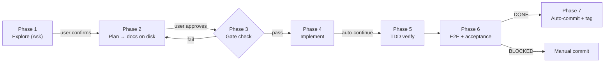

# Delivery pipeline v4.0 (Ask → Plan → Agent → verify)

Artifacts live under **`docs/Process/<slug>/`** (kebab-case). Humans gate exploration and plan approval. Agent runs Phase 4–7 with minimal interruptions.

> Detailed explanations, troubleshooting, and rationale → **`SKILL_APPENDIX.md`** (same folder).



---

## Golden rules

| ID | Rule |
|----|------|
| **GR-PERSIST** | All docs (`proposal.md`, `design.md`, `acceptance*.md`) on disk under `docs/Process/<slug>/` **before Phase 4**. |
| **GR-ACC** | Acceptance criteria = **user-owned**. Agent **structures** user input into markdown; does **not** invent major criteria. |
| **GR-MOCK** | Agent **never** generates mockup images. User copies to `mockups/`. Agent checks once, offers skip. Never re-ask. |
| **GR-SIGNOFF** | Sign-off tables stay **empty** until Phase 6 verification. |
| **GR-MCP** | Playwright MCP `/qa` + `/design-review`: **mandatory** when `browser_*` tools invocable. Otherwise **SKIP + reason** in Sign-off. |
| **GR-SECRETS** | Never stage `.env`, `*.pem`, `chrome-debug-profile/**`. Use explicit `git add` paths; inspect `git diff --cached`. |

---

## Scope tiers

Agent evaluates at Phase 1 exit; user can override.

| Tier | When | Required artifacts |
|------|------|--------------------|
| **Patch** | ≤ 3 files, no new API/schema/UI | `design.md` (lite: touch list + test plan only). Skip proposal + acceptance. |
| **Standard** | Multi-file, new API or UI component | Full Phase 1–7. |
| **Epic** | Cross-system, multi-sprint | Full + ADR, phased rollout plan. |

---

## Hard limits

- **Remediation cap:** ≤ **5** combined rounds across `/qa`, `/design-review`, acceptance re-checks. After 5 → **STOP** + report.
- **Same-root-cause:** same blocker twice → stop and escalate.

---

## Template paths

| Template | Path |
|----------|------|
| Acceptance spec | `docs/Process/_templates/ACCEPTANCE_SPEC.md` |
| Acceptance-UI spec | `docs/Process/_templates/ACCEPTANCE_UI_SPEC.md` |
| Acceptance example | `docs/Process/_templates/acceptance.example.md` |
| Acceptance-UI example | `docs/Process/_templates/acceptance-ui.example.md` |
| target.yaml template | `.cursor/design-review-handoff/target.example.yaml` |
| Auth bootstrap | `docs/Process/LOCAL_AUTOMATION_AUTH.md` |

---

## Phase 1 — Explore (Ask mode)

1. Read-heavy, no implementation commits.
2. Optional: Skill **`process-explore-brainstorm`** for deeper ideation.
3. User **explicitly confirms** → Phase 2. No doc authorship obligation.

---

## Phase 2 — Plan

Create `docs/Process/<slug>/` then persist (with Write tool — not chat-only):

| # | File | Content |
|---|------|---------|
| 1 | **`proposal.md`** | Problem, goals, non-goals, users, scope, dependencies, success metrics. |
| 2 | **`design.md`** | Full implementation record — see **§design.md sections** below. If Cursor `*.plan.md` exists → `## Source plan (traceability)` (default). Details in **SKILL_APPENDIX.md §C**. |
| 3 | **`acceptance.md`** | Backend/API scope — per **GR-ACC** + templates. |
| 4 | **`acceptance-ui.md`** | UI scope — per **GR-ACC** + templates. |
| 5 | **`mockups/`** | Per **GR-MOCK**: ensure dir, check images, ask once, skip = `## Mockups deferred`. |

UI scope → also run **`plan-design-review`** (`.cursor/skills/plan-design-review/SKILL.md`); resolve or defer with rationale.

### design.md required sections

- **`## Metadata`** — slug, date, links.
- **`## Source plan (traceability)`** — (Path A only) plan path, 1–3 sentence intent, "`design.md` is SoT".
- **`## Todo list`** — GFM `- [ ]` items with stable **kebab-id** per line, ordered by dependency. Canonical Phase 4 backlog.
- **`## Architecture`** — text + Mermaid (component or C4-lite).
- **`## Flows`** — sequence / flowchart (Mermaid).
- **`## Contracts`** — API payloads, SSE shapes, DB migrations, config keys.
- **`## Code touch list`** — concrete file paths; flag risky areas.
- **`## Testing strategy`** — unit/integration types **and** E2E scenarios table (Standard/Epic tier). See **§E2E testing** below.
- **`## Edge cases & errors`** — failure modes, retries, idempotency.
- **`## Implementation order`** — phased steps or dependency order.
- **`## Rationale`** — ADR-style notes for non-obvious trade-offs.
- **`## UI`** (if applicable) — component/state breakdown, interaction states.
- Pseudocode for non-trivial logic.
- Omit section only if truly N/A with one-line justification.
- Optional YAML frontmatter: `name`, `overview`, `isProject` only. No `todos:` key.

### E2E testing (Standard / Epic tier)

`## Testing strategy` in `design.md` should include an **E2E scenarios** sub-section when the delivery involves UI or cross-system flows:

```markdown
### E2E scenarios
| ID | Scenario | Route / API | Key assertions |
|----|----------|-------------|----------------|
| E2E-01 | ... | ... | ... |
```

- Each E2E ID maps to acceptance criterion IDs (e.g. `A-01` evidence = `E2E-01 passed`).
- Specs live in `e2e/tests/<slug>.spec.ts`. Use `e2e/fixtures/authenticated.ts` for logged-in sessions.
- Patch tier: E2E optional. Standard/Epic: E2E required when UI or API flows are in scope.

### Exit checklist

- [ ] `proposal.md` exists, non-empty.
- [ ] `design.md` has architecture + flow + touch list + depth sections (or N/A justification).
- [ ] Plan traceability correct (Path A: traceability section; Path B: standalone; no fake archive).
- [ ] `## Todo list` present with `- [ ]` items + stable ids.
- [ ] UI scope: `acceptance-ui.md` with user criteria; mockups present or skip documented.
- [ ] Backend scope: `acceptance.md` with user criteria.
- [ ] Sign-off tables empty (**GR-SIGNOFF**).

**Human approval** required before Phase 3.

---

## Phase 3 — Pre-implementation gates

Re-confirm Phase 2 artifacts. Do **not** write acceptance/mockups here for the first time.

**3A — Frontend** (if UI):
1. `acceptance-ui.md` valid per `ACCEPTANCE_UI_SPEC.md`.
2. Mockups present **or** documented skip.
3. `target.local.yaml` exists for `/design-review`.
4. `design.md` has `## Design review handoff`.

**3B — Backend:**
- `acceptance.md` present with stable ids + verifiable criteria.

Gate fails → **STOP**. Do not implement.

---

## Phase 4 — Implement (Agent mode)

1. Follow **`AGENT.md`** (TDD, English comments, planning discipline).
2. Work `## Todo list`: flip `- [ ]` → `- [x]` as completed.
3. Implement against `design.md` + `acceptance*.md` as contract. Keep changes scoped.
4. No routine confirmations. No new acceptance files (Phase 6 fills sign-off only).
5. Scope changes → add/split Todo items with user agreement.
6. **Auto-continue** to Phase 5 when done. Do not wait for user to say "go test."

---

## Phase 5 — Automated verification

### 5.1 Unit / Integration

1. Run `npm run test` (Vitest) + `pytest` for touched areas (match `design.md` testing strategy).
2. Red → Green → Refactor if gaps.
3. All required tests must **pass** (exit 0).

### 5.2 E2E (if `design.md` has E2E scenarios — Standard/Epic tier)

1. Ensure services running (Vite dev + Python API).
2. Run `npm run test:e2e -- --grep <slug>` for this delivery's specs under `e2e/tests/`.
3. Must **pass** (exit 0) before Phase 6. If no E2E scenarios defined → skip with note.

E2E specs live in `e2e/tests/<slug>.spec.ts`; use `e2e/fixtures/authenticated.ts` for logged-in tests. Config: `playwright.config.ts`.

---

## Phase 6 — Exploratory QA & acceptance

Remediation cap applies (see **Hard limits**). Phase 5 handles **automated regression** (unit + E2E); Phase 6 handles **exploratory discovery** + formal sign-off.

**6.1 Auth** — For logged-in UI: `npm run auth:bootstrap` → `browser_navigate` to printed URL once. See `LOCAL_AUTOMATION_AUTH.md`.

**6.2 /qa** — Per **GR-MCP**: `.cursor/skills/qa/SKILL.md` + Playwright MCP (exploratory). Use `target.local.yaml` `base_url`.

**6.3 /design-review** — Per **GR-MCP** (UI scope): `.cursor/skills/design-review/SKILL.md` + `target.local.yaml` URL. Load `mockups/` as reference if present. Walk `acceptance-ui.md` criteria.

**6.4 Backend** — Walk `acceptance.md` criteria; record evidence in Sign-off.

**6.5 Sign-off evidence** — Use **both** automated and exploratory results:
- E2E test IDs (e.g. `E2E-01 passed via npm run test:e2e`) as automated evidence.
- `/qa` + `/design-review` findings as exploratory evidence.

**6.6 Outcome:**

| Status | Meaning |
|--------|---------|
| **DONE** | Phase 5 green (unit + E2E); `/qa` + `/design-review` executed or SKIPPED with reason; sign-off has evidence. |
| **DONE_WITH_CONCERNS** | Minor deferred items documented. |
| **BLOCKED** | Cap hit or external dependency; list next human actions. |

→ Continue to Phase 7.

---

## Phase 7 — Git checkpoint

### Auto-commit gates (ALL must pass)

| # | Gate |
|---|------|
| 1 | Outcome = DONE or DONE_WITH_CONCERNS. |
| 2 | Phase 5: all test commands exited 0 (unit/integration **and** E2E if applicable). |
| 3 | Phase 6: sign-off rows have evidence (or DONE_WITH_CONCERNS: minor gaps documented). |
| 4 | `/qa`: ran + passed, **or** N/A (backend-only / MCP not invocable → **manual path**). |
| 5 | `/design-review`: ran + passed (or waiver), **or** N/A (no UI / MCP unavailable → **manual path**). |
| 6 | No secrets staged (**GR-SECRETS**). |

### All gates pass → auto-commit

1. `git add <explicit paths from touch list>`
2. `git commit -m "delivery(<slug>): verification passed — <one-line summary>"`
3. `git tag -a "passed/<slug>-<YYYYMMDD>-<short>" -m "Full verification pass for <slug>"`
4. Report: branch, full hash, short hash, tag, rollback commands. **Do not push.**

### Any gate fails → manual path

Do not auto-commit. Tell user: 完整流程未满足自动提交条件，请自行 `git commit` 或按 **`AGENT.md` checkpoint 规则**让 Agent 在确认后代为提交。

---

## Abort procedure

User says "放弃" / "abort" → add `status: abandoned` + reason to `design.md` `## Metadata`. Do not delete files. No further implementation.

---

## Invocation

`/delivery-pipeline` or `/workflow-delivery-pipeline` with `<requirement-slug>`.
