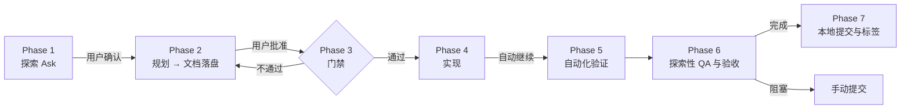

# SecManus 交付工作流说明

本文档说明本仓库采用的 **delivery-pipeline（Ask → Plan → Agent → verify）** 工作流：需求如何落盘、如何开发与验收、以及如何与 `AGENT.md` 对齐。

**权威细则**以 Cursor Skill 为准：

- **核心流程：** [`.cursor/skills/delivery-pipeline/SKILL.md`](.cursor/skills/delivery-pipeline/SKILL.md)（v4.0）
- **补充说明与排障：** [`.cursor/skills/delivery-pipeline/SKILL_APPENDIX.md`](.cursor/skills/delivery-pipeline/SKILL_APPENDIX.md)
- **行为与 TDD / 提交约定：** 根目录 [`AGENT.md`](AGENT.md)

---

## 1. 工作流总览

- **交付物根目录：** `docs/Process/<requirement-slug>/`（kebab-case，与文件夹名一致）
- **人类门禁：** 探索是否充分、规划文档是否批准，由人在 Phase 1→2、Phase 2→3 之间把关；Agent 在 Phase 4 之后尽量少打断，直至验证上限或阻塞。

---

## 2. 与 OpenSpec 的关系

本工作流 **不依赖** OpenSpec CLI。历史变更若存在于 `openspec/changes/`，可与本流程并存；**新需求**以 `docs/Process/<slug>/` 为准。

---

## 3. 黄金规则（Golden rules）

| ID | 含义 |
|----|------|
| **GR-PERSIST** | Phase 4 编码前，`proposal.md`、`design.md`、`acceptance*.md` 必须已写入 `docs/Process/<slug>/`。 |
| **GR-ACC** | 验收标准由**用户**提供；Agent 只负责结构化写入表格，不擅自编造用户未同意的主要条目。 |
| **GR-MOCK** | Agent **不生成** mockup 图片；由用户放入 `mockups/`；最多询问一次是否跳过并记录 `## Mockups deferred`。 |
| **GR-SIGNOFF** | Sign-off 表在 Phase 6 验证前保持空白。 |
| **GR-MCP** | 本会话能调用 Playwright MCP（`browser_*`）时，`/qa` 与 UI 相关的 `/design-review` **必须执行**；否则 Sign-off 中 **SKIP + 原因**。 |
| **GR-SECRETS** | 禁止将 `.env`、`*.pem`、Chrome 调试 profile 等敏感或巨型目录纳入提交；`git add` 使用显式路径并检查 `git diff --cached`。 |

---

## 4. 范围分级（Scope tiers）

| 级别 | 适用 | 文档要求 |
|------|------|----------|
| **Patch** | 少量文件、无新 API/Schema/UI | 可仅 `design.md`（精简：改动列表 + 测试计划）；可跳过 proposal / acceptance。 |
| **Standard** | 多文件、新 API 或 UI | 完整 Phase 1–7。 |
| **Epic** | 跨系统、多迭代 | 完整流程 + ADR、分阶段上线说明等。 |

具体由 Agent 在 Phase 1 结束时评估，**用户可覆盖**。

---

## 5. Phase 2 落盘清单

在 **任何实现（Phase 4）之前**，`docs/Process/<slug>/` 下应包含：

| 文件/目录 | 说明 |
|-----------|------|
| `proposal.md` | 问题、目标、非目标、范围、依赖、成功指标等 |
| `design.md` | 架构、流程（Mermaid）、契约、代码改动列表、`## Todo list`（`- [ ]` + 稳定 id）、测试策略（含 Standard/Epic 下的 E2E 场景表）等 |
| `acceptance.md` | 后端/API 等非 UI 验收（按模板） |
| `acceptance-ui.md` | UI 验收（按模板） |
| `mockups/` | 用户提供的参考图；或经用户确认跳过并写明 `## Mockups deferred` |

模板与规范：

- `docs/Process/_templates/ACCEPTANCE_SPEC.md`
- `docs/Process/_templates/ACCEPTANCE_UI_SPEC.md`
- `docs/Process/_templates/acceptance.example.md`
- `docs/Process/_templates/acceptance-ui.example.md`

**仅聊天里的 Plan 摘要不算落盘**；须用工具写入文件。若 Cursor Plan 模式未写磁盘，可用 Agent 执行 **`/process-plan-docs`**（见 `.cursor/commands/process-plan-docs.md`）。

---

## 6. Phase 5：自动化验证

### 6.1 单元 / 集成

- 前端：`npm run test`（Vitest）
- 后端（按需）：`pytest`（`python-agent-service/tests`）
- 遵循 `design.md` 中的测试策略；失败则 **Red → Green → Refactor**，全部通过（exit 0）后再进入 Phase 6。

### 6.2 E2E（Playwright Test Runner）

- **位置：** `e2e/tests/`、`playwright.config.ts`
- **命令：** `npm run test:e2e`（可按 slug grep，见 SKILL）
- **与 MCP 的区别：** E2E 是 **仓库内可重复执行的测试代码**，用于回归；不依赖 Cursor MCP 是否可用。
- **登录：** 与 `npm run auth:bootstrap` 同源凭证（`E2E_EMAIL` / `E2E_PASSWORD` 等），详见 [`docs/Process/LOCAL_AUTOMATION_AUTH.md`](docs/Process/LOCAL_AUTOMATION_AUTH.md)。

Standard/Epic 且涉及 UI 或跨系统流程时，应在 `design.md` 的 `## Testing strategy` 中写明 **E2E scenarios** 表，并实现对应 spec。

---

## 7. Phase 6：探索性 QA 与验收

- **`/qa`：** 遵循 [`.cursor/skills/qa/SKILL.md`](.cursor/skills/qa/SKILL.md)，使用 **Playwright MCP** 做探索性检查（非仓库内固定脚本）。
- **`/design-review`：** 遵循 [`.cursor/skills/design-review/SKILL.md`](.cursor/skills/design-review/SKILL.md)；本地目标配置见 [`.cursor/design-review-handoff/target.example.yaml`](.cursor/design-review-handoff/target.example.yaml)（复制为 **gitignore** 的 `target.local.yaml`）。
- **修复与回归：** Phase 6 对 `/qa`、`/design-review` 与验收重验合计 **最多 5 轮**；同一根因重复两次应升级处理（见 SKILL **Hard limits**）。
- **Sign-off：** 同时记录自动化证据（如 E2E 用例 id）与探索性结论。

---

## 8. Phase 7：本地 Git 检查点

当 Phase 5–6 全部满足 SKILL 中 **auto-commit gates** 时，Agent 可 **自动** 执行本地 `git commit` 并打 **`passed/<slug>-<YYYYMMDD>-<short>`** 标签；**不自动 `git push`**。

任一闸门不满足 → 走 **手动提交** 路径，见 `AGENT.md` 的 **Local checkpoint commits**。

---

## 9. 项目内 Cursor Skills（团队共享）

以下 skill 已放在仓库内，**clone 即可用**，无需每人维护 `~/.claude/skills/` 副本：

| Skill | 路径 |
|-------|------|
| delivery-pipeline | `.cursor/skills/delivery-pipeline/` |
| qa | `.cursor/skills/qa/` |
| design-review | `.cursor/skills/design-review/` |
| plan-design-review | `.cursor/skills/plan-design-review/` |
| process-explore-brainstorm | `.cursor/skills/process-explore-brainstorm/` |
| （其他） | `.cursor/skills/update-deepagents-vendor` 等 |

在 Cursor 中可通过 **`/delivery-pipeline`**、**`/workflow-delivery-pipeline`** 等命令触发对应流程说明。

---

## 10. 常用命令速查

| 场景 | 命令 |
|------|------|
| 仅写 Phase 2 文档 | `/process-plan-docs` + `<slug>` |
| 前端单元测试 | `npm run test` |
| E2E | `npm run test:e2e` / `npm run test:e2e:noauth` |
| 本地自动化登录 URL | `npm run auth:bootstrap`（需 Python API + `.env` 中 E2E 账号） |
| Playwright MCP | 配置见 `.cursor/mcp.json` |

---

## 11. 中止交付

用户明确表示放弃时：在 `design.md` 的 `## Metadata` 中记录 `status: abandoned` 与原因；**不删除**已写文档，停止后续实现。

---

若你后续调整了工作流结构或门禁规则，请同步更新 **`project_context.md`** 与本文件，并保持与 **`.cursor/skills/delivery-pipeline/SKILL.md`** 一致。
