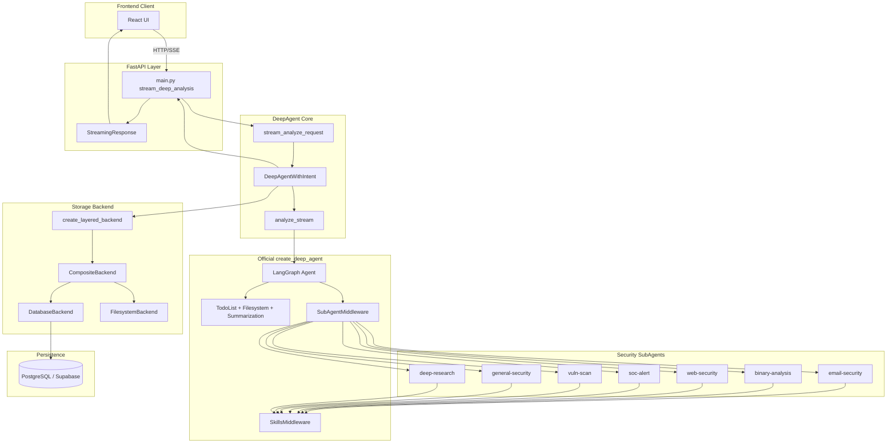
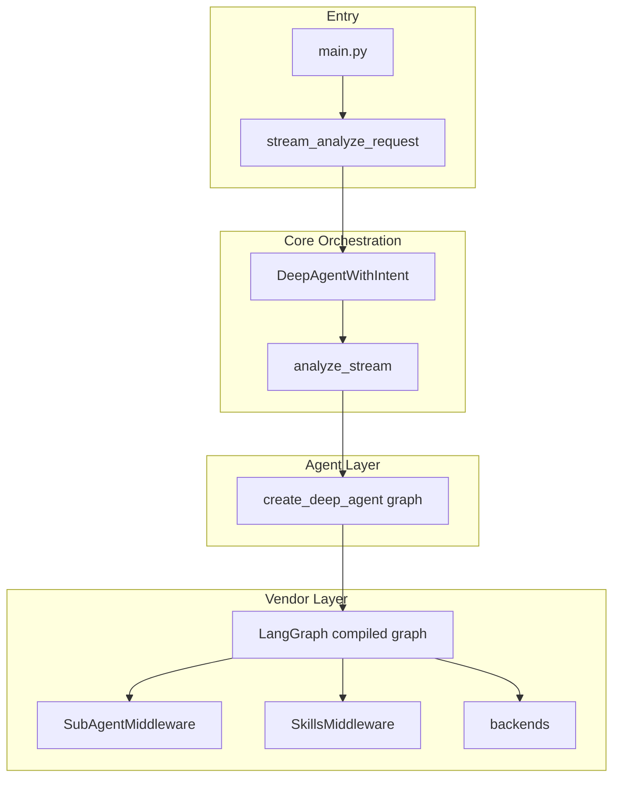
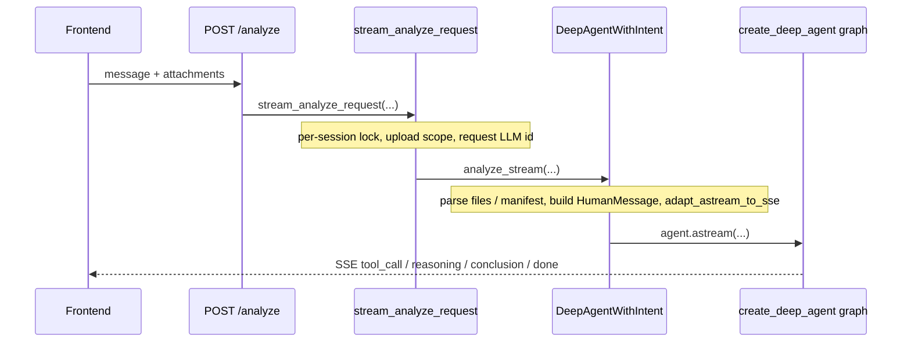
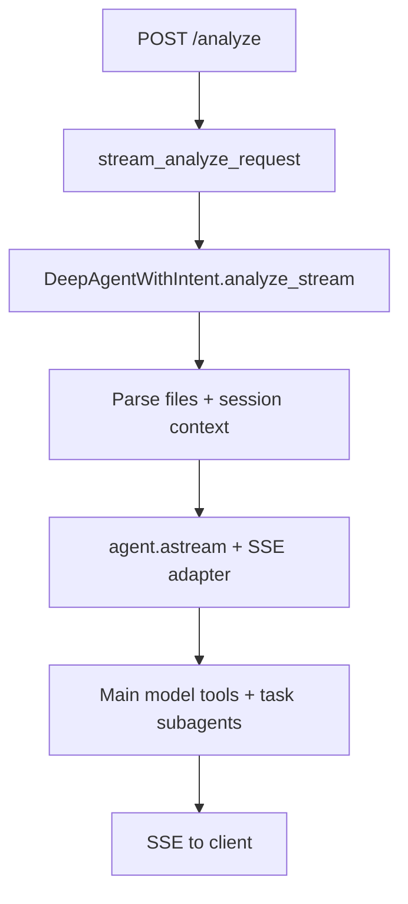
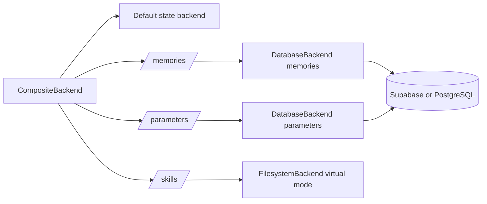
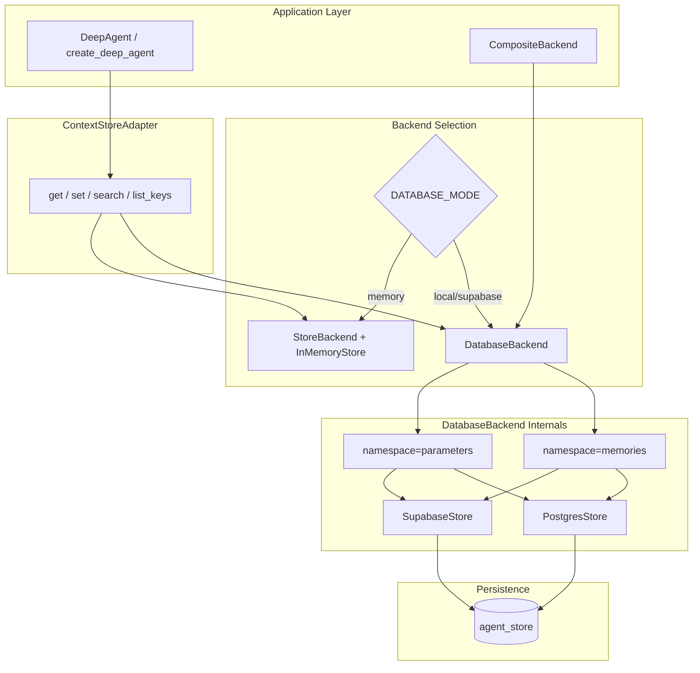

# SecManus Workspace Architecture (2026-02)

This document is aligned with the current repository implementation.

---

## Table of Contents

- Project Overview
- System Architecture
- Tech Stack
- Frontend Architecture
- Backend Architecture
- Core Flows and Sequence Diagrams
- Data Model and Storage
- API Reference
- Configuration
- Deployment
- Extension Guide

---

## Project Overview

SecManus Workspace is an AI-driven security analysis platform for IOC, email, web, log, and malware-related workflows.

Core goals:

- Stream analysis execution to UI through SSE.
- Use FastAPI + DeepAgents (LangGraph) for multi-stage orchestration.
- Support Supabase, local PostgreSQL, and memory modes.
- Scale domain capabilities through skill directories and SKILL.md metadata.

---

## System Architecture



---

## Tech Stack

### Frontend

- React 18 + TypeScript
- Vite
- Tailwind CSS + shadcn/ui
- TanStack Query
- React Router

### Backend

- Python 3.11+
- FastAPI
- LangGraph / DeepAgents
- LangChain
- Pydantic / pydantic-settings

### Infra

- Supabase
- PostgreSQL
- Railway / Docker

---

## Frontend Architecture

```text
src/
- components/
  - reasoning/
  - workspace/
  - ui/
- hooks/
  - useStreamingAnalysis.ts
  - useProjects.ts
  - useConversationPersistence.ts
- lib/
  - api-client.ts
  - config.ts
- config/endpoints.ts
- pages/
```

Notes:

- `useStreamingAnalysis.ts` is the main SSE consumer.
- `internal=true` events are filtered from main user display.
- Backend URL comes from `src/config/endpoints.ts` and `VITE_API_MODE`.

---

## Backend Architecture

```text
python-agent-service/app/
- main.py
- api/
- agents/
  - deep_agent.py
  - intent_handlers.py
  - official_subagents.py
- middleware/
  - intent_understanding.py
  - task_planner.py
  - context_task_runner.py
  - task_instruction_builder.py
- parsers/
  - deepagents_stream_adapter.py
  - events.py
- backends/
  - composite.py
  - database_backend.py
  - store.py
  - supabase_store.py
- config/settings.py
```

Runtime modes:

- `agent_mode=deepagent|simple`
- `database_mode=supabase|local|memory`
- checkpointing via `enable_checkpointing` and `checkpoint_backend`

### Component Hierarchy



---

## Core Flows and Sequence Diagrams

### Analyze Request Sequence



### DeepAgent Flow (current)



Routing, clarification, and task decomposition are handled **inside** the main LangGraph agent per `MASTER_AGENT.md`, not by a separate pre-agent intent service.

### Backend Route-to-Store Mapping



---

## Data Model and Storage

Main business tables:

- `profiles`
- `projects`
- `messages` (includes content, reasoning, thinking_steps, blocks)
- `shared_reports`
- `session_parameters`
- `parameter_callbacks`

Agent storage strategy:

- `/memories/` and `/parameters/` use `DatabaseBackend` (or memory fallback).
- `/skills/` maps to virtual filesystem for SkillsMiddleware `read_file` behavior.
- Checkpoint storage supports memory and postgres.

### Storage Data Flow



---

## API Reference

Base URL:

- Production: `https://secmanus-workspace-production.up.railway.app`
- Local example: `http://localhost:8003`

Key endpoints:

- `GET /health`
- `POST /uploads` — multipart file upload; returns `virtual_path` under `/uploads/...` for use in `POST /analyze` attachments (path-only, no large inline `content`).
- `POST /analyze`
- `GET /agents`
- `GET /tools`
- `POST /auth/register`
- `POST /auth/login`
- `GET /auth/me`
- `POST /auth/logout`
- `/projects/*`
- `/messages/*`
- `/shared-reports/*`

`/analyze` request body (simplified; see OpenAPI for full schema):

```json
{
  "message": "Analyze this alert log",
  "stream": true,
  "session_id": "optional",
  "ui_language": "zh",
  "input_language": "auto",
  "language": "zh",
  "attachments": [
    {
      "filename": "sample.eml",
      "content_type": "message/rfc822",
      "file_path": "/uploads/s_my-project-id/sample.eml",
      "sha256": "optional"
    }
  ]
}
```

**Reverse proxy:** allow request bodies large enough for your upload policy (e.g. **100MB** per file if using default `MAX_UPLOAD_BYTES_PER_FILE`). Configure `client_max_body_size` (nginx), `LimitRequestBody` (Apache), or the equivalent on your platform so `POST /uploads` is not truncated before it reaches FastAPI.

Common SSE event types:

- base: `step`, `tool_call`, `tool_result`, `reasoning`, `conclusion`, `error`, `done`
- intent: `understanding`, `parameter_request`, `decision_request`
- task: `task_plan`, `task_start`, `task_step`, `task_complete`, `plan_complete`, `task_summary`, `next_actions`
- skill/workflow: `skill_start`, `skill_complete`, `workflow_step`, `skill_error`

Visibility control:

- `python-agent-service/config/EVENTS.md`
- `python-agent-service/app/parsers/events.py`

---

## Configuration

Main backend config file:

- `python-agent-service/app/config/settings.py`

Important flags:

- `AGENT_MODE=deepagent|simple`
- `DATABASE_MODE=supabase|local|memory`
- `INTENT_LLM_BACKEND=langchain|gateway|auto`
- `ENABLE_CHECKPOINTING=true|false`
- `CHECKPOINT_BACKEND=memory|postgres`
- `MAX_ITERATIONS`
- `TIMEOUT_SECONDS`

Frontend config:

- `src/config/endpoints.ts`
- `VITE_API_MODE`

---

## Deployment

### Railway

```bash
cd python-agent-service
railway login
railway init
railway up
```

### Docker

```bash
cd python-agent-service
docker build -t secmanus-backend .
docker run -d -p 8000:8000 secmanus-backend
```

### Local

```bash
cd python-agent-service
python -m venv venv
venv\Scripts\activate
pip install -r requirements.txt
python -m uvicorn app.main:app --reload --port 8003
```

---

## Extension Guide

### Add a skill

1. Create `python-agent-service/skills/<skill-name>/SKILL.md`.
2. Include `name` and `description` in frontmatter.
3. Restart service to let discovery and subagent wiring refresh.

### Add a tool

1. Add tool implementation under `python-agent-service/app/tools/`.
2. Register it in `create_common_tools()` or target subagent tool list.
3. Verify visibility and execution in `/tools` and `/analyze` path.

---

When architecture, event protocol, or backend routing changes, update this file and `project_context.md` together.
