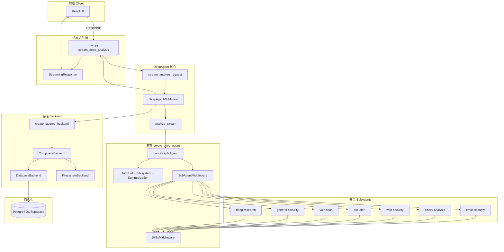
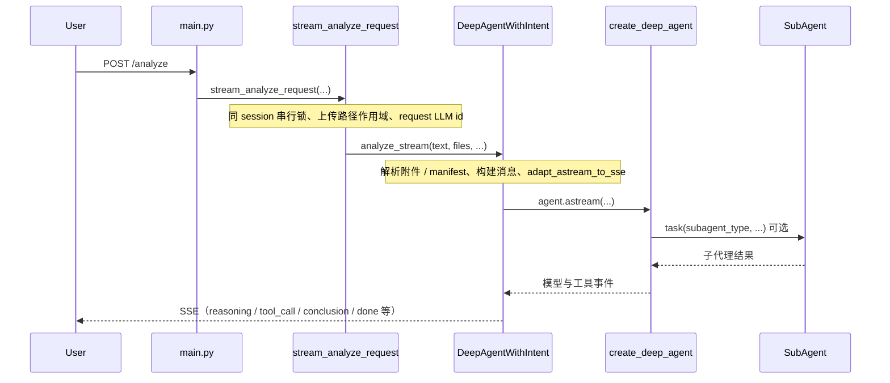
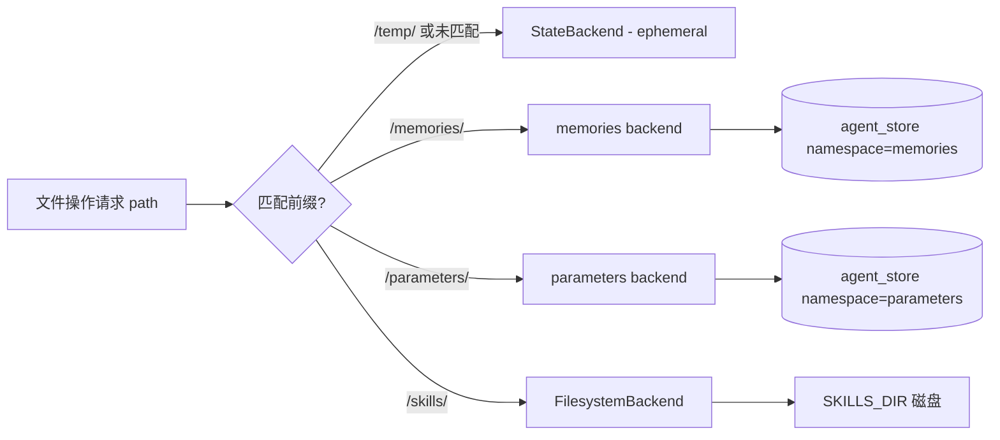
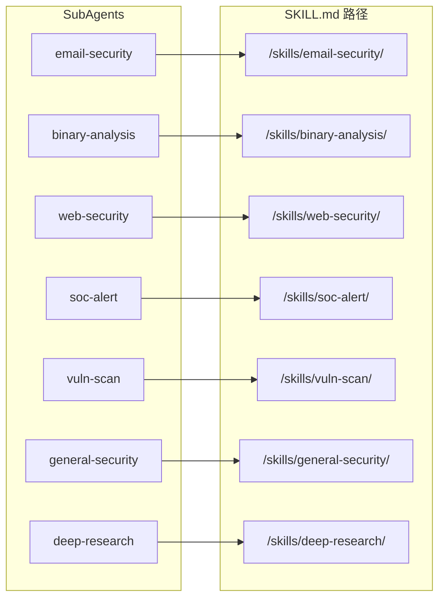
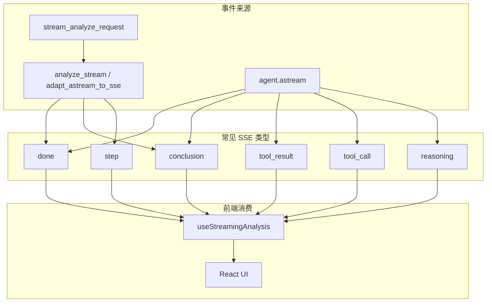
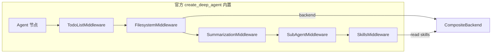
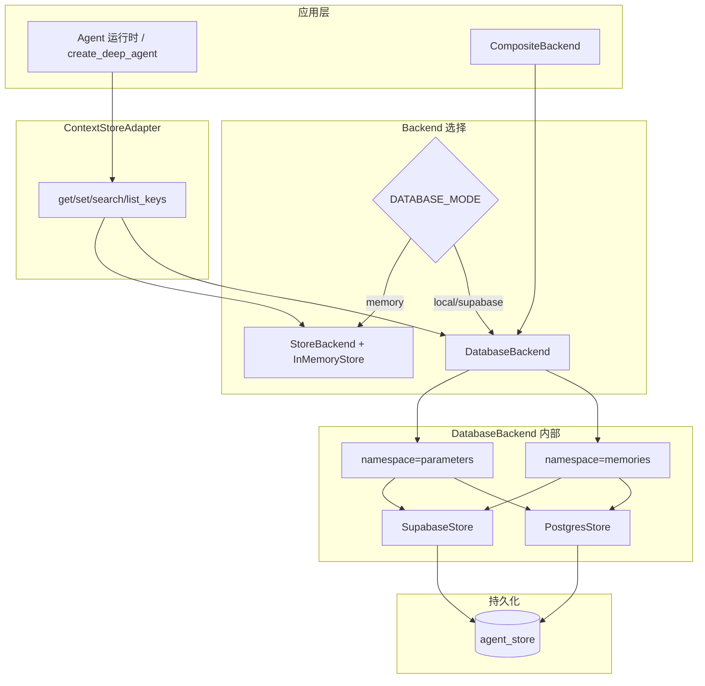
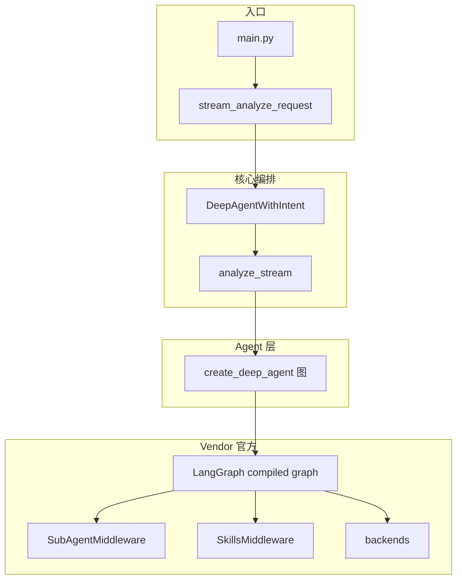

# SecManus DeepAgent 架构图与时序图

> **请以 [`ARCHITECTURE.md`](./ARCHITECTURE.md) 为结构与流程的权威说明。**  
> 本文保留 Mermaid 图；曾误用的入口名 `analyze_with_intent_stream` 已删除（现为 `stream_analyze_request` / `stream_resume_request`）。  
> 更新日期：2026-04-04

---

## 一、整体系统架构图



---

## 二、端到端安全分析时序图



---

## 三、Backend 路由架构图

```mermaid
flowchart TB
    subgraph Config [配置]
        DBMode[DATABASE_MODE]
        DBMode -->|local or supabase| UseDB[DatabaseBackend]
        DBMode -->|memory| UseMem[StoreBackend + InMemoryStore]
    end

    subgraph Factory [create_layered_backend]
        BuildRoutes[_build_routes]
        FactoryFn[factory(rt) -> CompositeBackend]
    end

    subgraph Composite [CompositeBackend]
        Default[default: StateBackend]
        Routes[routes]
    end

    subgraph RouteMap [路由表 routes]
        R1["/memories/"]
        R2["/parameters/"]
        R3["/skills/"]
    end

    subgraph Backends [具体 Backend]
        State[StateBackend - 会话临时状态]
        DB1[DatabaseBackend namespace=memories]
        DB2[DatabaseBackend namespace=parameters]
        FS[FilesystemBackend - SKILLS_DIR]
    end

    subgraph Storage [持久化]
        AgentStore[(agent_store 表)]
    end

    BuildRoutes --> R1 & R2 & R3
    R1 --> DB1
    R2 --> DB2
    R3 --> FS
    Default --> State
    Routes --> RouteMap
    DB1 & DB2 --> AgentStore
```

---

## 四、Backend 路径路由决策流程图



---

## 五、路由与任务形态（当前实现）

独立「意图理解服务 → TaskPlanner → TaskExecutor」流水线**不存在**。分类、是否先 `web_search`、是否 `task(deep-research)` 等由 **主模型** 在 LangGraph 内按 `MASTER_AGENT.md` 与工具调用完成。

---

## 六、主模型委派（概念）

```mermaid
flowchart TB
    MA[主 Agent LLM]
    MA --> Tools[通用工具 web_search / read_file / …]
    MA --> Todos[write_todos 可选]
    Todos --> Task[task(subagent_type, description)]
    Task --> Sub[SubAgentMiddleware → 对应子代理]
    Sub --> Out[结果回主线程 / SSE]
```

---

## 七、SubAgent 与 Skill 依赖矩阵



---

## 八、SSE 事件流图（简化）



---

## 九、create_deep_agent 内部 Middleware 链



---

## 十、存储层数据流图



---

## 十一、组件层次结构图



---

## 图例说明

| 符号     | 含义      |
| -------- | --------- |
| 实线箭头 | 调用/数据流 |
| 虚线框   | 逻辑分组  |
| 菱形     | 条件分支  |
| 圆角矩形 | 处理节点  |

---

## 相关文档

- [`ARCHITECTURE.md`](./ARCHITECTURE.md)
