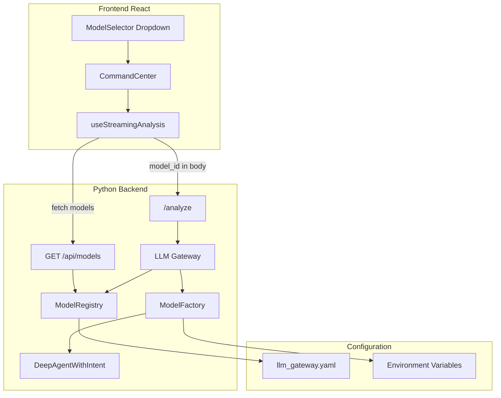

# LLM 统一调度网关 (LLM Gateway)

## 文档信息

- **文档版本**: 1.0.0
- **创建日期**: 2026.03.11
- **最后更新**: 2026.03.11
- **文档状态**: 规划中
- **所属模块**: SecManus Workspace 核心能力层
- **文档负责人**: LLM Gateway 模块团队

---

## 目录

- [1. 需求概述](#1-需求概述)
- [2. 功能范围](#2-功能范围)
- [3. 核心能力详解](#3-核心能力详解)
- [4. 技术架构](#4-技术架构)
- [5. 数据模型](#5-数据模型)
- [6. 交互流程](#6-交互流程)
- [7. 接口定义](#7-接口定义)
- [8. 异常处理](#8-异常处理)
- [9. 性能要求](#9-性能要求)
- [10. 验收标准](#10-验收标准)
- [11. 附录](#11-附录)

---

## 1. 需求概述

### 1.1 背景与目标

**背景**:
SecManus Workspace 作为安全分析平台，依赖多种 LLM 进行意图理解、任务规划和深度分析。当前实现中，模型选择依赖 `DEFAULT_MODEL` 环境变量，仅支持 Anthropic、OpenAI、Google 三家 Provider，且用户需自行配置 API Key。参考 Cursor、OpenCode Zen 等产品的 LLM 网关模式，需要构建统一的 LLM 调度能力。

**目标**:
构建一个类似 Cursor/OpenCode Zen 的 LLM 统一调度网关，实现：
- 所有用户无需单独配置 LLM KEY，由平台统一 KEY 作为出口
- 支持中美主流 LLM Provider（Anthropic、OpenAI、Gemini、Kimi、Minimax、GLM、豆包、OpenCode Zen）
- 对话界面支持用户自由选择模型

### 1.2 用户价值

| 用户场景 | 痛点 | 解决方案 |
|---------|------|---------|
| 企业内部分析师 | 每人需申请和管理多个 API Key | 平台统一配置，用户零配置即可使用 |
| 多模型对比分析 | 无法在同一界面切换不同模型 | 对话窗口提供模型选择器，按需切换 |
| 合规与成本管控 | 难以统一管控 LLM 调用 | 统一出口便于后续做用量统计与套餐控制 |
| 国内用户 | 需分别对接 Kimi、GLM、豆包等 | 配置化支持，一次接入多 Provider |

### 1.3 设计原则

1. **统一出口**: 所有 LLM 调用经网关转发，KEY 仅在后端环境变量中配置
2. **配置驱动**: Provider 与模型列表通过 YAML 配置文件管理，便于运维扩展
3. **安全优先**: API Key 不落库、不暴露给前端，配置文件不包含敏感信息
4. **可扩展**: 新增 Provider 仅需扩展配置与适配逻辑，无需改动核心流程

---

## 2. 功能范围

### 2.1 功能边界

**包含范围**:
- 统一 KEY 管理（环境变量加载，按 Provider 过滤）
- 多 Provider 支持（anthropic、openai、google、kimi、minimax、glm、doubao、opencode）
- 配置文件驱动的模型列表（`llm_gateway.yaml`）
- 请求级 `model_id` 传递与模型实例创建
- 前端模型选择器组件
- `GET /api/models` 接口返回可用模型列表

**不包含范围**（第一版）:
- 按用户套餐的用量控制与配额限制
- 模型调用计费与用量统计
- 用户自定义 BYOK（Bring Your Own Key）

### 2.2 功能矩阵

| 功能 | P0(必需) | P1(重要) | P2(增强) | 状态 |
|-----|---------|---------|---------|------|
| 统一 KEY 管理 | 是 | - | - | 规划中 |
| 配置文件加载 | 是 | - | - | 规划中 |
| Anthropic 支持 | 是 | - | - | 规划中 |
| OpenAI 支持 | 是 | - | - | 规划中 |
| Google Gemini 支持 | 是 | - | - | 规划中 |
| Kimi 支持 | 是 | - | - | 规划中 |
| Minimax 支持 | 是 | - | - | 规划中 |
| GLM 支持 | 是 | - | - | 规划中 |
| 豆包支持 | 是 | - | - | 规划中 |
| OpenCode Zen 支持 | 是 | - | - | 规划中 |
| GET /api/models 接口 | 是 | - | - | 规划中 |
| AnalyzeRequest 扩展 model_id | 是 | - | - | 规划中 |
| 前端模型选择器 | 是 | - | - | 规划中 |
| 默认模型回退 | 是 | - | - | 规划中 |
| 模型实例复用（可选） | - | - | 是 | 规划中 |
| 按用户套餐用量控制 | - | 是 | - | 后续版本 |

---

## 3. 核心能力详解

### 3.1 统一 KEY 管理

#### 3.1.1 环境变量加载

- 所有 API Key 通过环境变量配置，配置文件 `llm_gateway.yaml` 仅引用 `env_key` 名称
- 加载时检查各 Provider 对应环境变量是否存在且非空
- 未配置 KEY 的 Provider 自动过滤，不暴露给前端模型列表

#### 3.1.2 Provider 过滤逻辑

```python
# Pseudo-code: Filter providers by API key availability
for provider_id, config in providers.items():
    env_key = config["env_key"]
    api_key = os.environ.get(env_key)
    if not api_key or not api_key.strip():
        # Skip this provider, do not expose its models
        continue
    available_providers[provider_id] = config
```

### 3.2 多 Provider 支持

#### 3.2.1 支持的 Provider 列表

| Provider | 环境变量 | 说明 |
|----------|----------|------|
| anthropic | ANTHROPIC_API_KEY | Claude 系列 |
| openai | OPENAI_API_KEY | GPT 系列 |
| google | GOOGLE_API_KEY | Gemini 系列 |
| kimi | KIMI_API_KEY | 月之暗面 Kimi |
| minimax | MINIMAX_API_KEY | MiniMax |
| glm | GLM_API_KEY | 智谱 GLM |
| doubao | DOUBAO_API_KEY | 火山引擎豆包 |
| opencode | OPENCODE_ZEN_API_KEY | OpenCode Zen 网关 |

#### 3.2.2 适配方式

| Provider | LangChain 实现 | 备注 |
|----------|----------------|------|
| anthropic | `ChatAnthropic` | 原生 SDK |
| openai | `ChatOpenAI` | 原生 SDK |
| google | `ChatGoogleGenerativeAI` | 原生 SDK |
| kimi | `ChatOpenAI(base_url=...)` | OpenAI 兼容 API |
| minimax | `ChatOpenAI(base_url=...)` | OpenAI 兼容 API |
| glm | `ChatOpenAI(base_url=...)` | OpenAI 兼容 API |
| doubao | 火山引擎 API 或 OpenAI 兼容 | 需确认实际 API 形态 |
| opencode | 按模型族选择 endpoint | `/responses`、`/messages`、`/models/{id}` |

### 3.3 模型选择

#### 3.3.1 配置驱动

- 模型列表由 `llm_gateway.yaml` 定义，包含 `id`、`name`、`sdk_model` 等
- `id` 格式：`{provider}/{model}`，如 `anthropic/claude-sonnet-4`、`google/gemini-2.5-flash`

#### 3.3.2 请求级 model_id

- `AnalyzeRequest` 新增可选字段 `model_id`
- 请求未携带或 `model_id` 无效时，回退到配置中的 `default_model`

#### 3.3.3 默认模型回退

- 配置文件中定义 `default_model`
- 无效 `model_id`（不存在、Provider 无 KEY）时使用默认模型

---

## 4. 技术架构

### 4.1 架构图



### 4.2 核心组件

#### 4.2.1 ModelRegistry

**职责**: 加载 `llm_gateway.yaml`，解析 Provider 与模型列表，过滤无 KEY 的 Provider

**实现要点**:
- 从 `python-agent-service/config/llm_gateway.yaml` 加载配置
- 按 `env_key` 检查环境变量，过滤不可用 Provider
- 暴露 `list_models() -> List[ModelInfo]` 供 `/api/models` 使用
- 暴露 `get_provider_config(model_id) -> ProviderConfig` 供 Factory 使用

#### 4.2.2 ModelFactory

**职责**: 根据 `model_id` 创建 LangChain `BaseChatModel` 实例

**实现要点**:
- `get_model(model_id: str | None) -> BaseChatModel`
- `model_id is None` 时使用 `default_model`
- 根据 Provider 类型选择 `ChatAnthropic`、`ChatOpenAI`、`ChatGoogleGenerativeAI` 或 `ChatOpenAI(base_url=...)`

#### 4.2.3 Provider 适配器

**职责**: 将配置转换为各 Provider 的 LangChain 构造参数

**实现要点**:
- OpenAI 兼容类（Kimi、Minimax、GLM、OpenCode Zen）：使用 `ChatOpenAI` + `base_url`
- OpenCode Zen 需按模型族选择不同 endpoint（`/responses`、`/messages`、`/models/{id}`）

### 4.3 与现有模块关系

| 现有模块 | 变更说明 |
|----------|----------|
| [deep_agent.py](python-agent-service/app/agents/deep_agent.py) | `get_model()` 改为调用 `llm_gateway.get_model(model_id)`，支持传入 `model_id` |
| [main.py](python-agent-service/app/main.py) | `AnalyzeRequest` 新增 `model_id` 字段；新增 `GET /api/models` 路由 |
| [CommandCenter.tsx](src/components/CommandCenter.tsx) | 集成 ModelSelector 组件 |
| [useStreamingAnalysis.ts](src/hooks/useStreamingAnalysis.ts) | 请求体携带 `model_id` |

---

## 5. 数据模型

### 5.1 配置模型（llm_gateway.yaml）

```yaml
# Structure
providers:
  <provider_id>:
    env_key: <ENV_VAR_NAME>
    base_url: <url | null>
    models:
      - id: <provider/model>
        name: <display name>
        sdk_model: <actual model name for SDK>
        # Optional for OpenCode Zen
        endpoint_suffix: <responses|messages|models/{id}>

default_model: <provider/model>
```

### 5.2 Python 数据结构

#### 5.2.1 ModelInfo

```python
@dataclass
class ModelInfo:
    id: str           # e.g. "anthropic/claude-sonnet-4"
    name: str         # Display name for UI
    provider: str     # Provider ID
    sdk_model: str    # Model name passed to SDK
```

#### 5.2.2 ProviderConfig

```python
@dataclass
class ProviderConfig:
    provider_id: str
    env_key: str
    base_url: str | None
    api_key: str       # Loaded from env at runtime
    models: list[ModelInfo]
```

---

## 6. 交互流程

### 6.1 模型列表获取

```
Frontend (ModelSelector)
    │
    │ GET /api/models
    ▼
Backend (ModelsAPI)
    │
    │ ModelRegistry.list_models()
    │ - Load YAML
    │ - Filter providers by env_key
    │ - Flatten models from available providers
    ▼
Response: { "models": [ { "id", "name", "provider" }, ... ] }
```

### 6.2 分析请求携带 model_id

```
User selects model in ModelSelector
    │
    ▼
useStreamingAnalysis sends AnalyzeRequest
    │ body: { message, model_id: "anthropic/claude-sonnet-4", ... }
    ▼
Backend /analyze
    │
    │ stream_deep_analysis(..., model_id=request.model_id)
    │
    ▼
stream_analyze_request(..., model_id=model_id)
    │
    │ ModelFactory.get_model(model_id)
    │ - Resolve model_id or default_model
    │ - Create BaseChatModel instance
    ▼
DeepAgent uses model for inference
```

---

## 7. 接口定义

### 7.1 GET /api/models

**用途**: 返回当前可用的模型列表，供前端模型选择器使用

**响应格式**:

```json
{
  "models": [
    {
      "id": "anthropic/claude-sonnet-4",
      "name": "Claude Sonnet 4",
      "provider": "anthropic"
    },
    {
      "id": "google/gemini-2.5-flash",
      "name": "Gemini 2.5 Flash",
      "provider": "google"
    }
  ]
}
```

**说明**:
- 仅返回已配置 API Key 的 Provider 下的模型
- 按配置文件中定义的顺序返回

### 7.2 AnalyzeRequest 扩展

**新增字段**:

| 字段 | 类型 | 必填 | 说明 |
|------|------|------|------|
| model_id | string | 否 | 用户选择的模型 ID，如 `anthropic/claude-sonnet-4`。未传或无效时使用 default_model |

**示例**:

```json
{
  "message": "分析这个文件",
  "model_id": "google/gemini-2.5-flash",
  "stream": true,
  "session_id": "..."
}
```

---

## 8. 异常处理

| 场景 | 处理策略 |
|------|----------|
| Provider 无 KEY | 过滤该 Provider，不暴露其模型，不报错 |
| 无效 model_id | 回退到 default_model，记录日志 |
| default_model 对应 Provider 无 KEY | 返回 503，提示 "No LLM provider configured" |
| 模型 API 调用失败 | 由上层（DeepAgent/IntentClassifier）捕获，返回标准错误事件 |
| 配置文件缺失或格式错误 | 启动时告警，使用内置最小配置（仅 default_model）或启动失败 |

---

## 9. 性能要求

| 指标 | 要求 |
|------|------|
| 配置加载 | 启动时加载一次，内存缓存，避免每次请求读文件 |
| GET /api/models | 响应时间 < 100ms（基于内存缓存） |
| get_model() | 每次请求可创建新实例；后续可考虑按 model_id 缓存实例（P2） |

---

## 10. 验收标准

1. **统一 KEY 出口**: 用户无需配置任何 LLM KEY，所有调用使用后端环境变量中的 KEY
2. **多 Provider**: 至少支持 anthropic、openai、google、kimi、minimax、glm、doubao、opencode 中的已配置项
3. **配置驱动**: 通过 `llm_gateway.yaml` 可增删 Provider 和模型，无需改代码
4. **界面模型选择**: 对话窗口具备模型下拉选择器，选择后请求携带对应 model_id
5. **默认回退**: 未选或无效 model_id 时使用 default_model，分析流程正常完成

---

## 11. 附录

### 附录 A. Provider 适配表

| Provider | env_key | base_url 默认值 | LangChain 实现 |
|----------|---------|-----------------|----------------|
| anthropic | ANTHROPIC_API_KEY | null | ChatAnthropic |
| openai | OPENAI_API_KEY | null | ChatOpenAI |
| google | GOOGLE_API_KEY | null | ChatGoogleGenerativeAI |
| kimi | KIMI_API_KEY | https://api.moonshot.cn/v1 | ChatOpenAI(base_url, api_key) |
| minimax | MINIMAX_API_KEY | https://api.minimax.chat/v1 | ChatOpenAI(base_url, api_key) |
| glm | GLM_API_KEY | https://open.bigmodel.cn/api/paas/v4 | ChatOpenAI(base_url, api_key) |
| doubao | DOUBAO_API_KEY | https://ark.cn-beijing.volces.com/api/v3 | 需确认 API 形态 |
| opencode | OPENCODE_ZEN_API_KEY | https://opencode.ai/zen/v1 | 按模型族选 endpoint |

### 附录 B. 配置文件示例（llm_gateway.yaml）

```yaml
# LLM Gateway Configuration
# API keys are loaded from environment variables (never in this file)

providers:
  anthropic:
    env_key: ANTHROPIC_API_KEY
    base_url: null
    models:
      - id: anthropic/claude-sonnet-4
        name: Claude Sonnet 4
        sdk_model: claude-sonnet-4-20250514
      - id: anthropic/claude-opus-4
        name: Claude Opus 4
        sdk_model: claude-opus-4-20250514

  openai:
    env_key: OPENAI_API_KEY
    base_url: null
    models:
      - id: openai/gpt-4o
        name: GPT-4o
        sdk_model: gpt-4o
      - id: openai/gpt-4o-mini
        name: GPT-4o Mini
        sdk_model: gpt-4o-mini

  google:
    env_key: GOOGLE_API_KEY
    base_url: null
    models:
      - id: google/gemini-2.5-flash
        name: Gemini 2.5 Flash
        sdk_model: gemini-2.5-flash-preview-05-20
      - id: google/gemini-2.5-pro
        name: Gemini 2.5 Pro
        sdk_model: gemini-2.5-pro-preview-05-06

  kimi:
    env_key: KIMI_API_KEY
    base_url: https://api.moonshot.cn/v1
    models:
      - id: kimi/k2.5
        name: Kimi K2.5
        sdk_model: moonshot-v1-128k

  minimax:
    env_key: MINIMAX_API_KEY
    base_url: https://api.minimax.chat/v1
    models:
      - id: minimax/m2.5
        name: MiniMax M2.5
        sdk_model: abab6.5s-chat

  glm:
    env_key: GLM_API_KEY
    base_url: https://open.bigmodel.cn/api/paas/v4
    models:
      - id: glm/glm-4-plus
        name: GLM-4 Plus
        sdk_model: glm-4-plus

  doubao:
    env_key: DOUBAO_API_KEY
    base_url: https://ark.cn-beijing.volces.com/api/v3
    models:
      - id: doubao/doubao-pro
        name: Doubao Pro
        sdk_model: doubao-pro-32k

  opencode:
    env_key: OPENCODE_ZEN_API_KEY
    base_url: https://opencode.ai/zen/v1
    models:
      - id: opencode/gpt-5.3-codex
        name: GPT 5.3 Codex (Zen)
        sdk_model: gpt-5.3-codex
        endpoint_suffix: responses
      - id: opencode/claude-sonnet-4-6
        name: Claude Sonnet 4.6 (Zen)
        sdk_model: claude-sonnet-4-6
        endpoint_suffix: messages

default_model: google/gemini-2.5-flash
```
