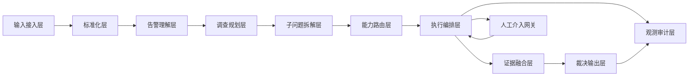
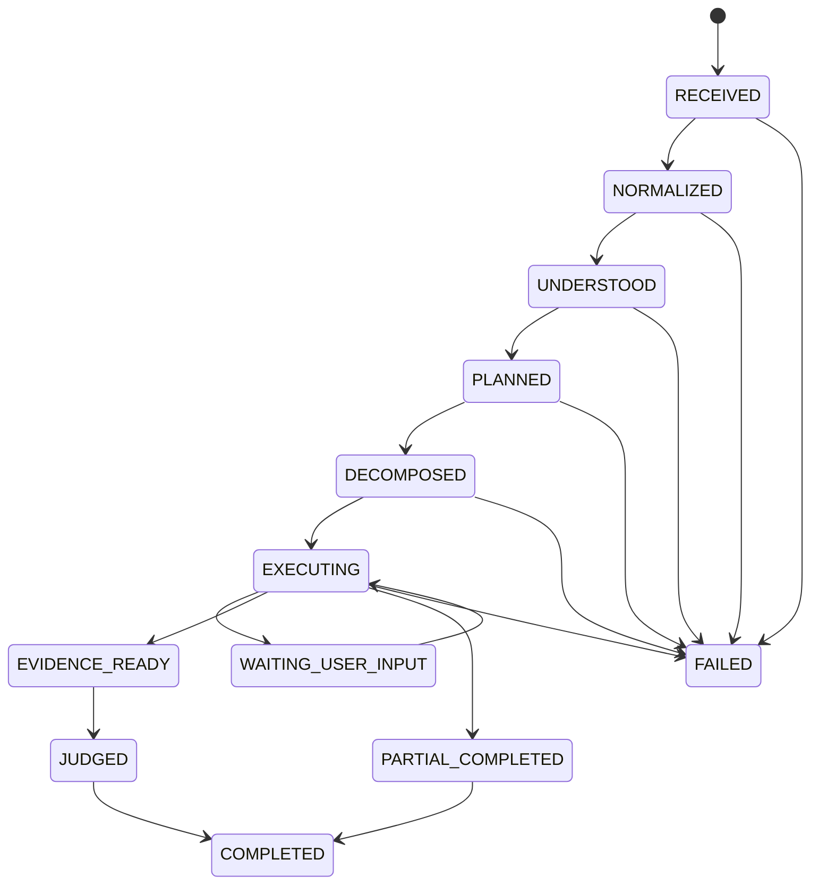

# Soc Alert Agent 架构设计

## 1. 文档定位
- 类型：开发前架构设计文档（可直接拆任务开工）
- 目标：让后端/算法/测试在无二义性的前提下开始实现
- 适用范围：SOC 告警分诊闭环（理解 -> 规划 -> 拆解 -> 执行 -> 裁决）

---

## 2. 一句话目标
输入任意来源的安全告警，输出结构化分诊结论与证据链，并保证流程可追溯、可降级、可人工接管。

---

## 3. 术语约定
- 告警对象：原始告警的标准化载体。
- 调查动作：围绕某个调查目标定义的动作项。
- 子问题：可执行、可验证、可查询的最小调查单元。
- 执行项：对子问题的一次具体工具执行记录。
- 证据项：可被结论引用的事实片段。
- 缺口项：因数据、权限、工具失败导致的未闭合调查点。

---

## 4. 系统边界

### 4.1 In Scope
- 单条告警的端到端分诊。
- 多能力域采证（SIEM、EDR、NDR、威胁情报、身份资产）。
- 授权缺失时人工补参并恢复执行。
- 输出统一分诊结果对象。

### 4.2 Out of Scope（当前版本）
- 自动执行高风险处置动作（如隔离、封禁）。
- 跨告警批处理编排引擎。
- 厂商特定策略模板。

---

## 5. 逻辑架构与模块职责



### 5.1 模块清单（必须实现）
1. `InputGateway`
   - 接收告警、会话上下文、用户范围信息。
   - 输出 `AlertEnvelope`。
2. `AlertNormalizer`
   - 将异构告警映射为统一结构。
   - 输出 `NormalizedAlert`。
3. `AlertUnderstandingService`
   - 提取实体、行为、事件摘要、攻击面、背景知识。
4. `InvestigationPlanner`
   - 生成调查维度与调查动作。
5. `QuestionDecomposer`
   - 调查动作 -> 子问题清单（可执行单位）。
6. `CapabilityRouter`
   - 子问题 -> 能力域映射 + 参数校验。
7. `ExecutionOrchestrator`
   - 并发执行、重试、超时、汇总状态。
8. `EvidenceSynthesizer`
   - 生成证据项、缺口项、证据-结论关联。
9. `TriageJudge`
   - 产出最终分诊结果对象。
10. `HumanInLoopGateway`
   - 缺授权/缺关键参数时发起人工输入并恢复执行。
11. `ObservabilityService`
   - 全链路日志、指标、审计记录。

---

## 6. 状态机设计（开发必须遵循）



### 6.1 状态转移规则
- 任何阶段异常不可直接丢失上下文，必须写入 `failure_reason` 和 `recoverable`。
- `WAITING_USER_INPUT` 仅允许由执行阶段进入。
- `PARTIAL_COMPLETED` 必须有 `gap_items` 且 `summary.failed > 0`。
- `COMPLETED` 包含两种：全成功、部分成功（需标记 `completion_mode`）。

---

## 7. 数据契约（可直接给开发）

## 7.1 输入对象：`AlertEnvelope`
```json
{
  "request_id": "string",
  "session_id": "string",
  "user_id": "string",
  "alert_payload": {},
  "alert_source_type": "string",
  "ingest_time": "ISO-8601",
  "scope": {
    "time_range_hint": "string|null",
    "asset_scope": ["string"],
    "tenant_id": "string|null"
  }
}
```

## 7.2 标准告警对象：`NormalizedAlert`
```json
{
  "alert_type": "string|null",
  "alert_time": "ISO-8601|null",
  "severity_raw": "string|null",
  "entities": [
    { "name": "string", "type": "string", "value": "string", "role": "string|null" }
  ],
  "events": ["string"],
  "objects": ["string"],
  "behaviors": ["string"],
  "attack_surface": ["string"]
}
```

## 7.3 调查规划对象：`InvestigationPlan`
```json
{
  "dimensions": [
    {
      "id": "F1",
      "name": "string",
      "objective": "string",
      "evidence_types": ["string"]
    }
  ],
  "actions": [
    {
      "id": "A1",
      "title": "string",
      "objective": "string",
      "dimension_id": "F1",
      "required_inputs": ["string"]
    }
  ]
}
```

## 7.4 子问题对象：`QuestionPlan`
```json
{
  "questions": [
    {
      "id": "A1-01",
      "action_id": "A1",
      "question": "string",
      "capability_type": "SIEM|EDR|NDR|THREAT_INTEL|IDENTITY_ASSET|NONE",
      "action_name": "string|null",
      "action_params": {},
      "routing_hint": { "provider": "string|null" },
      "skip_reason": "string|null"
    }
  ]
}
```

## 7.5 执行结果对象：`ExecutionResult`
```json
{
  "items": [
    {
      "id": "A1-01",
      "status": "success|failed|skipped",
      "action_name": "string|null",
      "provider": "string|null",
      "started_at": "ISO-8601",
      "ended_at": "ISO-8601",
      "latency_ms": 0,
      "result": {},
      "error_code": "string|null",
      "error_message": "string|null"
    }
  ],
  "summary": { "total": 0, "success": 0, "failed": 0, "skipped": 0 }
}
```

## 7.6 最终输出对象：`TriageVerdict`
```json
{
  "classification": "string",
  "severity": "Critical|High|Medium|Low",
  "priority": "P1|P2|P3|P4",
  "true_positive_assessment": {
    "confidence": "High|Medium|Low",
    "reasoning": "string"
  },
  "mitre_mapping": {
    "tactic": "string",
    "technique": "string",
    "sub_technique": "string|null"
  },
  "evidence": [
    { "evidence_id": "string", "source": "string", "content": "string" }
  ],
  "gaps": [
    { "gap_id": "string", "type": "missing_data|auth|tool_failure", "impact": "string" }
  ],
  "conclusion": "string",
  "recommended_actions": {
    "immediate": ["string"],
    "short_term": ["string"],
    "long_term": ["string"]
  }
}
```

---

## 8. 能力路由规则（实现口径）

### 8.1 路由决策优先级
1. 子问题显式指定能力域。
2. 根据问题语义分类。
3. 根据可用授权过滤能力域。
4. 若无可用域则标记 `skipped` 并生成缺口项。

### 8.2 参数校验规则
- `action_params` 必须为对象，禁止空字符串代替空值。
- 必填参数缺失时不得执行，输出 `E_PARAM_MISSING`。
- 参数类型不匹配时不得执行，输出 `E_PARAM_INVALID`。

### 8.3 执行策略
- 并发上限：默认 8（可配置）。
- 单项超时：默认 30s（可配置）。
- 重试策略：仅对可重试错误重试 1 次（指数退避）。
- 失败不阻断：除非达到“关键证据缺失阈值”。

---

## 9. 人工介入设计

### 9.1 触发场景
- 授权信息缺失。
- 核心参数缺失（例如时间范围、目标实体）。
- 高风险策略冲突（需人工确认是否继续）。

### 9.2 交互协议
- 状态置为 `WAITING_USER_INPUT`。
- 返回 `required_fields`、`reason`、`resume_token`。
- 用户提交后通过 `resume_token` 继续执行。

### 9.3 恢复约束
- 仅允许恢复一次相同阻塞点，避免无限循环。
- 恢复后必须记录 `human_input_applied=true`。

---

## 10. 错误码设计（统一）

| 错误码 | 含义 | 可重试 | 处理策略 |
|---|---|---|---|
| E_INPUT_INVALID | 输入对象不合法 | 否 | 直接失败，返回字段级错误 |
| E_NORMALIZE_FAILED | 标准化失败 | 否 | 记录原始告警片段并失败 |
| E_PLAN_EMPTY | 调查规划为空 | 否 | 进入部分完成并输出缺口 |
| E_PARAM_MISSING | 执行参数缺失 | 否 | 转人工介入或跳过 |
| E_PARAM_INVALID | 参数类型或格式错误 | 否 | 标记失败并给修复建议 |
| E_AUTH_REQUIRED | 缺失授权 | 是 | 转人工介入 |
| E_TOOL_TIMEOUT | 工具超时 | 是 | 重试后失败归档 |
| E_TOOL_UNAVAILABLE | 工具不可用 | 是 | 降级到替代能力域 |
| E_TOOL_RESPONSE_INVALID | 工具返回结构异常 | 否 | 标记失败并写审计 |
| E_JUDGE_INSUFFICIENT_EVIDENCE | 证据不足无法高置信裁决 | 否 | 输出低置信结论+缺口 |

---

## 11. 配置项（交付时必须可配置）

| 配置键 | 默认值 | 说明 |
|---|---:|---|
| triage.max_iterations | 12 | 分诊最大循环次数 |
| execution.max_parallel | 8 | 并发执行上限 |
| execution.timeout_seconds | 30 | 单项执行超时 |
| execution.retry.max_attempts | 2 | 最大尝试次数（含首次） |
| auth.ephemeral_ttl_seconds | 1800 | 临时授权有效期 |
| judge.min_evidence_count | 2 | 最低证据条数阈值 |
| judge.max_high_confidence_gap_count | 0 | 高置信允许缺口数 |
| observability.log_retention_days | 30 | 执行日志保留天数 |

---

## 12. 可观测性与审计

### 12.1 必打日志事件
- `triage_request_received`
- `triage_normalized`
- `triage_planned`
- `triage_questions_generated`
- `triage_execution_item_started`
- `triage_execution_item_finished`
- `triage_waiting_user_input`
- `triage_judged`
- `triage_completed`
- `triage_failed`

### 12.2 核心指标
- 请求总量、成功率、部分完成率。
- 平均/分位耗时（总流程与阶段）。
- 工具成功率、超时率、授权中断率。
- 高置信结论占比、证据不足占比。

---

## 13. 开发任务拆分

## 13.1 Epic A：数据契约与状态机
- A1：定义 6 个核心对象 Schema（含校验器）。
- A2：实现状态机与状态转移守卫。
- A3：补充异常与失败恢复模型。

## 13.2 Epic B：流程核心
- B1：实现标准化层。
- B2：实现理解层（结构化输出）。
- B3：实现规划层（维度+动作）。
- B4：实现拆解层（动作->子问题）。

## 13.3 Epic C：执行引擎
- C1：实现能力路由器与参数校验。
- C2：实现并发执行、超时、重试、汇总。
- C3：实现失败降级与缺口记录。

## 13.4 Epic D：人工介入
- D1：实现中断触发协议。
- D2：实现恢复协议与幂等控制。
- D3：实现授权生命周期管理。

## 13.5 Epic E：裁决与输出
- E1：证据融合与缺口生成。
- E2：结论对象输出。
- E3：置信度规则实现。

## 13.6 Epic F：观测与测试
- F1：日志与指标埋点。
- F2：单元测试与契约测试。
- F3：集成测试与故障注入测试。

---

## 14. 测试矩阵

| 编号 | 场景 | 输入 | 期望 |
|---|---|---|---|
| T01 | 标准告警完整流程 | 完整告警+可用授权 | 输出 `COMPLETED`，`failed=0` |
| T02 | 缺失关键字段 | 无时间、无实体 | 进入低置信结论，含缺口项 |
| T03 | 参数缺失 | 子问题缺必填参数 | 对应项 `failed`，错误码 `E_PARAM_MISSING` |
| T04 | 授权缺失 | 可执行但无授权 | 进入 `WAITING_USER_INPUT` |
| T05 | 人工恢复 | 提交补参后恢复 | 流程继续并完成 |
| T06 | 工具超时 | 模拟外部超时 | 重试后失败，错误码 `E_TOOL_TIMEOUT` |
| T07 | 工具返回异常结构 | 模拟不合法响应 | 标记 `E_TOOL_RESPONSE_INVALID` |
| T08 | 多能力域混合 | SIEM+EDR+情报问题 | 正确路由，汇总输出一致 |
| T09 | 部分完成 | 一部分工具不可用 | `PARTIAL_COMPLETED` + 缺口项 |
| T10 | 审计检查 | 全流程执行 | 存在完整事件链日志 |

---

## 15. Definition of Done（DoD）
- 6 个核心对象 Schema 与校验器完成并通过契约测试。
- 状态机可覆盖所有主路径与异常路径。
- 执行引擎支持并发、超时、重试、失败降级。
- 人工介入可中断并恢复，具备幂等保护。
- 最终输出满足 `TriageVerdict` 契约。
- 测试覆盖率：核心模块语句覆盖率 >= 80%。
- 关键指标与日志事件可在监控面板查询。

---

## 16. 实施顺序建议
- 第 1-2 天：对象契约、状态机、错误码。
- 第 3-5 天：标准化、理解、规划、拆解。
- 第 6-8 天：路由与执行引擎。
- 第 9 天：人工介入与恢复。
- 第 10 天：裁决层与输出。
- 第 11-12 天：测试、故障注入、观测补齐。
- 第 13-14 天：联调、回归、验收。

---

## 17. 已知风险与规避
- 输入质量波动大：增加输入质量评分与快速失败策略。
- 外部依赖不稳定：对每类能力域配置降级路径。
- 人工介入拖慢流程：只在关键缺口触发，非关键缺口直接降级。
- 过度自动化误判：强制证据引用与低证据降置信机制。

---

## 18. 评审清单
- [ ] 产品确认输出字段满足运营使用。
- [ ] 安全确认授权与审计策略符合合规要求。
- [ ] 后端确认状态机与执行策略无歧义。
- [ ] 测试确认测试矩阵覆盖主异常路径。
- [ ] 运维确认指标、告警、日志保留策略可落地。
