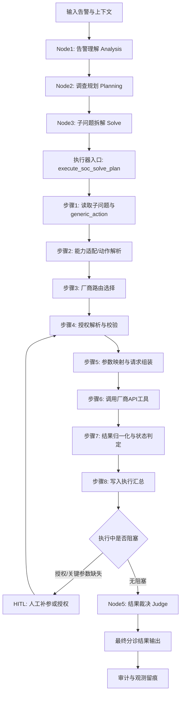

# 分诊子 Agent 架构设计（开发落地版）

## 1. 主流程架构（节点化版，用于研发联调）

### 1.1 主流程图（带节点）

### 1.2 节点定义（输入/输出/职责）

1.2.1. `Node1: Analysis（告警理解）`  
   - 输入：原始告警与上下文。  
   - 职责：提取实体、行为、事件、攻击面与初步战术映射。  
   - 输出：结构化理解结果（不做最终恶意/良性裁决）。

1.2.2. `Node2: Planning（调查规划）`  
   - 输入：Node1 结构化理解结果。  
   - 职责：生成调查维度与调查动作，明确每个动作的目标与证据需求。  
   - 输出：调查规划结果（维度 + 动作列表）。

1.2.3. `Node3: Solve（子问题拆解）`  
   - 输入：Node2 调查规划结果。  
   - 职责：将调查动作拆分为可执行子问题，绑定能力域、参数与路由提示。  
   - 输出：机器可解析执行计划（用于批量执行）。

1.2.4. `执行器: execute_soc_solve_plan（自动化采证）`  
   - 输入：Node3 执行计划 + 原始告警上下文。  
   - 职责：批量执行子问题，处理并发、重试、失败归因与执行汇总。  
   - 输出：执行结果对象（每项 success/failed/skipped + summary）。

#### 1.2.4.1 执行器内“厂商工具适配与调用”子流程（N3 -> EX 扩展）
- 步骤1：读取子问题执行单元，识别 `generic_action`、能力域、路由提示。  
- 步骤2：能力适配，将通用动作映射到标准能力接口（SIEM/EDR/NDR/情报等）。  
- 步骤3：厂商路由，根据上下文、可用连接、路由提示选定具体厂商适配器。  
- 步骤4：授权解析，优先读取可用授权；若缺失则触发人工介入并等待恢复。  
- 步骤5：参数映射，将通用参数转换为目标厂商接口所需请求结构。  
- 步骤6：调用厂商 API 工具，执行查询/检索/聚合动作并采集原始响应。  
- 步骤7：结果归一化，将不同厂商返回统一为标准执行结果结构。  
- 步骤8：状态判定与回写，标记 success/failed/skipped，并写入汇总统计。  

#### 1.2.4.2 适配层实现要求（开发约束）
- 通用动作与厂商动作必须通过“映射表”解耦，禁止在流程中硬编码厂商分支。
- 每个厂商适配器需提供统一能力接口：参数校验、请求构造、响应归一化、错误归类。
- 同一子问题必须记录“路由决策依据”（为何选该厂商）以便审计复盘。
- 厂商 API 错误需统一归并到标准错误码，不向上游泄漏厂商私有异常格式。
- 任一厂商调用失败不得阻断其他子问题执行，除非命中全局中断策略。

1.2.5. `HITL（人工介入分支）`  
   - 触发条件：授权缺失、关键参数缺失、策略冲突。  
   - 职责：收集补充信息并恢复执行器继续采证。  
   - 输出：恢复后的执行上下文与补全参数。

1.2.6. `Node5: Judge（分诊裁决）`  
   - 输入：Node1 + Node2 + Node3 + 执行器结果。  
   - 职责：完成最终分诊判断，输出分类、严重度、优先级、置信度、结论与建议。  
   - 输出：最终分诊结果对象。

1.2.7. `输出与审计`  
   - 输入：Node5 最终结果与执行轨迹。  
   - 职责：结果回传上层调用方，并沉淀日志、指标和审计记录。  
   - 输出：可消费结果 + 可追溯过程数据。

### 1.3 节点串联规则（研发实现约束）
- 必须按 `Node1 -> Node2 -> Node3 -> 执行器 -> Node5` 顺序执行，禁止跳节点。
- `Node5` 必须依赖执行器返回结果，不允许在未采证情况下直接裁决。
- `HITL` 只允许在执行器阶段触发，恢复后继续回到执行器而不是回退前置节点。
- 任一节点失败需输出标准错误对象与可恢复标记，避免上下文丢失。
- `Node3 -> 执行器` 之间必须经过“动作解析 -> 路由 -> 授权 -> 参数映射 -> 调用 -> 归一化”完整链路，禁止直接跳过适配层。
