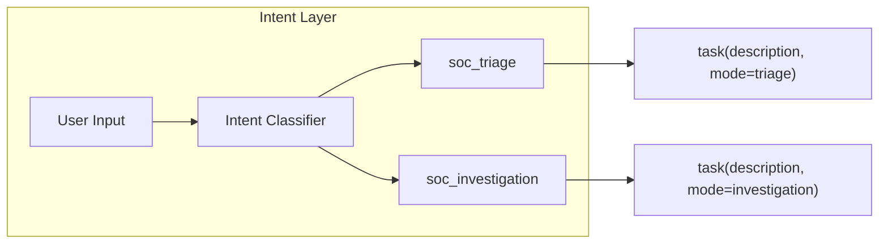
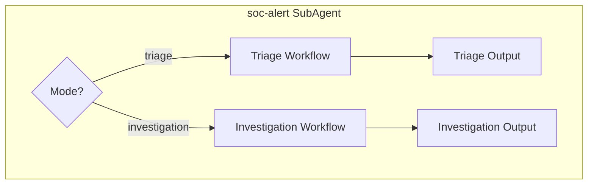

# SOC 告警分诊与安全事件调查 (SOC Alert Triage & Investigation)

## 文档信息

- **文档版本**: 1.0.0
- **创建日期**: 2026.03.12
- **最后更新**: 2026.03.12
- **文档状态**: 规划中
- **所属模块**: SecManus Workspace soc-alert 技能模块
- **文档负责人**: Security Team

---

## 目录

- [1. 需求概述](#1-需求概述)
- [2. 功能范围](#2-功能范围)
- [3. 核心能力详解](#3-核心能力详解)
- [4. 技术架构](#4-技术架构)
- [5. 数据模型](#5-数据模型)
- [6. 交互流程](#6-交互流程)
- [7. 异常处理](#7-异常处理)
- [8. 性能要求](#8-性能要求)
- [9. 验收标准](#9-验收标准)
- [10. 附录](#10-附录)

---

## 1. 需求概述

### 1.1 背景与目标

**背景**：当前 `soc-alert` 技能（[skills/soc_alert/SKILL.md](../../python-agent-service/subagents/official/soc_alert/skills/soc_alert/SKILL.md)）已覆盖告警解析、IOC 提取、威胁情报、MITRE 映射等能力，但存在两点不足：

- 告警分诊与安全事件调查混在同一流程，未区分场景
- 调查场景缺乏「扩线」能力：安全事件调查需追根溯源、对线索不断扩线直至串起完整攻击链

**目标**：

- 在**单一 soc-alert 智能体**内实现**双模式**：Triage（告警分诊）与 Investigation（安全事件调查）
- Triage 模式：线性流程，快速分类、优先级、真/假阳性
- Investigation 模式：迭代扩线，支持多轮工具调用，直至构建完整攻击链与根因

### 1.2 用户价值

| 用户场景 | 痛点 | 解决方案 |
|---------|------|---------|
| SOC 分析师日常分诊 | 告警量大，需快速判断优先级 | Triage 模式：5-8 轮工具调用，输出分类、P1-P4、真/假阳性 |
| 事件响应工程师调查 | 需追根溯源、扩线、串起攻击链 | Investigation 模式：15-30 轮扩线，输出时间线、根因、完整链路 |
| 混合场景 | 分诊后需深入调查 | 同一会话内可先 Triage 再 Investigation，上下文复用 |

### 1.3 设计原则

1. **单智能体双模式**：不拆成两个 SubAgent，避免上下文传递与调度开销
2. **扩线驱动**：Investigation 模式以「发现线索 → 扩线 → 新线索 → 再扩线」为核心
3. **配置化**：通过意图/模式参数控制 max_iterations、timeout、workflow 侧重点

---

## 2. 功能范围

### 2.1 功能边界

**包含范围**：

- 意图层区分 `soc_triage` / `soc_investigation`（或通过 description 传递模式）
- Triage 模式：现有 workflow 优化，max_iterations=8，timeout=120s
- Investigation 模式：扩线 workflow、假设追踪、max_iterations=25，timeout=300s
- 扩线工具：`siem_query`、`log_search`、`correlate_alerts`（P0 至少实现 siem_query 或 log_search 其一）
- SKILL.md 双模式 Prompt 与约束

**不包含范围**（第一版）：

- 与真实 SIEM/EDR 的实时对接（工具可为 Mock/模拟实现）
- 批量告警流水线（高吞吐批处理）
- 多智能体协作（Triage Agent → Investigation Agent 接力）

### 2.2 功能矩阵

| 功能 | P0 | P1 | P2 | 状态 |
|-----|----|----|----|------|
| 意图区分 triage/investigation | 是 | - | - | 待实现 |
| Triage 模式（现有能力优化） | 是 | - | - | 部分已有 |
| Investigation 模式（扩线 workflow） | 是 | - | - | 待实现 |
| siem_query / log_search 工具 | 是 | - | - | 待实现 |
| correlate_alerts 工具 | - | 是 | - | 待实现 |
| 假设追踪（Prompt 级） | 是 | - | - | 待实现 |
| 调查模式迭代预算配置 | 是 | - | - | 待实现 |

---

## 3. 核心能力详解

### 3.1 Triage 模式

**触发意图**：告警分诊、批量告警分析、优先级排序、真/假阳性判断

**流程**：Parse → Extract IOCs → Enrich → Correlate → Assess → Recommend（线性）

**配置**：max_iterations=8，timeout_seconds=120

**输出**：Alert Classification、Severity、Priority、True Positive Assessment、MITRE 映射、Investigation Steps（简要）

### 3.2 Investigation 模式

**触发意图**：深入调查、根因分析、攻击链还原、事件时间线、扩线调查

**流程**：迭代扩线

1. 解析初始线索（告警/IOC/用户/主机）
2. 提取 IOCs，查询威胁情报
3. **扩线**：对每个新发现的实体（IP、用户、主机、哈希）调用 siem_query/log_search 查询相关日志与告警
4. **假设追踪**：维护「已验证事实 / 待验证假设 / 已排除假设」
5. 重复 3-4 直至：时间线完整、根因可解释、攻击链串起
6. 输出：完整时间线、攻击链、根因、遏制建议

**配置**：max_iterations=25，timeout_seconds=300

**终止条件**（Prompt 中定义）：

- 攻击链可解释（Initial Access → ... → Exfiltration）
- 根因有明确证据
- 影响范围清晰
- 或达到迭代上限/超时

### 3.3 扩线工具设计

| 工具 | 输入 | 输出 | 说明 |
|------|------|------|------|
| siem_query | query, time_range, entity_type, entity_value | 匹配的告警/事件列表 | 按 IOC、用户、主机等查询 SIEM |
| log_search | query, source, time_range | 日志条目列表 | 按条件搜索日志 |
| correlate_alerts | alert_ids, entity_keys | 关联图/时间线 | 关联多告警，构建时间线 |

第一版可先实现 `siem_query` 或 `log_search` 的 Mock/占位实现，返回结构化示例数据，供 Agent 演练扩线逻辑。

---

## 4. 技术架构

### 4.1 模式识别流程



### 4.2 soc-alert 双模式执行



### 4.3 涉及文件

| 文件 | 变更内容 |
|------|----------|
| [python-agent-service/subagents/official/soc_alert/skills/soc_alert/SKILL.md](../../python-agent-service/subagents/official/soc_alert/skills/soc_alert/SKILL.md) | 增加 modes、Investigation 扩线 Prompt、假设追踪模板 |
| [python-agent-service/app/middleware/intent_models.py](../../python-agent-service/app/middleware/intent_models.py) | 可选：SecuritySubType 增加 SOC_TRIAGE / SOC_INVESTIGATION |
| [python-agent-service/app/middleware/intent_classifier](../../python-agent-service/app/middleware/) | 意图分类输出 mode 或 subtype |
| [python-agent-service/app/middleware/task_planner.py](../../python-agent-service/app/middleware/task_planner.py) | 将 mode 传递至 task description 或 skill 参数 |
| [python-agent-service/app/agents/official_subagents.py](../../python-agent-service/app/agents/official_subagents.py) | SubAgent 支持按 mode 覆盖 max_iterations/timeout |
| 新增 tools | siem_query、log_search（含 Mock 实现） |

---

## 5. 数据模型

### 5.1 意图输出扩展（可选）

```python
# intent_models.py 或 task 参数
soc_mode: Literal["triage", "investigation"] = "triage"
```

### 5.2 扩线工具输入

```python
# siem_query
SiemQueryInput(query: str, time_range: str, entity_type: str, entity_value: str)

# log_search
LogSearchInput(query: str, source: str, time_range: str)
```

---

## 6. 交互流程

### 6.1 Triage 流程

1. 用户输入告警内容或粘贴 SIEM 告警 JSON
2. 意图识别 → soc_triage
3. task(soc-alert, description="...", mode=triage)
4. SubAgent 执行：parse_alert → extract_iocs → enrich → correlate → assess → recommend
5. 输出：分类、优先级、真/假阳性、简要建议

### 6.2 Investigation 流程

1. 用户输入：「帮我深入调查这个事件，把攻击链串起来」
2. 意图识别 → soc_investigation
3. task(soc-alert, description="...", mode=investigation)
4. SubAgent 执行扩线循环：解析 → 提取 → 扩线查询 → 假设追踪 → 重复
5. 输出：完整时间线、攻击链、根因、遏制建议

---

## 7. 异常处理

- 扩线工具超时：记录已发现线索，输出「部分调查结果 + 待续建议」
- 无新线索：Agent 判断是否可终止，或提示用户补充数据源
- 迭代达上限：输出当前进度与未验证假设

---

## 8. 性能要求

| 模式 | 目标延迟（P95） | 迭代上限 |
|------|-----------------|----------|
| Triage | < 60s | 8 |
| Investigation | < 180s（视数据量） | 25 |

---

## 9. 验收标准

### 9.1 Triage 模式

- [ ] 输入 SIEM 告警 JSON，输出包含：Alert Classification、Severity、Priority、True Positive Assessment、MITRE 映射
- [ ] 工具调用轮次 ≤ 8
- [ ] 支持 Splunk/Elastic/Sentinel 至少一种格式

### 9.2 Investigation 模式

- [ ] 输入初始告警或 IOC，能执行至少 2 轮「扩线」工具调用
- [ ] 输出包含：时间线、攻击链（MITRE 阶段）、根因分析、遏制建议
- [ ] Prompt 中明确假设追踪结构（已验证/待验证/已排除）

### 9.3 模式识别

- [ ] 用户说「分诊」「优先级」→ triage
- [ ] 用户说「深入调查」「根因」「攻击链」「扩线」→ investigation

---

## 10. 附录

### 10.1 与主 PRD 的关联

- 对应 [PRD.md](PRD.md) 4.8 告警日志自动化分析、4.9 自动化溯源调查
- 本 PRD 将两者统一到 `soc-alert` 双模式，替代原「告警分析智能体 + 溯源智能体」分离设计

### 10.2 参考文档

- [soc-alert SKILL.md](../../python-agent-service/subagents/official/soc_alert/skills/soc_alert/SKILL.md)
- [deepagent_move_plan.md](../Process/deepagent_move_plan.md) Skill 依赖矩阵
