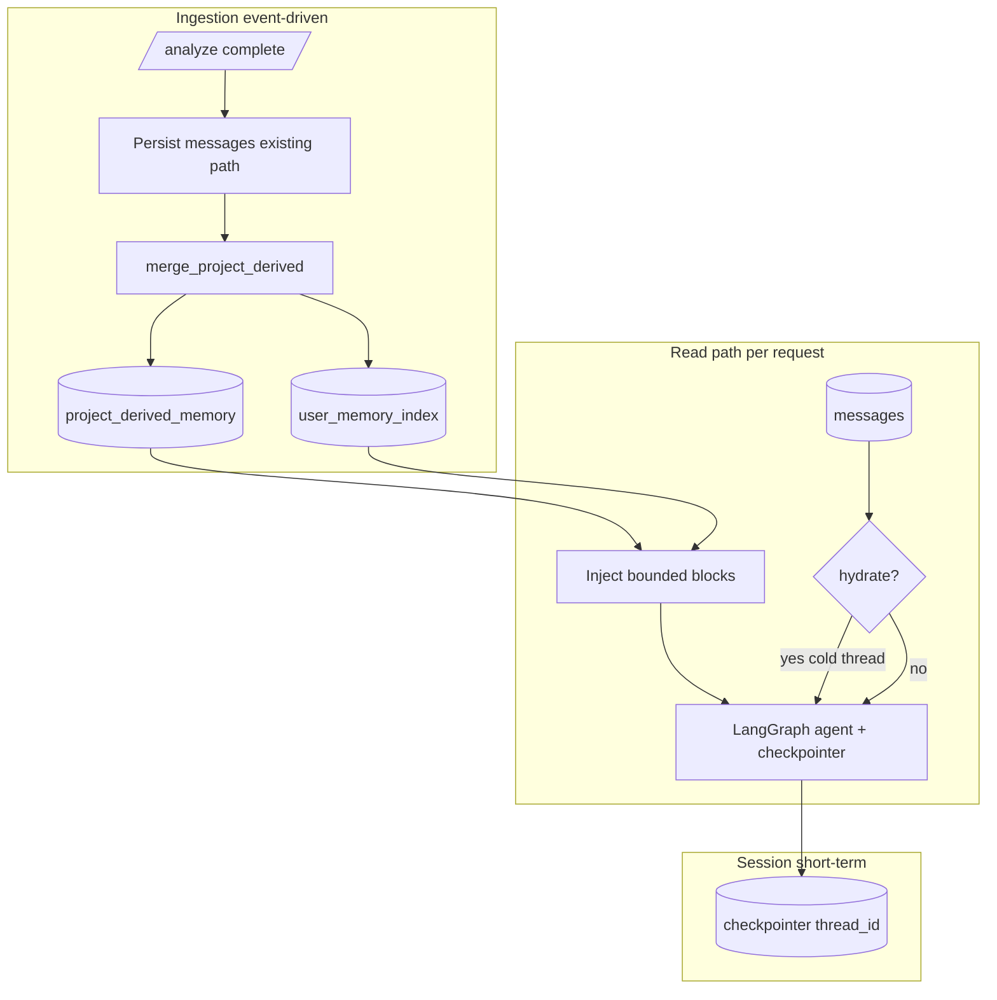
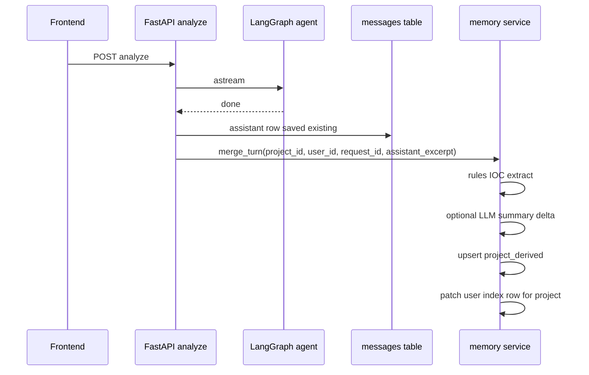

# Design: Agent context & memory layers

## Metadata

- **Slug:** `agent-context-memory-layers`
- **Status:** Phase 4–6 implemented (2026-04-07)
- **Related:** [proposal.md](./proposal.md), [acceptance.md](./acceptance.md)
- **`design.md` is the implementation source of truth** for this delivery.

## Todo list

Implementation backlog (stable ids). Order by dependency.

- [x] **ctx-spec-schema** — `app/services/context_memory/schema.py` + JSONB `payload` with `version: 1` (`MEMORY_SCHEMA_VERSION`).
- [x] **ctx-db-migration** — `python-agent-service/scripts/db/20260407120000_context_memory_layers.sql` (tables + triggers; local Postgres without `auth.uid()` RLS — app-layer tenant checks).
- [x] **ctx-store-factory** — v1: dedicated async repository (`context_memory/repository.py`) instead of `ContextRetriever` store adapter; flag-off keeps prior behavior.
- [x] **ctx-merge-service** — `context_memory/merge.py` + `pipeline.merge_after_message_persist`; idempotency via `context_memory_merge_log` + early skip.
- [x] **ctx-summary-llm** — `context_memory/summary_llm.py` + `derived_layer_model` / `DERIVED_LAYER_MODEL`; failure → rules-only; bounded input.
- [x] **ctx-hook-post-analyze** — `message_persistence.persist_analysis_result` awaits merge after successful local/supabase persist.
- [x] **ctx-inject-analyze** — `deep_agent.analyze_stream` prepends `[Project memory]` / `[User context]` via `build_injection_prefix` (`CONTEXT_INJECT_MAX_CHARS`).
- [x] **ctx-hydrate-checkpoint** — v1: `CONTEXT_HYDRATE_ENABLED` + `fetch_hydration_prefix` (last K message rows as text block), not full checkpoint rewrite.
- [x] **ctx-prompt-master** — `MASTER_AGENT.md` — **Context memory & multi-turn history**.
- [ ] **ctx-optional-tools** — Deferred: `get_recent_turns` tool not in v1.
- [x] **ctx-observability** — `context_memory_merge_total` / `context_memory_inject` logs (`merge_duration_ms`, `memory_inject_bytes`, `summary_model`).
- [x] **ctx-tests** — `tests/test_context_memory.py` (merge, idempotency, owner deny, LLM failure, injection cap, flag off).

## Architecture

Three **logical** layers; two are **persisted derived** + one is **LangGraph ephemeral/persistent state**.



**Responsibilities**

| Layer | Storage | Lifetime | Purpose |
|-------|---------|----------|---------|
| User index + profile bits | PostgreSQL | Cross-project | Cheap navigation, last-active project lines, optional habits |
| Project derived | PostgreSQL | Per project | Structured IOCs/findings/summary; **not** full chat |
| Session (checkpointer) | Postgres/memory | Per `thread_id` | Tool loops, multi-turn graph state; may be summarized by DeepAgents middleware |

## Flows

### F1 — Incremental update after a turn



### F2 — Cold thread / refresh

1. Client sends same `session_id` / `thread_id` as `project_id` (current product pattern).
2. Server loads checkpointer state.
3. If **empty** or **stale** (heuristic: `messages.updated_at` newer than checkpoint metadata — exact rule in implementation), optionally **hydrate** last K message pairs into state **or** rely on injection-only path for first model call.
4. Run `analyze_stream` as today.

### Pseudocode (merge idempotency)

```
function on_turn_committed(project_id, user_id, request_id, assistant_text):
  key = f"merge:{project_id}:{request_id}"
  if store.has_processed(key): return
  prev = load_project_derived(project_id)
  entities = extract_iocs_rules(assistant_text)
  summary_delta = optional_llm_summarize(assistant_text, model=DERIVED_LAYER_MODEL)
  next = merge(prev, entities, summary_delta)
  save_project_derived(project_id, next)
  patch_user_index(user_id, project_id, one_line_from(next))
  store.mark_processed(key, ttl=7d)
```

## Contracts

### Config keys (environment)

| Key | Purpose |
|-----|---------|
| `CONTEXT_MEMORY_ENABLED` | Master flag for inject + merge |
| `DERIVED_LAYER_MODEL` | Gateway model id for summary/merge text |
| `CONTEXT_INJECT_MAX_CHARS` | Hard cap for injected memory blocks |
| `CONTEXT_HYDRATE_ENABLED` | Enable checkpoint hydration from `messages` |
| `CONTEXT_HYDRATE_MAX_TURNS` | Max user/assistant pairs to load |
| `CONTEXT_MERGE_ASYNC` | If true, enqueue merge (future queue); v1 may inline with timeout |

### `project_derived_memory` (logical; implementation = table JSONB or `agent_store`)

- `version` (int)
- `updated_at` (timestamptz)
- `entities` (array of {type, value, verdict?, confidence?})
- `findings` (array of short strings or structured)
- `open_questions` (array of strings)
- `running_summary` (string, bounded length)
- `source_last_request_id` (string, optional)

### `user_memory_index` (logical)

- `user_id` (uuid)
- `projects` (array of {project_id, title, last_active_at, one_line_summary})
- `preferences` (optional, shallow key-value)
- `updated_at`

### API / behavior

- No new public REST requirement for v1 unless product wants a debug endpoint; **internal service functions** called from analyze path.
- All reads/writes must enforce **same tenant** as `messages` RLS.

## Edge cases & errors

- **LLM summary failure**: Skip summary delta; still apply rule-based entity merge; log warning.
- **Duplicate merge** (retry): Idempotency via `request_id` or message id.
- **Huge assistant payload**: Truncate input to summarizer; never expand beyond `CONTEXT_INJECT_MAX_CHARS` on inject.
- **Subagent-only deep-research path**: Ensure merge uses **final user-visible** text from persistence layer, not partial stream.
- **SummarizationMiddleware** already compacts graph messages: prompt must say **verbatim compare** may require tool/DB read.
- **HITL pending**: Do not run merge for incomplete turns until committed (same as message persistence rules).

## Operational / rollout

- Ship with `CONTEXT_MEMORY_ENABLED=false` in prod until acceptance passed.
- Backfill: optional one-off script **per active project** (batched LIMIT), not mandatory for v1.
- Metrics: counter `context_memory_merge_total`, histogram `context_memory_merge_latency_ms`.

## Implementation order

1. Schema + RLS + feature flag.
2. Merge service (rules-only path first).
3. Post-analyze hook after message commit.
4. Injection in `analyze_stream`.
5. `MASTER_AGENT.md` prompt section.
6. Optional hydrate + tools.
7. LLM summary path + `DERIVED_LAYER_MODEL`.

## Rationale (ADR-style)

- **Event-driven merge** vs nightly full recompute: cost scales with **active analyzes**, not registered users.
- **Derived layer** vs duplicating `messages`: keeps tokens predictable; `messages` remains audit/UI source of truth.
- **Separate small model**: isolates cost and avoids coupling summarization to the main security model choice.
- **Hydration optional**: checkpointer is canonical for tool state; DB hydrate is for **continuity** when checkpoint lags UI.

## UI (v1)

**No user-visible UI changes** in this slice. Optional future: “Project memory” debug panel — out of scope; see [acceptance-ui.md](./acceptance-ui.md).

## Code touch list (initial)

| Area | Paths / notes |
|------|----------------|
| Analyze pipeline | `python-agent-service/app/agents/deep_agent.py` (`analyze_stream`), `stream_analyze_request` |
| Persistence hook | Where assistant `messages` rows are finalized (message_persistence / API layer) — align merge ordering |
| Store | `python-agent-service/app/backends/store.py`, `ContextStoreAdapter`, Postgres pool |
| Retriever | `python-agent-service/app/middleware/context_retriever.py` — wire store, namespaces `memories/{session}` vs new tables |
| Config | `python-agent-service/app/config/settings.py`, `config/env.md` |
| Prompt | `python-agent-service/app/prompts/MASTER_AGENT.md` |
| Gateway | `python-agent-service/app/llm_gateway/*` — resolve `DERIVED_LAYER_MODEL` |
| Migrations | `supabase/migrations/*.sql` if new tables |
| Tests | `python-agent-service/tests/test_context_memory_*.py` |

## Testing strategy

- **Unit**: `merge_project_derived` pure merges, truncation, idempotency key.
- **Integration**: Mock Supabase or test DB — RLS deny cross-user read/write.
- **Contract**: Injection respects `CONTEXT_INJECT_MAX_CHARS`.
- **Regression**: Existing analyze SSE tests still pass with flag off.

## Design review handoff

- **Slug:** `agent-context-memory-layers`
- **Mockups:** Deferred — backend-only v1; user opted to skip mockups (see `acceptance-ui.md`).
- **acceptance-ui.md:** N/A criteria for UI; **`target.local.yaml`** not required for this slice; Phase 6 `/design-review` is **N/A** unless UI scope is added later.
