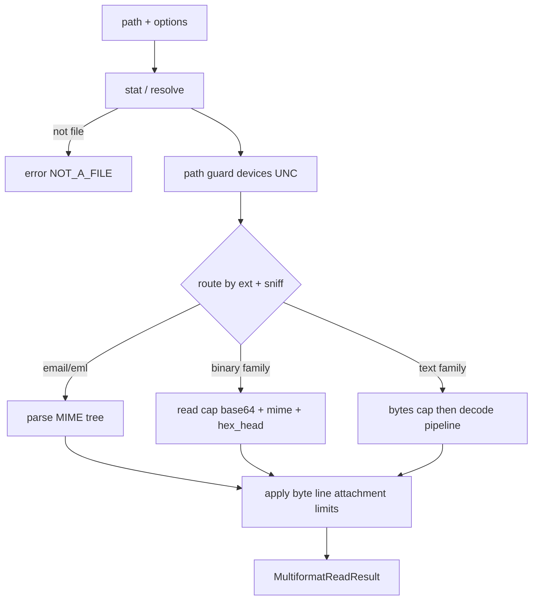
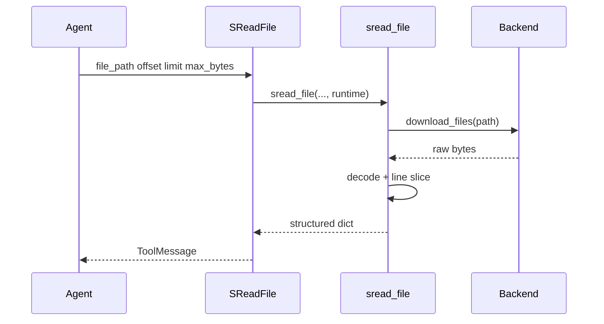
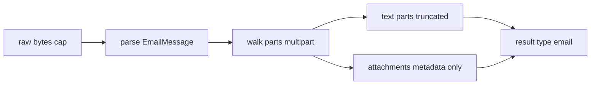

# Design: Agent 多格式安全读取

## Metadata

- **Slug**: `agent-multiformat-file-read`
- **Date**: 2026-04-28
- **Design review**: 2026-04-28（Claude Code parity + 实现差距对齐，见 §Claude Code parity）
- **Verification**: 2026-04-28 — Phase 5 绿；Phase 6 **DONE_WITH_CONCERNS**（见 `acceptance.md` Sign-off）
- **Links**: [`proposal.md`](./proposal.md) · [`acceptance.md`](./acceptance.md)

## Source plan (traceability)

本期由对话直接提炼需求，无独立 `*.plan.md`。**`design.md` 为本交付的设计 SoT**；实施时若引入 Cursor plan 文件，可在此补录路径与一句意图。

## Todo list（Phase 4 基准 backlog）

> **命名说明**：落地工具名为 **`SReadFile`**（非初版草稿中的 `read_file_analyze`）。下文 Todo id 保持不变，便于追溯。

- [x] **spec-contract** — 工具返回字典已与 §Contracts 大致对齐；待补：`encoding_confidence`、`sha256`、`binary_base64` 字段名与契约表统一（当前 JSON 用 `base64`）。
- [x] **core-reader** — `app/tools/sread_file.py`：`download_files` 取字节 → 分类 → 文本/二进制/EML。
- [x] **text-encoding** — UTF-8 / UTF-8-sig → CJK 与 cp1252 → `charset-normalizer` → replace；**未**单独输出 `encoding_confidence` 数值。
- [ ] **line-window** — 已实现 offset/limit 行窗 + 单行长度帽；**未**实现 readFileInRange 式「仅读窗口字节」流式（整对象仍经 `download_files` 进入内存，见 §缺口）。
- [x] **email-eml** — `.eml` 分支与附件元数据；**未**做 headers 结构化预览数组、附件 hash；**MIME 嵌套/畸形** 仍可能触内存峰值（见 §缺口）。
- [x] **webshell-heuristics** — 文本扩展名 + 魔数/`NUL`  sniff 强制二进制；`hex_preview_bytes` 可选。
- [ ] **safety-guards** — 虚拟路径为主，**未**复刻 Claude Code 的 `/dev/*` 设备黑名单（对 `CompositeBackend` 一般不暴露）；**未**在工具层重复 Filesystem **deny 规则**显式校验（依赖后端隔离）。
- [x] **integrate-backend** — 经 `ToolRuntime` + `download_files`，未改 vendor。
- [x] **tool-or-wrapper** — `SReadFile` + `common_tool_registry` + `tool_presentation.yaml` + `MASTER_AGENT.md` 引导。
- [ ] **obs-logging** — 结构化 metrics（`content_kind`、`truncated`、耗时）**未**接入。
- [x] **tests-fixtures** — 单元测试覆盖路径/解码/sniff/假 backend；完整 fixture 文件仍可扩充。

## Architecture

核心思想：**先分类（kind），再选解码策略（decode policy），再应用预算（budget），最后封装元数据（metadata）**。



- **Router**：扩展名（快路径）+ 文件头魔数（防伪装扩展名）+ 既有 `_get_file_type` 逻辑可对齐但不得唯扩展名论。
- **Binary family**：与现后端一致返回 **base64**，并附加 **sha256 可选**、**前 N 字节 hex**（便于 webshell 里藏二进制块时人工扫）。
- **Text pipeline**：见 §Rationale（UTF-8 优先、探测、替换符退化）。
- **Email**：独立分支，输出 **结构化子对象**，避免单行拼接进模型。

## Flows

### 主序列（文本文件）



> **Note**：图中「policy reminder」为设计目标；当前实现未附加 Claude Code 同款的 cyber-risk 文案（见 §Claude Code parity）。

### EML



## Contracts

### `MultiformatReadResult`（逻辑模型）

与实现语言无关的字段约定（JSON 可序列化）：

| Field | Type | 说明 |
|-------|------|------|
| `ok` | bool | 是否可读（退化成功也算 true，见 `warnings`） |
| `path` | str | 请求路径 |
| `content_kind` | enum | `text` \| `binary` \| `email` \| `image` \| `pdf` \| `empty` \| `error` |
| `mime_guess` | str? | `mimetypes` 或魔数推断 |
| `text` | str? | 仅 `text`/`email` 摘要文本或主体片段 |
| `encoding` | str? | 实际用于解码的编码名，`utf-8`/`gb18030`/… |
| `encoding_confidence` | float? | 0–1，`charset-normalizer` |
| `truncated` | bool | 是否因字节/行/附件策略截断 |
| `truncation_reason` | str? | `max_bytes` / `max_lines` / `attachment_skipped` |
| `line_start` | int? | 返回文本起始行（1-based 与工具对齐需在工具层说明） |
| `line_count` | int? | 返回行数 |
| `total_lines` | int? | 若已扫描全文件则填；流式部分扫描可 `null` |
| `binary_base64` | str? | `content_kind=binary`（或 image/pdf 视产品是否走专用工具） |
| `hex_head` | str? | 可选；前 N 字节 hex，空格分隔 |
| `email` | object? | 见下 |
| `warnings` | str[] | 如 `decoded_with_replacement` |
| `error_code` | str? | `NOT_FOUND` / `NOT_A_FILE` / `BLOCKED_PATH` / `TOO_LARGE` |
| `error_message` | str? | 人类可读 |

`email` 对象（示意）：

```json
{
  "subject": "…",
  "from": "…",
  "to": ["…"],
  "date": "…",
  "headers_preview": [{"name": "Received", "value": "…"}],
  "body_text": "…",
  "body_html": null,
  "attachments": [{"filename": "a.bin", "content_type": "application/octet-stream", "size_bytes": 1024, "skipped": true}]
}
```

### 与现有 `ReadResult` / `FileData` 映射

- **`content_kind=binary`**：`FileData(encoding="base64", content=binary_base64)`，与当前 middleware 图片/pdf 分支一致时可继续用 `ToolMessage` content_blocks。
- **`content_kind=text`**：`FileData(encoding="utf-8", content=text)` — **注意**：内部解码可为 GBK，**入 `ReadResult` 前须归一化为 Unicode 字符串**（Python `str`），`encoding` 元数据放在 tool artifact 或 `additional_kwargs`（若扩展 Middleware）。
- **`content_kind=email`**：优先整包 `text` 为 **人类可读摘要 Markdown 串**（工具层生成），完整 `email` JSON 放 `artifact`（若 LangChain 工具支持）或第二个块；需在实现任务中二选一并写死。

### 配置键（建议环境变量或 YAML）

| Key | 含义 | 默认建议 |
|-----|------|----------|
| `MULTIFORMAT_READ_MAX_BYTES` | 单次读盘上限 | 与现网 `maxSize` 对齐，如 2–20MB |
| `MULTIFORMAT_READ_MAX_LINES` | 默认行窗 | 与 DeepAgents 默认 limit 对齐 |
| `MULTIFORMAT_HEX_HEAD_BYTES` | hex 前缀长度 | 64 |
| `MULTIFORMAT_EMAIL_ATTACH_INLINE_MAX` | 附件内联阈值 | 0（默认不内联） |

## Code touch list（预期）

| 路径 | 风险 / 备注 |
|------|----------------|
| `python-agent-service/app/tools/sread_file.py` | **当前实现**：`SReadFile` 核心逻辑 |
| `python-agent-service/app/tools/common_tool_registry.py` | 注册 mounter |
| `python-agent-service/config/tool_presentation.yaml` | `SReadFile` 描述与 LLM 路由说明 |
| `python-agent-service/app/prompts/MASTER_AGENT.md` | `SReadFile` vs `read_file` |
| `python-agent-service/requirements.txt` | `charset-normalizer` |
| `python-agent-service/tests/test_sread_file.py` | 单测 |
| **避免直接改** `app/_vendor/deepagents/**` | 同步 vendor 会丢补丁 |
| 参考：`deepagents/backends/filesystem.py` `read()` | 默认 UTF-8 与 binary 分支（`read_file`） |

## Claude Code（FileReadTool）安全与工程 parity

对照第三方归档 [FileReadTool.ts](https://github.com/chauncygu/collection-claude-code-source-code/blob/main/original-source-code/src/tools/FileReadTool/FileReadTool.ts) / [readFileInRange.ts](https://github.com/chauncygu/collection-claude-code-source-code/blob/main/original-source-code/src/utils/readFileInRange.ts) 中与**安全、鲁棒性、成本**相关的做法：

| Claude Code 做法 | 本设计 / `SReadFile` 现状 | 说明 |
|------------------|---------------------------|------|
| **设备路径黑名单**（`/dev/zero`、`/dev/urandom` 等防挂死） | **未在工具层实现** | SecManus 使用虚拟路径 + `download_files`；若未来支持「原始主机路径」直连，需移植黑名单。 |
| **UNC 路径与权限**：校验阶段对 `\\` 延迟真实 I/O | **弱相关** | 虚拟路径无 UNC；本地 `FilesystemBackend` 另由 DeepAgents 与上传范围约束。 |
| **扩展名二进制门禁** + PDF/图例外 | **部分**：二进制扩展表 + `_get_file_type != text` → base64；**未**把 PDF/图单独升成 document/image 块（与 `read_file` 多模态分支重复时有意识简化）。 |
| **BOM 剥离 + CRLF 规范化** | **部分**：解码走 `utf-8-sig`；行切分用 `splitlines()`，展示用 `\n` 拼接，与 CC 行为接近。 |
| **行窗 + 字节帽** | **有**：`offset`/`limit`、`max_bytes`、行长上限；**无**：CC 的「大文件流式只数行不入内存」双路径。 |
| **Token / 字符预算 API 计票** | **无** | 仅靠字节与行；大文本可能仍占满上下文，属后续缺口。 |
| **同路径同 range + mtime 去重（file_unchanged）** | **无** | 设计 §Rationale 已提；未实现。 |
| **工具结果附加「恶意代码」系统提示**（只分析、不协助改进恶意逻辑） | **无** | CC 在 `mapToolResultToToolResultBlockParam` 注入 `CYBER_RISK_MITIGATION_REMINDER`；**建议在 `SReadFile` 成功返回的 ToolMessage 或 prompt 层补等价提醒**（与 MASTER 身份护栏互补）。 |
| **空文件 / offset 超界** 明确文案 | **有** | `empty`、`offset_beyond_eof` 等。 |
| **Notebook / PDF 页范围** | **不在 SReadFile 范围** | 继续用 `read_file` / 专用流水线。 |

## 缺口与建议（设计审查）

以下为对照设计目标与 Claude/Code 优秀做法后，**仍欠缺或需明确决策**的项（不改变 §Sign-off 规则；实施前可走 Phase 3 小批变更）：

1. **服务端内存与「整文件 download」**：当前 `download_files` 返回完整 `bytes` 后再截断；若后端先读满 100MB 再截断，仍可能峰值过高。建议：后端支持 **Range / 首块** 读取，或文档化「后端必须按路径流式且遵守 max_bytes」的契约。
2. **EML / MIME**：`get_payload(decode=True)` 为测附件大小时会解码整段；恶意邮件可导致 **CPU/内存放大**。建议：multipart **深度/部件数上限**、单 part **字节上限**、大附件只记 `Content-Length` 式元数据（若头可用）而不解码。
3. **契约字段一致**：实现使用 `base64` 而非设计表的 `binary_base64`；缺少 `encoding_confidence`、`sha256`。建议：下一补丁统一字段名或补别名。
4. **模型政策字符串**：补 **与 CC 同级的 malware-analysis-only 提醒**（挂载在工具返回或系统片段），避免模型在检材场景下「帮改 webshell」。
5. **观测**：`acceptance.md` N-02 要求日志不含正文；需在实现中 **`structlog` 事件字段** 与采样策略对齐。
6. **流式行窗**：超大单行日志 / 无换行文件，当前仍会先把全文解码为 `str` 再切行。建议：二进制路径或 **仅首 MB 试解码** 与 CC streaming 对齐。
7. **权限与敏感路径**：明确 SReadFile **仅允许** `/workspace/`、`/uploads/`（及运营白名单前缀），拒绝对 `/memories/` 等敏感虚路径的「检材式全文读取」若业务需要限制。

## Phase 3 Gate（补登记）

- **3A UI**：N/A（`acceptance-ui.md` 已声明无 UI）。
- **3B Backend**：`acceptance.md` 仍有效；本节的 **parity/缺口** 不改变 A/N 编号，可作为 **DONE_WITH_CONCERNS** 或下一迭代的 acceptance 增补来源。

## Testing strategy

### 单元 / 集成

- 编码：UTF-8、UTF-8 BOM、`gb18030` PHP 样本、非法尾部字节 + replacement 路径。
- 二进制：扩展名 `.exe` 与小文件魔数 `MZ`。
- EML：multipart、无 Subject、`base64` 附件、`message/rfc822` 嵌套（可选）。
- 边界：空文件、`offset` 超界、单文件无换行超大行（流式截断）。
- 安全：`/dev/zero` 类路径拒绝（若运行在 Linux 环境测）。

### E2E scenarios

本期 **无 UI**；若仅交付库 + 工具，E2E 可为 **可选**：用集成测试调用带工具的 Agent 一次 **`SReadFile`**。若后续接前端上传，再补 Standard E2E。

| ID | Scenario | Route / API | Key assertions |
|----|----------|-------------|----------------|
| E2E-01 | Agent 读 GBK PHP | 内部 API 触发工具调用 | 返回 `ok=true`，`encoding` 含 `gb` 族或 `warnings` 含 replacement |
| E2E-02 | Agent 读 EML | 同上 | `content_kind=email`，附件 `skipped` |

## Edge cases & errors

| 情况 | 行为 |
|------|------|
| 伪装扩展名（`.txt` 实为 PE） | 魔数优先 → `binary` |
| Webshell 极小 + base64 块 | `text` 窗 + 可选 `hex_head` 同开 |
| 邮件 50MB + 多附件 | 仅头与正文窗 + 附件列表 |
| **恶意 MIME 嵌套 / base64 炸弹** | 设计缺口：见 §缺口与建议（2）；实施前应加 part 深度与解码字节帽 |
| **虚拟路径越权**（如 `/memories/`） | 设计建议：见 §缺口与建议（7）；可在 `_canonical_virtual_path` 后加白名单 |
| Windows 无 `/dev/*` | 维持路径黑名单为 **平台条件编译** |
| 软链 | 与现有 `O_NOFOLLOW` 策略一致 |
| Unicode 规范化路径 | 与 `validate_path` 一致 |

## Implementation order

1. `MultiformatReadResult` + 纯函数路由 + 单测夹具。
2. 文本编码管线 + 行窗 + 字节帽。
3. 二进制与 hex_head。
4. EML 解析与限额。
5. 工具封装与 prompt 引导。
6. 观测与文档同步。

## Rationale

- **为何不全员 `errors=replace`**：安全审计需要知道是否发生了替换；默认 **严格 UTF-8 尝试** 再探测，与 Claude Code「假定 UTF-8」一致，但多一步 **显式探测** 以降低中文环境失败率。
- **为何 EML 不单走 `read_file` 文本**：`splitlines` 会破坏 MIME 边界语义；独立解析才能控附件与钓鱼特征字段。
- **为何借鉴 dedup**：Claude Code 的 `file_unchanged` 省 token；我们可在 **工具层** 用 `(path, mtime, range)` 缓存键实现，避免改 vendor。

## UI

**N/A**（本期为后端读取函数与 Agent 工具）。若产品在 UI 展示「编码/截断」标签，另开交付。

## Design review handoff

**N/A** — 无用户界面变更。

## Mockups deferred

无 UI mockup；`mockups/README.md` 占位说明。正式 Sign-off 仅出现在 `acceptance.md` / `acceptance-ui.md`（**GR-SIGNOFF**）。
