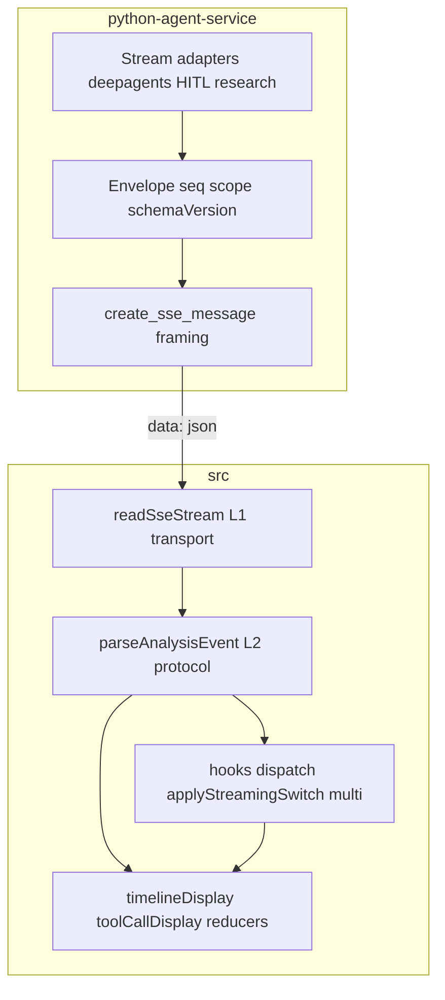
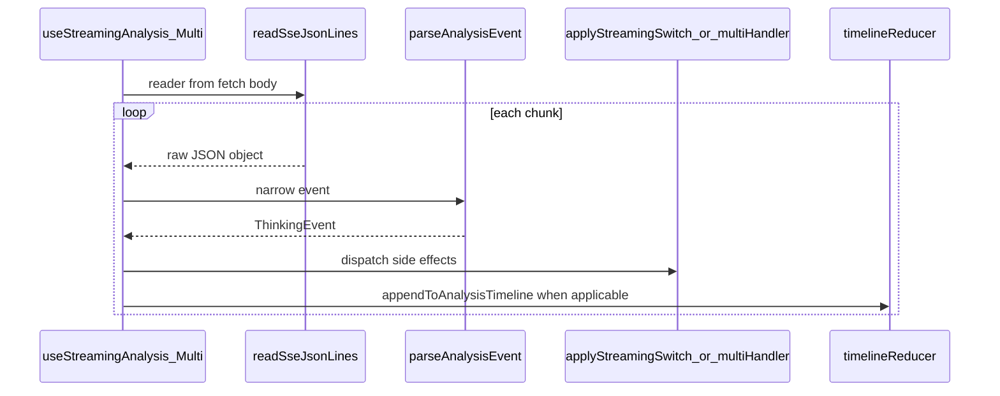

## Metadata

- **Slug:** `analysis-sse-layering`
- **Updated:** 2026-03-28
- **Source Cursor plan (read-only reference):** `C:\Users\chenf\.cursor\plans\sse_protocol_layering_db0def90.plan.md` — this file is the **implementation source of truth**; the plan is not pasted verbatim here to avoid duplicate sections and drift.
- **Related:** [proposal.md](./proposal.md), [acceptance.md](./acceptance.md), [acceptance-ui.md](./acceptance-ui.md)

## Scope summary

- **Slice A (behavior parity):** Frontend L1 (`readSseJsonLines`) + L2 (`parseAnalysisEvent`) + shared `write_todos` / task-plan extraction; hooks delegate to these layers without changing observable SSE behavior.
- **Slice B (contract):** Backend emits `toolPresentation` / `parameterControl` per [docs/SSE_EVENT_CATALOG.md](../../SSE_EVENT_CATALOG.md); L2/L3 prefer those fields over `toolName` heuristics (with migration fallback).
- **Mandatory for this delivery (supersedes any older「可选」wording in the plan file):** `python-agent-service/app/sse/` (framing + envelope) and the **tool presentation registry** + adapter enrichment — not optional follow-ups.

Anchors: [docs/SSE_EVENT_CATALOG.md](../../SSE_EVENT_CATALOG.md), [src/types/analysis.ts](../../../src/types/analysis.ts). OpenSpec e.g. [openspec/changes/unify-agent-sse-timeline/](../../../openspec/changes/unify-agent-sse-timeline/) is parallel reference only.

---

## Architecture (four layers)



| Layer | Responsibility |
| --- | --- |
| **L1** | SSE bytes → complete `data:` lines → `JSON.parse`; buffer semantics and abort/idle hooks match existing hooks. |
| **L2** | `unknown` → `ThinkingEvent`; migration shims (`stateMutatingOnly` ↔ `toolPresentation`, `skill_*`) align with catalog §3/5/6 when enabled. |
| **L3** | Pure functions: `appendToAnalysisTimeline`, `timelineDisplay`, `reactLinearTimeline`, etc. — **only** parsed events; never raw `ReadableStream`. |
| **L4** | React: `useStreamingAnalysis` / `useStreamingAnalysisMulti` — lifecycle, `requestId` / `internal` filtering, call **unified dispatch**. |

**Invariant:** L3 never reads raw streams; it receives `ThinkingEvent` or derived timeline rows only.

---

## Phased delivery

**Slice A**

1. Add `src/lib/sse/readSseJsonLines.ts` — async iterable, multi-chunk line boundaries, same skip/log policy as current hooks; Vitest fixtures.
2. Add `src/lib/sse/parseAnalysisEvent.ts` — narrow to `ThinkingEvent`; golden tests from captured lines (redact secrets).
3. Add `src/lib/streaming/taskPlanFromWriteTodos.ts` — dedupe `applyStreamingSwitch` vs `multiAnalyzeStreamEvents`.
4. Refactor both streaming hooks to `for await` over L1 → L2; preserve idle timer, abort, `requestId`, `internal` semantics **line-by-line** vs current code.

**Slice B**

- Registry-backed `toolPresentation` on every `tool_call`; L3 branches on `toolPresentation` first, `toolName` as fallback until backend fully rolled out.
- Keep [docs/SSE_EVENT_CATALOG.md](../../SSE_EVENT_CATALOG.md) §11 and `analysis.ts` in sync.

---

## Todo list

Phase 4 backlog (stable ids). Check off in this file as work completes.

- [x] **fe-sse-l1** — Add `src/lib/sse/readSseJsonLines.ts` (or `transport.ts`) + Vitest; match existing hook buffer/`data:` / parse behavior where observable.
- [x] **fe-sse-l2** — Add `src/lib/sse/parseAnalysisEvent.ts` + golden tests; thin narrow to `ThinkingEvent`.
- [x] **fe-write-todos-shared** — Add `src/lib/streaming/writeTodosTaskPlan.ts` (name final in PR); replace duplicate logic in `applyStreamingSwitch.ts` and `multiAnalyzeStreamEvents.ts`.
- [x] **fe-hooks-refactor** — Wire `useStreamingAnalysis.ts` and `useStreamingAnalysisMulti.ts` through L1/L2; preserve idle timeout, abort, `requestId` filtering, `internal` handling.
- [x] **be-sse-framing** — **(Required)** Move `create_sse_message` (+ `mark_event_internal` call site unchanged) to `python-agent-service/app/sse/framing.py`; `main.py` and other producers **import** it; pytest proves byte-identical SSE lines for fixture events.
- [x] **be-sse-envelope** — **(Required)** Move `_apply_sse_envelope` (+ related helpers) to `python-agent-service/app/sse/envelope.py`; adapters **import** it; existing adapter tests green.
- [x] **be-tool-registry** — Authoritative **`toolName → presentation metadata`** table in Python (`app/sse/tool_presentation.py`; YAML merge optional / deferred); register all **system/framework** tools once with tests; document merge order (file vs code vs tool object attrs).
- [x] **be-tool-call-enrich** — Before each `tool_call` SSE: `meta = REGISTRY.get(toolName) or DEFAULT`; copy `toolPresentation` / `parameterControl`; remove unbounded `if toolName == …` presentation chains.
- [x] **be-tool-registration-conventions** — Prefix/namespace defaults (e.g. `internal_*`, `hitl_*` → default `state` unless overridden); fixed middleware tool names in a small static table if useful.
- [x] **be-unknown-tool-observability** — On miss: DEFAULT; structured log `unknown_tool_name`; optional dev **strict** flag (name TBD).
- [x] **fe-slice-b-l3** — L2/L3 prefer event `toolPresentation` over `toolName` allowlists; migration fallback until backend complete; sync `analysis.ts` + catalog §11.
- [ ] **verify-pipeline** — `npm run test` (Vitest) for touched frontend; `pytest` for touched Python; Phase 6 sign-off per `acceptance.md` / `acceptance-ui.md`.

### Implementation order (authoritative)

1. **be-sse-framing** — Single outbound SSE line formatter (removes duplication in `main.py`).
2. **be-sse-envelope** — Single place for `schemaVersion` / `seq` / `scope` / `turn`.
3. **be-tool-registry** + **be-tool-registration-conventions** + **be-unknown-tool-observability** — Before adapter edits that emit `tool_call`.
4. **be-tool-call-enrich** — All `tool_call` emitters use registry lookup.
5. **fe-sse-l1** → **fe-sse-l2** → **fe-write-todos-shared** → **fe-hooks-refactor** — Frontend transport / protocol / dispatch.
6. **fe-slice-b-l3** — UI reads `toolPresentation` first.
7. **verify-pipeline**

PR split example: PR-A = steps 1–2, PR-B = 3–4, PR-C = FE — all in scope for this delivery.

---

## Flows



---

## Pseudocode (L1)

```
buffer = ""
loop:
  read chunk from reader (respect abortSignal)
  buffer += decode(chunk, stream=true)
  lines = buffer.split("\n")
  buffer = last incomplete line
  for line in complete lines:
    if not line.startsWith("data: "): continue
    payload = line.slice(6)
    try: yield JSON.parse(payload)
    catch: same as current hook (skip or log — lock with existing code)
```

Diff against `useStreamingAnalysis` / `useStreamingAnalysisMulti` for: empty payloads, `[DONE]` if present, double newlines.

---

## Code touch list

| Path | Action |
| --- | --- |
| `src/lib/sse/readSseJsonLines.ts` | **Add** |
| `src/lib/sse/readSseJsonLines.test.ts` | **Add** |
| `src/lib/sse/parseAnalysisEvent.ts` | **Add** |
| `src/lib/sse/parseAnalysisEvent.test.ts` | **Add** |
| `src/lib/streaming/taskPlanFromWriteTodos.ts` | **Add** (+ test) |
| `src/hooks/useStreamingAnalysis.ts` | **Edit** — replace inline SSE loops |
| `src/hooks/useStreamingAnalysisMulti.ts` | **Edit** — same |
| `src/hooks/applyStreamingSwitch.ts` | **Edit** — shared todo helper |
| `src/hooks/multiAnalyzeStreamEvents.ts` | **Edit** — shared todo helper |
| `python-agent-service/app/sse/__init__.py` | **Add** (if package) |
| `python-agent-service/app/sse/framing.py` | **Add** — canonical `create_sse_message` |
| `python-agent-service/app/sse/envelope.py` | **Add** — canonical envelope helpers |
| `python-agent-service/app/main.py` | **Edit** — import framing |
| `python-agent-service/app/parsers/deepagents_stream_adapter.py` | **Edit** — import envelope; registry enrich |
| `docs/SSE_EVENT_CATALOG.md` | **Edit** only if Slice B or doc drift |

**Risky areas:** HITL resume streams, multi-project `requestId` filtering, idle timeout — preserve behavior; add regression tests if gaps.

---

## Contracts

| Concern | Rule |
| --- | --- |
| L1 output | Each successful line → parsed value (`unknown` / `Record<string, unknown>`), equivalent to current `JSON.parse(line.slice(6))`. |
| L2 output | `ThinkingEvent` per [src/types/analysis.ts](../../../src/types/analysis.ts); `internal: true` may still log then short-circuit in L4 (match `multiAnalyzeStreamEvents`). |
| SSE line shape | `data: ` + single JSON object + `\n` (and trailing `\n` as today); `create_sse_message` path still applies `mark_event_internal` ([events.py](../../../python-agent-service/app/parsers/events.py)). |
| Envelope | `schemaVersion`, `seq`, `scope`, `turn` per catalog §1; Slice A does not remove fields. |
| Error / done | `type: error` / `done` ordering unchanged from current product. |
| `tool_call` (Slice B) | Every emitted `tool_call` includes `toolPresentation` from **merged registry** or **DEFAULT**; `parameterControl` iff `toolPresentation === 'parameter'`. Values are **not** model-generated. |

---

## Edge cases & errors

- **Request superseded:** Event `requestId` ≠ active → multi hook returns early; L2 must not drop this check.
- **Abort / stream switch:** `activeRequestId` and refs unchanged; L1 does not swallow errors.
- **Partial line / half JSON:** Buffer retains incomplete line (match current).
- **Empty lines / `[DONE]`:** Match current hook + E2E.
- **Unmount mid-stream:** Reader cancel; no updates after unmount (`isMountedRef` patterns stay in hooks).
- **Malformed JSON:** Match current (typically skip + dev log); lock in L1 tests.
- **Registry duplicate key:** Deterministic merge rule or fail-fast at startup; document in registry module.
- **toolName casing:** Registry keys case-sensitive, exact runtime names; aliases explicit rows only.
- **Subagent merged stream:** Same registry; document `scope` / `subagentName` if names could collide.

---

## Tool presentation registry (Slice B)

**Principle:** `toolPresentation` / `parameterControl` are **declared by engineering** (registry, tool metadata, or merged config), not inferred from LLM text. Adapter does **lookup + default + copy** only.

### Registry shape (conceptual)

| Field | Type | Notes |
| --- | --- | --- |
| Key | `toolName` | Exact LangGraph / OpenAI tool name string. |
| `toolPresentation` | `task` \| `action` \| `state` \| `parameter` | Catalog §6 / Appendix A. |
| `parameterControl` | `single` \| `multi` \| `fill` | Required when `toolPresentation === 'parameter'`. |

### Merge sources (runtime single table)

1. **Code registry (base):** System/framework tools in one reviewed module.
2. **Config overlay (optional):** YAML/JSON; documented precedence vs code.
3. **Tool object metadata (optional):** Read at registration/wrap; same merged table.

**Default precedence recommendation:** Code rows for system tools stable; config may override custom entries if documented; tool object fills gaps. Encode final rule in comments + one test.

### Adapter (before serializing `tool_call`)

```text
meta = MERGED_REGISTRY.get(toolName)
if meta is None:
    log structured: unknown_tool_name { toolName, ...context }
    meta = DEFAULT_PRESENTATION
event["toolPresentation"] = meta.toolPresentation
if meta.parameterControl:
    event["parameterControl"] = meta.parameterControl
```

### Naming conventions

- Prefixes (`internal_`, `hitl_`, …) → default `state` unless explicit registry row.
- Deepagents / `TodoListMiddleware` names → small static set in same registry file.

### Unknown `toolName`

| Aspect | Decision |
| --- | --- |
| **DEFAULT** | Recommended: `toolPresentation: action` (conservative). Alternative `state` needs product sign-off. |
| **Logging** | Structured `unknown_tool_name` with `tool_name`, `request_id` when available. |
| **Dev / CI** | Optional strict flag → warn/assert on unregistered names. |

### Backend–frontend

- SSE `tool_call` / `tool_result` carry `toolPresentation` (and `parameterControl` when applicable) for replay (catalog §9).
- L3 uses these **first**; `toolName` allowlists are **migration fallback** only.

### Extra paths (Slice B)

| Path | Action |
| --- | --- |
| `python-agent-service/app/tools/presentation_registry.py` (name TBD) | **Add** — merged table, DEFAULT, prefix rules, `get_presentation(toolName)`. |
| `python-agent-service/config/tool_presentation.yaml` (optional) | **Add** — overlay; document merge. |
| `python-agent-service/tests/test_tool_presentation_registry.py` | **Add** — system tools, unknown → DEFAULT + log, precedence, optional strict mode. |
| `src/lib/toolCallDisplay.ts` / `reactLinearTimeline.ts` (TBD) | **Edit** — `toolPresentation` first. |

---

## Operational / rollout

- **`app/sse`:** Structural refactor; no feature flag if wire output identical — pytest parity.
- **Registry:** Backend registry + enrich **mandatory** in this delivery; UI may keep `toolName` fallback briefly.
- Optional strict registry in dev/staging before prod.
- New tools: PR checklist — registry row or config + test (or documented third-party exception).

---

## Rationale

- **Slice A then B:** Smaller PRs; `toolPresentation` touches backend + frontend + UI — easier to review alone.
- **L1/L2 outside hooks:** Testable pure functions per [AGENT.md](../../../AGENT.md); hooks stay IO + state.
- **Single L1:** One parser when catalog evolves.
- **Shared write_todos:** Task board and single-project stream stay aligned.

---

## UI

- **Slice A:** No intentional visual change; regression in `acceptance-ui.md`.
- **Slice B:** Linear trace / task board follow `toolPresentation` (catalog §6, §10).

---

## Testing strategy

| Layer | Tests |
| --- | --- |
| L1 | Vitest: chunk splits, partial `data:`, valid/invalid JSON |
| L2 | Vitest: fixtures from real SSE lines |
| Shared todos | Vitest: `todos` vs `tasks` key variants |
| Registry | Pytest: parametrized `toolName` → presentation; unknown + DEFAULT + log; merge precedence; strict mode |
| Integration | Existing hook tests + `test_e2e_full_stream.py` when keys present |
| Phase 6 | Per delivery-pipeline: `npm run test`, pytest; browse → `/qa`; UI-only regression → `/design-review` or SKIP with reason in acceptance-ui |

Verifiable acceptance examples live in **`acceptance.md`** (not duplicated here).

---

## Design review handoff

- **Slug:** `analysis-sse-layering`
- **Mockups:** No binaries in `mockups/` at doc creation — see `acceptance-ui.md` **Mockups** / **Mockups deferred**.
- **target.local.yaml:** From `.cursor/design-review-handoff/target.example.yaml` (gitignored). See `.cursor/design-review-handoff/README.md`.

---

## Mockups

- **Folder:** [mockups/](./mockups/) (`README.md` until user adds images).
- **If user skips mockups:** Record in `acceptance-ui.md` under **## Mockups deferred**.
