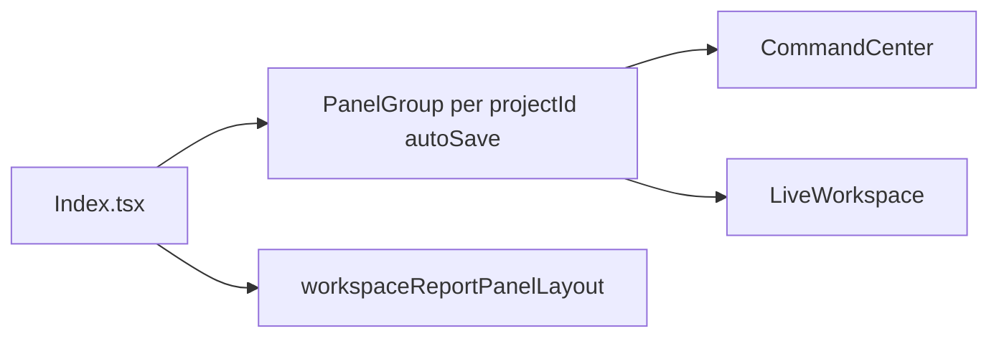
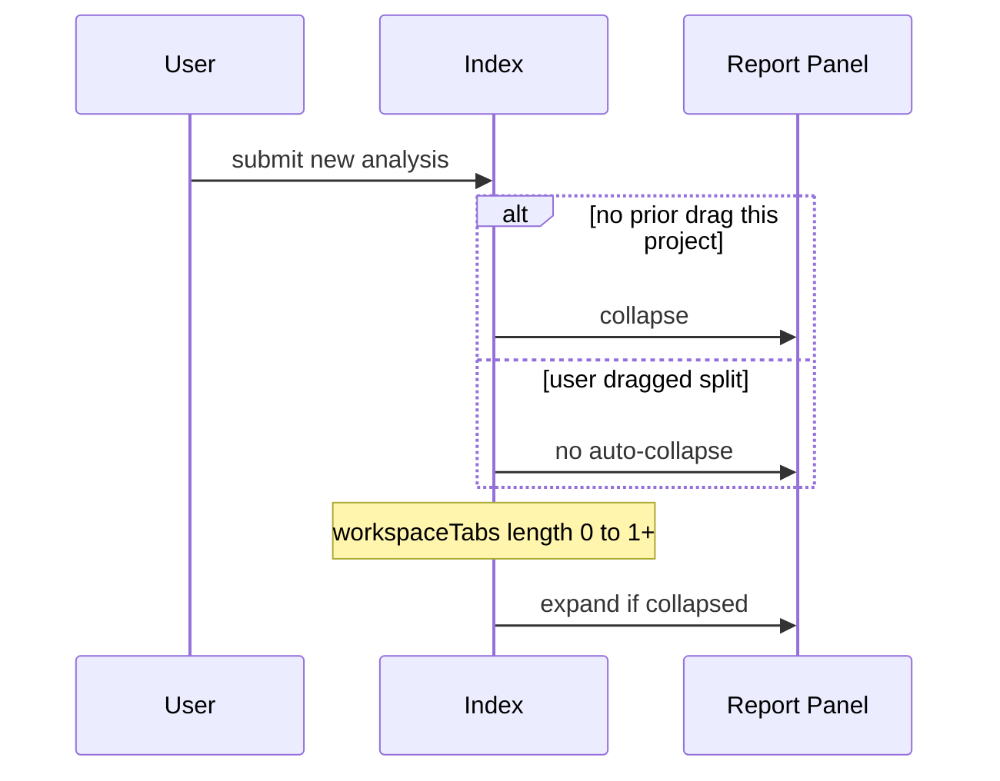

# Design — analysis-workspace-report-collapse

## Metadata

- **Slug:** analysis-workspace-report-collapse
- **Date:** 2026-04-21
- **Status:** Phase 5 complete (pending Phase 6 sign-off / optional MCP QA)

## Source plan (traceability)

No Cursor `*.plan.md`. This `design.md` is the implementation source of truth.

## Todo list

- [x] doc-artifacts
- [x] lib-project-should-expand-report
- [x] index-panel-behavior
- [x] command-center-max-width-open-report
- [x] unit-tests
- [x] e2e-smoke

## Architecture



- **`projectShouldExpandReportPanel`:** pure function from `Project` — true iff any `analysisResults[].workspaceTabs.length > 0` OR any assistant `messages[].workspaceTabs?.length > 0`.
- **Session flag:** `sessionStorage` key per project — user completed a resize-handle drag (`PanelResizeHandle.onDragging`).
- **Programmatic layout:** guarded ref so `onLayout` does not treat imperative `collapse`/`resize` as user customization.

## Flows



## Contracts

| Key | Value |
|-----|-------|
| `sessionStorage` | `secmanus:workspacePanelUserDragged:<projectId>` → `'1'` after user customizes layout (resize drag, panel cycle, report fullscreen toggle, or “Open workspace panel”) |
| `projectShouldExpandReportPanel` | True if `project.blocks` non-empty, or any result/message has `workspaceTabs`, non-empty `blocks`, `useWorkspaceTaskPanel`, or `inferUseWorkspaceTaskPanelFromMessage` |
| `PanelGroup.autoSaveId` | `secmanus-workspace-chat-report-<projectId>` (per project layout persistence) |

## Code touch list

| Path | Risk |
|------|------|
| `src/pages/Index.tsx` | Panel state, effect ordering, flash on load |
| `src/components/CommandCenter.tsx` | Layout wrapper, optional click handler |
| `src/lib/workspaceReportPanelLayout.ts` | Pure predicate + tests |
| `e2e/tests/analysis-workspace-report-collapse.spec.ts` | Auth / timing |

## Testing strategy

- **Unit:** `projectShouldExpandReportPanel` — empty project, tabs on result, tabs on message, mixed.
- **Vitest:** existing suites regression (`npm run test`).
- **E2E:** grep slug; smoke layout or DOM where stable.

### E2E scenarios

| ID | Scenario | Route / API | Key assertions |
|----|----------|-------------|----------------|
| E2E-01 | Workspace route loads | `GET /` (auth) | Panel group or main landmark present |
| E2E-02 | Chat column has max-width wrapper | `GET /` | Center column class or data attribute |

## Edge cases & errors

- **Initial `isAnalyzing`:** On mount or project switch, skip the “new turn collapse” until `prevAnalyzingForPanelCollapseRef` is seeded so restore mid-analysis does not force-collapse.
- **Programmatic vs user layout:** Resize-handle drag uses `onDragging` only (not `onLayout`).
- **Expand when tabs appear:** Runs even if user had previously customized split — only skips resize if report already expanded.
- **sessionStorage throws:** Swallow; treat as no drag flag.

## Implementation order

1. Pure helper + tests
2. `Index.tsx` panel effects + per-project `autoSaveId` + drag flag
3. `CommandCenter` max-width + `onOpenReportPanel` for history clicks
4. E2E + sign-off

## Rationale

- **`workspaceTabs` as sole “has report chrome” signal:** Matches product decision: expand when tabs exist even if report body empty.
- **Drag vs cycle button:** Only drag sets “user customized” for skip-auto-collapse on new analysis; cycle remains programmatic.
- **Per-project `autoSaveId`:** Avoids one project’s split leaking into another.

## UI

- Chat column: `max-w-3xl` (48rem) centered with `mx-auto w-full` for scroll area + composer.

## Design review handoff

- **target:** `.cursor/design-review-handoff/target.local.yaml` (`base_url: http://127.0.0.1:8080`)
- **priority paths:** `/`
- **mockups:** deferred (see `acceptance-ui.md`)

### Pseudocode

```
function shouldExpand(project):
  for r in project.analysisResults:
    if len(r.workspaceTabs) > 0: return true
  for m in project.messages:
    if m.type == assistant and len(m.workspaceTabs or []) > 0: return true
  return false

on new analysis (isAnalyzing: false -> true):
  if sessionStorage[dragKey(projectId)] != '1':
    programmatic: collapse report, mode = chat

on workspaceTabs: len 0 -> positive while analyzing:
  if report.isCollapsed(): programmatic: split 30/70

on projectId or shouldExpand(project) change after load:
  if shouldExpand: programmatic split
  else: programmatic collapse

onResizeHandleDragging(false) after true:
  sessionStorage[dragKey(projectId)] = '1'
```
