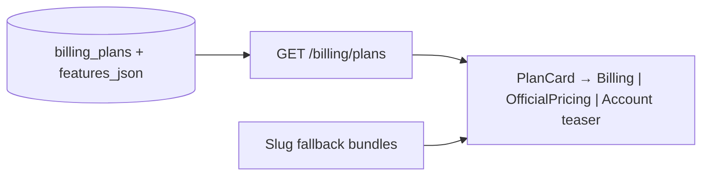
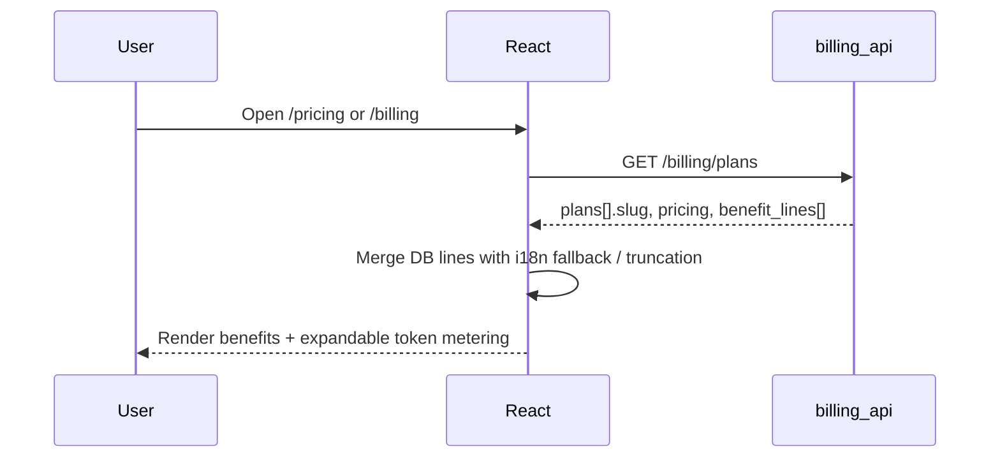

## Metadata

- **Slug:** `billing-plan-benefits-ux`
- **Date:** 2026-05-07
- **Related:** [proposal.md](./proposal.md), [acceptance.md](./acceptance.md), [acceptance-ui.md](./acceptance-ui.md), prior billing delivery [billing-token-stripe-usage](../billing-token-stripe-usage/design.md)

> **Path B:** No Cursor `*.plan.md`. **`design.md` is SoT.**

## Mockups deferred

Per **GR-MOCK**: optional reference images were not supplied. Proceed implementation using existing SecManus card/marketing typography; **`/design-review`** uses live pages + acceptance criteria.

## Todo list

- [ ] **schema-plan-benefits** — Extend `billing_plans` with benefits payload (`features_json jsonb` or equivalent) + migration + seed updates for existing slugs (`free`,`pro`,`ultra`,`enterprise`).
- [ ] **api-plans-shape** — `GET /billing/plans`: include localized feature lines + structured flags (optional) without exposing `stripe_price_id`; keep backward-compatible fields.
- [ ] **types-api-client** — Update `BillingPlanRow` (+ tests/types) for new fields.
- [ ] **i18n-benefits-fallback** — If DB empty: fallback strings keyed by `slug` in `en/zh/ja/ko` (single source helper).
- [ ] **ui-plan-card** — Shared `PlanCard` (or equivalent) used by `Billing.tsx` & `OfficialPricing.tsx`: headline, price, **benefits list**, collapsible 「Usage / metering」for tokens.
- [ ] **ui-account-overview** — Replace raw `tokens_used / included_tokens` lone row with progress + link to `/usage` + one-line 「套餐包含」摘要（仍保留详细数字可访问）。
- [ ] **a11y-semantic** — Lists use `<ul>/<li>`; expandable region `aria-expanded`.
- [ ] **vitest-formatters** — Optional unit tests for benefit merge / truncation rules.
- [ ] **playwright-e2e-pricing** — Grep-tag spec for `/pricing` + `/billing` benefits visible (authenticated path for `/billing`).
- [ ] **ui-faq-metering-link** — Billing/Pricing 卡片底部增加「如何计费 / 复杂度与用量」链到站内 FAQ 或一篇 docs（对齐 Lovable 的 Billing FAQ 入口；可先占位路由 `#`）。
- [ ] **schema-credits-usd** — `billing_plans` 增加 `included_credits_usd NUMERIC(10,2)` + 可选 `credits_label TEXT`；为 `free/pro/ultra/enterprise` seed。
- [ ] **api-summary-usd** — `GET /billing/summary` 返回 `spent_usd_period`、`monthly_spend_cap_usd`、`included_credits_usd`、`tokens_used_period_estimate`；**移除** `included_tokens_per_period` / `tokens_used_period`。
- [ ] **ui-progress-usd** — `Billing.tsx` / `AccountOverview.tsx` 主进度条改为 `spent_usd / cap_usd`；token 移入折叠区。
- [ ] **i18n-credits-copy** — `plan_card.credits_headline.*`、`summary.progress.*`、`summary.disclosure.*` 四个 key 在 `en/zh/ja/ko` 落地（`ja/ko` 可先 fallback EN）；移除/弃用旧 `t.billing.includedTokens` 主显引用。
- [ ] **tokens-retire-stage1-api** — `_list_plans_supabase_sync` / `_list_plans_local_async` 删除 `included_tokens_per_period` select；`/billing/summary` 同步移除该字段；DB 列保留并打 `-- DEPRECATED` 注释。
- [ ] **tokens-retire-stage1-fe** — 删除 `BillingPlanRow.included_tokens_per_period`；删除 `Billing.tsx` / `OfficialPricing.tsx` / `AccountOverview.tsx` 中对 `included_tokens_per_period` 与 `tokens_used_period` 的渲染。
- [ ] **tokens-retire-stage1-tests** — 更新 `tests/test_billing_plans_api.py` 等断言；用 `included_credits_usd` 与 USD-基础字段替代。
- [ ] **tokens-retire-stage2-followup** — 创建后续小交付 slug `billing-tokens-column-drop`：迁移 `DROP COLUMN`、`init_local_billing.sql` 同步、全仓残留清理。**不在本交付完成。**

## Architecture

计费内核不变；在本交付中引入 **Plan catalog 展示层**：Postgres **扩展 schema** → FastAPI **序列化为稳定 JSON** → React **统一卡片组件** → i18n 兜底。



## Flows



## Contracts

### Proposed DB (`billing_plans`)

| Column | Type | Notes |
|--------|------|-------|
| `features_json` | `JSONB NOT NULL DEFAULT '{}'::jsonb` | Localized arrays, e.g. `{"en":["..."],"zh":["..."]}` OR structured `{"items":[{"id":"models","en":"...","zh":"..."}]}` — **pick one shape in implementation** and document in OpenAPI comment. |
| (optional) `tagline_json` | `JSONB` | Short subtitle under plan name. |
| (optional) `highlights` | `TEXT[]` | Legacy-free alternative if team prefers non-localized ops editing only in EN. |

**Recommendation:** `features_json` with **stable `id` per bullet** + per-locale `text` so PM can reorder without breaking analytics; frontend maps `id` → icon (optional Phase 4+).

### API `GET /billing/plans` response additions

Each plan object gains (example names — finalize in impl):

```json
{
  "slug": "pro",
  "display_name": "Pro",
  "monthly_price_usd": 40,
  "included_tokens_per_period": 1000000,
  "sort_order": 1,
  "tagline": "For security teams running daily investigations",
  "benefit_lines": [
    "Access to frontier-class models on the workspace",
    "Higher analysis throughput vs Free"
  ],
  "metering_disclosure": "Allowance resets each billing period; usage is aggregated from AI calls.",
  "quota_hints": [
    { "id": "concurrent_analyses", "label": "Concurrent analyses", "value": "3" },
    { "id": "queue_priority", "value": "high" },
    { "id": "supported_file_types", "value": "PDF, DOCX, PCAP, EVTX, …" },
    { "id": "supported_security_log_types", "value": "Syslog, CEF, JSON alerts, …" }
  ]
}
```

- **`quota_hints`**（可选）：键值型 **硬配额/亮点**，对齐 Manus「并发任务」、Lovable「团队/发布边界」等信息架构；**无后端数据则省略**，不下发假数字。

- **`benefit_lines`**: Already resolved server-side to **requested locale** (new `Accept-Language` or `?lang=` — align with existing app language cookie/header if present) **or** return all locales keyed and let FE choose (lighter backend). Prefer **single resolution** on server if `OfficialPricing` SSR/API is shared anon traffic.
- **Security:** Never return `stripe_price_id` (already excluded).

### Pseudocode — merge benefits

```
function resolveBenefits(plan, userLang):
  lines = plan.features_json[userLang] ?? plan.features_json["en"] ?? []
  if lines.isEmpty():
    lines = FALLBACK_BY_SLUG[plan.slug][userLang]
  return lines.slice(0, MAX_VISIBLE).concat(moreChipIfTruncated)
```

### Metering semantics — 单一基线：**A（Credits = USD 等价额度）+ C（折叠层 token/USD 明细）**

> **Decision (2026-05-07, locked):** 主外显采用 **「Credits / AI 用量额度」品牌名 + USD 等价数值**；折叠层保留 **token + USD 明细** 作为透明披露。其他方案（B 抽象点、D 参考模型等价）**本期不做**。

#### 与现有代码事实一致（不重写计费内核）

| 概念 | 含义（与代码对齐） |
|------|----------------------|
| **Token（技术单位）** | 每次 LLM 调用记录 input/output tokens，按 **`model_pricing`** 的 **$/1M input**、**$/1M output** 折成 **`cost_usd`**（`python-agent-service/app/billing/pricing.py`）。 |
| **USD（治理单位 / 主显单位）** | 周期内汇总 **`llm_usage_events.cost_usd`**；`BILLING_ENFORCE=true` 时 **`gate.py`** 以 **`monthly_spend_cap_usd + arrears_allowance_usd`** 比对已消费，超限拒绝 **新的** `/analyze`（不中途截断）。 |
| **`included_tokens_per_period`（DB 列，**清退中**）** | **本期 API 停止返回；前端不再消费**；DB 列在 Stage 2 单独迁移 drop。详见 § **Tokens retirement plan**。折叠层显示的 token 数据来自 **`tokens_used_period_estimate`**（聚合自 `llm_usage_events`），与本字段无关。 |

**没有单一「Credits ↔ 某模型」固定换算比。** 因此选 **A**：Credits 直接 == USD 等价额度，**与 gate 同单位**，避免文案-行为偏差。

#### 主显（A）+ 折叠（C）信息层

**主显（卡片正文 / 摘要进度条）**

- 营销页 / Billing 卡片：「**含相当于 $N AI 用量**」或品牌化 **「N Credits / 月（≈ $N AI 用量）」**。
- Account / Billing 摘要：进度条 = **`spent_usd_period / monthly_spend_cap_usd`**。

**折叠区（透明披露 — C 风味）**

- 当前周期 **token 估算**（`tokens_used_period_estimate`，沿用既有 `llm_usage_events` 聚合）。
- 主要模型的 **$/1M tokens** 单价表入口（链 `/usage` 页）。
- 一句免责：「实际扣费按所选模型与 token 量；不同模型单价不同」。

#### 字段建议（前后端契约最小冲突）

`GET /billing/plans` 每个 plan 增加：

| 字段 | 类型 | 含义 |
|------|------|------|
| `included_credits_usd` | number | **主显**额度（= 该套餐「Credits 月度配额」对应的美元等价；运营定义；可大于、等于或小于 `monthly_price_usd`） |
| `credits_label` | `"credits" \| "ai_budget"` | UI 用语开关（默认 `credits`，中文文案附加「AI 用量额度」副标） |

`GET /billing/summary` 增加（或确保返回）：

| 字段 | 含义 |
|------|------|
| `spent_usd_period` | 当周期已用 USD（来自 `sum(llm_usage_events.cost_usd)`） |
| `monthly_spend_cap_usd` | 用户当前 cap（来自 `user_billing_settings`） |
| `included_credits_usd` | 当前套餐主显额度（mirror `billing_plans`） |
| `tokens_used_period_estimate` | 折叠区用；**命名带 `_estimate`** 以避免被误读为硬闸 |

> **不再保留**旧字段 `included_tokens_per_period` / `tokens_used_period`：见下文 § **Tokens retirement plan**。

#### Tokens retirement plan（locked, 2026-05-07）

将 `included_tokens_per_period` **完全退役**（不再过渡保留）。分两个 Stage 执行，**本交付仅承诺并验收 Stage 1**；Stage 2 作为下一个小交付，避免一次性 schema drop 把生产打穿。

**Stage 1（本交付，对应 Todo `tokens-retire-stage1-*` 系列）**

1. **API 输出层停用**
   - `GET /billing/plans`：从 `_list_plans_supabase_sync` 与 `_list_plans_local_async` 的 `select` 中删除 `included_tokens_per_period`，响应不再包含该字段。
   - `GET /billing/summary`：删除 `included_tokens_per_period` 与 `tokens_used_period`；用 `tokens_used_period_estimate` 替换前者展示需求；新增 `spent_usd_period` 与 `monthly_spend_cap_usd` 作为主显基础（已在 Decision 中要求）。
2. **前端类型与渲染层停用**
   - `src/lib/api-client.ts` 的 `BillingPlanRow` **删除** `included_tokens_per_period` 字段。
   - `src/pages/Billing.tsx`、`src/pages/OfficialPricing.tsx`、`src/pages/AccountOverview.tsx` 删除所有对 `included_tokens_per_period`、`tokens_used_period` 的引用与 `formatBillingTokens` 调用；改为 Credits/USD 主显 + 折叠估算（见 § Metering semantics）。
   - `src/lib/billingDisplay.ts` 中的 `formatBillingTokens` **保留** 用于折叠层 token 估算渲染（同名函数复用即可），不需要删除。
3. **i18n 字段停用**
   - 移除/弃用 `t.billing.includedTokens`（与「per month」「per period」相关）的旧 key，改用新 `plan_card.credits_headline.*` 与 `summary.progress.*` 系列；`en/zh/ja/ko` 同步处理（`ja/ko` 可暂时 fallback 至 EN）。
4. **DB 列保留**
   - 本期不动 `billing_plans.included_tokens_per_period`（仍 `NOT NULL DEFAULT 0`），避免任何残留读取路径短期出错。在 schema 注释加 `-- DEPRECATED: removed in Stage 2`。
5. **测试更新**
   - `python-agent-service/tests/test_billing_plans_api.py` 等需删除对 `included_tokens_per_period` 的断言；新增 `included_credits_usd` / USD-基础 summary 字段断言（见 acceptance.md A-06/A-07）。
   - 任意 Vitest/E2E 中对 token 主显的断言改为对 Credits/USD 主显 + 折叠层 token 估算。

**Stage 2（紧随的小交付，独立 slug 例如 `billing-tokens-column-drop`）**

1. 新建 migration：`ALTER TABLE public.billing_plans DROP COLUMN included_tokens_per_period;`
2. 删除 `python-agent-service/scripts/db/init_local_billing.sql` 中对该列的 `CREATE TABLE` / `INSERT`。
3. 修订 `supabase/migrations/20260408120000_billing_token_stripe_usage.sql` 的注释：「Ultra included_tokens = 3x Pro at seed time.」该说明改写为 USD/Credits 维度（或在新 migration 同步覆盖）。
4. 全仓 grep 搜索 `included_tokens_per_period` 残留并清理（`_list_plans_*` 已在 Stage 1 删 select；`docs/Process/billing-token-stripe-usage/` 中的历史描述以**注脚**说明已退役，不改原始落盘内容以保持交付历史可追溯）。
5. 验证：`/billing/plans` 与 `/billing/summary` 在 supabase 与 local 模式下均不再触发该列。

**回滚策略**

- Stage 1 仅是输出层与展示层调整，回滚等价于 git revert 前端/api 改动；DB 不变。
- Stage 2 才涉及 DROP COLUMN；建议合入前 **数据库快照** + 在低峰期发布，回滚需重新 ADD COLUMN（值用 0 重置可接受，因为已无业务读路径）。

#### 文案模板（实现时直接复用 / i18n key 占位）

- `plan_card.credits_headline.en`: **「{credits} Credits / month (≈ ${usd} AI usage)」**
- `plan_card.credits_headline.zh`: **「{credits} Credits / 月（≈ ${usd} AI 用量）」**
- `summary.progress.en`: **「Used ${spent} of ${cap} this period」**
- `summary.disclosure.en`: **「Cost depends on model and token usage. See Usage for details.」**
- `summary.disclosure.zh`: **「实际扣费按所选模型与 token 量；不同模型单价不同。详见「用量」。」**

### `quota_hints` 稳定 ID 与产品指标（已确认方向）

以下指标**可作为真值展示**（数据需有来源：配置表或后续 `plan_quota_limits` 类表；**禁止前端写死假数**）。`id` 建议稳定，便于 i18n 只对 `label` 做多语言（`label_key` 方案亦可）。

| `id` | 含义 | `value` 示例 | 数据来源（建议） |
|------|------|----------------|------------------|
| `concurrent_analyses` | 同时进行的分析会话/worker 上限 | `1` / `3` / `10` | 配置 / 限流中间件 |
| `queue_priority` | 排队优先级档位 | `standard` / `high` / `dedicated` | 配置 |
| `supported_file_types` | 上传/解析支持的文件类型范围 | `PDF, Office, …` 或 ISO 扩展名列表的短摘要 | 产品配置或能力检测 |
| `supported_security_log_types` | 支持的告警/日志/SIEM 类型 | `CEF, LEEF, Syslog, …` | 产品配置（与解析器覆盖面对齐） |
| `knowledge_base_capacity` | 知识库容量（若套餐区分） | `5 GB` / `50k chunks` | KB 子系统配额 |
| （扩展）`e2b_sandbox` | 云沙箱/E2B 是否可用或配额 | `on` / `10h/mo` | 与 `e2b` 集成配置 |

API 形状保持 **`{ "id", "label"?, "value" }`**：`label` 可省略由前端用 `id → i18n`；**列表类**指标可将 `value` 设为缩写文案，或扩展为 `value_list: string[]`（实现时二选一写进 OpenAPI）。

## Code touch list

| Area | Paths |
|------|-------|
| Migration | New file under `supabase/migrations/*_billing_plan_features.sql` |
| API | `python-agent-service/app/api/billing_api.py` (`_list_plans_*`, `list_billing_plans`) |
| Types FE | `src/lib/api-client.ts` (`BillingPlanRow`) |
| Pages | `src/pages/Billing.tsx`, `src/pages/OfficialPricing.tsx`, `src/pages/AccountOverview.tsx` |
| UI | Prefer `src/components/billing/` (new): `PlanBenefitsList.tsx`, `MeteringDisclosure.tsx` |
| i18n | `src/i18n/locales/*.ts` — keys for generic labels + slug fallbacks |
| Tests | New Vitest + `e2e/tests/billing-plan-benefits-ux.spec.ts` (name TBD) |

## Testing strategy

### Unit / integration

- Python: migration applied in local mode; `list_billing_plans` returns `benefit_lines` for seeded rows.
- Vitest: benefit merge / empty DB fallback (if extracted pure function).

### E2E scenarios

| ID | Scenario | Route / API | Key assertions |
|----|----------|-------------|----------------|
| E2E-01 | Marketing pricing shows ≥1 benefit line per public plan | `/pricing` | Non-empty list under each plan card; tokens in secondary/collapsed region |
| E2E-02 | Authenticated billing matches structure | `/billing` | Same `PlanCard` pattern; current plan badge preserved |
| E2E-03 | Account overview shows human summary | `/account/overview` | Progress or summary text + link to `/usage` |
| E2E-04 | Billing summary uses USD-based progress | `/billing` | Progress 元素文本含 `$` 与 cap；token 数字仅在折叠区可见 |
| E2E-05 | Legacy `included_tokens_per_period` 未出现在 API/UI | `/pricing` + `GET /billing/plans` + `GET /billing/summary` | 响应字段不含 `included_tokens_per_period` / `tokens_used_period`；DOM 不出现「included tokens / 包含 token」类主显文案 |

## Edge cases & errors

- **Empty `features_json`**: Always fall back to i18n bundle; never render blank card body.
- **Anonymous `/pricing`**: No Bearer — `GET /billing/plans` must remain public; locale from browser or default `en`.
- **Enterprise `included_tokens_per_period = 0`**: Copy must not imply 「无用量」；展示「定制配额」+ 联系销售 CTA。
- **Very long benefit lines**: CSS line-clamp + full text in tooltip or expand.
- **RLS**: New columns readable by existing `billing_plans_select_authenticated` — confirm **anon** marketing page: today plans may be loaded without auth; verify policy allows `anon` SELECT or route through backend with service role (current code uses Supabase client in API — document if public read required).

## Implementation order

1. Migration + seed copy (EN first, then zh parity in DB or i18n fallback).
2. API field selection + response shaping + pytest.
3. FE types + shared components + page wiring.
4. Account overview polish.
5. E2E + i18n pass (`ja`/`ko` minimal: fallback to EN until translated).

## Rationale

- **Why not only i18n:** 运营常需热改套餐卖点；纯代码 i18n 需要发版。JSONB 允许 **Supabase Studio** 或内部工具更新（配合审计日志后续交付）。
- **Why not drop tokens：** B2B/安全客群部分用户需要核对 **与成本模型一致** 的数字；移至折叠区兼得「主流叙事 + 透明度」。
- **Why agent-builder patterns (Manus / Lovable)：** 安全工作台更接近 **长程 Agent + 工具** 消费模型；仅像 ChatGPT 一样列「模型名」不够，需要像 Manus 一样把 **能力与用量绑在同一张卡里**，像 Lovable 一样把 **档与档的可见差异**写清楚，才配得上「选哪一档够用」的决策路径。

## UI

### Information hierarchy（每档套餐卡片）

1. **名称 + 可选 tagline**（Lovable 式：一句话 **Best for** 可放在 tagline）
2. **价格**（月费；年费若未来支持再扩展；可与 Manus 一样标年化折扣位 **占位**）
3. **Credits 主显行**：**「N Credits / 月（≈ $N AI 用量）」** —— 来自 `included_credits_usd`，**主显单位 = USD 等价**
4. **Benefits list**（3–7 条，勾选图标）— **产品与能力**，优先于数字
5. **（可选）Quota hints**：一行或多行 **「标签 + 数值」**（Manus 的 concurrent / Lovable 的 seats/发布边界 — **仅当有真实数据**）
6. **Primary CTA**（Upgrade / Manage / Contact sales）
7. **Secondary「计费透明度」折叠区**：周期内 **token 估算**、主要模型的 **$/1M** 单价入口、一句「消耗因模型与 token 量而异」

### Agent-builder 范式对齐要点（Manus / Lovable）

| 做法 | 落地 |
|------|------|
| **Credits 仍出现，但不独大** | 主卡以权益 bullet 为主；token 放入 **「用量」** 分区或折叠 |
| **复合额度叙事**（日/月、bonus） | 若产品仅有 **月周期 token**，文案上避免假装有日更 bonus；若未来有 **日限额** 或 **赠送额度**，用同一分区展示，勿混在标题 |
| **结构化限制数字化** | 有并发/队列/知识库上限 → `quota_hints`；没有则不下发 |
| **协作与组织** | Team/Enterprise 行突出 **席位、共享额度逻辑、管理**（Lovable Business 类） |
| **加购与 FAQ** | 若日后支持 top-up，在 Billing 区域与 **FAQ** 互链（Lovable billing FAQ 模式） |

### Components

- `PlanBenefitsList`: unordered list, `gap-y-2`, icon `Check` from lucide.
- `TokenMeteringDisclosure`: `Collapsible` (shadcn) default **collapsed** on marketing, **expanded** on logged-in Billing（可 A/B）。
- （可选）`QuotaHintsRow`: 小字号 **dl** 或两列表格，用于 `quota_hints`。

## Design review handoff

- Copy `.cursor/design-review-handoff/target.example.yaml` → **`.cursor/design-review-handoff/target.local.yaml`** (gitignored).
- Set **`base_url`** to local Vite origin.
- For Phase 6 `/design-review`, walk **`acceptance-ui.md`** criteria on **`/pricing`** and **`/billing`** at 375 / 768 / 1280 breakpoints.
