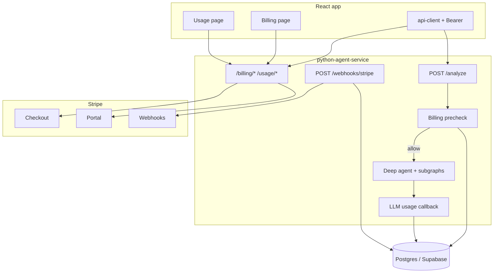
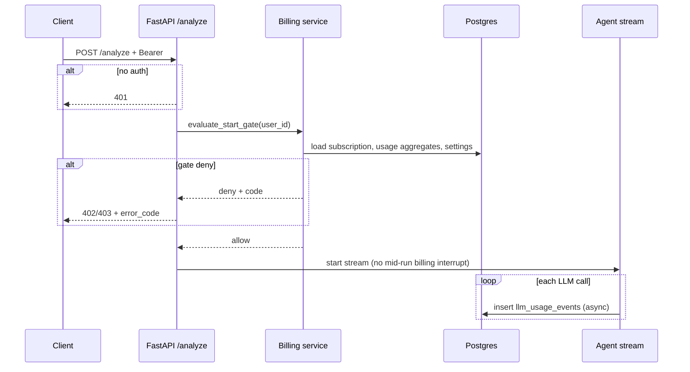
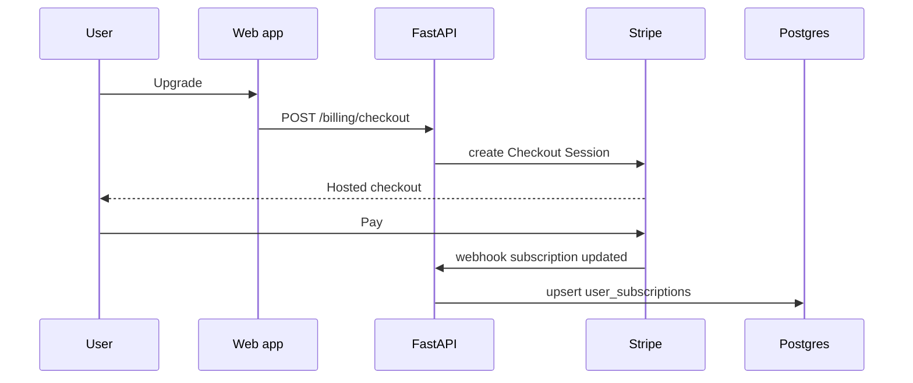

## Metadata

- **Slug:** `billing-token-stripe-usage`
- **Related:** [proposal.md](./proposal.md), [acceptance.md](./acceptance.md), [acceptance-ui.md](./acceptance-ui.md)

> **Path B:** No Cursor `*.plan.md` for this delivery. **`design.md` is the implementation source of truth.**

## Todo list

Phase 4 backlog (stable ids):

- [x] **db-migrations-billing** — `supabase/migrations/20260408120000_billing_token_stripe_usage.sql` (plans, profile, subscriptions, model_pricing, llm_usage_events, settings, stripe_webhook_events, RLS).
- [x] **seed-plans-config** — Seed rows in same migration (Free 500k / Pro 1M / Ultra 3M tokens; `stripe_price_id` null until ops set).
- [x] **settings-stripe-env** — `app/config/settings.py` + `config/env.md` billing section; `BILLING_ENFORCE` default `false`.
- [x] **auth-register-free-plan** — `ensure_default_billing_for_user` after local + Supabase register: profile, settings, `user_subscriptions` Free `active` when none active.
- [x] **analyze-require-auth** — `POST /analyze`, `/analyze/resume`, `/analyze/cancel` use `get_current_user`; **401** without Bearer (`tests/test_analyze_requires_auth.py`).
- [x] **billing-precheck-analyze** — `app/billing/gate.py`: when `BILLING_ENFORCE=true`, loads period (Stripe period if active/trialing sub with bounds, else UTC calendar month), sums `llm_usage_events.cost_usd`, compares to `user_billing_settings` cap + arrears; **402** `BILLING_CAP_EXCEEDED` / **403** `BILLING_PLAN_INACTIVE`; **503** if local billing tables missing.
- [x] **llm-usage-callback** — `LlmUsageRecordingCallbackHandler` on main `create_deep_agent` model via `with_config(callbacks=…)`; writes `llm_usage_events` using `get_analyze_*` + `get_request_llm_model_id` (subagent-only LLM paths may still need follow-up).
- [x] **stripe-checkout-session** — `POST /billing/checkout` (`plan_slug` pro|ultra); requires `STRIPE_*` price IDs + checkout URLs in settings.
- [x] **stripe-customer-portal** — `POST /billing/portal` when `stripe_customer_id` exists on profile.
- [x] **stripe-webhook** — `POST /webhooks/stripe`: verify signature; idempotency via `stripe_webhook_events`; applies `checkout.session.completed` + `customer.subscription.*` (Supabase + local).
- [x] **api-billing-summary** — `GET /billing/summary`.
- [x] **api-billing-settings** — `PATCH /billing/settings` with `billing_max_monthly_spend_cap_usd` cap.
- [x] **api-usage-series** — `GET /usage/summary` (daily by model).
- [x] **api-usage-events** — `GET /usage/events` (`limit`/`offset`).
- [x] **frontend-routes-nav** — Routes `/billing`, `/usage`; `TopNavbar` user menu links; `App.tsx`.
- [x] **frontend-billing-page** — Loads `GET /billing/summary` + summary grid; Stripe CTAs can extend `acceptance-ui.md`.
- [x] **frontend-usage-page** — Recent rows from `GET /usage/events`; chart from `/usage/summary` TODO.
- [x] **frontend-analyze-errors** — `parseAnalyzeHttpError` + Sonner toasts for `BILLING_CAP_EXCEEDED` / `BILLING_PLAN_INACTIVE` on analyze + resume.
- [x] **i18n-billing-usage** — `billing.*` keys in `en` / `zh` / `ja` / `ko`.
- [x] **pytest-billing** — `test_billing_gate.py`, `test_billing_pricing.py`, `test_billing_webhook.py` (cost math, settings cap, webhook signature path).
- [ ] **vitest-ui-smoke** — Optional component tests for Billing/Usage.

## Architecture

Billing and usage are **authoritative in Postgres (Supabase)** with **Stripe** as payment source of truth for subscription state. The Python service performs **authorization**, **pre-flight gate**, and **LLM usage writes**. The web app renders **Billing** and **Usage** from REST (or Supabase read with RLS if aligned — default here: **FastAPI owns billing APIs** to keep Stripe secrets server-side).



## Flows

### Start analysis with billing gate



### Stripe subscription sync (sketch)



## Pseudocode

### Start-of-request gate (no mid-stream stop)

```
function evaluate_analyze_start_gate(user_id) -> Allow | Deny:
    period = current_billing_period(user_id)  // align with Stripe period for paid; calendar month for Free if chosen — pick one in implementation and document
    included = included_tokens_for_plan(user_id)
    used_tokens = sum_tokens_llm(period, user_id)
    billable_usd = sum_cost_usd_llm(period, user_id)  // from llm_usage_events; pricing at event time

    settings = load_user_billing_settings(user_id)
    cap = settings.monthly_spend_cap_usd  // USD ceiling for period
    arrears = settings.arrears_allowance_usd  // small overage allowed before hard block next start

    // Policy: user may exceed *included tokens* but not exceed spend governance:
    // Deny new analyze if billable_usd >= cap + arrears (tune: arrears may apply only after cap — document exact inequality in code comments)
    if billable_usd >= cap + arrears:
        return Deny(BILLING_CAP_EXCEEDED)

    // Optional: if free tier included tokens exhausted AND no payment method / not paid plan, Deny — only if product requires (default: tie to plan slug free + no card)
    // (Omit if Free may spend up to cap only — product choice; leave as config flag in implementation)

    return Allow
```

**Note:** Because the gate does not estimate the **next** request cost, a single run may push `billable_usd` above `cap` mid-stream; that is **accepted** per requirement (no interruption). The **next** `/analyze` is then denied until period reset or cap raised/payment resolved.

## Contracts

### HTTP errors (analyze)

| Condition | HTTP | `error_code` (example) | Body shape |
|-----------|------|-------------------------|------------|
| Missing/invalid JWT | 401 | `UNAUTHORIZED` | Existing API error envelope |
| Billing gate deny | 402 or 403 | `BILLING_CAP_EXCEEDED`, `BILLING_PLAN_INACTIVE`, etc. | `{ detail, error_code, timestamp }` |

### REST (illustrative — finalize paths in implementation)

| Method | Path | Purpose |
|--------|------|---------|
| GET | `/billing/summary` | Plan, period, tokens used/included, USD totals, cap |
| PATCH | `/billing/settings` | `monthly_spend_cap_usd` (+ optional arrears) |
| POST | `/billing/checkout` | Body: `plan_slug` → Stripe Checkout URL/session id |
| POST | `/billing/portal` | Stripe Billing Portal URL |
| GET | `/usage/summary` | Query: month → daily USD by model |
| GET | `/usage/events` | Paginated LLM line items |
| POST | `/webhooks/stripe` | Raw body + `Stripe-Signature` |

### DB entities (logical)

- **`billing_plans`**: `slug`, `display_name`, `included_tokens_per_period`, `stripe_price_id` (nullable for Free/Enterprise), `monthly_price_usd` (denormalized for UI), `sort_order`.
- **`user_billing_profile`**: `user_id`, `stripe_customer_id`, timestamps.
- **`user_subscriptions`**: `user_id`, `plan_slug`, `stripe_subscription_id`, `status`, `current_period_start`, `current_period_end`.
- **`model_pricing`**: `model_id` (string matching runtime model id), `usd_per_million_input`, `usd_per_million_output`, `effective_from`.
- **`llm_usage_events`**: `user_id`, `project_id` (nullable), `request_id`, `model_id`, `prompt_tokens`, `completion_tokens`, `cost_usd`, `created_at`; optional `trace` for debugging (keep PII-free).
- **`user_billing_settings`**: `user_id`, `monthly_spend_cap_usd`, `arrears_allowance_usd` (or use global default from env).

**RLS:** All tables scoped by `user_id = auth.uid()` for client-side reads if any; **service role** or FastAPI with service key for writes from backend. Prefer **backend-only writes** to Stripe-linked tables to reduce attack surface.

### SSE

No new SSE event types required; billing failures happen **before** `StreamingResponse` starts.

## Edge cases & errors

- **Webhook duplicates:** Use Stripe `event.id` idempotency store (table or cache) to skip replays.
- **Clock skew:** Use Stripe `period_end` from webhook payload, not only local clock.
- **Unknown model id:** Log warning; insert usage with `cost_usd = 0` or skip — **decide one** (recommend: record tokens, `cost_usd = 0`, flag `pricing_missing` for ops).
- **Partial stream failure:** Usage rows already inserted remain; no rollback required unless product demands (default: keep).
- **Enterprise:** `plan_slug = enterprise` set manually; unlimited or custom cap via DB; skip Checkout.
- **local dev:** Stripe CLI forward webhooks; test keys; optional `BILLING_DISABLED=true` **only** in dev if needed (document; default off for realistic QA).

## Operational / rollout

1. Create Stripe products/prices; copy IDs to env.
2. Apply migrations; seed plans + initial `model_pricing` from spreadsheet.
3. Deploy webhook URL with signing secret rotation procedure.
4. Feature flag optional: `BILLING_ENFORCE=true` in prod; staging runs full stack.
5. Backfill: existing users get Free + default settings via migration script.

## Implementation order

1. Migrations + seeds + env docs.
2. Auth-required `/analyze` + billing gate (can return “allow all” behind flag until usage exists).
3. LLM callback + usage tables (behind feature flag).
4. Stripe webhook + checkout + portal.
5. Billing summary/settings APIs.
6. Usage aggregate APIs.
7. Frontend pages + i18n + analyze error handling.
8. Tests + harden RLS and secrets.

## Rationale (ADR-style)

- **FastAPI owns billing APIs:** Keeps `STRIPE_SECRET_KEY` off the browser; single place for gate logic.
- **Start-only gate:** Matches “never interrupt analysis” and avoids streaming complexity; accepts possible one-request overshoot past cap.
- **Token included allowance + USD cap:** Dual control matches marketing (token buckets) and user safety (USD ceiling); implementation computes USD from priced LLM events only.
- **Exclude non-LLM tools:** Matches explicit product scope; reduces coupling to vendor pricing.

## UI breakdown

- **Billing:** Dark-friendly cards (match app theme); primary/secondary CTAs for Upgrade vs View plans; explain period reset in helper text; show **USD** as primary currency for caps and spend; show token included usage as secondary line “X / Y tokens this period”.
- **Usage:** Month selector; stacked bar chart library (e.g. existing chart dep or lightweight Recharts — add only if justified in implementation); table sortable by date desc; link `project_id` to workspace route if available.
- **Analyze:** If 401, redirect to Auth; if billing code, toast + link to Billing.

## Code touch list (primary)

| Area | Paths |
|------|--------|
| Migrations | `supabase/migrations/*billing*.sql` |
| Settings | `python-agent-service/app/config/settings.py`, `python-agent-service/config/env.md` |
| Auth / analyze | `python-agent-service/app/main.py`, `python-agent-service/app/api/auth.py` (registration hook) |
| New modules | `python-agent-service/app/billing/*` (gate, stripe, usage, pricing) |
| Agent / LLM | `python-agent-service/app/agents/deep_agent.py` or shared `app/llm/factory.py` / callbacks |
| Frontend API | `src/lib/api-client.ts`, `src/config/endpoints.ts` |
| Pages | `src/pages/Billing.tsx`, `src/pages/Usage.tsx` (names adjustable), `src/App.tsx` routes |
| i18n | `src/i18n/locales/*.ts` |

**Risky areas:** Ensuring **all** LLM paths (including subagents) use the instrumented client; webhook signature and idempotency; RLS mistakes exposing other users’ usage.

## Testing strategy

- **pytest:** Pricing math; gate function with fixture DB or mocked aggregates; webhook handler with signed test payloads (Stripe test mode or mock).
- **integration:** `/analyze` without token → 401; with token and mocked “over cap” → 402/403; happy path inserts ≥1 usage row per fake LLM invoke.
- **Vitest:** Billing/Usage components loading and error states; optional MSW for summary API.

## Design review handoff

- **Slug:** `billing-token-stripe-usage`
- **Mockups:** **Deferred** — no `*.png` in `mockups/` yet; Phase 6 `/design-review` uses [acceptance-ui.md](./acceptance-ui.md) + live URL. User may add `mockups/billing-reference.png` and `mockups/usage-reference.png` later and list them in `acceptance-ui.md`.
- **Acceptance UI:** [acceptance-ui.md](./acceptance-ui.md)
- **Phase 3 setup:** **`target.local.yaml`** generated locally under [`.cursor/design-review-handoff/`](../../../.cursor/design-review-handoff/) (gitignored) with `base_url` and `priority_paths` including `/billing`, `/usage`. Template: [`target.example.yaml`](../../../.cursor/design-review-handoff/target.example.yaml). See [README.md](../../../.cursor/design-review-handoff/README.md). **No passwords** in YAML — use root `.env` + [LOCAL_AUTOMATION_AUTH.md](../LOCAL_AUTOMATION_AUTH.md) and `npm run auth:bootstrap`.
