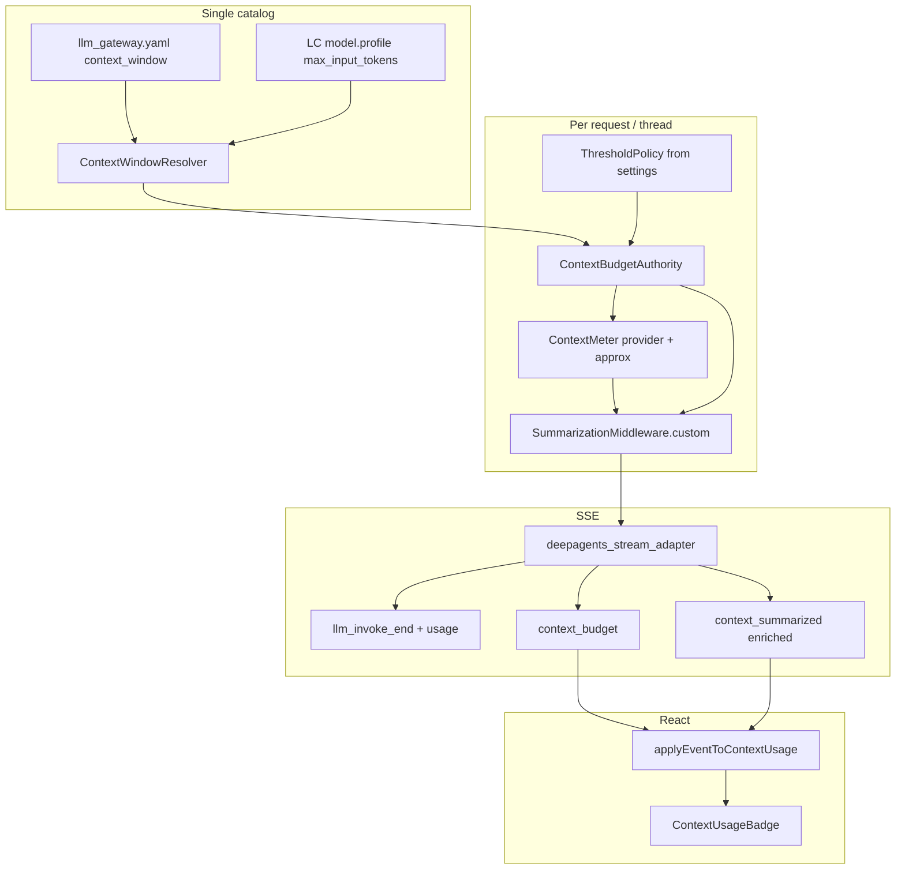
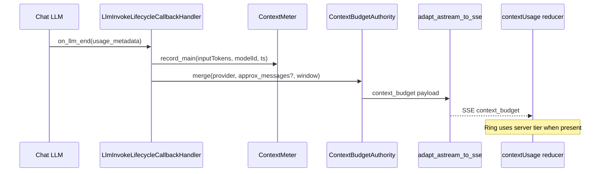
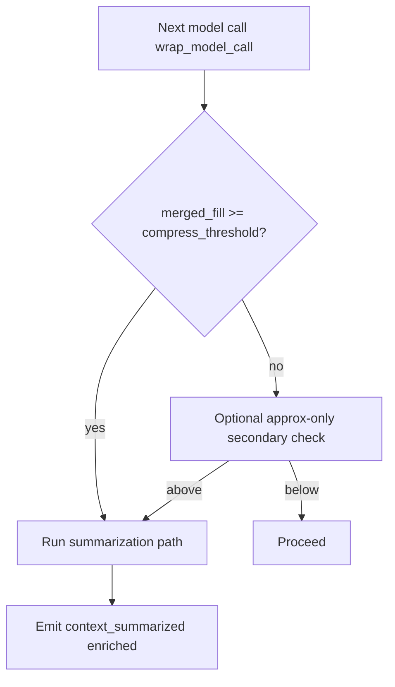

# Design — Context summarization × usage orchestration

## Metadata

- **Slug**: `context-summarization-usage-orchestration`
- **Date**: 2026-05-06
- **Tier**: Standard (cross-cutting backend + frontend + config)
- **Proposal**: [`proposal.md`](./proposal.md)
- **Acceptance (backend)**: [`acceptance.md`](./acceptance.md)
- **Acceptance (UI)**: [`acceptance-ui.md`](./acceptance-ui.md)
- **Related prior delivery**: [`../realtime-context-usage-indicator/design.md`](../realtime-context-usage-indicator/design.md)
- **Source plan (traceability)**: Path B — this folder is SoT; no Cursor `*.plan.md` predecessor.

## Todo list

- [ ] `budget-authority-module` — Add `app/context_budget/` (or equivalent): resolve `context_window`, policy thresholds, merge `provider_prompt_tokens` + `approximate_tokens` with rules.
- [ ] `settings-policy-keys` — Extend `app/config/settings.py`: e.g. `context_budget_warn_ratio`, `danger_ratio`, `compress_ratio`, `compress_use_provider_meter`, `compress_fallback_approximate`.
- [ ] `catalog-alignment` — Ensure `context_window` in gateway/catalog and LangChain `model.profile["max_input_tokens"]` are **synced or overridden** by one resolver (document precedence).
- [ ] `meter-runtime` — Request- or thread-scoped **ContextMeter** updated from `on_llm_end` (main scope only for ring parity); store last `inputTokens`, `modelId`, `endedAt`.
- [ ] `meter-in-graph-config` — Pass `ContextMeter` / callback handles via `RunnableConfig.configurable` (or equivalent) into agent graph so summarization middleware can read **latest provider fill**.
- [ ] `summarization-policy-hook` — Patch vendored stack: **either** subclass `SummarizationMiddleware` `_should_summarize` to use merged fill vs window **or** replace `create_summarization_middleware` factory to inject custom class + same `trigger` tuple derived from **policy** (not only `compute_summarization_defaults`).
- [ ] `pre-turn-compact-hint` — Optional: if merged fill ≥ compress threshold **before** next `model.invoke`, force compaction path (avoid race where UI shows safe but next prompt explodes).
- [ ] `sse-context-budget` — Emit new SSE type `context_budget` after each main `llm_invoke_end` (and optionally after `context_summarized`) with `{ contextWindow, promptTokens, fillRatio, fillSource, tier }`.
- [ ] `sse-summarize-enrich` — Enrich `context_summarized` with `{ cutoffIndex, preApproxTokens?, postApproxTokens?, filePath? }` (privacy: no raw message bodies).
- [ ] `adapter-wire-budget` — `deepagents_stream_adapter`: call budget authority, attach to lifecycle queue; dedupe rules documented.
- [ ] `frontend-apply-budget-event` — Extend `applyEventToContextUsage` (or parallel reducer) to prefer **server `context_budget`** for ring when present; keep legacy path when absent.
- [x] `frontend-reconcile-summarize` — **Option A shipped**: reducer clears `latestMain`/`latest` on `context_summarized`; badge shows Layers icon (`data-awaiting-measure`) until next main `llm_invoke_end`. Enriched SSE fields deferred.
- [ ] `persistence-v2` — Version `context_usage` client payload (`v: 2`) with optional `lastServerBudget` mirror; migration notes for older clients.
- [ ] `tests-unit-budget` — Pytest: merge logic, threshold edge cases, missing usage fallback.
- [ ] `tests-integration-stream` — Assert SSE order: `llm_invoke_end` → `context_budget` (or merged envelope) in main-agent fixtures.
- [ ] `tests-frontend-reducer` — Vitest: reducer with mocked SSE sequence, summarization reconciliation.
- [ ] `e2e-budget-ring` — Playwright: long session or mocked stream verifies tier alignment (grep SSE or mock).

## Mockups deferred

User did not supply reference images; visual acceptance relies on existing `ContextUsageBadge` patterns and §UI in this document. Directory `mockups/` may hold future assets; none required to start implementation.

## Architecture



## Flows

### Unified fill after each main LLM call



### Compression decision (server)



## Contracts

### SSE: `context_budget` (new, additive)

| Field | Type | Notes |
|-------|------|--------|
| `type` | `"context_budget"` | |
| `scope` | `"main"` \| `"subagent"` | Ring uses **`main`** only for primary badge. |
| `contextWindow` | number | Resolved window for **this** model id. |
| `promptTokens` | number | **Merged** best estimate (see merge rules). |
| `fillRatio` | number | `0..1` |
| `fillSource` | string | e.g. `provider`, `approximate`, `merged` |
| `tier` | `"safe"` \| `"warn"` \| `"danger"` \| `"critical"` | Align with frontend severity. |
| `timestamp` | number | ms epoch |

### SSE: `context_summarized` (enriched)

Existing event; add optional fields:

| Field | Type | Notes |
|-------|------|--------|
| `cutoffIndex` | number \| null | Message index boundary. |
| `historyPath` | string \| null | Backend offload path if any. |
| `preMergeRatio` | number \| null | Optional debug. |

### Config keys (settings / yaml)

| Key | Purpose |
|-----|--------|
| `context_budget_warn_ratio` | Default 0.70 |
| `context_budget_danger_ratio` | Default 0.90 |
| `context_budget_critical_ratio` | Default 0.95 |
| `context_compress_trigger_ratio` | Default 0.85–0.95 (team choice; may equal `critical` or sit between danger and critical) |
| `context_compress_prefer_provider_meter` | bool |
| `context_window_override_max` | optional cap |

### Persistence: `context_usage` schema v2 (client-authored JSON)

Extend stored payload with optional:

```json
{
  "v": 2,
  "state": { "... existing ContextUsageState ..." },
  "lastServerBudget": {
    "promptTokens": 0,
    "contextWindow": 0,
    "fillRatio": 0,
    "tier": "safe",
    "fillSource": "merged",
    "capturedAt": 0
  },
  "updatedAt": 0
}
```

Back-compat: `v: 1` unchanged; hydrator treats missing `lastServerBudget` as legacy.

## Code touch list

| Area | Path | Risk |
|------|------|------|
| Budget resolver | `python-agent-service/app/context_budget/` (new) | Medium — must not block hot path |
| Settings | `python-agent-service/app/config/settings.py` | Low |
| LLM callbacks | `python-agent-service/app/parsers/llm_invoke_callbacks.py` | Medium — threading / invokeId |
| Stream adapter | `python-agent-service/app/parsers/deepagents_stream_adapter.py` | High — ordering, dedupe |
| Summarization | `python-agent-service/app/_vendor/deepagents/middleware/summarization.py` + `graph.py` | High — vendor patch discipline |
| Deep agent wiring | `python-agent-service/app/agents/deep_agent.py` | Medium — configurable injection |
| Types | `src/types/analysis.ts`, `src/types/streaming.ts` | Low |
| Reducer | `src/lib/contextUsage.ts` | Medium |
| Streaming hooks | `src/hooks/multiAnalyzeStreamEvents.ts`, `useStreamingAnalysis*.ts` | Medium |
| Sync | `src/lib/contextUsageSync.ts` | Low — larger payload |

## Testing strategy

### Unit / integration (Python)

- Merge: provider-only, approximate-only, provider+approx disagree (document: max, weighted, or conservative upper bound).
- Threshold: exactly at boundaries warn/danger/critical/compress.
- Missing usage: fallback path still emits `context_budget` with `fillSource=approximate`.
- Summarization: mock meter at 96% → `_should_summarize` true.

### Unit (Vitest)

- `applyEventToContextUsage`: sequence `llm_invoke_end` + `context_budget` → ring uses budget.
- `context_summarized` clears stale main snapshot per policy.

### E2E scenarios

| ID | Scenario | Route / API | Key assertions |
|----|----------|-------------|----------------|
| E2E-01 | Long multi-turn main | Workspace analyze | SSE contains `context_budget`; badge tier matches `tier` from last main event |
| E2E-02 | Reload hydration | Project page | `context_usage` v2 hydrates; ring consistent with stored `lastServerBudget` |
| E2E-03 | Summarization turn | Workspace analyze | `context_summarized` then next `context_budget` shows drop in fill |

## Edge cases & errors

- **Provider omits usage**: `fillSource` degrades; compress policy may use approximate-only with safety margin (+ε).
- **Model switch mid-thread**: Resolver picks window by **current** `modelId`; meter resets or tags per model (document: reset main meter on model change).
- **Subagent invokes**: Do not overwrite main ring; `context_budget` carries `scope`.
- **Double summarization**: Idempotent cutoff handling; adapter dedupes `context_summarized` as today.
- **Clock skew**: Timestamps ms; hydration uses `updatedAt` / server `context_usage_updated_at` as today.

## Implementation order

1. Catalog resolver + settings + pure `ContextBudgetAuthority` (tests).
2. `ContextMeter` + callback wiring (tests).
3. SSE `context_budget` emission (adapter + tests).
4. Frontend reducer + types (tests).
5. Summarization policy hook + vendor patch (tests + replay).
6. Enriched `context_summarized` + persistence v2 + E2E.

## Rationale

- **Why not only tune `trigger=("fraction", 0.85)`** — Still uses approximate tokens only; does not consume provider truth the UI already receives.
- **Why merged instead of provider-only** — Some routes lack usage; compression must remain safe.
- **Why new SSE instead of overloading `llm_invoke_end`** — Keeps lifecycle events stable; clients can adopt incrementally.
- **Why server tier** — Avoids three implementations of warn/danger/critical in TS/Python/docs drift.

## UI

### Reconciliation after `context_summarized`

- **Option A (selected)**: Clear `latestMain` and `latest` on `context_summarized`; show a compact **awaiting-measurement** badge (icon) until the next main `llm_invoke_end`. Cumulative / subagent snapshots are unchanged.
- **Option B (deferred)**: Synthetic `context_budget` immediately post-compress — not in this increment.

### Badge / popover

- Show `fillSource` in debug popover (power users) behind existing breakdown UI; default ring unchanged visually except **accuracy**.

## Design review handoff

- Copy `.cursor/design-review-handoff/target.example.yaml` → `target.local.yaml` for `/design-review`.
- Scope: `ContextUsageBadge`, popover, composer bar, post-summarize states.

## Pseudocode — merge policy

```
function merged_fill(provider, approximate, window, policy):
  if provider is None:
    return clamp(approximate / window), "approximate"
  if policy.compress_prefer_provider:
    # Conservative: use max(provider, approximate) when both present to avoid under-estimate
    return clamp(max(provider, approximate) / window), "merged"
  return clamp(provider / window), "provider"
```

(Team may choose **max** vs **provider** only; document final choice in `acceptance.md`.)

## Sign-off

| Gate | Status | Verifier | Date | Notes |
|------|--------|----------|------|-------|
| Phase 6 complete | | | | Empty until verification. |
