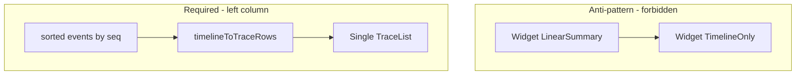
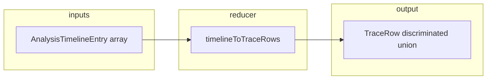
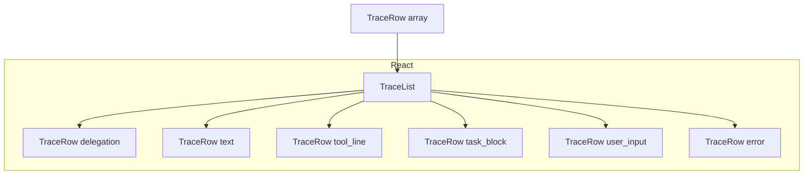
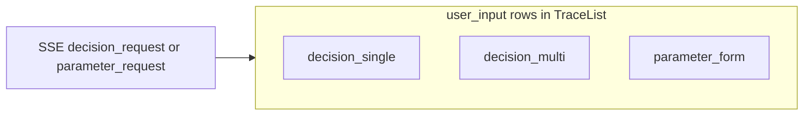
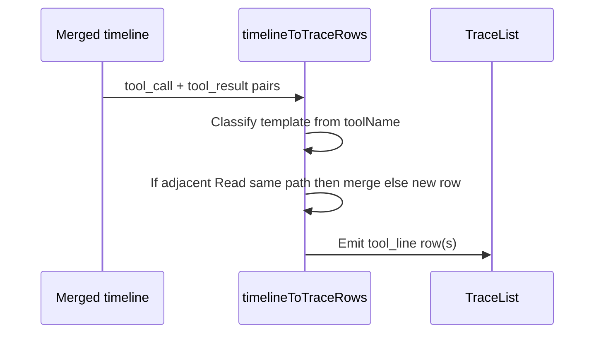
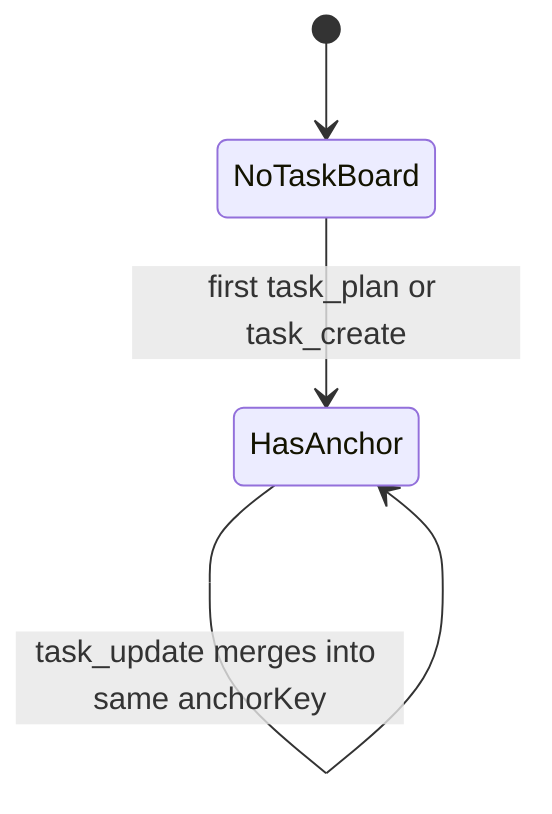

# Design — Cursor-style analysis timeline

## Metadata

- **Slug:** `cursor-style-analysis-timeline`
- **Updated:** 2026-03-27
- **Related:** [proposal.md](./proposal.md), [acceptance-ui.md](./acceptance-ui.md), [acceptance.md](./acceptance.md)

> **vs Cursor `*.plan.md`：** Cursor **Plan 文件**把待办放在文首 **YAML `todos:`** 里，是因为 **Plan 面板**要解析它。本 **`design.md`** 在仓库里主要用 **Markdown 预览**阅读，待办放在 **`## Todo list`** 用 **`- [ ]`** 列表，预览里会像勾选清单一样显示。文首 YAML 仅保留 **`name` / `overview`**（可选），**不**再放 `todos:`，避免预览里一大段无法互动的缩进文本。

## Todo list

Phase 4 实现 backlog；完成项改为 **`- [x]`**。

- [ ] **left-single-flow** — 移除双段布局；`task_summary` / `conclusion` 以 `TraceRow` 落在正确 `seq`（`UnifiedAnalysisTracePanel`, `ReactLinearTraceView`）
- [ ] **sort-events-by-seq** — 在 reducer 入口或调用方对 `events` 稳定升序 `sort(by seq)`
- [ ] **reducer-and-tests** — 实现 `timelineToTraceRows` + `timelineToTraceRows.test.ts`（A-01～A-08，含 HITL `hitlKind` 映射）
- [ ] **trace-list-row** — `TraceList` / `TraceRow` 唯一左栏列表；按 `row.seq` 渲染
- [ ] **two-column-layout** — 双栏桌面两列、窄屏栈叠（`CommandCenter` 或布局父级）
- [ ] **right-column-conversation** — 右栏用户消息列表与 timeline 分离；气泡/卡片对齐 `1.jpeg` / `2.jpeg` 与 `3.jpeg` 的 Lovable 语言
- [ ] **lovable-control-tokens** — Lovable 向控件 token（圆角、阴影、主按钮、选项卡片）用于右栏与左栏 HITL/展开区；对照 `mockups/3.jpeg`
- [ ] **hitl-single-select** — `user_input` 单选行 `decision_request` `allowMultiple=false`；提交后 resume 流
- [ ] **hitl-multi-select** — `user_input` 多选行 `allowMultiple=true`；至少一项；提交 resume
- [ ] **hitl-parameter-form** — `user_input` 参数行 `parameter_request`；校验与提交；与 `ParameterInput` 对齐或重构
- [ ] **timeline-activity-migration** — `TimelineActivity` 接入 `TraceList`；收敛 `ReasoningPanel` 重复叙事
- [ ] **chatmessage-thinkingchain** — 时间线内停用气泡混排或 `embedded` 变体（`ChatMessage`, `ThinkingChain`）
- [ ] **feature-flag-optional** — 可选新布局开关与旧会话回放（`config`）
- [ ] **tool-display-registry** — `toolCallDisplay` 与工具模板 registry 对齐

## Layout: left execution, right conversation

**布局参考：** [mockups/1.jpeg](./mockups/1.jpeg)、[mockups/2.jpeg](./mockups/2.jpeg)。**控件视觉（按钮、选项卡、气泡、表单块）参考：** [mockups/3.jpeg](./mockups/3.jpeg) — **Lovable 向**（圆角、柔和层次、明确主按钮、少「调试感」mono 外溢）。


| 区域     | 内容                                             | 排序规则                                            |
| ------ | ---------------------------------------------- | ----------------------------------------------- |
| **左栏** | Agent **执行过程**（工具、推理行、任务块、HITL、错误、**结论/摘要** 等） | **严格按时间线**（见下节「单一时间序」）                          |
| **右栏** | **用户需求 / 对话列表**（用户消息、附件提示等，气泡或列表形态）            | 按会话 **turn / 时间** 排列；**不**与左栏事件混在一个 DOM 列表里交叉排序 |


**桌面：** 左右分栏（grid 或 flex，`min-w-0` 防撑破）。**窄屏：** 在 `acceptance-ui.md` 约定栈叠顺序（建议先过程后输入或按 mockup 补充）；两栏数据模型仍分离。

**禁止：** 将「执行轨迹」拆成 **上下两个独立组件** 各自渲染一部分事件（例如上线性摘要组件、下时间线组件），否则易出现 **summary 卡在中间、时间序语义错乱**（历史问题）。

## Strict single timeline on the left (no order bugs)

**根因（历史）：** 两个兄弟控件分别渲染「线性摘要 / conclusion」与「timeline」，DOM 顺序固定为 A→B，**与 SSE `seq` 真实顺序不一致** 时，用户会看到摘要插在两段过程之间。

**目标：** 左栏 **只有一个**「按时间排序的流」对应的 **单一容器**（一个 `TraceList` 或单根 `div` 子树），其 children **完全由** `TraceRow[]` 派生，且：

1. **输入：** `AnalysisTimelineEntry[]`（或等价 merged 列表）必须先 **`sort` by `seq`**（同 `seq` 时次要键稳定，如 `id`）。
2. **投影：** `timelineToTraceRows(events)` 产出 `TraceRow[]`，**每个 row 携带 `seq`（或可追溯至源事件的序）**；渲染时 **按 `seq` 非降序**（合并行继承被合并事件的最大/最小 seq 规则在 reducer 内固定并测）。
3. **`task_summary` / `conclusion` / 最终答复：** **不得**由独立面板组件插在时间线外；必须作为 **一种 `TraceRow`（如 `text` 高强调 或 `result_line`）** 插入 **与源事件序一致** 的位置，或作为 **同一条时间线末尾** 的唯一块——**唯一约束：左栏垂直阅读顺序 ≡ 合同时间序**。
4. **流式增量：** 仍只对 **同一份** `events[]` append + resort 或对有序列表插入；**禁止**第二 state 树渲染另一列「摘要」。




## Architecture

将 **展示逻辑** 与 **事件合并** 解耦：canonical merged timeline 经纯函数 `timelineToTraceRows` 变为判别联合的 `TraceRow[]`，再由 **左栏单一** `TraceList` 渲染。Reducer 负责相邻 Read 合并、task 锚定、tool 配对等；React 只做映射与局部交互（展开详情）。**右栏** 为独立对话列表组件，数据源为用户消息列表（与 timeline 分离，仅 turn 对齐）。







### TraceRow kinds (TypeScript shape — illustrative)

- `delegation_line`: `{ kind, id, seq, labelI18nKey?, displayName? }`
- `text`: `{ kind, id, seq, body, format?: 'plain' | 'markdown_compact' }`
- `tool_line`: `{ kind, id, seq, template, primaryText, status, detail? }`
- `task_block`: `{ kind, id, seq, anchorKey, tasks: TaskItem[] }`
- `user_input`: `{ kind, id, seq, hitlKind: 'decision_single' | 'decision_multi' | 'parameter_form', payload }` — 见下节 **HITL 三形态**；`payload` 形状与现有 `decision_request` / `parameter_request` SSE 对齐。
- `error_line`: `{ kind, id, seq, message }`

## User input rows (HITL) — three variants

所有 HITL **仍在左栏时间序内**占一行（或一块），`seq` 与相邻 tool/reasoning 一致；**禁止** sticky dock。**视觉**（圆角卡片、主按钮、选项 hover）对齐 [mockups/3.jpeg](./mockups/3.jpeg)。

| hitlKind | 用户操作 | SSE / 数据源 | UI 要点 |
|----------|----------|--------------|---------|
| `decision_single` | **单选**（选一） | `decision_request`，`allowMultiple === false` | Radio / 单选卡片组；一项必选；主按钮「确认」提交选中 `option.id` |
| `decision_multi` | **多选** | `decision_request`，`allowMultiple === true` | Checkbox 组；至少一项（若产品允许零选需在契约写明）；提交 `option.id[]` |
| `parameter_form` | **输入参数**（多字段） | `parameter_request`（字段名、类型、是否必填等以现有 payload 为准） | 表单控件 + 校验 + 主按钮提交；可复用/扩展 [ParameterInput.tsx](../../../src/components/reasoning/ParameterInput.tsx) |

**Reducer：** `timelineToTraceRows` 遇到 `decision_request` → `user_input` + `hitlKind` 由 `allowMultiple` 映射；`parameter_request` → `parameter_form`。

**提交后：** 沿用现有 resume API（`submitHitlResume` / `onParameterSubmit` 等）；成功后该 row 可变为只读摘要或折叠，**不**改变已发生事件的 `seq`。



## Visual language: Lovable-style controls (3.jpeg)

**分工：**

- **左栏执行列表主体**（tool_line、text、delegation）：保持 **Cursor 式** 文字优先、高密度、少装饰（与既有 acceptance U-01～U-04 一致）。
- **需要用户操作的块**（HITL 整卡、工具详情展开、右栏用户气泡）：采用 **Lovable 向** token，以 [3.jpeg](./mockups/3.jpeg) 为参考：
  - 卡片：`rounded-2xl` 量级、轻边框或浅阴影、充足内边距。
  - 主按钮：实心主色、明确 label；次要操作为 ghost/outline。
  - 选项：可点击整卡或清晰 radio/checkbox，hover/focus 可见。
  - **避免**在交互块上使用整段 `font-mono`（仅代码/JSON 区 mono）。

建议在 `design tokens` 或组件层增加 **`traceExecution`** vs **`traceInteractive`**（或 `lovableSurface`）两套 class 组合，避免左栏全局变成「厚重卡片墙」。

## Contracts


| Layer              | Contract                                                                          | Notes                                                                  |
| ------------------ | --------------------------------------------------------------------------------- | ---------------------------------------------------------------------- |
| Input              | `AnalysisTimelineEntry[]`（或合并后的 canonical 列表），**进入 reducer 前保证按 `seq` 升序（稳定并列键）** | 类型定义见 [src/types/analysis.ts](../../../src/types/analysis.ts)（路径以仓库为准） |
| Output             | `TraceRow[]`：判别联合，`id` + **`seq`（或 `sortKey`）** 稳定；**渲染顺序 = 按 seq 升序**            | 不修改 SSE 线协议；纯客户端投影                                                     |
| Ordering invariant | 左栏 **仅** 此列表驱动；**禁止**第二组件插入 summary/conclusion 破坏序                                | 见单测 A-07                                                               |
| Tool pairing       | `tool_call` 与 `tool_result` 以现有事件 `id` 关联                                         | 仅 `result` 无 `call`：generic `tool_line` 或跳过（实现时选一条并在测试中固定）             |
| Task anchor        | `anchorKey` 建议 `task-board:<messageIdOrTurn>:<firstTaskSeq>`                      | 防同会话多计划碰撞（见 OpenSpec D3 风险）                                            |
| i18n               | 用户可见字符串经 `src/i18n/locales/`                                                      | Reducer 可输出 `i18nKey + params`，由 UI 层翻译                                |
| HITL               | `decision_request` / `parameter_request` 载荷与现有类型一致                                         | 见 [src/types/analysis.ts](../../../src/types/analysis.ts)；三形态映射上表                |


## Edge cases and errors


| Scenario                          | Expected behavior                                                              |
| --------------------------------- | ------------------------------------------------------------------------------ |
| 流式中途仅 `tool_call` 无 `tool_result` | UI：`running` 状态；reducer 可发出 pending `tool_line` 或在结果到达时一次性发出（实现择一，**文档与测试一致**） |
| `tool_result` 早于或孤立于 `tool_call`  | 不崩溃；fallback 一行 generic 或合并入现有行（**不丢错误信息**）                                    |
| 重复 `delegation_line`（边界检测抖动）      | 测试约束：同一 subagent invocation **最多一行**；若上游重复发事件，reducer 去重键需定义                   |
| 空 timeline                        | `TraceList` 渲染空容器或保持现有「无活动」占位（与产品一致）                                           |
| 极大 JSON `toolOutput`              | 预览截断（沿用 `formatToolResultPreview` 或统一上限）；展开区可滚动                                |
| 历史回放与实时流 **同一 reducer**           | A-06：相同 `events[]` 输出一致；流式增量等价于最终数组折叠后的结果（若不等价，必须在 design 写明增量算法）              |
| HITL 校验失败（未选/多选为空/参数非法）           | 内联错误提示；**不** resume；不插入假 `seq` 事件                                                     |


**User-visible errors:** `error_line` 展示 `detail`/`message`；不暴露堆栈除非已有 dev 模式开关。

## Operational and rollout


| Topic                  | Decision                                                                                                                    |
| ---------------------- | --------------------------------------------------------------------------------------------------------------------------- |
| Feature flag           | 建议 `VITE_*` 或现有 config 开关 **新轨迹 UI**，默认 dev 开、prod 按发布节奏开（具体键名实现时写入 [src/lib/config.ts](../../../src/lib/config.ts) 并在下表更新） |
| Backward compatibility | 旧会话仅存储 timeline JSON：**无迁移**则回放路径必须仍能渲染（或 flag off 走旧组件）                                                                    |
| Deprecation            | `ThinkingChain` / 时间线内 `ChatMessage`：标记 deprecated 或限制路由；移除前至少一个版本双轨可选                                                      |
| Telemetry              | 可选：`unmapped_toolName` 计数（console 或现有 analytics），不阻塞首版                                                                      |


## Implementation order

1. **布局骨架：** 左执行 + 右对话（桌面双栏 / 窄屏栈叠），占位与 `min-w-0`。
2. **去掉双段序 bug：** 合并 `UnifiedAnalysisTracePanel` / `ReactLinearTraceView` 编排，禁止上线性摘要 + 下时间线分控件。
3. `timelineToTraceRows.ts` + **全量单元测试**（A-01～A-07）。
4. `TraceRow.tsx`（骨架 + `tool_line` + `text` + 结论类高强调行）。
5. `TraceList.tsx` 唯一左栏列表；**排序后**渲染。
6. `task_block` / `user_input`（含 **三态 HITL**）/ `delegation_line` / `error_line`。
6b. **Lovable token** 应用于 HITL 与右栏气泡（对照 3.jpeg）。
7. 右栏对话列表数据接好；与 turn 对齐。
8. 收敛 `ReasoningPanel`；`ChatMessage` 右栏专用或 embedded。
9. 清理 `StreamEventRenderer` / `ThinkingChain` 重复路径。
10. E2E 黄金路径（可选）。

## Rationale (ADR-style)

- **Reducer vs JSX 模板：** 合并规则与单元测试必须在纯函数中，避免 `TimelineActivity` 再成上帝组件（对齐 OpenSpec D1）。  
- **不增 SSE `ui_kind`：** 首版用 `toolName` registry，降低前后端协调成本；后续若漂移再议字段。  
- **左单流 + 右对话：** 执行事件与用户气泡 **数据源不同**；右栏不参与 `seq` 混排，避免一列内交替排序复杂度。**左栏** 必须用 **单一列表** 保证 `seq` 与 DOM 序一致。  
- **Mockups：** `1.jpeg` / `2.jpeg` 布局；`3.jpeg` **控件与对话气质**（Lovable）。执行列表密度与交互块厚重感 **刻意区分**，避免整屏同质化。

## UI component and state breakdown


| Piece                                          | Responsibility                                                                      | Key state                     |
| ---------------------------------------------- | ----------------------------------------------------------------------------------- | ----------------------------- |
| `AnalysisSplitLayout`（或父级布局）                   | **左**：执行单列；**右**：对话列表；响应式栈叠                                                         | `breakpoint`                  |
| `ConversationColumn`（右栏）                       | 仅用户消息 / 需求展示；**不**渲染 tool/reasoning                                                 | `messages[]` per turn         |
| `TraceList`（左栏）                                | **唯一**执行流：`rows` **排序后** `map` → `TraceRow`；列表级 `gap`；可选自动滚底（流式）                    | `rows`, `isStreaming`         |
| `TraceRow`                                     | 按 `kind` 分派子布局；共享左 gutter / 右 status                                                | 每行 `expanded?: boolean`（工具详情） |
| `TimelineActivity`                             | 收敛为左栏数据源：timeline → reducer → `TraceList`；**移除**与 `ReactLinearTraceView` 纵向叠放各渲染一段序 | 与现有父组件一致                      |
| `ReasoningPanel` / `UnifiedAnalysisTracePanel` | **不得**再与 Timeline 并行各渲染一块「线性结论+时间线」；结论进 `TraceRow` 或并入同一 reducer 输入流                | 删除双控件编排                       |


**Interaction states（须可被 I-xx 验证）：** loading（流式）、empty、error、HITL blocking（**单选 / 多选 / 表单** 三种）、tool expanded/collapsed。

**Deprecated pattern:** `ReactLinearTraceView`（hideLinearTraceBody + productTimelineCompanion）若导致 **结论与 timeline 分两控件纵向排列**，本需求下应改为 **单左栏 TraceList** 或 **线性块仅为右栏无关的壳**（以代码审阅为准）。

## Flows

### Tool call / result pairing and read collapse




### Task block anchor




## Pseudocode — timelineToTraceRows (core)

```
INPUT: events: AnalysisTimelineEntry[] sorted by seq
OUTPUT: rows: TraceRow[]

state:
  pendingToolById: Map<id, ToolCallPartial>
  lastEmittedReadPath: string | null  // normalized path after last non-merge row
  taskAnchor: { anchorKey, rowIndex } | null

for each ev in events:
  if ev is delegation boundary:
    append delegation_line
    lastEmittedReadPath = null

  else if ev.type == reasoning / step (text-eligible):
    append text row (merge policy: optional consecutive text same turn — v1 may keep separate rows)
    if row is not a "read" synthetic: lastEmittedReadPath = null for read-merge? (actually only tool_line affects read merge)

  else if ev.type == tool_call:
    store in pendingToolById[ev.id]

  else if ev.type == tool_result:
    pair = pendingToolById.delete(ev.id)
    template = classifyTool(pair.name, pair.input, ev.output)
    if template == READ and same normalized path as lastEmittedReadPath and last row was tool_line READ same path:
      merge into previous tool_line (update preview / status)
    else:
      append tool_line
      if template == READ: lastEmittedReadPath = path
      else: lastEmittedReadPath = null  // write/edit/delete break — use explicit BREAK_TOOLS set

  else if ev.type matches task_*:
    if no taskAnchor:
      append task_block row; taskAnchor = { rowIndex }
    else:
      merge ev into rows[taskAnchor.rowIndex].tasks

  else if ev.type == decision_request:
    append user_input with hitlKind = allowMultiple ? decision_multi : decision_single
  else if ev.type == parameter_request:
    append user_input with hitlKind = parameter_form

  else if ev.type == error:
    append error_line

return rows
```

**Write-path break list (must be in code + tests):** e.g. `write_file`, `edit_file`, `delete_file`, …（以实现时仓库内 tool 名为准，与 OpenSpec D5 一致。）

## Visual tokens (binding for UI)


| Token           | Rule                                               |
| --------------- | -------------------------------------------------- |
| Body sans       | 全轨迹主文案 **一档**（建议 13px 或 `text-[13px]`，实现时二选一并全局统一） |
| Meta sans       | 次要一行 **小一档**（预览、耗时）                                |
| Mono            | **仅**展开区、内联路径片段、JSON/code block                    |
| Vertical rhythm | 列表统一 `gap`（如 8px）；禁止同列表混用 `mb-4` 气泡外边距             |
| Surface         | 轨迹容器允许 `muted/20` + 细边框；**禁止**主轨迹区紫粉渐变背景           |
| Motion          | 流式 **最多一种**主反馈（光标或行尾渐入）                            |
| Interactive surface | **HITL 与右栏气泡** 可用 Lovable 向浅阴影/圆角（见 3.jpeg）；与上表 **traceExecution** 区分 |


## Code touch list


| Path                                                                                             | Action                                              |
| ------------------------------------------------------------------------------------------------ | --------------------------------------------------- |
| **New** `src/lib/timelineToTraceRows.ts`                                                         | Reducer + helpers (path normalize, merge, classify) |
| **New** `src/lib/timelineToTraceRows.test.ts`                                                    | Unit tests for A-xx scenarios                       |
| **New** `src/components/reasoning/TraceList.tsx`                                                 | Map rows → TraceRow                                 |
| **New** `src/components/reasoning/TraceRow.tsx`                                                  | Variants + shared layout                            |
| [TimelineActivity.tsx](../../../src/components/reasoning/TimelineActivity.tsx)                   | Consume TraceList or inline migrate                 |
| [ReasoningPanel.tsx](../../../src/components/reasoning/ReasoningPanel.tsx)                       | 减少与 Timeline 重复的 thinking 叙事；数据源对齐                  |
| [ChatMessage.tsx](../../../src/components/reasoning/ChatMessage.tsx)                             | `variant=embedded` 或时间线内停用                          |
| [ThinkingChain.tsx](../../../src/components/ThinkingChain.tsx)                                   | 收敛样式或与 TraceRow 统一                                  |
| [UnifiedAnalysisTracePanel.tsx](../../../src/components/reasoning/UnifiedAnalysisTracePanel.tsx) | **去掉**「上线性 + 下时间线」双段布局；改为左单流 + 右对话                  |
| [ReactLinearTraceView.tsx](../../../src/components/reasoning/ReactLinearTraceView.tsx)           | 收缩职责或合并：避免 conclusion 与 timeline 分控件                |
| [CommandCenter.tsx](../../../src/components/CommandCenter.tsx)                                   | 双栏布局、右栏对话数据源                                        |
| [ParameterInput.tsx](../../../src/components/reasoning/ParameterInput.tsx)                         | `parameter_form` 样式与校验对齐 3.jpeg                         |
| [UserDecision.tsx](../../../src/components/reasoning/UserDecision.tsx)（或等价）                    | `decision_single` / `decision_multi` UI 与提交                    |
| [toolCallDisplay.ts](../../../src/lib/toolCallDisplay.ts)                                        | 与模板 registry 对齐或合并                                  |


**Risky areas:** 流式中途 partial 事件、历史会话回放、子代理边界检测重复/遗漏、与 `StreamEventRenderer` 并行路径重复渲染。

## Testing strategy

1. **Unit (required):** `timelineToTraceRows` — Read 合并、write 打断、delegation 行、task 锚定更新、未知工具 fallback；**A-07 `seq` 单调**。
2. **Component:** `TraceRow` 关键 variant 使用 RTL（若项目已有惯例）。
3. **Integration / DOM (recommended):** fixture 含 `conclusion` 与中段 `tool_call`：断言左栏 **单一列表容器** 内顺序与 `seq` 一致（无 summary 插在两个 list 之间）。
4. **Component / RTL：** 三种 HITL 各至少一条（单选、多选、参数提交与校验）。
5. **E2E (optional):** 一条黄金路径「发起分析 → 可见工具行」；避免断言每一帧流式。

## plan-design-review

- **Status:** Deferred in Phase 2 doc pass — run `/plan-design-review` after stakeholder read, or record findings in this section.
- **Deferred items:** 委托行信号源最终表；toolName 全量清单（可在实现 PR 中闭合）。

## Design review handoff

- **Slug:** `cursor-style-analysis-timeline`
- **Mockups status:** **Present** — [1.jpeg](./mockups/1.jpeg)、[2.jpeg](./mockups/2.jpeg) 布局；[3.jpeg](./mockups/3.jpeg) 控件 Lovable 风（见 [acceptance-ui.md](./acceptance-ui.md)）。
- **Acceptance UI:** [acceptance-ui.md](./acceptance-ui.md)（准则以 **用户确认/编辑** 为准；Agent 仅结构化落盘。）
- **Local run target:** 实现后复制 [`.cursor/design-review-handoff/target.example.yaml`](../../../.cursor/design-review-handoff/target.example.yaml) 为 **`target.local.yaml`**（勿提交密钥）；`base_url` 指向本地 dev server。

