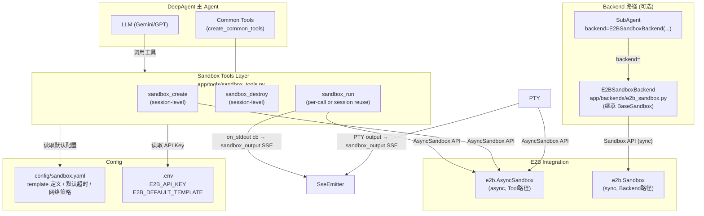
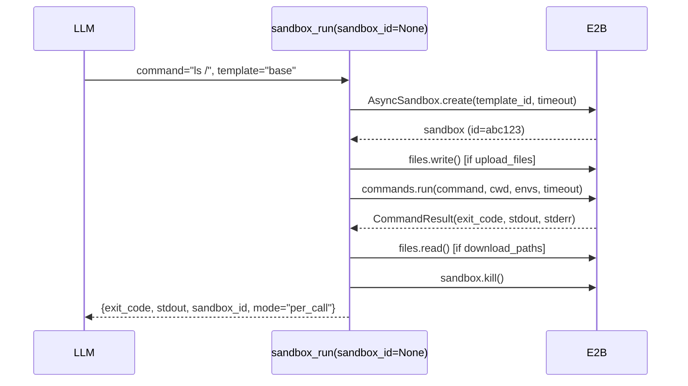
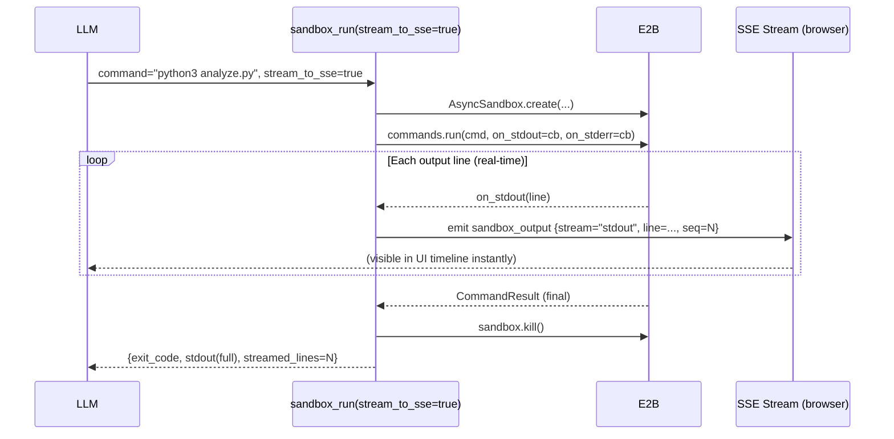
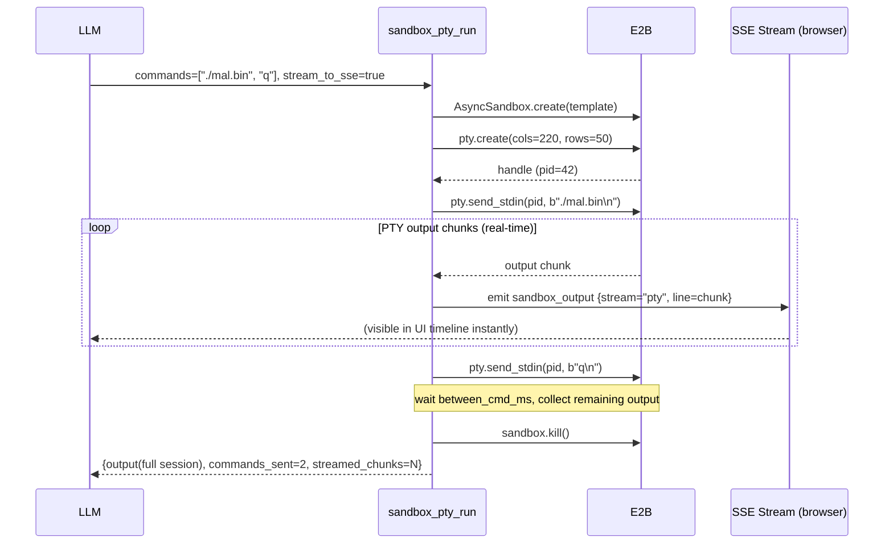

# Design: E2B On-Demand Sandbox Tools

## Metadata

| Field | Value |
|-------|-------|
| Slug | `e2b-sandbox-tools` |
| Status | **DONE** (Phase 6 verification passed 2026-04-14) |
| Date | 2026-04-13 |
| Path B | No prior Cursor plan — greenfield design |

---

## Todo list

- [x] **cfg-sandbox-yaml** — 创建 `config/sandbox.yaml`，定义模板列表、默认超时、网络策略
- [x] **env-example** — 在 `.env.example` 中添加 `E2B_API_KEY`、`E2B_DEFAULT_TEMPLATE` 等变量
- [x] **deps-e2b** — 在 `requirements.txt` 添加 `e2b` 依赖
- [x] **sandbox-tools-models** — 在 `app/tools/sandbox_tools.py` 定义输入 Pydantic 模型（含流式参数）
- [x] **sandbox-tools-impl** — 实现 `sandbox_create`、`sandbox_destroy`、`sandbox_run`（含 `stream_to_sse` 支持）
- [x] **sandbox-pty-impl** — 实现 `sandbox_pty_run` 工具（PTY 交互式会话）
- [x] **sse-emitter-ctx** — 实现 `SandboxSseEmitter` ContextVar 机制，供流式工具推送 `sandbox_output` 事件
- [x] **e2b-backend** — 实现 `app/backends/e2b_sandbox.py`（`E2BSandboxBackend` 继承 `BaseSandbox`）
- [x] **tool-presentation** — 在 `config/tool_presentation.yaml` 注册四个 sandbox 工具的 SSE 配置
- [x] **tool-registry** — 在 `app/tools/common_tool_registry.py` 注册 sandbox tools（条件装配，仅当 `E2B_API_KEY` 存在时）
- [x] **unit-tests** — 编写 `tests/test_sandbox_tools.py`（mock E2B SDK，覆盖三种模式；23 项全绿）

---

## Architecture



### 模块职责

| 模块 | 职责 |
|------|------|
| `config/sandbox.yaml` | 模板注册、默认参数、网络策略；Tools 和 Backend 都从此读取 |
| `app/tools/sandbox_tools.py` | **四个** StructuredTool：`sandbox_create`、`sandbox_destroy`、`sandbox_run`（含流式）、`sandbox_pty_run` |
| `app/tools/sandbox_sse.py` | `SandboxSseEmitter` ContextVar 机制，工具运行时推送 `sandbox_output` SSE 事件 |
| `app/backends/e2b_sandbox.py` | `E2BSandboxBackend`（同步），继承 `BaseSandbox` |
| `config/tool_presentation.yaml` | SSE 呈现配置（presentation: action） |
| `app/tools/common/tools.py` | 条件挂载 sandbox tools（KEY 存在时） |

---

## Config: `config/sandbox.yaml`

这是沙箱功能的**唯一配置入口**。结构设计：

```yaml
# Sandbox global configuration
# All sandbox templates, defaults, and network policies are defined here.
# Tools and E2BSandboxBackend both load from this file at startup.

defaults:
  template: "base"          # fallback when caller does not specify a template
  timeout_seconds: 60       # per-command default timeout
  max_sandbox_lifetime: 300 # sandbox TTL in seconds (E2B will auto-kill after this)
  allow_internet: false     # whether sandbox outbound internet is allowed by default

templates:
  base:
    template_id: "base"     # E2B built-in template
    description: "Default minimal Linux sandbox (Python, bash)"
    allow_internet: false
    timeout_seconds: 60

  binary-analysis:
    template_id: "base"     # or a custom E2B template ID
    description: "Binary dynamic analysis environment with common RE tools"
    allow_internet: false
    timeout_seconds: 120
    env:
      ANALYSIS_MODE: "binary"

  web-simulation:
    template_id: "base"
    description: "Simulate malicious URL visits via curl/requests"
    allow_internet: true    # needs outbound for URL fetching
    timeout_seconds: 60

  desktop:
    template_id: "desktop"  # E2B desktop template with browser
    description: "Full desktop environment with Chromium/Playwright"
    allow_internet: true
    timeout_seconds: 120

network_policy:
  # Additional per-template egress override (future extension point)
  blocked_domains: []
```

---

## Contracts — Tool Schemas

### `sandbox_create`

**Input:**

| Field | Type | Required | Description |
|-------|------|----------|-------------|
| `template` | `str` | No | 模板名（在 `config/sandbox.yaml` templates 中查找），默认读 `defaults.template` |
| `env_vars` | `dict[str,str]` | No | 额外环境变量（追加到模板 env 之上） |
| `metadata` | `str` | No | 自定义标注字符串（便于日志追踪） |

**Output (JSON string):**

```json
{
  "sandbox_id": "abc123",
  "template": "base",
  "status": "running",
  "created_at": "2026-04-13T10:00:00Z"
}
```

**Error:** `{"error": "...", "sandbox_id": null}`

---

### `sandbox_destroy`

**Input:**

| Field | Type | Required | Description |
|-------|------|----------|-------------|
| `sandbox_id` | `str` | Yes | 要销毁的沙箱 ID |

**Output (JSON string):**

```json
{
  "sandbox_id": "abc123",
  "status": "killed",
  "message": "Sandbox destroyed successfully"
}
```

---

### `sandbox_run`

**Input:**

| Field | Type | Required | Description |
|-------|------|----------|-------------|
| `command` | `str` | Yes | 要执行的 shell 命令 |
| `sandbox_id` | `str` | No | 为空时使用 per-call 模式（新建+执行+销毁）；提供时复用 existing sandbox |
| `template` | `str` | No | per-call 模式下使用的模板（session 模式忽略此参数） |
| `upload_files` | `list[UploadFileSpec]` | No | 需要上传到沙箱的文件列表 |
| `download_paths` | `list[str]` | No | 执行后从沙箱下载的文件路径列表 |
| `cwd` | `str` | No | 执行命令的工作目录（默认 `/home/user`） |
| `env_vars` | `dict[str,str]` | No | 覆盖本次执行的额外环境变量 |
| `timeout` | `int` | No | 覆盖默认超时（秒） |
| `background` | `bool` | No | 是否后台执行（不等待结果，默认 false） |
| `stream_to_sse` | `bool` | No | 为 true 时，每行 stdout/stderr 实时推送 `sandbox_output` SSE 事件（默认 false） |

**`UploadFileSpec`:**

```python
class UploadFileSpec(BaseModel):
    sandbox_path: str         # destination path inside sandbox
    content_b64: str | None   # base64-encoded file content (text or binary)
    content_text: str | None  # plain text content (alternative to b64)
```

**Output (JSON string):**

```json
{
  "exit_code": 0,
  "stdout": "...",
  "stderr": "",
  "sandbox_id": "abc123",
  "mode": "per_call",          // or "session"
  "downloaded_files": [
    {
      "sandbox_path": "/tmp/result.txt",
      "content_b64": "SGVsbG8=",
      "error": null
    }
  ],
  "truncated": false,
  "streamed_lines": 42,        // present when stream_to_sse=true; total lines pushed as SSE events
  "error": null
}
```

> 当 `stream_to_sse=true` 时，每行 stdout/stderr 在产生时立即推送 `sandbox_output` SSE 事件（见下方 **SSE 事件形状**），工具最终仍然返回完整的 `stdout`/`stderr` 以供 LLM 使用。

---

### `sandbox_pty_run`

PTY 交互式终端，适合需要逐步输入/输出的场景（交互式 shell、REPL、需要 tty 的程序）。

**Input:**

| Field | Type | Required | Description |
|-------|------|----------|-------------|
| `commands` | `list[str]` | Yes | 要依次发送的命令列表（每条命令自动追加 `\n`） |
| `sandbox_id` | `str` | No | 为空时 per-call 模式（新建+执行+销毁）；提供时复用 |
| `template` | `str` | No | per-call 模式下使用的模板 |
| `initial_wait_ms` | `int` | No | 启动 PTY 后等待初始 prompt 的毫秒数（默认 500） |
| `between_cmd_ms` | `int` | No | 每条命令发送后等待下一条的毫秒数（默认 300） |
| `cols` | `int` | No | 终端列数（默认 220） |
| `rows` | `int` | No | 终端行数（默认 50） |
| `timeout` | `int` | No | 整个 PTY 会话超时（秒，默认 60） |
| `stream_to_sse` | `bool` | No | 为 true 时每个输出 chunk 推送 `sandbox_output` SSE 事件（默认 true） |

**Output (JSON string):**

```json
{
  "output": "...(full raw terminal output)...",
  "sandbox_id": "abc123",
  "mode": "per_call",
  "commands_sent": 3,
  "streamed_chunks": 18,
  "error": null
}
```

---

### SSE 事件形状 — `sandbox_output`

当 `stream_to_sse=true` 时，工具层通过 `SandboxSseEmitter` ContextVar 推送以下事件到当前请求的 SSE 流：

```json
{
  "type": "sandbox_output",
  "data": {
    "sandbox_id": "abc123",
    "tool_name": "sandbox_run",        // or "sandbox_pty_run"
    "stream": "stdout",                // "stdout" | "stderr" | "pty"
    "line": "ELF 64-bit LSB executable",
    "seq": 5                           // monotonic line counter per tool call
  }
}
```

**`SandboxSseEmitter` 机制：**

```python
# app/tools/sandbox_sse.py
from contextvars import ContextVar
from typing import Callable, Awaitable

# Set by request middleware; None when not in a streaming request context
_sse_emitter: ContextVar[Callable[[dict], Awaitable[None]] | None] = ContextVar(
    "sandbox_sse_emitter", default=None
)

async def emit_sandbox_output(sandbox_id: str, tool_name: str,
                               stream: str, line: str, seq: int) -> None:
    """Push a sandbox_output SSE event if an emitter is registered."""
    emitter = _sse_emitter.get()
    if emitter:
        await emitter({
            "type": "sandbox_output",
            "data": {
                "sandbox_id": sandbox_id,
                "tool_name": tool_name,
                "stream": stream,
                "line": line,
                "seq": seq,
            },
        })

def set_sse_emitter(fn: Callable[[dict], Awaitable[None]]) -> None:
    _sse_emitter.set(fn)
```

**集成点：** FastAPI `/analyze` 请求处理时，在调用 `agent.astream()` 前通过 `set_sse_emitter(sse_send_fn)` 注册当前请求的 SSE 发送函数，工具运行期间即可实时推送事件。

---

## Flows

### Per-call Flow



### Session 复用 Flow

```mermaid
sequenceDiagram
    participant LLM
    participant Create as sandbox_create
    participant Run as sandbox_run(sandbox_id=X)
    participant Destroy as sandbox_destroy
    participant E2B

    LLM->>Create: template="binary-analysis"
    Create->>E2B: AsyncSandbox.create(...)
    E2B-->>Create: sandbox_id="X"
    Create-->>LLM: {sandbox_id="X", status="running"}

    LLM->>Run: command="strings /tmp/mal.bin", sandbox_id="X"
    Run->>E2B: connect to existing sandbox X
    Run->>E2B: commands.run(...)
    E2B-->>Run: result
    Run-->>LLM: {exit_code, stdout, mode="session"}

    LLM->>Destroy: sandbox_id="X"
    Destroy->>E2B: sandbox.kill()
    Destroy-->>LLM: {status="killed"}
```

### Streaming Flow (`stream_to_sse=true`)



### PTY Interactive Flow



---

## Pseudocode

### `sandbox_run` core logic (with streaming)

```python
async def _sandbox_run_impl(input: SandboxRunInput) -> dict:
    cfg = load_sandbox_config()  # config/sandbox.yaml

    if input.sandbox_id:
        mode = "session"
        sandbox = await AsyncSandbox.connect(input.sandbox_id)
        template_cfg = cfg.templates[cfg.defaults.template]  # defaults for env merge
    else:
        mode = "per_call"
        template_cfg = cfg.templates.get(input.template or cfg.defaults.template)
        if template_cfg is None:
            return {"error": f"Template '{input.template}' not found in config/sandbox.yaml"}
        sandbox = await AsyncSandbox.create(
            template=template_cfg.template_id,
            timeout=input.timeout or template_cfg.timeout_seconds,
        )

    seq_counter = 0

    async def on_stdout(data) -> None:
        nonlocal seq_counter
        if input.stream_to_sse:
            await emit_sandbox_output(sandbox.sandbox_id, "sandbox_run", "stdout", data.line, seq_counter)
        seq_counter += 1

    async def on_stderr(data) -> None:
        nonlocal seq_counter
        if input.stream_to_sse:
            await emit_sandbox_output(sandbox.sandbox_id, "sandbox_run", "stderr", data.line, seq_counter)
        seq_counter += 1

    try:
        for f in (input.upload_files or []):
            content = base64.b64decode(f.content_b64) if f.content_b64 else f.content_text.encode()
            await sandbox.files.write(f.sandbox_path, content)

        env = {**(template_cfg.env or {}), **(input.env_vars or {})}
        result = await sandbox.commands.run(
            input.command,
            cwd=input.cwd or "/home/user",
            envs=env or None,
            timeout=input.timeout or cfg.defaults.timeout_seconds,
            on_stdout=on_stdout,
            on_stderr=on_stderr,
        )

        downloaded = []
        for path in (input.download_paths or []):
            try:
                content = await sandbox.files.read(path)
                downloaded.append({"sandbox_path": path,
                                    "content_b64": base64.b64encode(content).decode(),
                                    "error": None})
            except Exception as e:
                downloaded.append({"sandbox_path": path, "content_b64": None, "error": str(e)})

        return {
            "exit_code": result.exit_code,
            "stdout": result.stdout,
            "stderr": result.stderr,
            "sandbox_id": sandbox.sandbox_id,
            "mode": mode,
            "downloaded_files": downloaded,
            "streamed_lines": seq_counter if input.stream_to_sse else None,
            "error": None,
        }
    finally:
        if mode == "per_call":
            await sandbox.kill()
```

### `sandbox_pty_run` core logic

```python
async def _sandbox_pty_run_impl(input: SandboxPtyInput) -> dict:
    cfg = load_sandbox_config()

    if input.sandbox_id:
        mode = "session"
        sandbox = await AsyncSandbox.connect(input.sandbox_id)
    else:
        mode = "per_call"
        template_cfg = cfg.templates.get(input.template or cfg.defaults.template)
        sandbox = await AsyncSandbox.create(template=template_cfg.template_id)

    full_output: list[str] = []
    chunk_counter = 0

    try:
        handle = await sandbox.pty.create(
            cols=input.cols or 220,
            rows=input.rows or 50,
            on_data=None,  # we use async iteration below
        )

        await asyncio.sleep((input.initial_wait_ms or 500) / 1000)

        # Subscribe to PTY output as async generator
        async def collect_output():
            nonlocal chunk_counter
            async for chunk in sandbox.pty.subscribe(handle.pid):
                text = chunk.decode("utf-8", errors="replace")
                full_output.append(text)
                if input.stream_to_sse:
                    await emit_sandbox_output(sandbox.sandbox_id, "sandbox_pty_run",
                                               "pty", text.rstrip("\n"), chunk_counter)
                chunk_counter += 1

        # Send commands while collecting output concurrently
        output_task = asyncio.create_task(collect_output())
        for cmd in input.commands:
            await sandbox.pty.send_stdin(handle.pid, (cmd + "\n").encode())
            await asyncio.sleep((input.between_cmd_ms or 300) / 1000)

        # Wait for remaining output with timeout
        await asyncio.wait_for(output_task, timeout=input.timeout or 60)

        return {
            "output": "".join(full_output),
            "sandbox_id": sandbox.sandbox_id,
            "mode": mode,
            "commands_sent": len(input.commands),
            "streamed_chunks": chunk_counter,
            "error": None,
        }
    finally:
        if mode == "per_call":
            await sandbox.kill()
```

### `config/sandbox.yaml` loader

```python
@lru_cache(maxsize=1)
def load_sandbox_config() -> SandboxConfig:
    """Load sandbox config from config/sandbox.yaml.
    
    Returns cached config; restart required for changes to take effect.
    """
    config_path = Path(__file__).parent.parent.parent / "config" / "sandbox.yaml"
    with open(config_path) as f:
        raw = yaml.safe_load(f)
    return SandboxConfig(**raw)
```

---

## Code Touch List

| Path | Action | Notes |
|------|--------|-------|
| `config/sandbox.yaml` | **新增** | 模板注册、默认配置，**唯一沙箱配置入口** |
| `python-agent-service/requirements.txt` | **修改** | 添加 `e2b` |
| `.env.example` | **修改** | 添加 `E2B_API_KEY`、`E2B_DEFAULT_TEMPLATE` |
| `app/tools/sandbox_tools.py` | **新增** | **四个** StructuredTool + Pydantic 模型 + config loader |
| `app/tools/sandbox_sse.py` | **新增** | `SandboxSseEmitter` ContextVar + `emit_sandbox_output()` + `set_sse_emitter()` |
| `app/backends/e2b_sandbox.py` | **新增** | `E2BSandboxBackend(BaseSandbox)` 同步实现 |
| `app/main.py` | **修改** | `/analyze` 请求处理前调用 `set_sse_emitter(sse_send_fn)` |
| `config/tool_presentation.yaml` | **修改** | 注册 `sandbox_create`、`sandbox_destroy`、`sandbox_run`、`sandbox_pty_run` |
| `app/tools/common/tools.py` | **修改** | 条件挂载四个 sandbox tools（E2B_API_KEY 存在时） |
| `tests/tools/test_sandbox_tools.py` | **新增** | 单元测试（mock E2B SDK，覆盖三种执行模式） |

---

## Edge Cases & Errors

| Scenario | Handling |
|----------|---------|
| `E2B_API_KEY` 未配置 | `sandbox_create`/`sandbox_run` 返回 `{"error": "E2B_API_KEY not configured"}`；工具不挂载 |
| 无效 `sandbox_id`（session 复用时） | E2B SDK 抛出异常，捕获后返回 `{"error": "Sandbox X not found or expired"}` |
| 命令超时 | E2B SDK `TimeoutException`，捕获后返回 `{"exit_code": -1, "error": "Command timed out"}` |
| 无效模板名 | 查 `config/sandbox.yaml` 未找到时，返回 `{"error": "Template 'xyz' not found in config/sandbox.yaml"}` |
| 下载路径不存在 | 单文件错误不终止整体，`downloaded_files[i].error` 记录错误信息 |
| per-call sandbox 泄漏（finally 中 kill 失败） | 记录 warning 日志，E2B 的 `max_sandbox_lifetime` TTL 会兜底回收 |
| 上传文件过大 | E2B SDK 限制由 SDK 自身返回错误，工具层捕获并透传 |
| `stream_to_sse=true` 但 `_sse_emitter` 未注册（非流式请求上下文） | `emit_sandbox_output` 检查 `_sse_emitter.get()` 为 None 时静默跳过；工具正常返回完整结果 |
| PTY 程序不退出（hung process） | `asyncio.wait_for` 超时后取消 output_task，记录 warning；finally 中 kill sandbox |
| PTY 输出含非 UTF-8 字节 | `decode("utf-8", errors="replace")` 替换无效字节；不中断会话 |
| `stream_to_sse=true` 时 SSE emit 失败（连接断开） | 捕获 emit 异常，记录 warning，继续执行命令（不中断沙箱） |

---

## Implementation Order

1. `config/sandbox.yaml` — 先建配置文件，让后续代码都能从它读
2. `.env.example` + `requirements.txt` — 依赖与环境准备
3. `app/tools/sandbox_tools.py` — 核心工具实现（先写测试）
4. `config/tool_presentation.yaml` — 注册 SSE 配置
5. `app/tools/common/tools.py` — 挂载工具到 Agent
6. `app/backends/e2b_sandbox.py` — Backend 路径（依赖 sandbox_tools 的 config loader）
7. `tests/tools/test_sandbox_tools.py` — 补充测试覆盖

---

## Rationale

| Decision | Rationale |
|----------|-----------|
| 3 个通用原子 Tool 而非场景专用函数 | 安全场景不断变化，LLM 可自由组合；避免为每个新场景添加新工具 |
| `config/sandbox.yaml` 独立于 `tool_presentation.yaml` | 关注点分离：前者是运行时业务配置，后者是 SSE UI 元数据；E2B 模板配置不应与 UI 呈现耦合 |
| Tool 路径用 `AsyncSandbox`，Backend 路径用同步 `Sandbox` | Tool 是 `async def`，天然匹配 async SDK；`BaseSandbox.execute()` 是同步接口，需使用同步 SDK |
| per-call 为默认模式（`sandbox_id=None`） | 最安全，无跨任务状态泄漏；LLM 无需管理生命周期 |
| 仅当 `E2B_API_KEY` 存在时才装配工具 | 不强制依赖外部服务；无 Key 时所有其他工具正常工作 |
| `lru_cache` 加载 sandbox.yaml | 避免每次工具调用重复 IO；重启后生效，符合服务生命周期 |
| 流式用 ContextVar 注入 SSE emitter，而非全局变量 | ContextVar 天然隔离并发请求；工具层无需感知 FastAPI/LangGraph 层级，解耦清晰 |
| `stream_to_sse` 默认 false（`sandbox_run`）/true（`sandbox_pty_run`） | PTY 本身就是交互式，默认流式合理；普通命令默认阻塞避免不必要的 SSE 事件噪音 |
| `on_stdout` 回调即使 `stream_to_sse=false` 也挂载 | E2B `commands.run()` 的最终 `result.stdout` 同样由 SDK 在内部积累；不影响结果，只是跳过 emit |
| PTY 使用 `asyncio.create_task` + `wait_for` | PTY 输出是无界流，需要独立 task 收集，并以 `timeout` 为安全边界防止 hung 进程 |

---

## Testing Strategy

| Layer | Framework | What |
|-------|-----------|------|
| Unit — blocking | `pytest` + `unittest.mock` | mock `e2b.AsyncSandbox.create`/`connect`/`commands.run`/`files.*`，覆盖 per-call/session/error 路径 |
| Unit — streaming | `pytest` + mock | 验证 `stream_to_sse=True` 时 `on_stdout`/`on_stderr` 回调触发 `emit_sandbox_output`；验证无 emitter 时静默跳过 |
| Unit — PTY | `pytest` + mock | mock `pty.create`/`pty.subscribe`/`pty.send_stdin`；验证命令序列正确发送、output 收集、超时处理 |
| Config loader | `pytest` | 验证 `sandbox.yaml` 各字段正确解析；无效模板名报错路径 |
| Backend unit | `pytest` + mock | `E2BSandboxBackend.execute()` 正确映射到 `Sandbox.commands.run()`；`upload_files`/`download_files` 路径 |
| SSE emitter | `pytest` | `set_sse_emitter` + ContextVar 隔离；emit 失败时工具不崩溃 |
| Integration | N/A（需要真实 E2B API Key，CI 跳过） | 手动验证；在本地有 E2B Key 时可执行 `pytest -m e2b_integration` |
