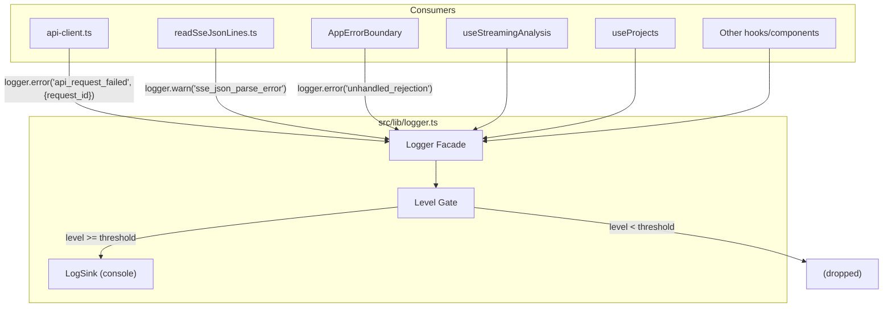
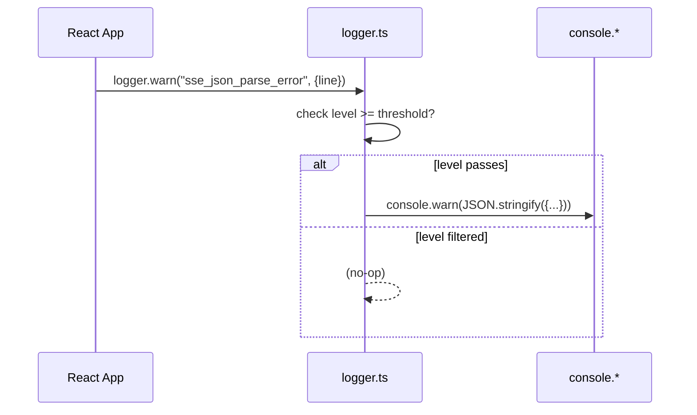

# Design: frontend-logging-standards

## Metadata

- **slug:** `frontend-logging-standards`
- **date:** 2026-04-16
- **tier:** Standard
- **related:** `observability-logging-standards` (backend)

## Todo list

- [x] `logger-facade` — Create `src/lib/logger.ts` with level gate, structured output, extensible sink
- [x] `sse-parse-warn` — `readSseJsonLines` parse failures → `logger.warn` + counter
- [x] `api-client-request-id` — Generate & inject `x-request-id` in `apiFetch`, log on error
- [x] `error-boundary-logger` — `AppErrorBoundary` migrate from `console.*` to `logger.*`
- [x] `hooks-migrate` — Migrate all `console.*` in hooks to `logger.*` (useStreamingAnalysis, useProjects, useVoiceInput, useConversationPersistence, useShareReport)
- [x] `components-migrate` — Migrate remaining `console.*` in components/pages
- [x] `agent-md-frontend` — Add frontend logging standards to `AGENT.md` §7
- [x] `tests` — Vitest unit tests for logger facade + SSE warn + api-client request-id

## Architecture



## Flows



## Contracts

### Logger API (`src/lib/logger.ts`)

```typescript
type LogLevel = "debug" | "info" | "warn" | "error";

interface LogEntry {
  timestamp: string;     // ISO 8601
  level: LogLevel;
  event: string;         // snake_case event name
  [key: string]: unknown; // structured fields
}

interface Logger {
  debug(event: string, fields?: Record<string, unknown>): void;
  info(event: string, fields?: Record<string, unknown>): void;
  warn(event: string, fields?: Record<string, unknown>): void;
  error(event: string, fields?: Record<string, unknown>): void;
  setLevel(level: LogLevel): void;
  /** Register additional sink (for future remote reporting) */
  addSink(sink: (entry: LogEntry) => void): void;
}
```

### Level defaults

| Environment | Default level |
|-------------|---------------|
| `import.meta.env.DEV` | `debug` |
| Production | `warn` |

### Event naming convention

Same as backend: `snake_case`, `<domain>_<action>`, max 60 chars.

### `x-request-id` header

`apiFetch` generates a UUID per request and sends it as `x-request-id` header. On error, the `request_id` is included in the logger fields.

## Code touch list

| File | Change | Risk |
|------|--------|------|
| `src/lib/logger.ts` | **NEW** — logger facade | Low |
| `src/lib/sse/readSseJsonLines.ts` | Parse error → logger.warn | Low |
| `src/lib/api-client.ts` | Generate + inject `x-request-id`, error logging | Medium — central API layer |
| `src/components/AppErrorBoundary.tsx` | `console.*` → `logger.*` | Low |
| `src/hooks/useStreamingAnalysis.ts` | 19 `console.*` → `logger.*` | Medium — complex hook |
| `src/hooks/useProjects.ts` | 7 `console.error` → `logger.error` | Low |
| `src/hooks/useVoiceInput.ts` | 3 `console.*` → `logger.*` | Low |
| `src/hooks/useConversationPersistence.ts` | 1 `console.warn` → `logger.warn` | Low |
| `src/hooks/useShareReport.ts` | 2 `console.error` → `logger.error` | Low |
| `src/components/workspace/DocumentWorkspace.tsx` | 2 `console.error` → `logger.error` | Low |
| `src/components/reasoning/AnalysisTurnPanel.tsx` | 1 `console.warn` → `logger.warn` | Low |
| `src/pages/NotFound.tsx` | 1 `console.error` → `logger.error` | Low |
| `src/pages/SharedReport.tsx` | 1 `console.error` → `logger.error` | Low |
| `AGENT.md` | Add §7.7 Frontend logging standards | Low |
| `src/lib/__tests__/logger.test.ts` | **NEW** — unit tests | Low |

## Testing strategy

### Unit tests (Vitest)

| Test | Validates |
|------|-----------|
| Logger level gate | `debug` entry dropped when level=`warn` |
| Logger structured output | Output matches `LogEntry` schema (timestamp, level, event) |
| Logger addSink | Custom sink receives entries |
| SSE parse warn | `readSseJsonLines` emits logger.warn on bad JSON |
| API client request-id | `apiFetch` attaches `x-request-id` header |
| API client error logging | Failed request produces logger.error with request_id |

### E2E scenarios

N/A for this delivery — no new UI flows. SSE + API changes are internal plumbing verified by unit tests.

## Edge cases & errors

| Case | Handling |
|------|----------|
| Logger called before init | Default level = `warn` in production, `debug` in dev; always safe |
| `x-request-id` header rejected by backend | Backend ignores unknown headers; no impact |
| Circular object in fields | `JSON.stringify` with replacer that catches circular refs |
| High-frequency SSE parse errors | Counter-based; logger.warn per-error, not aggregated (acceptable for MVP) |

## Implementation order

1. `logger-facade` — foundation, all others depend on it
2. `sse-parse-warn` — small, low risk
3. `api-client-request-id` — medium risk, test early
4. `error-boundary-logger` — global safety net
5. `hooks-migrate` — bulk migration
6. `components-migrate` — bulk migration
7. `agent-md-frontend` — standards doc
8. `tests` — written alongside each step, final pass

## Rationale

- **自建 vs 第三方**：用户明确要求不引入第三方。自建门面 < 60 行代码，足够满足 level gate + structured output + extensible sink。
- **console 作为 sink**：生产环境浏览器控制台是唯一可用 sink（无 Sentry）。结构化 JSON 便于未来 log shipper 采集。
- **level gate 而非删除**：开发态保留 debug/info，生产仅 warn+error。避免丢失调试能力。
- **event naming 与后端统一**：同一套 snake_case 约定，简化跨层 grep。
- **`x-request-id` 双向**：后端已支持 `x-request-id` header；前端生成后双端日志可对齐。

## UI

N/A — 本交付不涉及用户可见 UI 变更。

## Mockups

## Mockups deferred

N/A — backend/infrastructure only.
