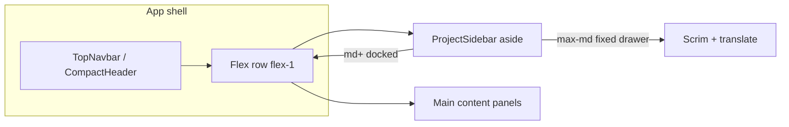
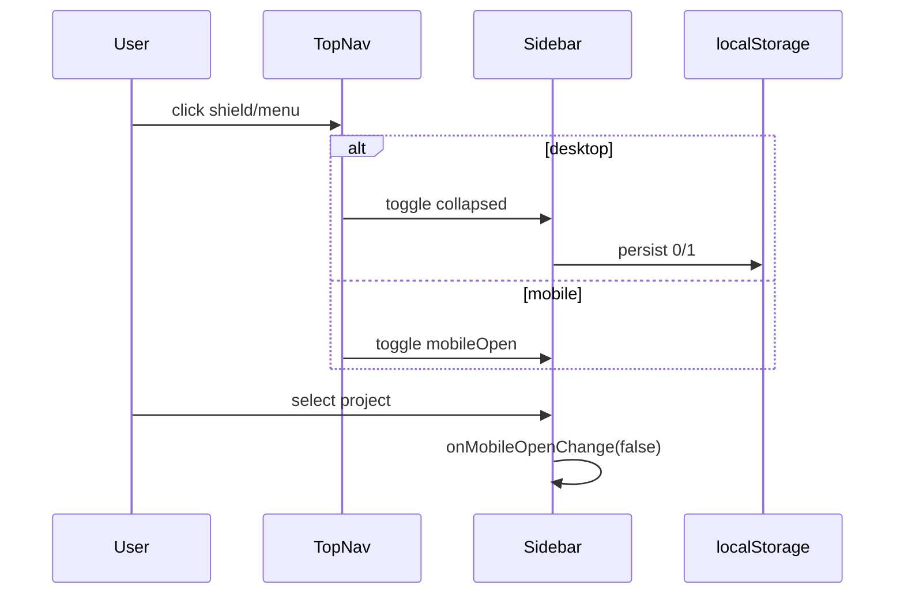

# Design — history-sidebar-persistent

## Metadata

- **Slug:** history-sidebar-persistent
- **Date:** 2026-04-20
- **Status:** verification complete (Phase 5–6: Vitest + E2E-01; MCP snapshot unauthenticated)

## Source plan (traceability)

No Cursor `*.plan.md`. This `design.md` is the implementation source of truth.

## Todo list

- [x] doc-artifacts
- [x] hook-collapsed-storage
- [x] hook-menu-behavior
- [x] refactor-project-sidebar
- [x] integrate-index-workspace-postlogin
- [x] i18n-keys
- [x] unit-tests-hook
- [x] e2e-desktop-aside

## Architecture

- **`useWorkspaceSidebarCollapsed`:** reads/writes `localStorage` key `secmanus:workspaceSidebarCollapsed`.
- **`useProjectSidebarChrome`:** combines `mobileOpen` with collapsed state; `onTopNavMenuClick` uses `matchMedia('(min-width: 768px)')` to branch.

## Flows

## Contracts

| Key | Value |
|-----|-------|
| `localStorage` | `secmanus:workspaceSidebarCollapsed` → `'1'` collapsed, `'0'` or missing expanded |

## Code touch list

| Path | Risk |
|------|------|
| `src/components/ProjectSidebar.tsx` | Layout + a11y regressions |
| `src/pages/Index.tsx` | Panel flex wrapper |
| `src/components/WorkspaceLayout.tsx` | Same shell pattern |
| `src/components/PostLoginWorkspaceStart.tsx` | Same shell pattern |
| `src/hooks/useWorkspaceSidebarCollapsed.ts` | New |
| `src/hooks/useProjectSidebarChrome.ts` | New |
| `src/i18n/locales/*.ts` | New strings |
| `e2e/tests/history-sidebar-persistent.spec.ts` | Auth dependency |

## Testing strategy

- **Unit:** `useWorkspaceSidebarCollapsed` — default, load `'1'`, persist on set/toggle.
- **Manual / E2E:** Authenticated project: desktop viewport — `complementary` aside visible; optional collapse.

### E2E scenarios

| ID | Scenario | Route / API | Key assertions |
|----|----------|-------------|----------------|
| E2E-01 | Docked sidebar on desktop | `GET /` (auth) | `aside` role complementary visible |
| E2E-02 | Project row dot + name | `GET /` | Locator for project list items |

## Edge cases & errors

- `localStorage` throws: ignore, in-memory state still updates.
- `useIsMobile` avoided for sidebar visibility; **Tailwind `md:`** + `fixed`/`relative` split prevents hydration flash for docked vs drawer.
- Live workspace mobile overlay z-index stays below sidebar (`z-30` vs `z-50`).

## Implementation order

1. Hooks + tests
2. `ProjectSidebar` refactor
3. Shell integration (three parents)
4. i18n + E2E

## Rationale

- **Delete moved to menu:** Keeps rows visually aligned with reference HTML (dot + name) while retaining capability.
- **Navbar full-width:** Smaller change than restructuring header into main column only.

## UI

- Tokens: bg `#201e1b`, border `#2e2c28`, text `#e8e5de` / 83% opacity, dot `rgba(232,229,222,0.35)`.
- Row: 40px height, 8px radius, hover `bg-[#e8e5de]/[0.04]`, active `bg-[#e8e5de]/[0.06]`.

## Design review handoff

- **target:** `.cursor/design-review-handoff/target.local.yaml` (`base_url: http://127.0.0.1:8080`)
- **priority paths:** `/`
- **mockups:** deferred (see `acceptance-ui.md`)
