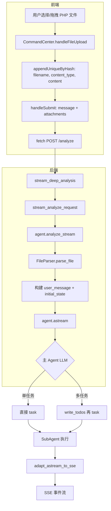

# 上传文件处理流程梳理

## 1. 整体流程概览



---

## 2. 详细步骤

### 2.1 前端上传

| 步骤 | 位置 | 说明 |
|------|------|------|
| 1 | `CommandCenter.tsx` | 用户拖拽或选择文件，`handleFileUpload` 读取内容 |
| 2 | 同上 | 文本类（含 `.php`）用 `file.text()` 读取，`content.slice(0, 50000)` |
| 3 | 同上 | `appendUniqueByHash` 去重，结构：`{ filename, content_type, content, size, hash_sha256 }` |
| 4 | `Index.tsx` → `handleSubmit` | 调用 `analyzeInput(input, true, language, attachments)` |
| 5 | `useStreamingAnalysis.ts` | `fetch(STREAM_URL, { body: JSON.stringify({ message, attachments, ... }) })` |

**请求体**：`message`（用户输入，可为空）+ `attachments`（文件数组，inline 内容）

---

### 2.2 后端接收与解析

| 步骤 | 位置 | 说明 |
|------|------|------|
| 1 | `main.py` | `AnalyzeRequest` 含 `message`, `attachments` |
| 2 | `stream_deep_analysis` | `files_payload = [a.model_dump() for a in attachments]` |
| 3 | `stream_analyze_request` | 传入 `agent.analyze_stream(text, files, ...)` |
| 4 | `DeepAgentWithIntent.analyze_stream` | 解析文件、构建上下文、启动 agent |

**文件解析**（`FileParser`）：

- PHP 在 `CODE_EXTENSIONS`（`.php`）→ `_parse_code` → 输出 ` ```php\n...\n``` `
- 单文件预算约 2000 字符，总预算 6000 字符
- 结果写入 `user_message`：`[Uploaded Files]\n### shell.php\n```php\n<?php ...\n````

**initial_state**：

- `messages`: `[HumanMessage(content=user_message)]`
- `files`: `{ "/shell.php": FileData(content) }`（inline 模式，Mode B）

---

### 2.3 主 Agent 路由与 write_todos

**MASTER_AGENT 路由表**（`MASTER_AGENT.md` 29–39 行）：

| 内容类型 | subagent_type |
|----------|---------------|
| Email, .eml, phishing | `email-security` |
| Executable, malware, **PHP/PowerShell/script** | `binary-analysis` |
| Web logs, HTTP traffic, XSS/SQLi/SSRF/RCE | `web-security` |
| SIEM alert, incident | `soc-alert` |
| CVE, vulnerability | `vuln-scan` |
| IP/domain/hash/URL reputation | `general-security` |
| Research, threat intel | `deep-research` |

**write_todos 规则**（`MASTER_AGENT.md` 19–26 行）：

- **多任务**（≥2 个 `task()`）：先 `write_todos`，再逐个 `task()`
- **单任务**：**跳过** `write_todos`，直接 `task()`

因此：

- 上传 **1 个** PHP 文件 → 单任务 → **不会** 出现 `write_todos`，也就**没有** `task_plan` 事件
- 上传 **多个** 文件（如 2 个 PHP）→ 多任务 → 会 `write_todos` → 会发出 `task_plan` 事件

---

### 2.4 PHP 路由到哪个 SubAgent？

按当前路由表：

- **PHP** 明确归在 `binary-analysis`（与 PowerShell、script 并列）
- `web-security` 对应：Web 日志、HTTP 流量、XSS/SQLi/SSRF/RCE

因此：

- 普通 PHP 脚本 → 预期走 `binary-analysis`
- 若 LLM 判断为 Web 相关（如 Web shell、RCE、XSS 等）→ 可能选 `web-security`

也就是说，**PHP 默认是 binary-analysis，只有在内容明显像 Web 攻击时才会被路由到 web-security**。

---

### 2.5 SubAgent 执行与文件访问

| 步骤 | 位置 | 说明 |
|------|------|------|
| 1 | `SubAgentMiddleware` | `task(subagent_type, description)` 被调用 |
| 2 | `_validate_and_prepare_state` | `subagent_state = {k:v for k,v in runtime.state if k not in _EXCLUDED}`
| 3 | 状态传递 | `files` **会**传给 SubAgent（不在 `_EXCLUDED_STATE_KEYS` 中） |
| 4 | SubAgent | `messages` 被覆盖为 `[HumanMessage(content=description)]` |
| 5 | SubAgent | 通过 `read_file("/shell.php")` 访问父级 `files` 中的文件 |

MASTER_AGENT 要求：在 `description` 中写明文件路径，例如 `/shell.php`，SubAgent 用 `read_file` 读取。

---

## 3. 与预期的对照

### 3.1 「上传一个 PHP 文件，会出现一个分析事件」

| 预期 | 实际 | 结论 |
|------|------|------|
| 出现分析事件 | 单文件时**不**调用 `write_todos`，无 `task_plan` | 单任务不会出现任务规划类事件 |
| | 会发出 `task_start`、`tool_call`、`tool_result`、`task_complete` 等 | 有任务执行事件 |

若「分析事件」指的是任务规划（`task_plan`），则单文件场景下**不会**出现；若指任务执行（`task_start` / `task_complete` 等），则**会**出现。

### 3.2 「LLM 识别是 web 文件，会调用 web 安全的 subagent」

| 预期 | 实际 | 结论 |
|------|------|------|
| PHP → web-security | 路由表将 PHP 归在 `binary-analysis` | 默认会走 binary-analysis |
| | 若内容明显是 Web shell / RCE，LLM 可能选 web-security | 存在一定不确定性 |

---

## 4. 建议调整（若希望 PHP 更倾向 web-security）

1. **修改路由表**（`MASTER_AGENT.md`）  
   将 PHP 从 binary-analysis 移到 web-security，或增加「PHP Web 相关」的单独规则，例如：

   ```
   | PHP (web shell, RCE, XSS payload) | `web-security` |
   | PHP (generic script, non-web)     | `binary-analysis` |
   ```

2. **单文件也展示任务规划**  
   若希望单文件也有「分析事件」展示，可调整 MASTER_AGENT：单任务也允许调用 `write_todos`（仅 1 个 todo），前端即可收到 `task_plan` 事件。

3. **在 description 中强调文件路径**  
   确保主 Agent 在调用 `task()` 时，在 `description` 中明确写出文件路径（如 `/shell.php`），以便 SubAgent 正确使用 `read_file`。

---

## 5. 关键文件索引

| 功能 | 文件 |
|------|------|
| 前端上传 | `src/components/CommandCenter.tsx` |
| 流式请求 | `src/hooks/useStreamingAnalysis.ts` |
| 后端入口 | `python-agent-service/app/main.py` |
| 分析流 | `python-agent-service/app/agents/deep_agent.py` |
| 文件解析 | `python-agent-service/app/middleware/file_parser.py` |
| 主 Agent 路由 | `python-agent-service/app/prompts/MASTER_AGENT.md` |
| SubAgent 调用 | `python-agent-service/app/_vendor/deepagents/middleware/subagents.py` |
| write_todos 事件 | `python-agent-service/app/parsers/deepagents_stream_adapter.py` |
