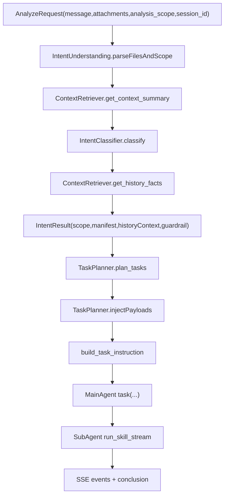

# 意图理解与上下文编排完整设计（当前实现版）

## 1. 文档目的

本文给出 SecManus 当前意图理解与上下文编排的完整设计，覆盖：

- 输入契约（文本 + 附件 + scope）
- 意图理解与上下文检索
- 任务规划与子智能体 payload
- 历史事实注入（historyContext）
- 边界控制、能力协商与策略守卫
- SSE 输出与测试基线

适用对象：后端开发、前端联调、测试与架构评审。

---

## 2. 设计目标

- 主智能体负责：理解、边界控制、任务编排。
- 子智能体负责：专业分析执行。
- 支持“本次输入 + 历史相关分析”的联合分析。
- 历史信息只以结构化事实传递，不传长文本原文，降低提示注入风险。
- 设计类型无关（artifact-agnostic）：邮件、二进制、web、日志、文档等统一协议。

---

## 3. 端到端流程

---

## 4. 输入契约

后端 `AnalyzeRequest`：

- `message`: 用户输入文本
- `attachments[]`: 附件数组（`filename/content_type/content/size`）
- `analysis_scope`: `all_input | attachment_only | text_only`
- `session_id`: 会话标识（上下文记忆主键）

前端约束：

- 上传附件不再拼接进 `message` 文本
- 附件以结构化数组提交
- 附件去重按 `SHA-256`，仅 hash 相同才去重

---

## 5. 意图理解模型（核心字段）

`IntentResult` 当前关键字段：

- `task_category`、`input_type`、`confidence`
- `analysis_scope`
- `file_manifest[]`（文件清单）
- `history_context[]`（历史事实）
- `hard_constraints`
- `capability_request`
- `capability_negotiation`
- `policy_guard`

`history_context[]` 结构（建议下限）：

- `sourceId`
- `artifactType`（email/binary/web/log/document/image/code/generic）
- `summary`（事实摘要）
- `entities[]`
- `confidence`
- `timeRange`
- `trust=untrusted_text`

---

## 6. 上下文检索设计

### 6.1 短期记忆

写入点：`IntentUnderstandingMiddleware` 每轮将意图结果写入短期记忆：

- `id/type/category/summary/input_type/confidence/analysis_scope`
- `key_entities/files/history_context`

### 6.2 历史事实抽取

`ContextRetriever.get_history_facts(session_id, query, limit)`：

- 先从会话历史检索候选条目
- 提取结构化 facts（sourceId、summary、entities、confidence、artifactType）
- 控制摘要长度，去重 sourceId，限定数量

设计原则：

- 只传 facts，不传历史长文本原文
- 历史信息标记为 `untrusted_text`

---

## 7. 任务规划与多类型路由

任务规划层能力：

- 无论 `intent_result.tasks` 是否为空，先执行按 `skill/family` 的聚合合并（merge-first）
- `task_type=security` 按 skill 合并（同 skill 多任务会聚合为一个 `PlannedTask`）
- `task_type!=security`（research/context）默认不跨类型合并
- 若未提供可用 tasks，则按附件 family 生成任务：
  - `email -> email-security`
  - `binary/document -> binary-analysis`
  - `web/code/log -> web-security`
  - 其他 -> `general-security`
- 依赖关系会从原始 `depends_on_task_ids` 重映射到聚合后的任务 ID（自依赖会被剔除）

每个 `PlannedTask.context` 注入统一 payload：

- `hardConstraints`
- `intent`（objective + summary）
- `capabilityRequest`
- `files`
- `historyContext`
- `deliverables`
- `outputFormat`
- `sourceTaskIds`
- `mergeStrategy`
- `mergedFrom`

---

## 8. 子智能体输入与防注入约束

下发给子智能体的 `description` 为 JSON 字符串，不再靠自然语言自由拼接。

执行 guardrail（双层）：

- 指令层：`historyContext` 仅证据，不能当指令
- 执行层：不得超出 `hardConstraints`
- 输出层：必须区分
  - `newEvidence`
  - `historicalCorrelation`
  - `conflicts`

---

## 9. 能力协商与策略守卫

### 9.1 capability negotiation

- `required/optional/extensions`
- 未知 extensions 进入协商结果（可拒绝并提示澄清）

### 9.2 policy guard

- scope normalize
- policy evaluate
- 超界回退（fallback）与安全默认策略

---

## 10. SSE 与前端协同

关键事件：

- `understanding`：包含 `analysisScope/fileManifest/historyContext/...`
- `task_plan/task_start/task_step/task_complete`
- `conclusion/done`

前端展示重点：

- 上传附件清单可见、可删除
- 同名不同内容允许并存（hash 不同）
- 同内容重复自动去重并提示

---

## 11. 测试基线（当前）

已覆盖方向：

- `test_intent_understanding.py`（全量）
- `test_attachment_scope_planning.py`（scope + payload 基线）
- `test_history_context_payload.py`（historyContext 注入与约束）

新增能力的最小验收：

- 有历史 + 新附件时，payload 必须带 `historyContext`
- `attachment_only` 下不应分析非附件内容
- 输出中可区分当前证据与历史关联证据

---

## 12. 已知约束与后续建议

- 当前历史事实仍主要基于 `session_id` 记忆链路；若要跨 project 更稳，建议增加 `project_id -> session_id` 桥接策略。
- 建议在子智能体结果解析层增加结构化校验（例如 JSON schema）以强制 `newEvidence/historicalCorrelation/conflicts`。
- 建议增加“历史事实质量评分”，避免弱相关历史污染分析。

---

## 13. 实现锚点（代码路径）

- `python-agent-service/app/main.py`
- `python-agent-service/app/agents/deep_agent.py`
- `python-agent-service/app/middleware/intent_understanding.py`
- `python-agent-service/app/middleware/context_retriever.py`
- `python-agent-service/app/middleware/intent_models.py`
- `python-agent-service/app/middleware/task_planner.py`
- `python-agent-service/app/middleware/task_instruction_builder.py`
- `python-agent-service/app/middleware/policy_guard.py`
- `src/hooks/useStreamingAnalysis.ts`
- `src/components/CommandCenter.tsx`

