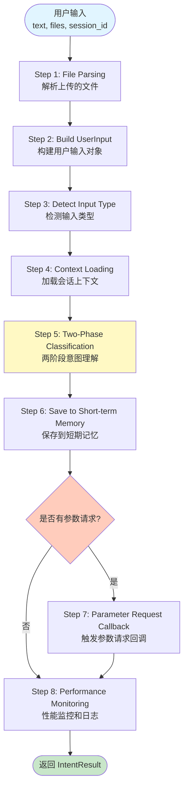
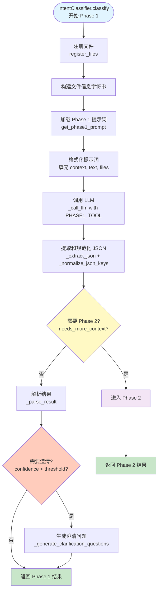
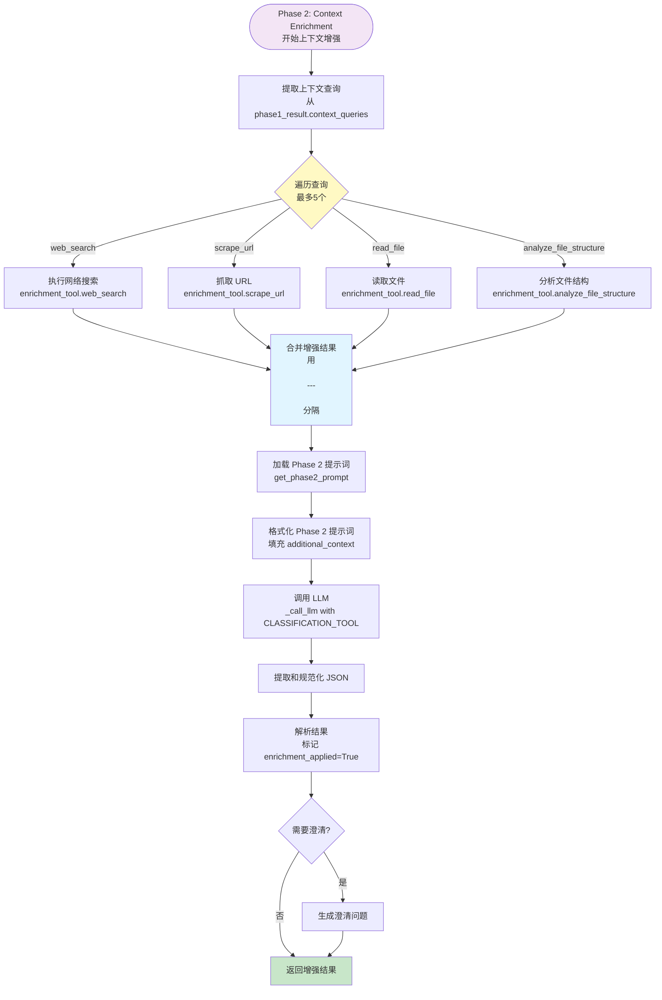
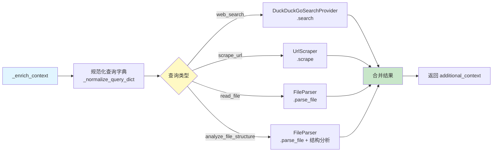
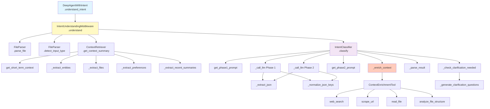
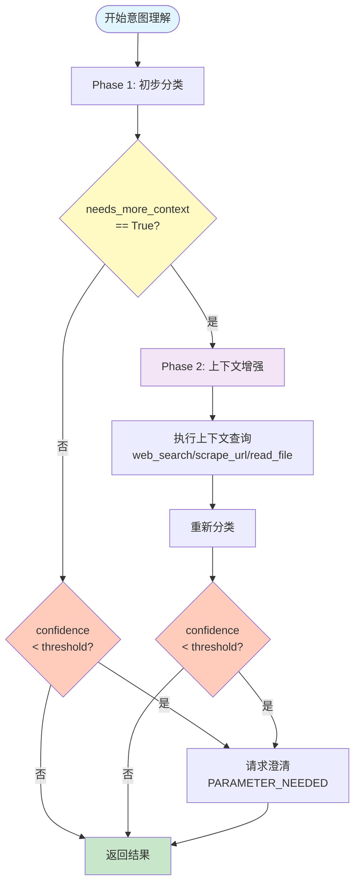
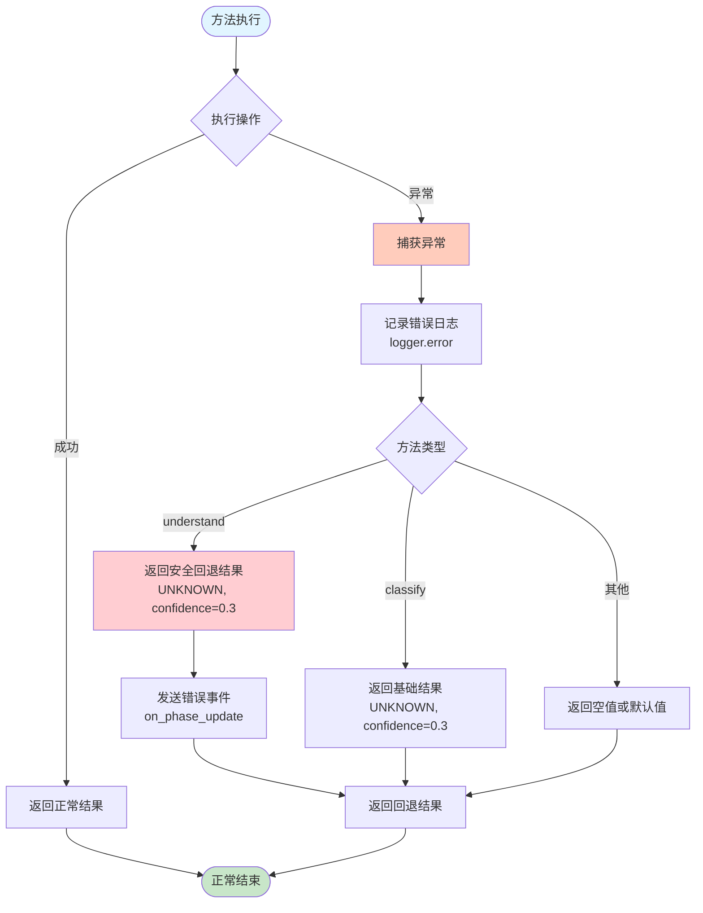
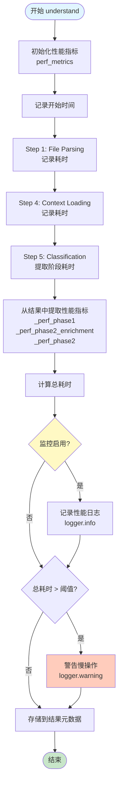

# Intent Understanding - Mermaid 流程图

本文档包含使用 Mermaid 语法绘制的流程图，可在支持 Mermaid 的 Markdown 查看器中渲染。

## 主流程图

## Phase 1 详细流程

## Phase 2 详细流程

## 上下文增强工具调用流程

## 函数调用关系图

## 数据流图

```mermaid
flowchart LR
    UserInput[用户输入<br/>text + files] --> FileParse[文件解析]
    FileParse --> ParsedFiles[FileInfo<br/>parsed_content]
    
    UserInput --> ContextLoad[上下文加载]
    ContextLoad --> ContextSummary[上下文摘要<br/>entities, files, preferences]
    
    ParsedFiles --> Combined[合并内容<br/>get_combined_content]
    Combined --> DetectType[检测输入类型]
    
    ContextSummary --> Phase1Prompt[Phase 1 提示词]
    UserInput --> Phase1Prompt
    Phase1Prompt --> LLM1[LLM 调用]
    LLM1 --> Phase1Result[Phase 1 结果<br/>needs_more_context?]
    
    Phase1Result -->|是| EnrichQueries[上下文查询<br/>context_queries]
    EnrichQueries --> EnrichContext[执行增强查询]
    EnrichContext --> AdditionalContext[增强上下文<br/>additional_context]
    
    AdditionalContext --> Phase2Prompt[Phase 2 提示词]
    UserInput --> Phase2Prompt
    ContextSummary --> Phase2Prompt
    Phase2Prompt --> LLM2[LLM 调用]
    LLM2 --> Phase2Result[Phase 2 结果]
    
    Phase1Result -->|否| FinalResult[最终结果]
    Phase2Result --> FinalResult
    
    FinalResult --> IntentResult[IntentResult<br/>task_category, confidence, summary]
    
    style UserInput fill:#e1f5ff
    style Phase1Result fill:#fff9c4
    style EnrichContext fill:#ffccbc
    style FinalResult fill:#c8e6c9
```

## 决策流程图

## 异常处理流程

## 性能监控流程

---

## 使用说明

这些 Mermaid 图表可以在以下环境中查看：
- GitHub/GitLab（原生支持）
- VS Code（安装 Mermaid Preview 扩展）
- 在线编辑器：https://mermaid.live/
- 文档工具：MkDocs、Docusaurus 等

## 图表说明

1. **主流程图**：展示从用户输入到返回结果的完整流程
2. **Phase 1 详细流程**：展示第一阶段分类的详细步骤
3. **Phase 2 详细流程**：展示上下文增强和第二阶段分类
4. **上下文增强工具调用流程**：展示各种增强工具的调用方式
5. **函数调用关系图**：展示主要函数之间的调用关系
6. **数据流图**：展示数据在各个组件之间的流动
7. **决策流程图**：展示关键决策点的判断逻辑
8. **异常处理流程**：展示异常处理策略
9. **性能监控流程**：展示性能监控的实现方式
