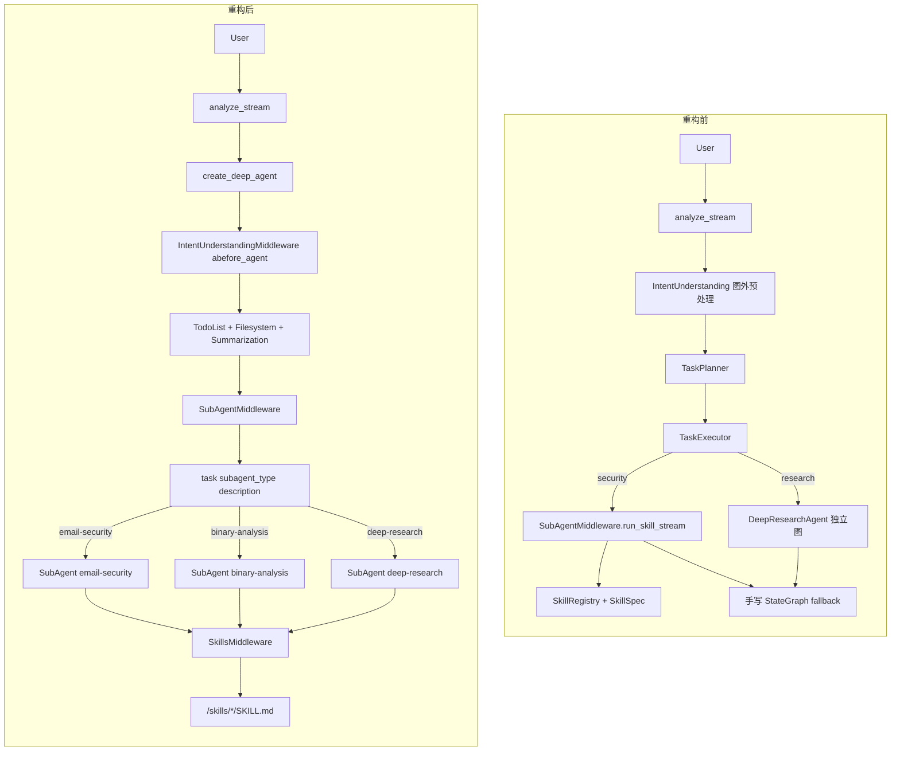
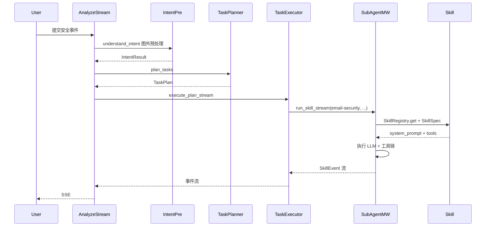
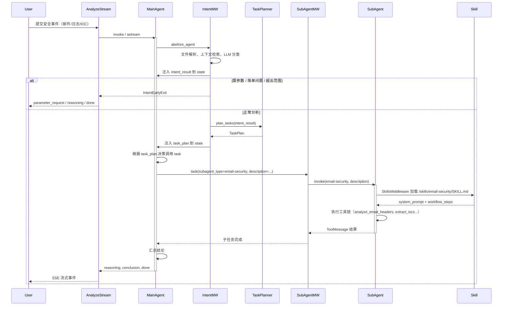

# 官方 DeepAgent 源码迁移改造方案

## 一、现状与目标

**当前实现**：手写 LangGraph `StateGraph` + 自研中间件栈（TodoList、Filesystem、SubAgent、Summarization、IntentUnderstanding）+ SkillRegistry 技能模型。

**目标**：使用官方 [deepagents](https://github.com/langchain-ai/deepagents) 的 `create_deep_agent()` 作为底层 Agent 引擎，保留并优雅集成意图理解、任务规划等业务逻辑。

---

## 二、架构对比与改造要点

### 2.1 核心架构差异

**Arch-Comparison (Mermaid graph TD)**




**Sequence Diagram: 安全事件处置流**

*重构前（当前）：*



*重构后（迁移后）：*




**Skill Dependency Matrix**


| SubAgent         | 依赖 Skill                    | 工具集                                                                     | 说明                      |
| ---------------- | --------------------------- | ----------------------------------------------------------------------- | ----------------------- |
| email-security   | `/skills/email-security/`   | analyze_email_headers, extract_iocs, decode_base64, lookup_threat_intel | 邮件头解析、钓鱼检测、IOC 提取       |
| binary-analysis  | `/skills/binary-analysis/`  | hash_file, entropy, extract_iocs                                        | 哈希计算、熵分析、恶意代码指标         |
| web-security     | `/skills/web-security/`     | detect_xss, detect_sqli, extract_iocs                                   | XSS/SQLi 检测、Webshell 分析 |
| soc-alert        | `/skills/soc-alert/`        | parse_siem_alert, extract_iocs, lookup_threat_intel                     | SIEM 告警解析、威胁情报          |
| vuln-scan        | `/skills/vuln-scan/`        | parse_cve, extract_iocs                                                 | CVE 解析、漏洞评估             |
| general-security | `/skills/general-security/` | extract_iocs, decode_base64, decode_url                                 | 通用 IOC 提取、编解码           |
| deep-research    | `/skills/deep-research/`    | web_search, scrape_url, summarize                                       | 深度研究、多源信息综合             |


*注：各 SubAgent 与 Skill 为 1:1 映射，通过 `skills=["/skills/{name}/"]` 注入。*


| 维度       | 当前                                                 | 官方                                 | 改造策略                                           |
| -------- | -------------------------------------------------- | ---------------------------------- | ---------------------------------------------- |
| Agent 构建 | 手写 StateGraph                                      | `create_agent()` + middleware      | 完全替换为官方 API                                    |
| 子 Agent  | `task(skill_name, description)` + `parallel_tasks` | `task(description, subagent_type)` | **直接使用官方 SubAgent + skills**                   |
| 技能/Skill | SkillSpec + SkillRegistry + 自研加载                   | SubAgent.skills + SkillsMiddleware | **沿用官方 SKILL.md 标准，无需映射**                      |
| 意图理解     | 自研预处理管线                                            | 无                                  | **改为 AgentMiddleware**，作为主 Agent 首个 middleware |
| 任务规划     | TaskPlanner + TaskExecutor                         | 无                                  | **保留，改为调用官方 task 工具**                          |
| Backend  | 自研 State/Store/Composite                           | deepagents.backends                | **直接替换**为官方实现 + Supabase/PostgreSQL 存储实现       |
| 流式事件     | 自定义 SSE 协议                                         | LangGraph astream                  | **适配层映射**                                      |


---

## 三、改造任务清单

### Phase 1：依赖与基础层（约 1 周）

**1.1 依赖升级**

- 升级 [python-agent-service/requirements.txt](python-agent-service/requirements.txt)：
  - `langchain>=1.2.10,<2.0.0`
  - `langchain-core>=1.2.10`
  - `langchain-anthropic>=1.3.3`
  - `langchain-google-genai>=4.2.0`
- 新增：`deepagents>=0.4.3`（或通过 git submodule 引入源码以支持定制）
- 注意：`langchain.agents.create_agent` 需 LangChain 1.2+，当前 0.3 不包含此 API

**1.2 Backend：替换为官方协议实现**

官方 [BackendProtocol](https://github.com/langchain-ai/deepagents/blob/main/libs/deepagents/deepagents/backends/protocol.py) 与当前实现的差异：


| 项目          | 当前实现                          | 官方协议                                                  |
| ----------- | ----------------------------- | ----------------------------------------------------- |
| FileInfo    | `name`, `is_file`             | `path`, `is_dir`                                      |
| WriteResult | `success`, `path`             | `error`, `path`, `files_update`                       |
| GrepMatch   | `line_number`, `line_content` | `line`, `text`                                        |
| 额外能力        | 无                             | `upload_files`, `download_files`（SkillsMiddleware 依赖） |


**改造策略：直接替换（非适配）**

- **替换**：用符合官方 `BackendProtocol` 的实现替换当前 backend，与官方架构对齐，避免长期维护「我们的格式 + 转换层」两套逻辑
- **具体做法**：
  1. 使用官方 `StateBackend`（会话临时状态）、`FilesystemBackend`（skills 目录）
  2. 使用官方 `CompositeBackend` 做路径路由（若支持），或按官方模式组合多个 backend
  3. 对持久化存储（memories、parameters）：**实现**符合官方 `BackendProtocol` 的存储类，支持两种模式：
    - **Supabase 模式**（`DATABASE_MODE=supabase`）：对接 Supabase 客户端
    - **PostgreSQL 模式**（`DATABASE_MODE=local`）：对接本地 PostgreSQL（asyncpg），沿用现有 `PostgresStore` 的表结构或迁移至官方 Store 协议
- **Skills 路径**：通过 `FilesystemBackend(root_dir=skills_dir)` 或 `invoke(files={...})` 暴露 `skills/` 目录

---

### Phase 2：Agent 核心替换（约 2 周）

**2.1 用 create_deep_agent 替换手写图**

- 删除 [deep_agent.py](python-agent-service/app/agents/deep_agent.py) 中的 `_build_agent()` 手写 StateGraph 逻辑
- 改为调用：

```python
from deepagents import create_deep_agent

agent = create_deep_agent(
    model=get_model(),
    tools=create_common_tools(),
    system_prompt=MASTER_SYSTEM_PROMPT,
    backend=backend_factory,  # BackendFactory 或适配后的实例
    subagents=security_subagents,  # 见 2.2
    checkpointer=self.checkpointer,
    store=store,  # 若使用 StoreBackend
)
```

**2.2 直接使用官方 SubAgent + skills 机制（无需映射层）**

官方 SubAgent 原生支持 `skills` 字段，与 [SkillsMiddleware](https://github.com/langchain-ai/deepagents/blob/main/libs/deepagents/deepagents/middleware/skills.py) 配合，遵循 [Agent Skills specification](https://agentskills.io/specification)：

```python
{
    "name": "email-security",
    "description": "Analyze email headers, detect phishing...",
    "system_prompt": "...",
    "model": model,
    "tools": [email_tools],
    "skills": ["/skills/email-security/"],  # 官方原生支持，直接传路径
}
```

改造要点：

- **沿用现有 SKILL.md**：当前 `skills/email-security/SKILL.md` 等已符合官方格式（name、description、YAML frontmatter），无需改动
- **SubAgent 直接定义**：在代码或配置中按官方结构定义各安全子 Agent，`skills` 指向 backend 中的路径（如 `/skills/email-security/`）
- **Backend 暴露 skills**：通过 `invoke(files={...})` 或 `FilesystemBackend` 将 `skills/` 目录提供给 SkillsMiddleware
- **general-purpose**：由官方默认提供，可保留
- **parallel_tasks**：官方无此工具，需在 system prompt 中引导主 Agent「一次消息中发起多个 task 调用」

**2.3 DeepResearchAgent 改为 SubAgent（与安全技能统一）**

- 当前 `DeepResearchAgent` 为独立 LangGraph 图，由 TaskExecutor 单独调用，架构不一致
- **改造**：将 DeepResearchAgent 定义为标准 SubAgent，与其他安全技能（email-security、binary-analysis 等）同等对待
- **实现**：在 subagents 列表中新增 `deep-research` SubAgent：
  - `name`: "deep-research"
  - `description`: 深度研究能力描述
  - `system_prompt`: 沿用 `skills/deep-research/SKILL.md` 或现有 prompt
  - `tools`: `create_research_tools()`（web_search、scrape_url 等）
  - `skills`: `["/skills/deep-research/"]`
- **调用**：主 Agent 或 TaskExecutor 通过 `task(subagent_type="deep-research", description="...")` 调用，不再单独维护独立图

---

### Phase 3：意图理解与任务规划（约 1.5 周）

**3.1 意图理解：作为主 Agent 的 AgentMiddleware（与官方架构统一）**

意图理解作为**主智能体的核心能力**，通过官方 `AgentMiddleware` 机制集成，而非独立预处理管线：

```
用户输入 → create_deep_agent 调用
         → IntentUnderstandingMiddleware.abefore_agent() 作为首个 middleware 运行
         → 执行意图理解（文件解析、上下文检索、LLM 分类）
         → 将 IntentResult 注入 state
         → 若需提前退出（参数请求/简单问题/超出范围）：抛出 IntentEarlyExit，调用方捕获并 yield 对应事件
         → 否则：Agent 继续执行，后续 middleware 与工具可见 intent_result
```

**改造要点**：

- **实现官方 AgentMiddleware**：将现有 `IntentUnderstandingMiddleware` 改造为继承 `langchain.agents.middleware.types.AgentMiddleware`
- **实现 `abefore_agent**`：在首条消息到达时运行意图理解逻辑，将 `intent_result` 写入 state
- **提前退出**：当 `parameter_requests`、`is_simple_question`、`out_of_scope` 时，抛出 `IntentEarlyExit` 异常，由 `analyze_stream` 捕获并 yield `parameter_request`、`reasoning`、`done` 等事件
- **注入 create_deep_agent**：将 `IntentUnderstandingMiddleware` 作为首个 middleware 传入 `create_deep_agent(middleware=[IntentUnderstandingMiddleware(...), ...])`

**保留模块**（逻辑复用，接口适配）：

- [intent_classifier.py](python-agent-service/app/middleware/intent_classifier.py)、[context_retriever.py](python-agent-service/app/middleware/context_retriever.py)、[file_parser.py](python-agent-service/app/middleware/file_parser.py)、[intent_models.py](python-agent-service/app/middleware/intent_models.py)
- [intent_understanding.py](python-agent-service/app/middleware/intent_understanding.py)：改造为 AgentMiddleware 子类，内部调用上述模块

**3.2 任务规划：保留 TaskPlanner，改造 TaskExecutor**

- **TaskPlanner**：保留，继续根据 `IntentResult` 生成 `TaskPlan`（含 security 与 research 任务）
- **TaskExecutor**：改造为驱动主 Agent 调用 `task` 工具，**不再区分 security_agent / research_agent**，统一通过 `task(subagent_type, description)` 调用
- **PlannedTask.task_type**：`SECURITY` 对应 `skill_name`（如 email-security），`RESEARCH` 对应 `subagent_type="deep-research"`，均映射为同一 task 工具

两种实现路径：


| 策略                 | 描述                                                                                | 复杂度 |
| ------------------ | --------------------------------------------------------------------------------- | --- |
| **A. 通过 Agent 调用** | TaskExecutor 将 TaskPlan 作为指令传给主 Agent，由主 Agent 按计划调用 task（security 与 research 统一） | 中   |
| **B. 直接调用子 Agent** | TaskExecutor 获取 subagent runnable，按计划直接 `ainvoke`（需访问内部结构）                        | 低   |


**推荐策略 A**：保持与官方架构一致；DeepResearchAgent 作为 SubAgent 后，TaskExecutor 不再需要 `research_agent` 参数。

---

### Phase 4：流式事件适配层（约 1 周）

**4.1 事件映射**

官方 `agent.astream()` 输出格式：`{node_name: node_output}`，如 `{"agent": {...}, "tools": {...}}`。

需映射为当前前端协议：


| 官方输出                             | 当前事件类型        |
| -------------------------------- | ------------- |
| agent 节点 AIMessage（无 tool_calls） | `reasoning`   |
| agent 节点 AIMessage（含 tool_calls） | `tool_call`   |
| tools 节点 ToolMessage             | `tool_result` |
| 图结束                              | `done`        |


**4.2 实现位置**

- 新建 `app/parsers/deepagents_stream_adapter.py`
- 函数 `adapt_astream_to_sse(agent, initial_state, config)`：包装 `agent.astream()`，yield 符合 `ThinkingEvent` 结构的事件
- 保持 [parsers/events.py](python-agent-service/app/parsers/events.py) 的 `mark_event_internal` 等逻辑不变

**4.3 意图理解相关事件**

- `understanding`、`parameter_request`、`step`（intent-phase1/2）等：由 `IntentUnderstandingMiddleware` 在 `abefore_agent` 中产生
- 当 middleware 抛出 `IntentEarlyExit` 时，`analyze_stream` 捕获并 yield 对应事件（parameter_request、reasoning、done 等）
- 正常流程下，意图结果在 state 中，流式适配层可从中解析并 yield `understanding` 事件

---

### Phase 5：Checkpointer、Store 与配置（约 0.5 周）

- **Checkpointer**：官方 `create_deep_agent` 支持 `checkpointer` 参数，继续使用 `PostgresSaver` 或 `MemorySaver`
- **Store**：若使用 `StoreBackend`，需传入 `store`；当前 `InMemoryStore` 可先保留，后续再对接 Supabase
- **配置**：保留 `AGENT_MODE`、`DATABASE_MODE` 等；灰度回退已取消，不新增 USE_OFFICIAL_DEEPAGENT

---

## 四、业务逻辑保留策略总结


| 业务模块                   | 保留方式                                                                |
| ---------------------- | ------------------------------------------------------------------- |
| 意图理解（两阶段、文件解析、上下文检索）   | AgentMiddleware.abefore_agent，作为主 Agent 首个 middleware 执行            |
| 参数请求 / 简单问题 / 超出范围     | 意图 middleware 抛出 IntentEarlyExit，调用方捕获后 yield 对应事件                  |
| 任务规划（TaskPlanner）      | 保留，输出 TaskPlan                                                      |
| 任务执行（TaskExecutor）     | 改造为驱动主 Agent 按计划调用 task；不再区分 security/research，统一走 task 工具          |
| 安全技能（email-security 等） | 直接使用官方 SubAgent + skills，沿用现有 SKILL.md                              |
| DeepResearchAgent      | **改为 SubAgent**，与安全技能同等对待，通过 task(subagent_type="deep-research") 调用 |
| 流式 SSE 协议              | 适配层映射，前端无需改动                                                        |
| 多语言、LABELS、EVENTS      | 保持不变                                                                |


---

## 五、文件变更清单


| 操作    | 文件/模块                                                                                                       |
| ----- | ----------------------------------------------------------------------------------------------------------- |
| 新增    | `app/backends/database_backend.py`（符合官方 BackendProtocol，支持 Supabase 与 PostgreSQL 双模式）                       |
| 新增    | `app/parsers/deepagents_stream_adapter.py`                                                                  |
| 重构    | `app/agents/deep_agent.py`（移除手写图，接入 create_deep_agent）                                                      |
| 改造    | `app/middleware/task_planner.py`（TaskExecutor 调用方式）                                                         |
| 替换    | `app/backends/`：用官方 backends + database_backend 替换现有实现                                                      |
| 删除/废弃 | `app/middleware/subagents.py`（由官方 SubAgentMiddleware 替代）                                                    |
| 改造    | `app/agents/research_agent.py`：DeepResearchAgent 改为 SubAgent 定义（导出 create_deep_research_subagent 等），移除独立图逻辑 |
| 改造    | `app/middleware/intent_understanding.py`：实现官方 AgentMiddleware，在 abefore_agent 中执行意图理解                       |
| 保留    | `skills/` 目录及 SKILL.md 文件（官方格式兼容）、`app/tools/`                                                              |
| 简化    | `app/prompts/skills/`：SkillRegistry 可简化为轻量配置（如 input_type→subagent 路由），技能加载由官方 SkillsMiddleware 负责          |
| 更新    | `requirements.txt`、`project_context.md`                                                                     |


---

## 六、风险与缓解


| 风险                                     | 缓解措施                                                         |
| -------------------------------------- | ------------------------------------------------------------ |
| 依赖升级导致 API 不兼容                         | 在独立分支先完成依赖升级与基础用例验证                                          |
| 官方 Backend 与 Supabase/PostgreSQL 不直接兼容 | 实现 database_backend，按 DATABASE_MODE 切换 Supabase 或 PostgreSQL |
| parallel_tasks 能力减弱                    | 在 prompt 中明确引导「一次消息中发起多个 task 调用」                            |
| 官方更新导致 breaking changes                | 锁定 deepagents 版本，定期评估升级                                      |


---

## 七、推荐实施顺序

1. **Phase 1**：依赖升级 + Backend 替换（官方实现 + database_backend，可独立验证）
2. **Phase 2**：最小可行迁移（仅 create_deep_agent + 基础 subagents，无意图理解）
3. **Phase 4**：流式适配层，确保前端协议不变
4. **Phase 3**：接入意图理解与任务规划
5. **Phase 5**：Checkpointer、Store、配置收尾

预计总工作量：**5–6 周**（单人全职）。