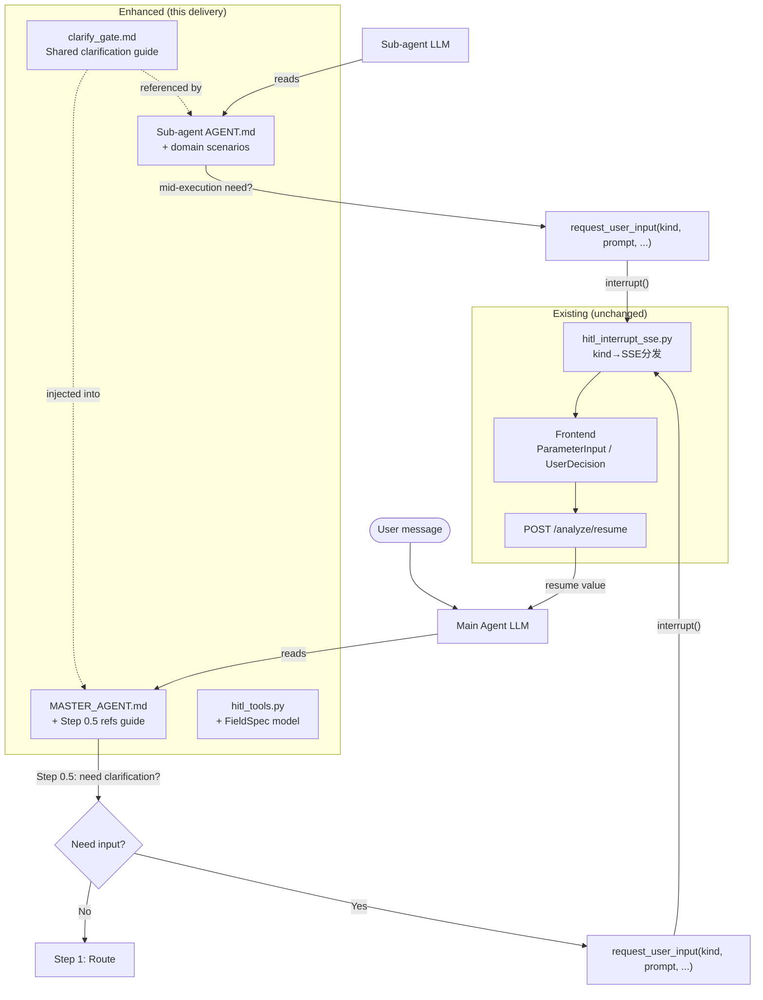
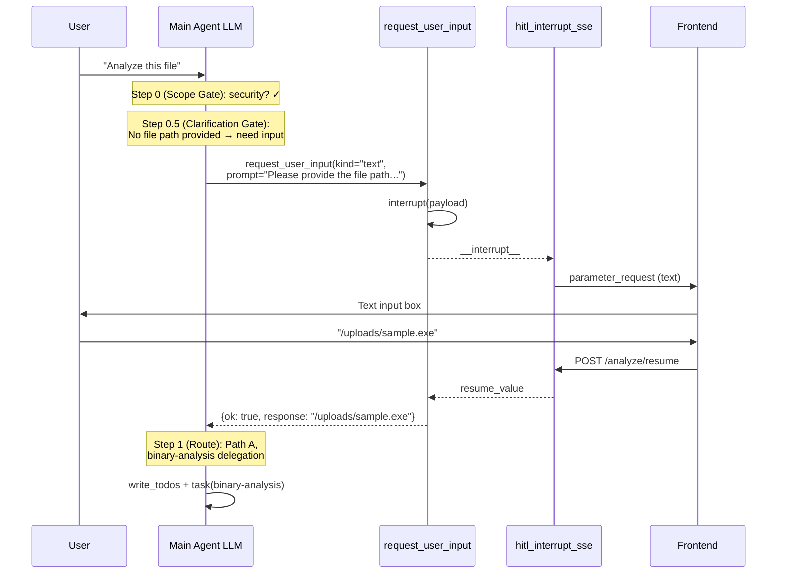
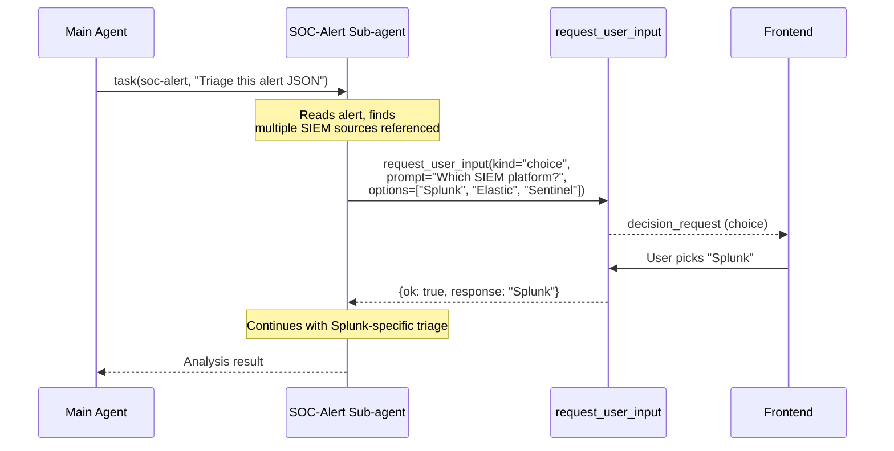
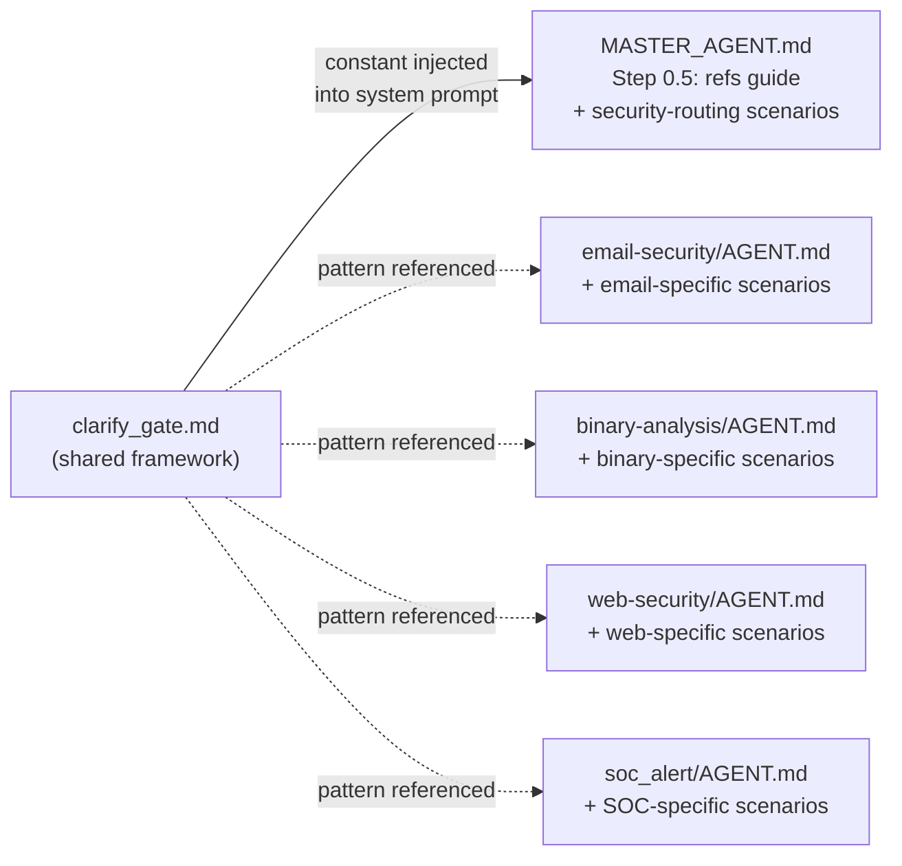

# Design: HITL Clarify Gate

## Metadata

- **Slug**: `hitl-clarify-gate`
- **Proposal**: [proposal.md](./proposal.md)
- **Scope**: Backend prompt + schema only; no graph/SSE/frontend changes

## Todo list

- [x] **schema-fieldspec** — Add `FieldSpec` Pydantic model to `hitl_tools.py`; migrate `fields` from `list[dict]` to `list[FieldSpec]`
- [x] **prompt-clarify-guide** — Create dedicated clarification guidance prompt (`app/prompts/clarify_gate.md`) with scenario analysis framework, kind selection logic, question formulation rules, and anti-patterns
- [x] **prompt-step05** — Write Step 0.5 (Clarification Gate) section in `MASTER_AGENT.md` that references the shared guide + adds main-agent-specific scenarios
- [x] **prompt-subagents** — Enhance each sub-agent `AGENT.md` (email-security, binary-analysis, web-security, soc-alert) with domain-specific clarification scenarios that build on the shared guide
- [x] **test-schema** — Unit tests for `FieldSpec` validation and `RequestUserInputArgs` with all three kinds
- [x] **test-prompt-scenarios** — Test that the prompt+schema produce correct interrupt payloads for representative scenarios (text/choice/form)
- [x] **doc-update** — Update `docs/HUMAN_IN_LOOP.md` §5 with clarification guidance architecture

## Architecture

The design adds **no new components**. It enhances two existing layers:



### Why prompt-driven, not a graph node

| Dimension | Graph node (like Deep Research) | Prompt-driven (this design) |
|-----------|-------------------------------|---------------------------|
| LLM overhead | 1 extra call per message even when unneeded | Zero overhead when no clarification needed |
| Flexibility | Fixed position in graph; one-shot | Model can ask at entry OR mid-execution |
| Reliability | Program-guaranteed | Prompt-guided; schema enforces structure when tool is called |
| Fit for main agent | Poor — diverse tasks, not always needs gate | Good — lightweight conditional |
| Fit for Deep Research | Good — focused research scope | N/A (keeps existing node) |

**Rationale**: The main agent handles extremely diverse requests (IOC lookups, file analysis, research delegation, direct answers). A mandatory clarification node would add latency to the ~70% of requests that are unambiguous. Prompt-driven Step 0.5 lets the model skip it naturally for clear requests while catching ambiguous ones.

## Flows

### Main Agent — Clarification Gate Flow



### Sub-agent — Mid-execution Clarification



## Contracts

### `FieldSpec` model (new)

```python
class FieldSpec(BaseModel):
    name: str = Field(description="Identifier (e.g. 'api_url', 'username')")
    label: str = Field(description="Human-readable label shown to user")
    param_type: str = Field(
        default="text",
        description="text | password | url | number | email"
    )
    required: bool = Field(default=True)
    placeholder: str | None = Field(default=None)
```

### `RequestUserInputArgs` changes

```python
class RequestUserInputArgs(BaseModel):
    kind: Literal["choice", "form", "text"] = Field(
        description=(
            "text: open-ended question. "
            "choice: pick one from options. "
            "form: structured fields (credentials, config)."
        )
    )
    prompt: str = Field(description="User-facing question or instructions")
    options: list[str] | None = Field(
        default=None,
        description="Required for kind=choice: option labels",
    )
    fields: list[FieldSpec] | None = Field(   # Changed: dict → FieldSpec
        default=None,
        description="Required for kind=form: structured input fields",
    )
    request_id: str | None = Field(
        default=None,
        description="Optional stable id for UI correlation; auto-generated if omitted",
    )
```

### Interrupt payload (unchanged contract)

The `_request_user_input_impl` function already constructs the correct payload for `hitl_interrupt_sse.py`. After the `FieldSpec` change, `fields` is serialized via `.model_dump()` instead of passing raw dicts — the wire format stays identical:

```json
{
  "interruptKind": "user_input_v1",
  "requestId": "...",
  "kind": "form",
  "prompt": "Please provide API access information:",
  "fields": [
    {"name": "api_url", "label": "API URL", "paramType": "url", "required": true},
    {"name": "api_key", "label": "API Key", "paramType": "password", "required": true}
  ]
}
```

**Note**: `FieldSpec` uses `param_type` (snake_case, Python convention); the serialized payload for `hitl_interrupt_sse.py` expects `paramType` (camelCase). The `_request_user_input_impl` must map this via `model_dump(by_alias=True)` or explicit key renaming. See implementation pseudocode below.

### SSE events (unchanged)

| `kind` | SSE event type | SSE key fields |
|--------|---------------|----------------|
| `text` | `parameter_request` | `userInputKind: "text"`, auto-generated `reply` field |
| `choice` | `decision_request` | `userInputKind: "choice"`, `decision.options` |
| `form` | `parameter_request` | `userInputKind: "form"`, `parameterRequests` from `fields` |

## Pseudocode

### `_request_user_input_impl` — FieldSpec serialization

```python
def _request_user_input_impl(kind, prompt, options=None, fields=None, request_id=None):
    rid = (request_id or "").strip() or str(uuid.uuid4())
    payload = {
        "interruptKind": "user_input_v1",
        "requestId": rid,
        "kind": kind,
        "prompt": prompt,
        "options": options,
    }
    # Serialize FieldSpec to camelCase dict for hitl_interrupt_sse compatibility
    if fields:
        payload["fields"] = [
            {
                "name": f.name,
                "label": f.label,
                "paramType": f.param_type,  # snake → camel
                "required": f.required,
                "placeholder": f.placeholder,
            }
            for f in fields
        ]
    else:
        payload["fields"] = None

    response = interrupt(payload)
    return {"ok": True, "requestId": rid, "response": response}
```

## Dedicated Clarification Guidance Prompt

### Why a dedicated prompt (parallel to Deep Research `clarify_with_user_instructions.md`)

Deep Research has a 46-line dedicated prompt file that teaches the model:
1. **When** to ask (vague scope, acronyms, first interaction)
2. **When not** to ask (already clarified, info already provided)
3. **How** to formulate questions (concise, structured, markdown)
4. **Output format** (JSON with `need_clarification` / `question` / `verification`)

Our main agent and sub-agents currently have ~3 lines of HITL guidance. The gap isn't just "a line in Step 0.5" — it's a **substantive reasoning framework** that teaches the model how to analyze ambiguity, select interaction kinds, and construct questions.

### Prompt architecture: shared guide + domain overlays



**Location**: `python-agent-service/app/prompts/clarify_gate.md`

This module exports a constant string (like existing prompt skills in `app/prompts/skills/`) that gets appended to the main agent system prompt when HITL is enabled. Sub-agent AGENT.md files inline a condensed version of the same framework with domain-specific overlays.

### Shared guide content structure (`CLARIFY_GATE_GUIDE`)

The guide covers **four layers** — analogous to `clarify_with_user_instructions.md` but extended for multi-kind support:

#### Layer 1: Ambiguity analysis framework

```markdown
## Clarification Guide (when `request_user_input` is available)

Before routing (Step 1) or during task execution, assess whether you have enough
information to produce a useful result. Evaluate along these dimensions:

| Dimension | Clear (skip) | Ambiguous (ask) |
|-----------|-------------|-----------------|
| **Target** | Specific file path, IP, URL, CVE-ID provided | "Analyze this", "check my system", no concrete target |
| **Scope** | Explicit task ("check SPF/DKIM", "triage this alert") | Vague ("look into this", "is this safe?") |
| **Context** | Environment info implicit or provided (file type, platform) | Multiple interpretations possible |
| **Parameters** | All required inputs available or inferable | Missing credentials, target URL, config values |
```

#### Layer 2: kind selection decision tree

```markdown
### Selecting interaction kind

After deciding clarification is needed, pick `kind` based on what's missing:

**kind = "text"** — Use when the gap is **open-ended understanding**:
- User intent is vague ("analyze this" → what aspect? what depth?)
- Research scope is unclear (which threat actor? which time period?)
- Missing context that can't be enumerated (describe your environment)
- Acronyms or domain-specific terms need explanation

**kind = "choice"** — Use when you can **enumerate 2–6 concrete alternatives**:
- Analysis mode selection: ["Quick triage", "Deep analysis", "Compliance audit"]
- Ambiguous file type: ["Treat as web shell", "Treat as legitimate PHP", "Analyze both ways"]
- Platform disambiguation: ["Splunk", "Elastic SIEM", "Microsoft Sentinel"]
- Scope selection: ["Headers only", "Full email with attachments", "Attachments only"]

**kind = "form"** — Use when you need **specific named values**:
- API credentials: fields=[{name:"api_url"}, {name:"api_key", param_type:"password"}]
- Target specification: fields=[{name:"host"}, {name:"port", param_type:"number"}]
- Authentication: fields=[{name:"username"}, {name:"password", param_type:"password"}]
- Custom config: fields=[{name:"siem_url", param_type:"url"}, {name:"index_pattern"}]

**Decision shortcut**: If you can list all valid answers → choice. If you need
labeled inputs → form. Everything else → text.
```

#### Layer 3: question formulation rules

```markdown
### Formulating good questions

1. **One question per call**: Do not ask multiple unrelated things. If you need
   both "which platform?" and "what credentials?", prioritize the one that
   unblocks routing — usually the conceptual question (choice) before parameters (form).

2. **Concise but complete**: Include enough context so the user understands WHY
   you're asking. Bad: "What platform?" Good: "The alert references SIEM events
   but doesn't specify the platform. Which SIEM are you using?"

3. **Match the user's language**: The `prompt` field must use the same language as
   the user's input (follows Output Language rule).

4. **For kind=choice — provide actionable labels**: Each option should be
   self-explanatory. Bad: ["Option A", "Option B"]. Good: ["Quick scan (headers
   + IOCs only)", "Deep analysis (full content + attachment detonation)"].

5. **For kind=form — use descriptive labels and appropriate param_type**:
   - `param_type: "password"` for secrets (API keys, tokens, passwords)
   - `param_type: "url"` for endpoints
   - `param_type: "number"` for ports, counts, thresholds
   - `placeholder` to show expected format (e.g. "https://splunk.example.com:8089")
```

#### Layer 4: anti-patterns (when NOT to ask)

```markdown
### Do NOT ask when:

- **Information is already provided**: Check the full message + attachments + file
  paths. If the user said "analyze /uploads/session/alert.json", do not ask
  "what file?" — use the path directly.
- **You already asked**: Check message history. If a clarifying question was already
  answered, do not re-ask the same thing. Only ask a NEW question if the answer
  revealed a genuinely new gap.
- **Reasonable defaults exist**: If a binary file has no platform specified, default
  to the most common (PE/Windows) and note the assumption — don't block on it.
- **The request is a simple lookup**: "What is CVE-2024-1234?" or "Is 1.2.3.4
  malicious?" are unambiguous. Answer directly.
- **`request_user_input` is not available**: When HITL is disabled, proceed with
  best-effort assumptions and note them in your response.
- **Over-engineering**: Don't ask for credentials/config when the task doesn't
  require external API access. Reading a local file doesn't need credentials.
```

### How the guide is injected

**Main Agent**: `clarify_gate.md` is loaded via `load_prompt("clarify_gate")`. The main agent system prompt builder (`deep_agent.py`) appends this guide to the prompt **when HITL is enabled** (`agent_hitl_enabled and agent_hitl_main_request_user_input_tool`). When HITL is off, the guide is not injected (no dead instructions).

```python
# In deep_agent.py or prompt assembly
if s.agent_hitl_enabled and s.agent_hitl_main_request_user_input_tool:
    from app.prompts.skills.clarify_gate import CLARIFY_GATE_GUIDE
    system_prompt = MASTER_SYSTEM_PROMPT + "\n\n" + CLARIFY_GATE_GUIDE
else:
    system_prompt = MASTER_SYSTEM_PROMPT
```

**Sub-agents**: Each sub-agent `AGENT.md` inlines a condensed version (~15 lines) of the shared guide (anti-patterns + kind selection shortcut) plus domain-specific scenario table. They don't need the full framework since their scope is narrower.

### MASTER_AGENT.md — Step 0.5 (compact reference)

Step 0.5 in `MASTER_AGENT.md` itself stays compact — it's a **pointer** to the detailed guide that's appended to the prompt:

```markdown
### Step 0.5: Clarification Gate (before routing)

After Step 0 (scope check), evaluate if you have enough information to proceed.
If the request is clear and unambiguous → skip to Step 1.

If information is missing or ambiguous, use `request_user_input` following the
**Clarification Guide** appended to this prompt. Pick the appropriate `kind`
(text / choice / form) based on what's missing. Ask at most once per turn;
do not loop.

If `request_user_input` is not available (HITL disabled), proceed with
best-effort assumptions and note them in your response.
```

### Domain-specific overlays (sub-agent AGENT.md examples)

#### email-security

```markdown
## Clarification scenarios (when `request_user_input` is available)

| Scenario | kind | Example |
|----------|------|---------|
| Email file missing or ambiguous | text | "No .eml file found. Please provide the email file path or paste the raw headers." |
| Multiple analysis depths possible | choice | options: ["Headers + auth only", "Full analysis with attachment detonation", "Phishing indicators only"] |
| Need SIEM/mail gateway credentials for live lookup | form | fields: [{name:"gateway_url", param_type:"url"}, {name:"api_token", param_type:"password"}] |

Do NOT ask when: .eml path is provided, headers are in the message, or task scope is explicit.
```

#### soc-alert

```markdown
## Clarification scenarios (when `request_user_input` is available)

| Scenario | kind | Example |
|----------|------|---------|
| Alert JSON ambiguous or multi-source | choice | options: ["Splunk", "Elastic SIEM", "Microsoft Sentinel", "Other"] |
| Missing alert context (no JSON, no log) | text | "Please provide the alert payload (JSON) or describe the alert details." |
| Need SIEM API access for correlation | form | fields: [{name:"siem_url", param_type:"url"}, {name:"api_key", param_type:"password"}, {name:"index", placeholder:"main"}] |

Do NOT ask when: alert JSON is provided, platform is mentioned in the alert body, or task is pure triage.
```

## Code touch list

| File | Change | Risk |
|------|--------|------|
| `python-agent-service/app/prompts/clarify_gate.md` | **New file**: shared clarification guidance prompt (~50 lines markdown) | **None** — new file |
| `python-agent-service/app/tools/hitl_tools.py` | Add `FieldSpec` model; change `fields` type in `RequestUserInputArgs`; update `_request_user_input_impl` serialization | **Low** — additive; existing `list[dict]` callers still work via Pydantic coercion |
| `python-agent-service/app/agents/deep_agent.py` | Conditionally append `CLARIFY_GATE_GUIDE` to system prompt when HITL is enabled | **Low** — 3 lines of conditional import |
| `python-agent-service/app/prompts/MASTER_AGENT.md` | Insert Step 0.5 section (compact, ~10 lines) between Step 0 and Step 1 | **Low** — prompt-only |
| `python-agent-service/subagents/official/email-security/AGENT.md` | Expand HITL section with email-specific scenario table (~15 lines) | **Low** — prompt-only |
| `python-agent-service/subagents/official/binary-analysis/AGENT.md` | Expand HITL section with binary-specific scenario table | **Low** — prompt-only |
| `python-agent-service/subagents/official/web-security/AGENT.md` | Expand HITL section with web-specific scenario table | **Low** — prompt-only |
| `python-agent-service/subagents/official/soc_alert/AGENT.md` | Expand HITL section with SOC-specific scenario table | **Low** — prompt-only |
| `docs/HUMAN_IN_LOOP.md` | Update §5 with clarification guidance architecture | **Low** — documentation |
| `python-agent-service/tests/test_hitl_*.py` | New tests for FieldSpec + scenario payloads | **None** — new test files |

| File | Change | Risk |
|------|--------|------|
| `python-agent-service/app/tools/hitl_tools.py` | Add `FieldSpec` model; change `fields` type in `RequestUserInputArgs`; update `_request_user_input_impl` serialization | **Low** — additive; existing `list[dict]` callers still work via Pydantic coercion |
| `python-agent-service/app/prompts/MASTER_AGENT.md` | Insert Step 0.5 section between Step 0 and Step 1 | **Low** — prompt-only; no code logic |
| `python-agent-service/subagents/official/email-security/AGENT.md` | Expand HITL section with email-specific scenarios | **Low** — prompt-only |
| `python-agent-service/subagents/official/binary-analysis/AGENT.md` | Expand HITL section with binary-specific scenarios | **Low** — prompt-only |
| `python-agent-service/subagents/official/web-security/AGENT.md` | Expand HITL section with web-specific scenarios | **Low** — prompt-only |
| `python-agent-service/subagents/official/soc_alert/AGENT.md` | Expand HITL section with SOC-specific scenarios | **Low** — prompt-only |
| `docs/HUMAN_IN_LOOP.md` | Update §5 with clarification guidance description | **Low** — documentation |
| `python-agent-service/tests/test_hitl_*.py` | New tests for FieldSpec + scenario payloads | **None** — new test files |

## Edge cases & errors

| Case | Handling |
|------|---------|
| Model calls `request_user_input` with `kind="form"` but `fields=None` | `hitl_interrupt_sse.py` already handles: no `preqs` → falls through to empty `parameterRequests`; add Pydantic validator to warn |
| Model calls `kind="choice"` with `options=None` or empty list | `hitl_interrupt_sse.py` handles gracefully (empty options). Add Pydantic validator: `options` must be non-empty when `kind="choice"` |
| Model over-asks (asks for clarification on every message) | Step 0.5 negative list in prompt: "Do NOT ask when: info is already sufficient, you already asked in history, request is unambiguous" |
| User provides empty response to `text` kind | Existing behavior: `_request_user_input_impl` returns `{"ok": True, "response": ""}`. Model handles empty string in next turn. |
| `FieldSpec.param_type` has invalid value | Pydantic validator with `Literal["text", "password", "url", "number", "email"]` or permissive `str` with documented values. Choice: use `str` for forward compatibility (new types don't break schema). |
| HITL disabled (`AGENT_HITL_ENABLED=false`) | No change: `request_user_input` tool not mounted → model cannot call it → Step 0.5 is a no-op. Prompt should note: "If `request_user_input` is not available, proceed with best-effort assumptions." |

## Operational / rollout

- **Feature flags**: No new flags. Existing `AGENT_HITL_ENABLED` + `AGENT_HITL_MAIN_REQUEST_USER_INPUT_TOOL` control everything.
- **Backward compatibility**: `FieldSpec` accepts `dict` input via Pydantic coercion, so any existing code passing `list[dict]` for `fields` continues to work.
- **Migration**: None. This is purely additive.

## Implementation order

1. **schema-fieldspec** (foundation — other items reference it)
2. **prompt-clarify-guide** (shared reasoning framework; parallel with 1)
3. **prompt-step05** (main agent Step 0.5 + guide injection in `deep_agent.py`; depends on 2)
4. **prompt-subagents** (domain-specific; depends on 2 pattern being established)
5. **test-schema** (after 1)
6. **test-prompt-scenarios** (after 1 + 2 + 3)
7. **doc-update** (after 3 + 4)

## Rationale

**Why not a mandatory graph node?** The main agent's request diversity (IOC lookup, file analysis, research, direct Q&A) means ~70% of requests need no clarification. A forced structured-output node adds 1 LLM call + 1-3s latency to every request. Prompt-driven is zero-overhead for the common case.

**Why enhance `FieldSpec` instead of using raw `dict`?** Pydantic validation catches malformed `fields` at tool-call time (model output validation), not at SSE serialization time. This gives better error messages and prevents silent failures.

**Why keep `param_type` as `str` instead of `Literal`?** Forward compatibility. If the frontend adds `"textarea"` or `"date"` in the future, the backend schema doesn't need a release.

## Testing strategy

| Test type | Location | Coverage |
|-----------|----------|----------|
| **Unit** | `tests/test_hitl_tools.py` (new or extend existing) | `FieldSpec` validation; `RequestUserInputArgs` with all 3 kinds; `_request_user_input_impl` serialization (snake→camel for `paramType`) |
| **Unit** | `tests/test_hitl_interrupt_sse.py` (extend) | Existing tests already cover kind→SSE dispatch; add `form` with `FieldSpec`-serialized payload |
| **Integration** | Manual / existing e2e | Trigger `request_user_input` with each kind via LLM; verify SSE events and frontend rendering |
| **Regression** | Existing `test_research_interrupt_propagation.py` | Deep Research clarification flow unchanged |
