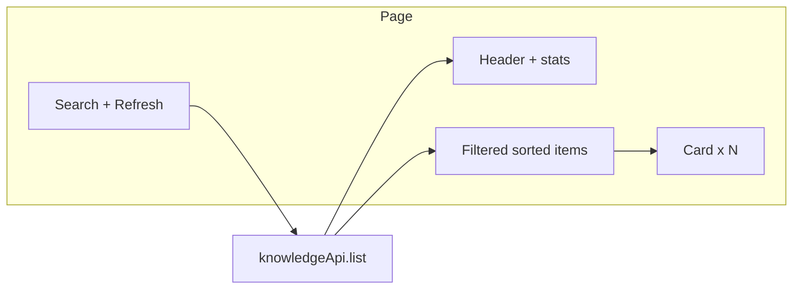
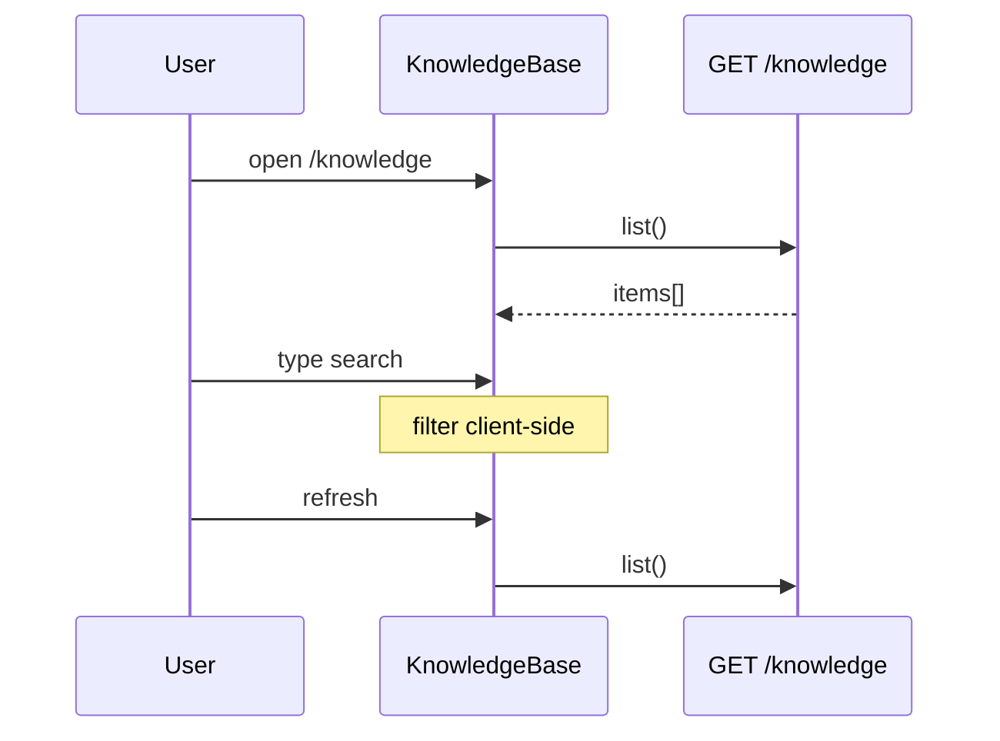

# Design — 知识库「知识感」体验

## Metadata

- **Slug**: `knowledge-base-experience`
- **Date**: 2026-05-06
- **Tier**: Standard（多文件前端 + i18n + E2E）
- **Proposal**: [`proposal.md`](./proposal.md)
- **Acceptance**: [`acceptance.md`](./acceptance.md), [`acceptance-ui.md`](./acceptance-ui.md)
- **Source plan**: Path B — 由前期探索（列表 vs 知识感）直接落档；**本文档为实施 SoT**。

## Mockups

**Deferred** — 未提交 `mockups/`；视觉以本文 **§UI** 与 `acceptance-ui.md` 为准。

## Todo list

- [x] `kb-exp-layout` — 页头、汇总条、工具栏（搜索 + 刷新）、`max-w-4xl` 容器。
- [x] `kb-exp-cards` — 卡片列表：扩展名图标、元信息、**标题点击**打开关联项目、下载。
- [x] `kb-exp-filter` — `useMemo` 搜索过滤；无匹配文案。
- [x] `kb-exp-empty-cta` — 空状态 + 前往 `/start`。
- [x] `kb-exp-highlight` — `?highlight=` 强高亮 + `scrollIntoView`。
- [x] `kb-exp-i18n` — `en` / `zh` / `ja` / `ko` 新增文案键。
- [x] `kb-exp-e2e` — 扩展 `e2e/tests/workspace-knowledge-base.spec.ts`（保持稳定 describe 名或按团队约定）。
- [x] `kb-exp-verify` — `npm run test` + `npm run test:e2e -- --grep workspace-knowledge-base`。

### Phase 6 结果

- **Outcome**: DONE（Vitest 全绿；E2E `workspace-knowledge-base` 4 passed）。
- **`/qa` / `/design-review`**: 与 E2E 同级自动化已覆盖关键路径；完整手工 `/design-review` 依赖本地 `target.local.yaml`（见 **Design review handoff**）。

## Architecture

仅前端：`KnowledgeBase.tsx` 消费现有 `knowledgeApi.list()`；搜索为客户端过滤。汇总由列表派生（`reduce` 求总字节、`max` 求最近 `updated_at`）。

## Flows

## Contracts

无变更。沿用 `KnowledgeItem`：`filename`, `display_name`, `display_path`, `project_id`, `size_bytes`, `updated_at`, `message_id`。

## Code touch list

| Path | Risk |
|------|------|
| `src/pages/KnowledgeBase.tsx` | 布局重构、回归下载与高亮 |
| `src/i18n/locales/en.ts` | 文案漏翻 |
| `src/i18n/locales/zh.ts` | 同上 |
| `src/i18n/locales/ja.ts` | 同上 |
| `src/i18n/locales/ko.ts` | 同上 |
| `e2e/tests/workspace-knowledge-base.spec.ts` | 选择器稳定性 |
| `docs/Process/knowledge-base-experience/*` | 文档维护 |

## Testing strategy

- **Vitest**：本交付不强制新增单测（过滤逻辑内联于页面，保持改动集中）；回归 `npm run test`。
- **E2E**：已存在 `workspace-knowledge-base` describe；增加搜索框与刷新控件存在性断言（登录夹具）。

### E2E scenarios

| ID | Scenario | Route / API | Key assertions |
|----|----------|-------------|----------------|
| E2E-01 | 页面主标题可见 | `/knowledge` | `h1` visible |
| E2E-02 | 搜索与刷新 | `/knowledge` | `data-testid=kb-search` + `kb-refresh` |
| E2E-03 | 空状态时 CTA | `/knowledge` | `data-testid=kb-empty-cta` **或** 有列表时跳过（用条件分支） |

说明：E2E-03 在「用户已有知识库文件」时可能无空状态；用 `if (await emptyCta.count() > 0)` 断言，否则仅记录有列表。

## Edge cases & errors

- **滚动**：`AppWorkspaceShell` 的 `<main>` 为 `overflow-hidden`；本页根节点须使用 `min-h-0 flex-1 overflow-y-auto`，否则长列表无法下拉。
- 未登录：保持现有短文案，不展示工具栏卡片列表。
- `total_bytes` 溢出：使用 JS `number`（与现有一致）；极大列表性能依赖条数（假设 < 数千）。
- 下载：`finally` 清除 loading；成功 `toast.success`。

## Implementation order

1. i18n 键（避免 TS 引用未定义）。
2. `KnowledgeBase.tsx` 结构与样式。
3. E2E 补充。
4. 文档 Todo 勾号 + 验收 sign-off（Phase 6）。

## Rationale

- **不增 API**：加快交付；搜索用前端过滤符合当前「个人知识库」规模假设。
- **卡片**：同一数据多维信息并行展示，比四列表格更接近「条目」心智。
- **汇总条**：即时回答「我有多少沉淀」，强化「库」而非「表」。

## UI

- **Header**：`BookOpen` + 标题 + 副标题（沿用 copy，可微调用翻译键加长价值句）。
- **Stats**：三列或一行三片段 — `N` 条目、`Σ size`、`latest updated`（无数据时隐藏整块或显示「—」）。
- **Toolbar**：`Input` + `Button` refresh（`RefreshCw` icon）。
- **Card**：`rounded-lg border bg-card/50`；左侧图标由扩展名映射（默认 `FileText`）；**主标题为可点击 `button`**（有 `project_id` 时 `hover:underline` 并跳转 `/start`）；次行 `size` · `relative date` · 关联/未关联；`Download` 右侧。
- **Highlight**：`ring-2 ring-primary` 或 `border-l-4 border-primary` + `bg-primary/5`。

## Design review handoff

（Plan-mode `plan-design-review` 要点自评，供 `/design-review` 对照。）

| Dimension | Score | 到 10 还需 |
|-----------|-------|------------|
| Hierarchy | 8 | 真实 mockup 与设计系统色板对齐 |
| Density | 7 | 条数 >50 时考虑分页或虚拟列表（非本交付） |
| Motion | 6 | 刷新与高亮可加 150ms transition（可选） |

- **Target**：本地复制 `.cursor/design-review-handoff/target.example.yaml` → `target.local.yaml`；`priority_paths` 含 `/knowledge`。
- **Focus**：汇总条、搜索空态、卡片 hover、375px 折行。
