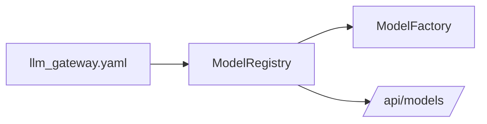
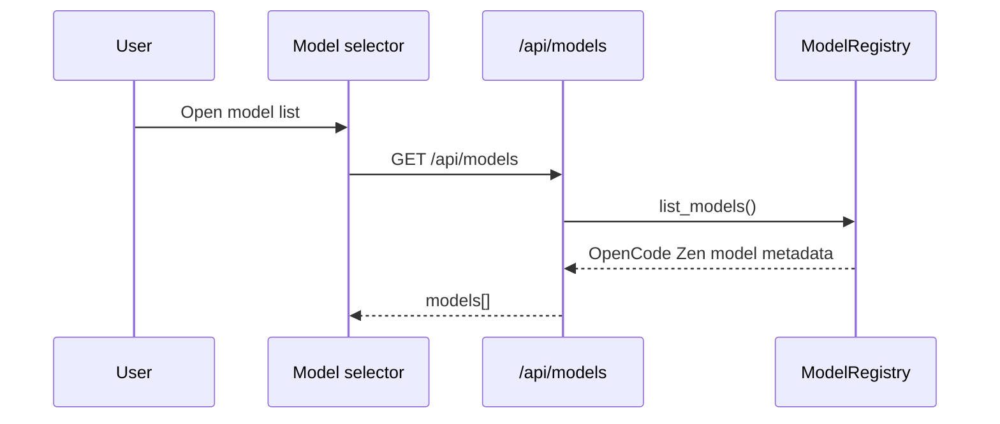

## Metadata

- slug: llm-gateway-opencode-zen-models
- date: 2026-04-25
- tier: Patch
- status: done

## Todo list

- [x] add-opencode-zen-model-regression-test
- [x] add-opencode-zen-gpt55-kimi26-models
- [x] verify-llm-gateway-model-config

## Code touch list

- `python-agent-service/tests/test_llm_gateway.py`
- `python-agent-service/config/llm_gateway.yaml`

## Testing strategy

- Add a config-level regression test that reads the real gateway YAML and verifies the new OpenCode Zen model IDs, SDK model names, endpoint suffixes, context windows, and output-token limits.
- Run the targeted pytest for the new regression test, then run the existing LLM gateway test file if the targeted test is green.

## Implementation order

1. Add the failing regression test.
2. Add the OpenCode Zen model entries.
3. Mark todos complete after verification.

## Architecture

This is a configuration-only patch. `app.llm_gateway.registry.ModelRegistry` already loads `config/llm_gateway.yaml`, filters by `OPENCODE_ZEN_API_KEY`, and surfaces model metadata through `/api/models`.

## Flows

## Contracts

- New model IDs:
  - `opencode/gpt-5.5`
  - `opencode/gpt-5.5-pro`
  - `opencode/kimi-k2.6`
- GPT 5.5 entries use `endpoint_suffix: responses`.
- Kimi K2.6 uses `endpoint_suffix: chat/completions`.

## Edge cases & errors

- If `OPENCODE_ZEN_API_KEY` is absent, registry filtering still hides all OpenCode models; the config test reads YAML directly so model presence is covered without requiring secrets.

## Rationale

The current factory already routes OpenCode models by `endpoint_suffix`, so adding model entries is lower risk than introducing a runtime branch.
