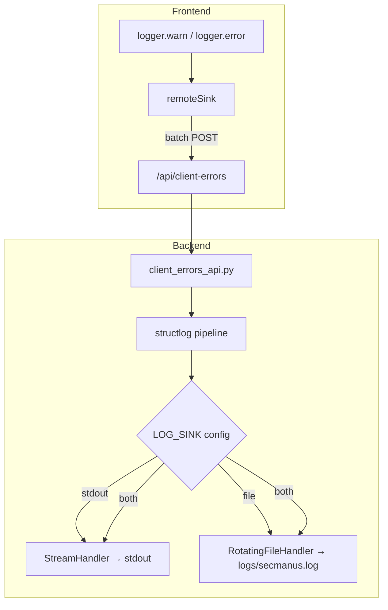
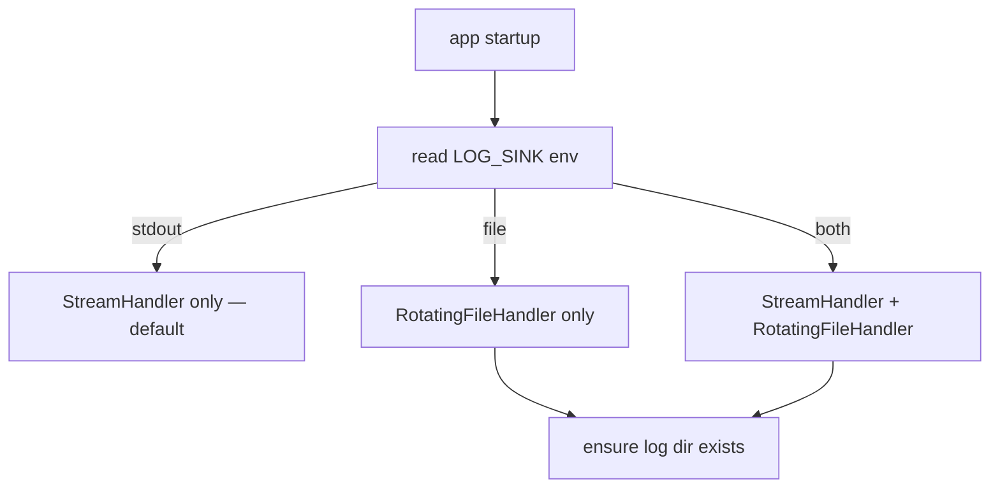
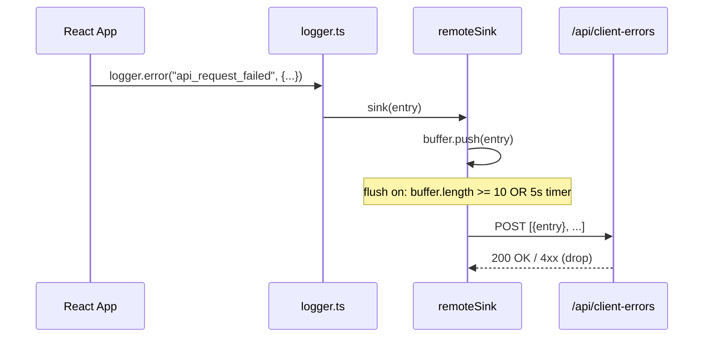

# Design: log-persistence-configurable

## Metadata

- **slug**: `log-persistence-configurable`
- **date**: 2026-04-16
- **depends-on**: `observability-logging-standards`, `frontend-logging-standards`

## Todo list

- [x] `backend-settings` — Add LOG_SINK / LOG_FILE_* settings to Settings + .env.example
- [x] `backend-file-handler` — Conditional RotatingFileHandler in main.py structlog config
- [x] `backend-client-errors-api` — POST /api/client-errors endpoint + router registration
- [x] `frontend-remote-sink` — src/lib/loggerRemoteSink.ts with batching + POST logic
- [x] `frontend-register-sink` — Register remote sink at app startup (src/main.tsx)
- [x] `backend-tests` — pytest for file handler config + client-errors endpoint
- [x] `frontend-tests` — Vitest for remote sink batching + error handling

## Architecture



## Flows

### Backend log sink selection (startup)



### Frontend remote error reporting



## Contracts

### Settings (env vars)

| Env var | Type | Default | Description |
|---------|------|---------|-------------|
| `LOG_SINK` | `"stdout" \| "file" \| "both"` | `"stdout"` | Log output target |
| `LOG_FILE_PATH` | `str` | `"logs/secmanus.log"` | Path relative to SERVICE_ROOT |
| `LOG_FILE_MAX_BYTES` | `int` | `10485760` (10 MiB) | Max size before rotation |
| `LOG_FILE_BACKUP_COUNT` | `int` | `5` | Number of rotated files to keep |

### POST /api/client-errors

**Request:**
```json
{
  "errors": [
    {
      "timestamp": "2026-04-16T10:00:00.000Z",
      "level": "error",
      "event": "api_request_failed",
      "request_id": "abc-123",
      "url": "/api/analyze",
      "status": 500
    }
  ]
}
```

**Response:** `204 No Content` (success) / `422` (validation) / `429` (rate limit).

**Rate limit:** max 50 entries per request, max 10 requests/min per IP (simple in-memory counter).

### Frontend remoteSink API

```typescript
interface RemoteSinkOptions {
  endpoint: string;       // default: "/api/client-errors"
  batchSize: number;      // default: 10
  flushIntervalMs: number; // default: 5000
  maxRetries: number;     // default: 1
}

function createRemoteSink(options?: Partial<RemoteSinkOptions>): LogSink;
```

## Code touch list

| File | Action | Risk |
|------|--------|------|
| `python-agent-service/app/config/settings.py` | Add 4 new fields | Low |
| `python-agent-service/.env.example` | Add LOG_SINK section | Low |
| `python-agent-service/app/main.py` | Conditional file handler | Medium — structlog startup |
| `python-agent-service/app/api/client_errors.py` | **NEW** — endpoint | Low |
| `python-agent-service/app/api/__init__.py` | Register router | Low |
| `src/lib/loggerRemoteSink.ts` | **NEW** — remote sink | Low |
| `src/main.tsx` | Register sink | Low |
| `python-agent-service/tests/test_log_persistence.py` | **NEW** — tests | Low |
| `src/lib/loggerRemoteSink.test.ts` | **NEW** — tests | Low |

## Testing strategy

### Unit / Integration

| Test | Type | What |
|------|------|------|
| `test_log_sink_default_stdout` | unit | LOG_SINK=stdout → no RotatingFileHandler |
| `test_log_sink_file_creates_handler` | unit | LOG_SINK=file → RotatingFileHandler present |
| `test_log_sink_both` | unit | LOG_SINK=both → both handlers |
| `test_client_errors_endpoint_204` | integration | POST valid payload → 204 |
| `test_client_errors_validation` | integration | POST invalid → 422 |
| `test_client_errors_rate_limit` | integration | Exceed rate → 429 |
| `test_remote_sink_batches` | unit (vitest) | Buffer flushes at batchSize |
| `test_remote_sink_timer_flush` | unit (vitest) | Buffer flushes on timer |
| `test_remote_sink_network_error` | unit (vitest) | Failed POST doesn't crash |

No E2E — this is infra plumbing, no UI change.

## Edge cases & errors

| Case | Handling |
|------|----------|
| Log dir doesn't exist | `main.py` creates `logs/` at startup via `Path.mkdir(parents=True, exist_ok=True)` |
| Disk full / permission denied | `RotatingFileHandler` raises at startup → fail-fast, stderr message |
| Frontend POST fails (network) | remoteSink drops batch after maxRetries, logs to console.warn |
| Frontend offline | navigator.onLine check, skip POST if offline |
| Rate limit hit | Backend returns 429, frontend drops batch (no retry) |
| Malicious payload | Pydantic validation: max 50 entries, string length caps |

## Implementation order

1. `backend-settings` → `backend-file-handler` (config before consumer)
2. `backend-client-errors-api` (independent of 1)
3. `frontend-remote-sink` → `frontend-register-sink`
4. `backend-tests` + `frontend-tests`

## Rationale

- **`RotatingFileHandler`** over custom file writer: stdlib, battle-tested, handles rotation/locking.
- **Batch POST** over per-event POST: reduces network chatter; 5s timer ensures timely delivery.
- **204 No Content**: endpoint is fire-and-forget, no response body needed.
- **In-memory rate limiter**: simple; no Redis dependency for a secondary endpoint.
- **LOG_SINK=stdout default**: zero-change for existing deployments.
