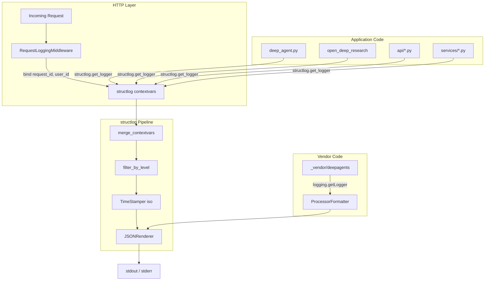
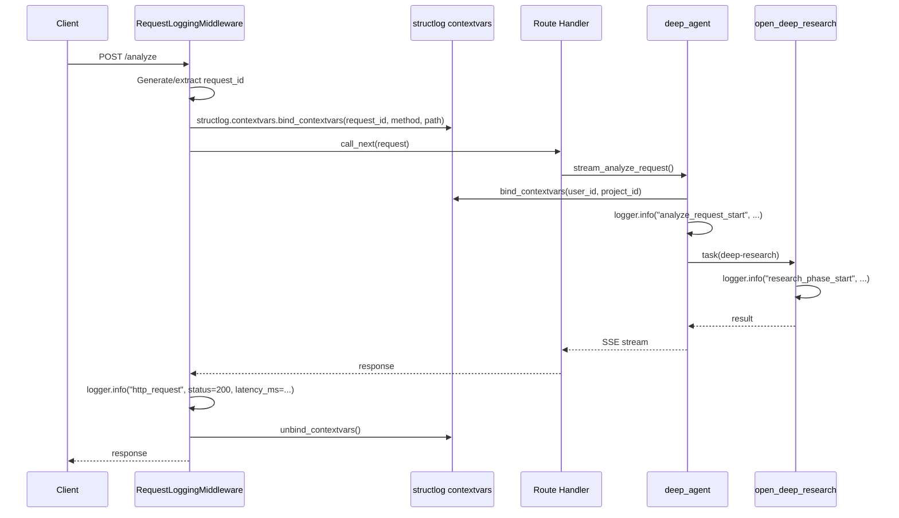

# Design — `observability-logging-standards`

## Metadata

- **Slug:** `observability-logging-standards`
- **Date:** 2026-04-16
- **Related:** [proposal.md](./proposal.md), [acceptance.md](./acceptance.md)

## Todo list

- [x] `structlog-contextvars` — Add `merge_contextvars` processor and bind `request_id`/`user_id`/`project_id` in structlog config
- [x] `http-access-middleware` — Create `app/middleware/request_logging.py` with structured HTTP access logging
- [x] `silent-exceptions` — Replace all bare `except: pass` in `app/agents/deep_agent.py` with `logger.debug`
- [x] `research-structlog` — Migrate `open_deep_research_original/utils.py` from `logging` to `structlog`; add correlation fields
- [x] `research-adapter-cleanup` — Optimize `open_deep_research_original_adapter.py`: remove file-based log writing, unify event names
- [x] `vendor-formatter` — Configure `structlog.stdlib.ProcessorFormatter` for vendor loggers to output JSON
- [x] `event-naming-normalize` — Normalize event names in touched files to snake_case convention
- [x] `agent-md-standards` — Add logging & event naming standards section to `AGENT.md`
- [x] `tests` — Add unit tests for middleware and verify log output format

## Architecture

The logging infrastructure is a cross-cutting concern layered on top of the existing FastAPI + structlog setup.



## Flows

### Request lifecycle with logging



## Contracts

### Log line JSON schema (after enhancement)

```json
{
  "event": "http_request",
  "timestamp": "2026-04-16T12:00:00.000000Z",
  "level": "info",
  "request_id": "req_abc123",
  "user_id": "usr_xyz",
  "project_id": "proj_456",
  "method": "POST",
  "path": "/analyze",
  "status_code": 200,
  "latency_ms": 1523
}
```

### Event naming convention

- Format: `snake_case`, max 60 chars
- Structure: `<domain>_<action>` or `<domain>_<object>_<action>`
- Examples: `http_request`, `analyze_request_start`, `research_phase_start`, `billing_gate_check_failed`
- Forbidden: English sentences, camelCase, mixed styles

### Config keys

No new environment variables. No DB migrations.

## Code touch list

| File | Change | Risk |
|------|--------|------|
| `app/main.py` | Add `merge_contextvars` + `add_log_level` to structlog processors; add vendor formatter config; register `RequestLoggingMiddleware` | **Medium** — central config, affects all log output |
| `app/middleware/request_logging.py` | **NEW** — HTTP access logging middleware | Low |
| `app/agents/deep_agent.py` | Replace ~10 bare `except: pass` with `logger.debug`; bind `user_id`/`project_id` via `bind_contextvars` | **Medium** — core agent loop |
| `app/agents/research/open_deep_research_original/utils.py` | Replace `logging.getLogger` with `structlog.get_logger`; add correlation to `web_search_deep_research_impl` | Low |
| `app/agents/research/open_deep_research_original_adapter.py` | Remove `_write_research_run_log` and `_write_research_run_report_markdown` file writes; replace with structlog events; normalize event names | **Medium** — research output path |
| `AGENT.md` | Add §7 Logging & Observability Standards | Low |

### Files NOT touched (vendor)

- `app/_vendor/deepagents/**` — vendor code, only configured externally via `ProcessorFormatter`.

## Testing strategy

### Unit tests

| Test | What it verifies |
|------|-----------------|
| `test_request_logging_middleware` | Middleware emits structured `http_request` event with correct fields |
| `test_structlog_contextvars_binding` | `request_id`/`user_id` appear in log output when bound |
| `test_vendor_formatter` | Vendor `logging.getLogger` output goes through `ProcessorFormatter` to JSON |
| `test_silent_exception_logging` | Previously silent catches now emit log events |

### Integration verification

| Check | Method |
|-------|--------|
| All log lines are valid JSON | `pytest` fixture captures structlog output, asserts JSON parse |
| `request_id` present in analyze flow | Run `/analyze` in test, grep logs for consistent `request_id` |
| No `except: pass` in `app/agents/deep_agent.py` | `grep -n "except.*: *$" app/agents/deep_agent.py` returns 0 |

### E2E scenarios

N/A — this is a backend-only observability change with no UI. Verification via unit/integration tests and log output inspection.

## Edge cases & errors

| Case | Handling |
|------|----------|
| `request_id` not present (non-analyze endpoints) | Middleware generates UUID; field always present |
| `ContextVar` not set (background tasks) | `merge_contextvars` gracefully skips missing vars |
| Vendor logger emits before structlog configured | `ProcessorFormatter` attached to root handler at import time |
| High-volume access logs | INFO level; can be filtered by level in production |
| `_write_research_run_log` removal | Research run data now in structlog JSON (queryable); file writes replaced by `research_run_complete` event |

## Implementation order

1. **`structlog-contextvars`** — Foundation; all other changes depend on this.
2. **`vendor-formatter`** — Unifies output format early.
3. **`http-access-middleware`** — Depends on structlog config being correct.
4. **`silent-exceptions`** — Independent, can parallel with 3.
5. **`research-structlog`** — Depends on 1.
6. **`research-adapter-cleanup`** — Depends on 5.
7. **`event-naming-normalize`** — Depends on 3–6 being done.
8. **`agent-md-standards`** — Last; documents the conventions established above.
9. **`tests`** — Written alongside each step (TDD).

## Rationale

### Why `merge_contextvars` over manual `bind`

`structlog.contextvars.merge_contextvars` automatically injects all bound context into every log call without requiring explicit `logger.bind()` at each callsite. This is less error-prone and ensures 100% coverage across the codebase, including third-party code that uses structlog.

### Why remove file-based research logs

`_write_research_run_log` writes JSON files to `logs/` directory. This is problematic in containerized deployments (ephemeral filesystem) and duplicates data that should live in the structured log stream. Replacing with a single `research_run_complete` structlog event preserves all the same data while making it queryable via any log aggregation tool.

### Why not modify vendor code

`_vendor/deepagents` is upstream-synced code with SECMANUS PATCH blocks. Adding logging changes would create merge conflicts on every vendor update. Instead, we configure `ProcessorFormatter` on the root `logging` handler to intercept vendor log output and format it as JSON.

### Why add standards to AGENT.md rather than a separate doc

`AGENT.md` is the single source of truth for AI agent coding behavior. Logging standards directly affect code quality and are checked during every code review. Embedding them in AGENT.md ensures they are always in context.

## UI

N/A — backend-only change. No UI components affected.

## Mockups deferred

Backend-only delivery; no UI mockups applicable.
