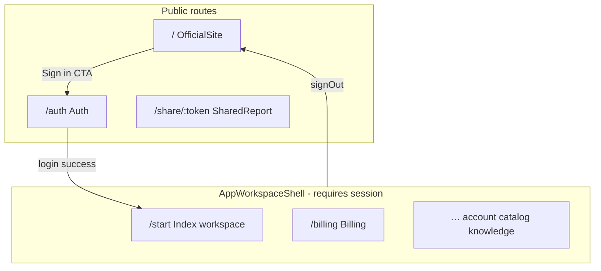
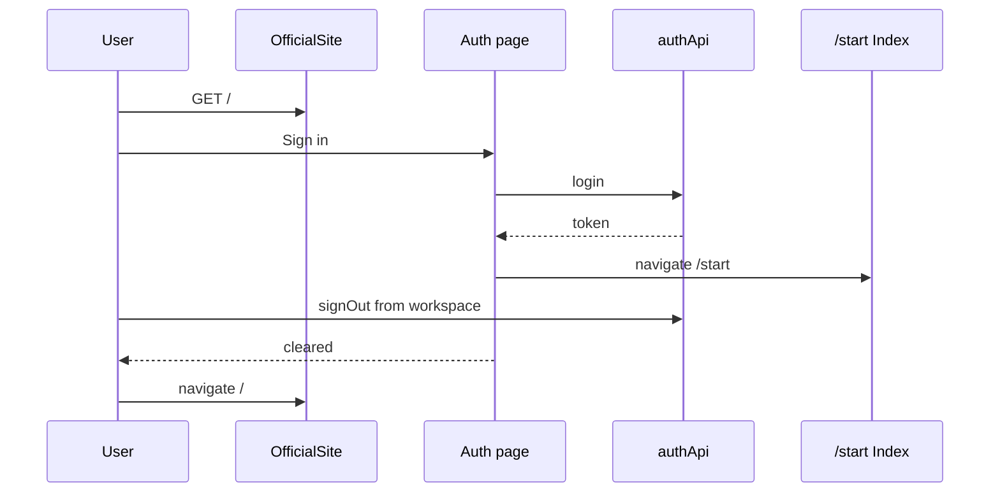

# Design — Official marketing home

## Metadata

- **Slug:** `official-website`
- **Date:** 2026-05-06 (routing + page); **2026-05-06** (marketing i18n follow-up documented here)
- **Status:** implemented; i18n for public marketing wired to existing `LanguageProvider` (`en` / `zh` / `ja` / `ko`)
- **Links:** [`proposal.md`](./proposal.md), [`acceptance.md`](./acceptance.md), [`acceptance-ui.md`](./acceptance-ui.md)

## Source plan (traceability)

Stand-alone delivery (no Cursor `*.plan.md`). **This `design.md` is the implementation SoT** for routing + marketing page + logout behavior **and** for how marketing copy is internationalized.

## Todo list

- [x] `route-public-home` — Register `/` as public marketing page **outside** `AppWorkspaceShell`; remove workspace `Index` from `/`.
- [x] `page-marketing` — Add `OfficialSite` (or `MarketingHome`) page component reproducing reference layout/sections (React + Tailwind; optional small CSS module only if Tailwind gaps).
- [x] `workspace-entry-start` — Workspace home only `/start`; update shell logic and internal `Link`/navigate targets from `/` to `/start`.
- [x] `cta-login-auth` — All sign-in CTAs and hero submission → `/auth` (preserve optional `?q=` for hero text if trivial).
- [x] `sign-out-home` — `signOut` navigates to `/` with `replace: true`.
- [x] `footer-stubs` — Footer: product anchors + Sign in → `/auth`; register → `/auth`; mailto placeholder; Pricing/legal stubs per proposal non-goals.
- [x] `tests-routing` — Vitest/route or smoke where applicable; Playwright grep `official-website` if E2E added.
- [x] `marketing-i18n` — All marketing UI strings (`OfficialSite`, workflow demo, hero composer placeholders, nav/footer) read from `t.marketing` in `src/i18n/locales/{en,zh,ja,ko}.ts`; **semantic parity with English**, no feature copy redesign (translation + key wiring only). Demo artefacts (URLs, IOC sample blobs) remain as translated strings keyed per locale where the English reference had literals.

## Architecture

Public marketing is a **leaf route** sibling to `/auth` and `/share/:token`, not nested under `AppWorkspaceShell`.

## Flows

### Anonymous visit

1. User opens `/` → `OfficialSite` renders (no sidebar, no `WorkspaceProjectsProvider`).
2. User clicks **Sign in** → `navigate` / `<Link to="/auth">`.

### Logout

1. User in workspace invokes `signOut`.
2. `authApi.logout()` clears server session; local user cleared.
3. **`navigate("/", { replace: true })`** (no longer `/auth`).

### Login success (unchanged intent)

1. After successful email auth, app still **`navigate("/start")`** and `markPostLoginLandingSession()` as today.

## Contracts

| Item | Detail |
|------|--------|
| Routes | `/` → marketing; `/start` → workspace `Index`; `/auth` unchanged. |
| Logout | `AuthContext.signOut` post-condition: user null, URL `/`. |
| External HTML links | Reference `login/login.html` → `/auth`; `signup.html` → `/auth`. |
| Pricing / legal | No backend; use `href="#"` + `aria-disabled` or omit until copy exists (document in UI acceptance). |
| **i18n (marketing)** | `useLanguage()` → `t.marketing.*`. Namespace **`marketing`** in `en.ts`, `zh.ts`, `ja.ts`, `ko.ts`: **same key shape across locales**. Includes `heroLine1`…`, `features.*`, workflow strings (`wf*`), `wfIocFound` / `wfStepSeconds` with `{{count}}` / `{{seconds}}` placeholders for the static demo timeline, `docTitle` for `document.title`, and `guestAttachTooltip` for the hero composer attachment control when `marketingGuest` is set. Typed via `TranslationKeys` (`typeof en`). |
| **Public hero test hook** | `OfficialSite` root hero `<h1>` exposes `data-testid="official-site-hero-title"` so Playwright assertions stay stable when locale is not English. |

## Code touch list

| Path | Change |
|------|--------|
| `src/App.tsx` | New route `/` outside shell; remove `<Route path="/" element={<Index />} />` from shell group. |
| `src/pages/OfficialSite.tsx` | Marketing page: `useLanguage()`, `document.title`, feature cards / nav / footer / orchestration chips from **`t.marketing`**; hero `data-testid` for E2E. |
| `src/contexts/AuthContext.tsx` | `signOut`: `navigate("/")`. |
| `src/components/AppWorkspaceShell.tsx` | Treat workspace home as `/start` only (`isWorkspaceHome`, `handleSelectProject` → `/start`). |
| `src/pages/*.tsx` | Replace `Link to="/"` breadcrumbs “回到工作台” targets with `/start` where they mean workspace. |
| `src/pages/KnowledgeBase.tsx` | `navigate("/")` → `navigate("/start")`. |
| `tailwind.config.ts` / `src/index.css` | Only if design tokens need DM Sans / background helpers. |
| **`src/i18n/locales/en.ts`** (pattern) | **`marketing` object inlined** in each locale file (`en` is the key SoT for `TranslationKeys`); keep **one** `marketing` key per file (merge conflicts with a split `marketing*.ts` helper should be resolved toward a single object shape matching `en`).
| **`src/i18n/locales/zh.ts`, `ja.ts`, `ko.ts`** | **`marketing`** section aligned with `en` keys; localized strings. |
| **`src/components/MarketingHomeComposer.tsx`** | Hero composer wrapper: guests vs signed-in branches; placeholders from **`t.marketing.heroComposerPlaceholder`**. |
| **`src/components/AnalysisInputComposer.tsx`** | When `marketingGuest`, attachment `title` → **`t.marketing.guestAttachTooltip`**. |
| **`src/components/marketing/OfficialSiteWorkflowSection.tsx`** | Workflow timeline demo; all labels / panel copy / aria-labels via **`t.marketing`** (+ small `marketingTpl` for count/seconds). |
| **`src/components/marketing/official-site-workflow.css`** | Layout / motion for workflow section (non-copy). |

Risky areas: every hard-coded `"/"` that assumed workspace home; grep after edit. **Locale files:** drift between `en` and other locales breaks `TranslationKeys` typing — add keys to all four files together.

## Testing strategy

- **Vitest:** Any helper for URL builders; routing-related component tests if fragile logic added.
- **Manual:** Smoke `/`, `/auth`, login → `/start`, logout → `/`.

### E2E scenarios

| ID | Scenario | Route / API | Key assertions |
|----|----------|-------------|----------------|
| E2E-01 | Public home load | `/` | Hero visible via **`data-testid="official-site-hero-title"`** (locale-agnostic); no workspace sidebar; optional copy check e.g. `Security Agent` in gradient line where still English product term. |
| E2E-02 | Login CTA | `/` → click Sign in | Lands on `/auth`. |
| E2E-03 | Logout to home | Logged-in `/start` → sign out | URL `/`; marketing hero testid visible. |

Map: `U-02`/`I-01` → E2E-02; logout acceptance → E2E-03.

## Edge cases & errors

- **Authenticated user visits `/`:** Show marketing (no forced redirect); optional future: show “Enter workspace” button → `/start` (not required by proposal).
- **Deep links:** Bookmarks to `/start` still work; unauthenticated redirect to `/auth` unchanged.
- **Hero submit with empty textarea:** Submit still routes to `/auth` (parity with static “continue to sign in”).

## Implementation order

1. Add `OfficialSite` page shell + routing (`/` public).
2. Remove `Index` from `/`; fix shell + breadcrumbs + `KnowledgeBase`.
3. Wire CTAs → `/auth`.
4. Change `signOut` → `/`.
5. Polish parity + responsiveness + footer stubs.
6. Tests (E2E if time allows in Phase 5).

## Rationale

- **Workspace only on `/start`:** Avoids ambiguous `/` meaning and matches “homepage = marketing.”
- **Logout to `/`:** Matches user requirement “退出时转到首页”; signing in remains explicit via `/auth`.
- **Pricing/legal stubs:** Proposal non-goals; prevents dead links misrepresenting deployed pages.
- **Marketing i18n:** Reuses `LanguageProvider` and `TranslationKeys` so marketing stays consistent with workspace language picker; four locale files edited in lockstep to satisfy TypeScript. After merges, avoid **duplicate `marketing` keys** and orphan imports from a non-existent `locales/marketing` module — the SoT is the inline `marketing` block keyed like `en.ts`.

## UI

Structure mirrors reference:

1. Skip link → `#main`
2. Sticky header: brand (`/` or scroll top), anchors `#features` / `#workflow`, optional Pricing stub, Sign in → `/auth`, mobile drawer — **strings from `t.marketing`** (including `skipToMain`, `navWorkflow` non-breaking spaces where needed).
3. Hero: headline gradient span (`heroLine1` / `heroLine2*`), subtitle, glass “chat” card via **`MarketingHomeComposer`** (`AnalysisInputComposer`); submit → `/auth`. **`document.title`** = `marketing.docTitle`.
4. Features: eyebrow + 4 cards + CTAs → `/auth` (`features[inquiry|binary|tracing|phishing]` subkeys).
5. Workflow: **`OfficialSiteWorkflowSection`** — timeline / demo panels; **no hard-coded English** in JSX; placeholders `{{count}}`, `{{seconds}}` for demo metrics.
6. Footer: columns + © line (`footer*` keys).

Sticky header shadow on scroll (match reference `site-header--scrolled` behavior).

**Localization:** Changing language via app `LanguageProvider` updates marketing copy immediately; **`secmanus-language`** in `localStorage` persists choice app-wide — E2E must not rely on English-only hero text (use hero `data-testid`).

### Plan design review (Phase 2 summary)

Informal desk review per **plan-design-review** dimensions (proposal-level):

| Dimension | Score | To reach 10 |
|-----------|-------|--------------|
| Visual hierarchy / brand | 8/10 | Full token match to reference (exact radii shadows); DM Sans parity. |
| Interaction clarity | 8/10 | Optional “Enter workspace” when logged in on `/`; optional preserve hero `q` into `/auth` state. |
| Accessibility | 7/10 | Verify focus trap in mobile nav; contrast audit on violet gradients. |
| Content / legal completeness | 6/10 | Replace footer stubs with real `Pricing` / `Terms` / `Privacy` routes when copy exists. |

**Deferred:** dedicated pricing/terms pages (**non-goals**); mockup PNGs (**GR-MOCK** — reference HTML path only).

### Design review handoff

- **Page:** Official marketing `/`
- **target.local.yaml:** Set `priority_paths: ["/", "/auth", "/start"]` under `.cursor/design-review-handoff/target.local.yaml` (copy from `target.example.yaml`).
