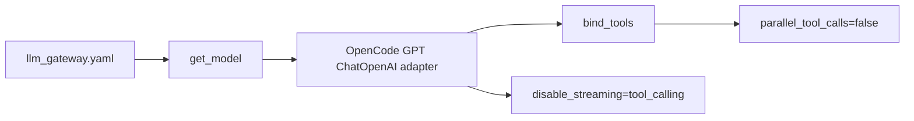
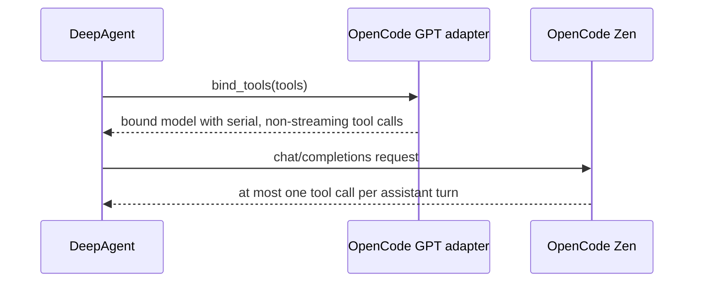

## Metadata

- slug: opencode-gpt-serial-tool-calls
- date: 2026-04-25
- tier: Patch
- status: done

## Todo list

- [x] add-bind-tools-regression-test
- [x] force-opencode-gpt-serial-tool-calls
- [x] verify-llm-gateway-tests

## Code touch list

- `python-agent-service/app/llm_gateway/factory.py`
- `python-agent-service/tests/test_llm_gateway.py`

## Architecture

OpenCode Zen GPT models are created through the existing LLM gateway factory. The fix stays at the model adapter boundary so DeepAgents and tool implementations continue to receive ordinary LangChain chat models.

## Flows

## Contracts

- OpenCode GPT-family entries (`endpoint_suffix: responses`) must disable parallel tool calls both on model construction and on `bind_tools(...)`.
- OpenCode GPT-family entries must set `disable_streaming: "tool_calling"` so LangChain uses non-streaming responses for tool-call turns.
- Non-GPT OpenCode models and other providers keep their existing behavior.

## Testing strategy

- Add a unit regression test that instantiates `opencode/gpt-5.3-codex`, binds a real `StructuredTool`, and asserts the model uses `disable_streaming == "tool_calling"` and the bound runnable has `parallel_tool_calls is False`.
- Run `python -m pytest tests/test_llm_gateway.py`.

## Edge cases & errors

- If callers explicitly pass `parallel_tool_calls=True`, the OpenCode GPT adapter should still force `False`; this provider path is known to corrupt streaming parallel tool-call chunks.
- Plain text streaming remains available; only tool-calling turns use the non-streaming fallback.

## Implementation order

1. Add failing regression test.
2. Add the provider-specific model adapter.
3. Run targeted and full gateway tests.

## Rationale

The malformed `read_filegrepgrepgrep` event is produced after provider streaming tool-call chunks are merged incorrectly. Once merged, later tool-call arguments are already lost, so the safe fix is preventing parallel GPT tool calls at the provider adapter boundary.
