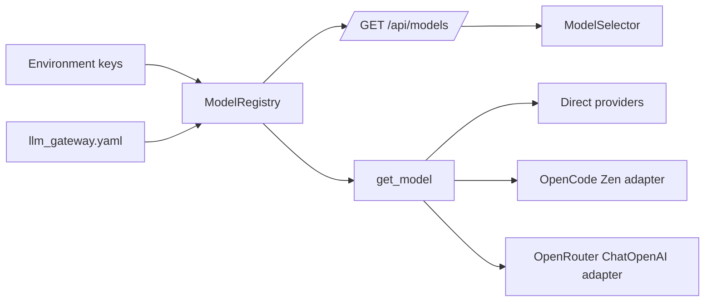
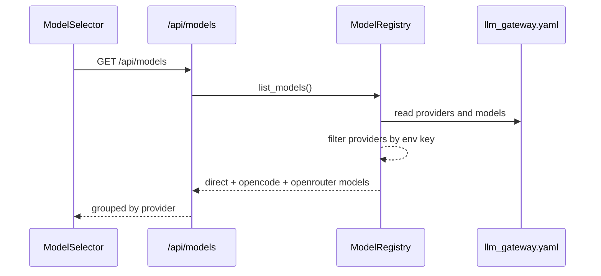
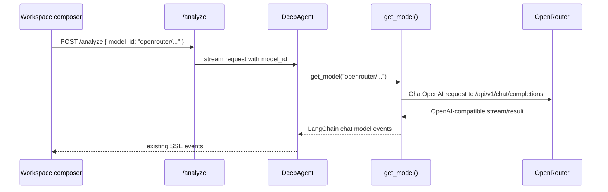

## Metadata

- slug: openrouter-unified-llm-gateway
- date: 2026-04-25
- tier: Standard
- status: done_with_concerns
- proposal: `proposal.md`
- acceptance: `acceptance.md`
- acceptance UI: `acceptance-ui.md`

## Todo list

- [x] add-openrouter-provider-registry-tests
- [x] add-openrouter-factory-tests
- [x] add-openrouter-provider-config
- [x] add-openrouter-runtime-adapter
- [x] add-openrouter-env-docs
- [x] add-openrouter-model-selector-label
- [x] add-openrouter-pricing-seed
- [x] add-openrouter-e2e-coverage
- [x] verify-openrouter-gateway-delivery

## Architecture

OpenRouter will be added as a first-class provider in the existing LLM gateway. It will not replace OpenCode in this delivery. Both providers remain controlled by their own environment keys and model lists in `llm_gateway.yaml`.



The intended split is:

- `opencode/*`: existing OpenCode Zen models, kept for comparison and rollback.
- `openrouter/*`: OpenRouter-routed models, backed by `OPENROUTER_API_KEY`.
- Direct providers such as `google/*`, `anthropic/*`, and `openai/*`: unchanged.

## Flows

### Model list



### Analyze with OpenRouter model



## Contracts

### Provider config

`python-agent-service/config/llm_gateway.yaml` adds:

```yaml
providers:
  openrouter:
    env_key: OPENROUTER_API_KEY
    base_url: https://openrouter.ai/api/v1
    models:
      - id: openrouter/anthropic/claude-opus-4.6
        name: Claude Opus 4.6 (OpenRouter)
        sdk_model: anthropic/claude-opus-4.6
        context_window: 200000
        max_output_tokens: 8192
```

Gateway ids intentionally include the `openrouter/` prefix. Runtime `sdk_model` values intentionally omit that prefix because OpenRouter expects provider-native model ids such as `anthropic/claude-opus-4.6`.

### Environment keys

- `OPENROUTER_API_KEY`: enables OpenRouter provider entries.
- `OPENROUTER_APP_URL`: optional attribution header source.
- `OPENROUTER_APP_TITLE`: optional attribution header source.

### Runtime adapter

OpenRouter uses `ChatOpenAI` with:

- `model = model_cfg["sdk_model"]`
- `api_key = provider_cfg["api_key"]`
- `base_url = provider_cfg["base_url"] or "https://openrouter.ai/api/v1"`
- `max_retries = 0`
- `timeout = settings.llm_request_timeout_seconds` when set
- optional default headers for OpenRouter attribution when env vars are set

Pseudo-code:

```python
if provider_id == "openrouter":
    headers = {}
    if settings.openrouter_app_url:
        headers["HTTP-Referer"] = settings.openrouter_app_url
    if settings.openrouter_app_title:
        headers["X-OpenRouter-Title"] = settings.openrouter_app_title
    return ChatOpenAI(
        model=sdk_model,
        api_key=api_key,
        base_url=(base_url or OPENROUTER_BASE_URL).rstrip("/"),
        default_headers=headers or None,
        stream_usage=True,
        max_retries=0,
        timeout=float(llm_timeout) if llm_timeout else None,
    )
```

### `/api/models`

No response-shape change. OpenRouter appears as another provider:

```json
{
  "id": "openrouter/anthropic/claude-opus-4.6",
  "name": "Claude Opus 4.6 (OpenRouter)",
  "provider": "openrouter",
  "context_window": 200000,
  "max_output_tokens": 8192
}
```

### OpenCode screening

This delivery keeps OpenCode active. Future screening can be done by removing/commenting the `opencode` provider or, if implemented later, adding an `enabled: false` config flag to `ModelRegistry`. This delivery does not require `enabled` support.

## Code touch list

- `python-agent-service/app/llm_gateway/registry.py`
  - Add `OPENROUTER_API_KEY` to the direct `.env` API key allowlist.
- `python-agent-service/app/llm_gateway/factory.py`
  - Add OpenRouter ChatOpenAI-compatible branch.
  - Include OpenRouter in no-provider error guidance.
- `python-agent-service/app/config/settings.py`
  - Add `openrouter_api_key`, `openrouter_app_url`, and `openrouter_app_title`.
- `python-agent-service/config/llm_gateway.yaml`
  - Add `openrouter` provider and seed model list.
- `python-agent-service/config/env.md`
  - Document OpenRouter keys and attribution.
- `python-agent-service/.env.example`
  - Add commented OpenRouter env placeholders.
- `python-agent-service/tests/test_llm_gateway.py`
  - Add registry/factory/config regression tests.
- `python-agent-service/scripts/db/seed_model_pricing_gateway_20260407.sql`
  - Add OpenRouter pricing rows for seeded model ids, or explicit zero-cost rows when pricing is not confirmed.
- `src/components/ModelSelector.tsx`
  - Add `openrouter: "OpenRouter"` provider label.
- `e2e/tests/openrouter-unified-llm-gateway.spec.ts`
  - Verify `/api/models` and selector visibility with mocked or test env-backed model catalog.

Risky areas:

- `factory.py` already contains OpenCode-specific branching. Keep OpenRouter branch independent and simple.
- Billing pricing rows must use gateway ids (`openrouter/...`), not `sdk_model` ids.
- Callback model-id resolution may serialize OpenRouter runtime models as `openai/*`; request-scoped id should preserve `openrouter/*` for selected analyze runs.

## Testing strategy

### Backend unit/integration

- Add a minimal config fixture with `openrouter` and `OPENROUTER_API_KEY`.
- Assert `ModelRegistry.list_models()` exposes only OpenRouter models when only `OPENROUTER_API_KEY` is set.
- Assert missing `OPENROUTER_API_KEY` hides OpenRouter models without raising.
- Assert `get_model("openrouter/...")` returns `ChatOpenAI` with OpenRouter base URL and native `sdk_model`.
- Assert real `llm_gateway.yaml` contains the initial OpenRouter model set.
- Assert `/api/models` includes `openrouter` metadata when the key is present.

### Frontend unit

- Add or extend `ModelSelector` test coverage only if an existing selector test exists; otherwise keep this to direct code assertion through component rendering in E2E.
- Verify provider heading displays `OpenRouter`.

### E2E scenarios

| ID | Scenario | Route / API | Key assertions |
|----|----------|-------------|----------------|
| E2E-01 | Model API exposes OpenRouter when configured | `GET /api/models` | Response includes at least one `provider: "openrouter"` item with context limits. |
| E2E-02 | Workspace model selector groups OpenRouter separately | `/` | Selector can show `OpenRouter` group without hiding existing OpenCode group when both keys are configured. |

### Commands

- `python -m pytest tests/test_llm_gateway.py`
- `npm run test -- ModelSelector` if a focused selector test is added
- `npm run test:e2e -- --grep openrouter-unified-llm-gateway`

## Edge cases & errors

- `OPENROUTER_API_KEY` absent: no OpenRouter models appear, and fallback behavior remains unchanged.
- `OPENROUTER_API_KEY` present but OpenCode key absent: OpenRouter appears, OpenCode stays hidden.
- Both keys present: both provider groups appear for comparison testing.
- Invalid explicit OpenRouter model id: existing gateway fallback behavior applies.
- OpenRouter outages: errors surface through existing LangChain/SSE error handling; no new retry policy is introduced.
- Attribution env vars absent: requests still work; headers are omitted.
- Billing row missing: usage is still recorded with zero cost and a warning, matching current behavior.

## Implementation order

1. Add failing backend tests for OpenRouter registry and factory behavior.
2. Add real-config regression tests for initial model ids.
3. Add OpenRouter env keys to settings and registry.
4. Add OpenRouter provider branch in `factory.py`.
5. Add OpenRouter model entries to `llm_gateway.yaml`.
6. Add env docs and `.env.example` placeholders.
7. Add frontend provider label.
8. Add billing pricing seed rows for the seeded OpenRouter ids.
9. Add E2E coverage for `/api/models` and model selector grouping.
10. Run Phase 5 verification and update this todo list as items complete.

## Rationale

- OpenRouter is OpenAI-compatible, so it should use the simple `ChatOpenAI(base_url=...)` path instead of the OpenCode special endpoint logic.
- Keeping `openrouter/*` gateway ids distinct prevents usage, billing, and UI context indicators from conflating direct provider calls with routed calls.
- Keeping OpenCode during evaluation preserves test flexibility and provides a rollback/comparison path.
- Dynamic model discovery is intentionally deferred because the current product contract is YAML-curated models with known context windows and pricing.

## UI

UI scope is limited to the existing model selector:

- Add provider label `openrouter: "OpenRouter"`.
- Preserve grouping by `provider`.
- Preserve selected model persistence; stored OpenCode selections remain valid while OpenCode is configured.
- No layout, spacing, motion, color, or interaction pattern changes are planned.

### Interaction states

| State | Expected behavior |
|-------|-------------------|
| Loading | Existing spinner behavior remains unchanged. |
| No models | Existing disabled compact trigger remains unchanged. |
| Only OpenRouter available | Selector shows OpenRouter group and auto-selects the first available model if no stored selection is valid. |
| OpenRouter + OpenCode available | Selector shows both groups; no provider is privileged by UI logic. |
| Stored OpenCode hidden later | Existing `getInitialModelId` falls back to the first available model. |

### Accessibility

- No new interactive component is introduced.
- Existing popover, command list, keyboard navigation, and focus behavior must remain unchanged.

## Design review handoff

- UI classification: app UI, configuration-driven selector update only.
- Existing local target: `.cursor/design-review-handoff/target.local.yaml` is present.
- Suggested priority path: `/`
- Mockups: not required for this text-only selector-label change.

### Plan-design-review result

- Initial design completeness: 8/10.
- Final design completeness: 9/10 after adding explicit selector states, accessibility notes, and provider grouping behavior.
- Findings: no visual hierarchy or layout changes; the main design risk is ambiguous behavior when OpenCode is later hidden. This is handled by preserving existing fallback selection behavior.
- Deferred: full visual QA remains Phase 6 `/design-review` if Playwright MCP is invocable.

## Mockups deferred

No mockup images are requested for this delivery because the UI scope is limited to a provider group label in an existing selector. Phase 6 visual verification will use the live UI and `acceptance-ui.md`.

## Verification outcome

- Phase 5 unit/integration:
  - `python -m pytest tests/test_llm_gateway.py -q` passed: 30 passed, 1 warning.
  - `npm run test -- ModelSelector.test.tsx` passed: 3 passed.
  - `npm run test` passed: 53 files, 396 tests.
- Phase 5 E2E:
  - `npm run test:e2e -- --grep openrouter-unified-llm-gateway` passed: 1 passed.
- Phase 6 exploratory:
  - `/qa` skipped because `browser_*` Playwright MCP tools are not invocable in this session.
  - `/design-review` skipped because `browser_*` Playwright MCP tools are not invocable in this session.
- Outcome: DONE_WITH_CONCERNS. Automated verification is green; MCP exploratory QA/design-review could not run from this session.
