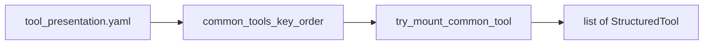

## Metadata

- **Slug:** `python-agent-tool-registry-toolspec`
- **Path B:** No Cursor `*.plan.md`; this file is the implementation source of truth.

## Todo list

- [x] **reg-spec** — Add `app/tools/tool_spec.py` (`ToolRisk`, `ToolSpec`)
- [x] **reg-map** — Add `app/tools/common_tool_registry.py` (`COMMON_TOOL_MOUNTERS`, `COMMON_TOOL_SPECS`)
- [x] **reg-wire** — Tiered branch in `create_common_tools()` uses registry lookup; HITL unchanged
- [x] **reg-test** — Parity test `registered_common_tool_names()` vs known orders
- [x] **reg-docs** — Update `docs/TOOLS_AND_REGISTRY.md` with add-tool checklist

## Architecture

- **YAML** (`common_tools` order) remains authoritative for **which** tools appear and **enabled/description**.
- **`try_mount_common_tool(name, tools)`** dispatches: research names use `try_append_research_tool`; others use **`COMMON_TOOL_MOUNTERS`** (security + `search_history` only).
- **ToolSpec** is optional metadata keyed by tool name; not yet consumed by runtime policy.

## Contracts

| Symbol | Meaning |
|--------|---------|
| `COMMON_TOOL_MOUNTERS` | `dict[str, Callable[[list[StructuredTool]], None]]` — security tools + `search_history` (research trio excluded; see `try_mount_common_tool`) |
| `try_mount_common_tool` | Returns whether a tool was appended; research trio delegates to `try_append_research_tool` |
| `COMMON_TOOL_SPECS` | `dict[str, ToolSpec]` — metadata for security + history + research names |
| `get_tool_spec(name)` | Returns `ToolSpec \| None` |
| `registered_common_tool_names` | `frozenset` — union of `COMMON_TOOL_MOUNTERS` keys and `RESEARCH_TOOL_ORDER` |

## Edge cases

- Unknown name in YAML: log `common_tools_no_impl` (unchanged) when `try_mount_common_tool` returns false.
- HITL: still handled before registry branch (`request_user_input`).
- Legacy flat `tools:` mode: unchanged; still uses `_append_common_security_tool` loop + research loop.

## Testing strategy

- Run `pytest python-agent-service/tests/test_common_tools_from_registry.py` and related tests.
- New unit test: registered keys == `COMMON_SECURITY_TOOL_ORDER` ∪ `{search_history}` ∪ `RESEARCH_TOOL_ORDER`.

## Operational / rollout

- No env flags; behavior-preserving refactor.

## Mockups deferred

- **N/A** — backend-only delivery; no UI mockups.

## Design review handoff

- **N/A** — no `acceptance-ui.md` for this delivery.

## Rationale

- Registry table is easier to extend than growing `elif` chains; `ToolSpec` gives a stable place for future governance without changing call sites again.

## Code touch list

- `python-agent-service/app/tools/tool_spec.py` (new)
- `python-agent-service/app/tools/common_tool_registry.py` (new)
- `python-agent-service/app/tools/enhanced_tools.py` (tiered loop)
- `python-agent-service/tests/test_common_tool_registry.py` (new)
- `docs/TOOLS_AND_REGISTRY.md`
