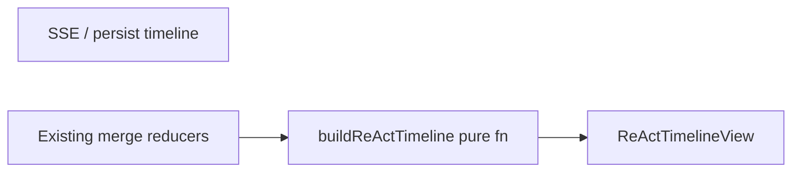
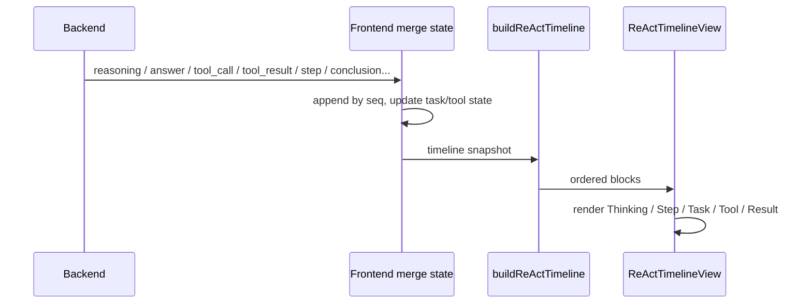

# Design — ReAct 对话时间线（v0 示例对齐）

## Metadata

- **Slug:** `react-timeline-v0-parity`
- **Updated:** 2026-03-30（Task List 分桶 + 正式回答协议）
- **Related:** [proposal.md](./proposal.md), [acceptance-ui.md](./acceptance-ui.md), [acceptance.md](./acceptance.md)

## Path B

本交付无独立 Cursor Plan 文件；以本 `design.md` 为实施与验收的单一技术来源。

## Todo list

- [x] **rtl-01** — 定义展示层类型 `ReActTimelineBlock`（或与示例对齐的 `TimelineItem` 变体）及 `status: active | completed | pending` 语义文档化。
- [x] **rtl-02** — 实现纯函数 `buildReActTimeline(entries: AnalysisTimelineEntry[], …) -> ReActTimelineBlock[]`：按 `seq` 全序归并，输出可与参考示例一一映射的块列表（含单元测试，固定 fixture）。
- [x] **rtl-03** — 实现 `ReActTimelineView`（或等价组件）：Thinking 合并行（Brain + 可折叠推理 + Thought 秒数 + 下方正式回答）、Task List、Tool Execution、Result、**Step** 行；样式对齐参考 `ai-chat-panel.tsx`（边框树、chevron、code  pill、图标）。
- [x] **rtl-04** — 工具行：**不**渲染 `tool_result` 正文；从 `toolInput` 解析展示用字符串（路径、URL 等），工具名映射规则与测试。
- [x] **rtl-05** — 任务列表：按 **`listBucketKey`**（见 Contracts）分桶；桶内 **`write_todos` 以任务唯一 id 更新行**；新桶（如子代理新任务域）在时间线上 **新建** Task List 块，与 `buildReActTimeline` 测试绑定。
- [x] **rtl-09** — 与后端落地「正式回答」通道：已采用独立 SSE **`type: answer`**（与终局 **`conclusion`** 区分）；已更新 `docs/SSE_EVENT_CATALOG.md`、Python `deepagents_stream_adapter` / 子代理中间件；前端 `ThinkingEventType` 与 `buildReActTimeline` 消费 `answer`。
- [x] **rtl-06** — 在 `AnalysisTurnPanel`（或 `Index` / `ReasoningPanel` 挂载点）**仅挂载**新时间线（`ReActTimelineView` + `buildReActTimeline` 数据）；**从挂载树移除**旧 `TimelineUnifiedBody` / `StreamEventRenderer` / 相关旧链，**不删除**其源文件（待你后续要求再删代码）。
- [x] **rtl-07** — 与后端确认/文档化「委派子智能体」等里程碑仅通过 **`type: step`** 下发；前端将 `step` 渲染为与 Thinking/TaskList 同列的时间线一项（`label`/`detail` 展示规则见 Contracts）。
- [x] **rtl-08** — 更新/新增 Vitest：`buildReActTimeline`、工具 JSON 解析、顺序回归（交错 Thinking → Tool → Thinking → Task → Tool → Summary）。

## Architecture

新层位于 **「已合并的 timeline 数组」** 与 **DOM** 之间：



旧版 `TimelineUnifiedBody` 等文件可仍在仓库中，但**不得**被本对话区挂载路径 `import` 渲染（与上图中 `View` 互斥）。

- **buildReActTimeline**：唯一排序键为 **`seq`**（同 seq 并列时再用稳定二级键，如 `type` 优先级或 `id`）。
- **ReActTimelineView**：只消费 `ReActTimelineBlock[]`，不直接读 SSE，便于测试与视觉冻结。

## Flows

### 用户一次分析 turn（简化）



### Thinking + 正式回答（逻辑块）

1. **推理正文**：来自同一 ReAct 周期内（例如同一 `turn`）的 **`reasoning`** 且 **`contentKind === 'thinking'`**（或**无** `contentKind` 时按 **thinking** 处理）的 `content` 累积；**无内容**则 Thinking 头仍可显示，但**不提供折叠交互**（或折叠控件 disabled + 无展开区）。
2. **Thought N 秒**：在「该思考段结束」时计算时长（与现 `ThinkingChrome` 类似：开始于本轮首条 reasoning 或 turn 起点，结束于下一块非 reasoning 事件或收到 `tool_call` / `step` / **正式回答首包** 等边界事件——**精确边界在 rtl-02 实现时写入测试用例**）。
3. **正式回答（每轮 Thinking）**：由与 `reasoning` **平级**的 SSE **`type: answer`** 承载流式或完整 `content`；在 Thinking 折叠区**下方**展示。**禁止**把未标注的 `reasoning` 默认当作正式回答。

### Reasoning vs 正式回答 vs 终局结论（已锁定）

| 信号 | 语义 | 时间线消费 |
|------|------|------------|
| **`reasoning`** | 可折叠「推理」正文 | `buildReActTimeline` 写入 Thinking 块的 `reasoning` |
| **`answer`** | 该 ReAct 周期面向用户的「正式回复」（可与终局文案同文，但事件类型不同） | 写入同一 Thinking 块的 `answer`（折叠下方） |
| **`conclusion`** | 图/会话**终局**结论（右侧或 turn 级 conclusion 条等，由现有 `analysisTurnModel` 等路径消费） | **不**与 `answer` 混用；本 build 层不把 `conclusion` 映射进 Thinking.answer（避免与 `answer` 重复语义） |

**`task_summary`** 仍映射时间线底部 **Result / 执行摘要**（`kind: result`），与上表独立。

## Contracts

### 时间线顺序

- 输出块的顺序 **严格等于** 输入 `AnalysisTimelineEntry[]` 按 **`seq` 升序**遍历时的**语义块发射顺序**。
- 允许的典型交错（与 proposal 一致）：  
  `Thinking(+reply)` → `Tool Execution` → `Thinking(+reply)` → `Task List` → `Tool Execution` → `执行摘要`。

### `step` 事件（与 Thinking / TaskList 同级）

- **必须**依赖后端下发的 `type: 'step'`（见 `AnalysisTimelineEntry` / `SSE_EVENT_CATALOG` 附录 B）。
- 前端 **禁止** 写死「委派子智能体」等字符串作为唯一来源；若需友好文案，可对 `label`/`detail` **做 i18n 映射**，但**显示内容**须来自事件载荷（`label`, `detail`, …）。
- 可见性遵守 `internal` / `visibility: debug` 等现有过滤规则（与 `timelineDisplay` 一致）。

### Thinking 块

| 子区域 | 数据源 | UI 行为 |
|--------|--------|---------|
| 标题行 | 固定文案「Thinking」+ Brain 图标 | 有推理正文时：可折叠；hover 图标切换 chevron（对齐示例） |
| 折叠内 | **`reasoning` 且 thinking** 拼接 | 无则整块折叠无效 |
| 时长 | 计时器 | 「Thought {N} 秒」与示例「思考了 N 秒」同语义 |
| 下方正文 | **正式回答** | 仅 **`type: answer`** 的 `content`（见上表）；无 `answer` 时该区为空 |

### Task List 块（分桶 + 按 ID 更新）

**列表桶键 `listBucketKey`**（稳定字符串，用于判断「更新同一 UI 块」还是「新建一块」）：

- **必选分量：** `scope`（`main` / `subagent`）+ **`subagentName`**（`subagent` 时必填，主图用规范化主键如 `main`）。
- **可选分量：** 若 `toolInput` 提供 **`listId`** / **`planSessionId`** / **`todoListId`**（名称以最终实现为准），则拼入 key；**值相对该 scope 下上一次写入发生变化**时，视为**新桶** → 时间线上 **新 Task List 块**（满足「子代理新任务 → 新列表」；主图若需多段列表也可靠此字段）。

**同桶内更新：**

- 每次 `write_todos`（或 `toolPresentation: 'task'` 且载荷为待办列表）到达时，对**已有行**以载荷内 **任务唯一 `id`**（或后端保证稳定的 todo id）做 **upsert**：同 id 更新 `title` / `status` / `completed` 等；新 id 追加行。
- **禁止**用「整表替换无 id」作为主策略；若某条无 id，实现可生成 ephemeral key，但验收以 **有 id 的载荷** 为准。

**时间线位置：**

- **新桶**首次出现的 `seq` 处 **插入** 新 Task List 块；后续同桶事件 **更新该块状态**，不在时间线另复制一整块（避免刷屏），除非产品改为「每次 write_todos 都留历史快照」——**本交付默认不快照**，仅保留当前块状态。

**子代理：**

- `scope === 'subagent'` 且 `subagentName` 与主图不同 → **默认即不同桶**，主时间线合并后应按 `seq` 穿插 **多个** Task List 块（各子代理一块），与 proposal 一致。

### Tool Execution 块

- **不展示** `tool_result` 的 output 正文（本阶段）。
- **展示**：工具名（或人类可读短名）+ 从 **`toolInput` JSON** 解析的 **路径 / URL**（例如 `file_path`、`path`、`url` 等键的优先序在代码中集中定义，见 `rtl-04` 测试）。
- 多条工具调用：可按示例作为 **同一 Tool Execution 父节点下的 children**，或按 `seq` 拆多段；默认 **同一 turn 或连续 action 工具** 归入一组子行（实现时以测试锁定行为）。

### Result / 执行摘要

- 映射 **`task_summary`** 为时间线 **`kind: result`**；**与 `answer` / `conclusion` 分流**——终局 `conclusion` 由 turn 视图其它项展示，本函数不重复注入 result 块（避免与 `answer` 双显；若产品要在时间线底部再显 conclusion，需单独验收项）。

## Pseudocode — `buildReActTimeline`（草图）

```
sort entries by seq
blocks = []
for each entry in order:
  if hidden(entry): continue
  # Before step / tool_call / task_summary: flush reasoning+answer into one ThinkingBlock if non-empty
  if entry.type == 'step':
    emit StepBlock(label, detail, status from entry.status)
  if entry.type == 'reasoning':
    append content to thinkingBuffer
  if entry.type == 'answer':
    append content to formalReplyBuffer (Thinking.answer)
  if entry.type == 'tool_call' && isTaskTool(entry):
    bucket = listBucketKey(entry)
    emitOrUpdate TaskListBlock(bucket, merge todos by stable id)
  if entry.type == 'tool_call' && isExploreTool(entry):
    emitOrAppend ToolExecutionBlock(parseDisplayFromToolInput(entry))
  if entry.type == 'tool_result':
    update active state only; do not append output text to Tool block (this phase)
  if entry.type == 'task_summary':
    emit ResultSummaryBlock(summary)
  ...
flush tail
return blocks
```

（最终实现以 TDD 测试为准，草图仅表达决策意图。）

## Code touch list（预估）

| 路径 | 动作 |
|------|------|
| `src/lib/reactTimeline/`（新建）或 `src/lib/buildReActTimeline.ts` | 新增纯函数 + 测试 |
| `src/components/reasoning/ReActTimelineView.tsx`（新建） | 新 UI，对齐示例 Tailwind 结构 |
| `src/components/reasoning/AnalysisTurnPanel.tsx`（及上游挂载点） | **只渲染**新时间线；去掉对旧 `TimelineUnifiedBody` 链的 JSX 引用 |
| `src/lib/unifiedTimelineItems.ts` / `multiAnalyzeStreamEvents.ts` | 仅当需在合并层暴露更细粒度时小改；优先保持合并不变、只在 build 层消费 |
| `src/types/analysis.ts` | 已扩展 `ThinkingEventType` 含 `answer` |
| `docs/SSE_EVENT_CATALOG.md` | 已登记 **`answer`** 与 `conclusion` 语义 |
| `python-agent-service/app/parsers/deepagents_stream_adapter.py`、子代理中间件 | 已发出 **`type: answer`** |
| **暂不删文件** | `TimelineUnifiedBody.tsx`, `StreamEventRenderer.tsx`, `ThinkingChain.tsx`, …（未挂载即可） |

## Edge cases & errors

- **仅有 tool 无 reasoning**：Thinking 块可无折叠区，仅显示 Thought 时长或隐藏时长（验收中二选一）。
- **子代理 scope**：`scope === 'subagent'` 时块是否进入主时间线遵循现有 merge 规则；不在本阶段改变合并语义，仅消费已合并数组；**Task List 按 `listBucketKey` 与主图分离**。
- **无 `answer` 的旧流**：仅渲染 Thinking 折叠内容，**不**渲染正式回答区（或显示空），直至后端发出 `answer`。
- **乱序 seq**：记录 telemetry 或 dev warning；排序仍以 seq 为准。

## Operational / rollout

- **无运行时双挂**：交付合并后主路径**仅**新时间线；回滚旧 UI 用 **git revert / 分支切换**，不在生产 DOM 上同时挂两套。
- （可选）开发中可短期用本地分支或临时代码对比，**合入主线前**须满足「只挂载新链」验收项。
- 持久化消息加载：从 `messages.timeline` 重建的数组须走同一 `buildReActTimeline`。

## Rationale（ADR 摘要）

- **单独 build 层**：避免再在 `TimelineUnifiedBody` 内堆分支，才能稳定对齐 v0 的五种渲染分支。
- **保留旧文件、不挂载**：仓库内保留旧模块便于 diff 与按需回滚；运行时只挂新链，避免双渲染与验收歧义。
- **step 后端驱动**：避免前端与真实委派时机漂移，满足「与 Thinking 同级、可随时间线穿插」的要求。
- **正式回答独立 `answer` 事件**：与 `reasoning`、`conclusion` 三分，避免把用户可见答案混在推理流或终局结论的语义里。
- **Task List 分桶 + id 更新**：子代理与主图列表并存、与「唯一 id 更新状态」同时满足。

## Testing strategy

- **Vitest**：`buildReActTimeline` 为核心；fixtures 覆盖交错顺序、**Task List 分桶 + 按 id upsert**、子代理第二块列表、**`answer` 与 `reasoning` 分轨**、工具 JSON 解析、`step` 插入。
- **RTL**：可选快照测试 `ReActTimelineView`（克制使用，优先断言角色与关键文案）。
- **E2E**：Phase 6 在 `acceptance-ui.md` 中定义的手动或 `/qa` 路径。

## Design review handoff

- **Slug:** `react-timeline-v0-parity`
- **Mockups:** 见 `acceptance-ui.md` — 当前为 **deferred**（参考在线演示 + 本地示例源码）；用户可随时向 `mockups/` 添加 PNG。
- **acceptance-ui.md:** 视觉与交互验收来源。
- **target.local.yaml:** 沿用 `.cursor/design-review-handoff/target.example.yaml` 复制为本地；**勿提交密钥**。

## UI breakdown（对照示例组件）

| 示例 `TimelineItem.type` | 本交付 `ReActTimelineBlock` |
|--------------------------|-----------------------------|
| `thinking` + 内文 | Thinking（折叠内 = reasoning） |
| `reasoning`（示例单独类型） | **合并进** Thinking；不再单独一类 |
| `task` | Task List（write_todos 驱动） |
| `tool` | Tool Execution（无 result 正文） |
| `result` | Result / 执行摘要 |
| — | **`step`**（新增同级块，后端驱动） |
| 用户气泡 / 助手开场白 | 保留在现有 `ChatMessage` 流或块前导语，不强制迁入 build 层 |
