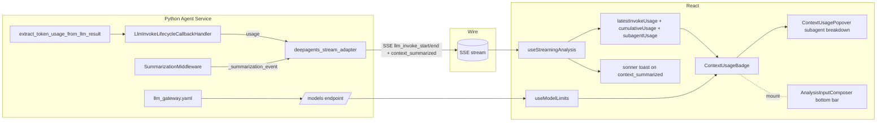
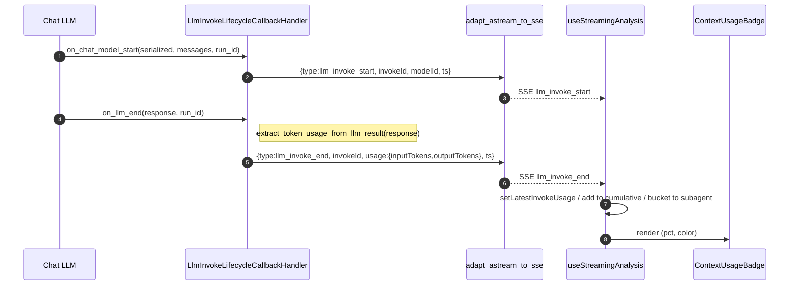
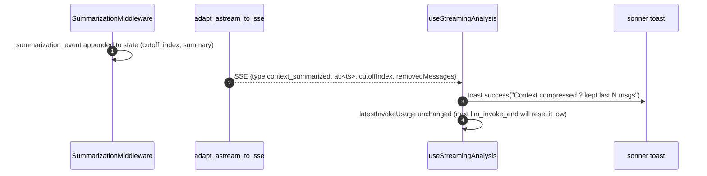
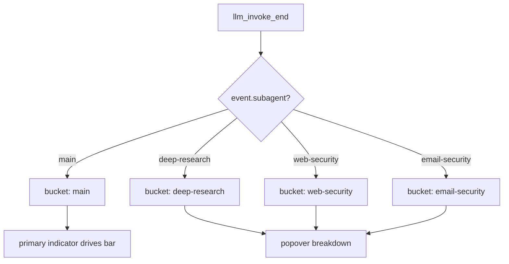

# Design ??Realtime context usage indicator

## Metadata

- **Slug**: `realtime-context-usage-indicator`
- **Date**: 2026-04-19
- **Tier**: Standard
- **Proposal**: [`proposal.md`](./proposal.md)
- **Acceptance (backend/API)**: [`acceptance.md`](./acceptance.md)
- **Acceptance (UI)**: [`acceptance-ui.md`](./acceptance-ui.md)
- **Source plan**: N/A (Path B ??standalone; no Cursor `*.plan.md` predecessor)

## Todo list

- [x] `backend-yaml-contextwindow` ??Extend `config/llm_gateway.yaml` model entries with `context_window` and `max_output_tokens` (all 3 providers, ~15 models).
- [x] `backend-models-endpoint` ??Surface `context_window` / `max_output_tokens` through `/models` (and `/v1/models` alias) response.
- [x] `backend-usage-in-sse-end` ??Modify `LlmInvokeLifecycleCallbackHandler.on_llm_end` to attach `usage: {inputTokens, outputTokens}` via `extract_token_usage_from_llm_result(response)`.
- [x] `backend-modelid-in-sse-start` ??Attach `modelId` to `llm_invoke_start` (reuse `resolve_gateway_model_id_from_chat_start`, fall back to request-scoped id).
- [x] `backend-subagent-tag-propagation` ??Ensure subagent-origin `llm_invoke_end` events preserve `usage` through `adapt_subagent_astream_to_skill_events` ??merged queue.
- [x] `backend-summarization-sse-event` ??Emit `context_summarized` SSE when `_summarization_event` private state appears in the stream (one line in `deepagents_stream_adapter.py`).
- [x] `backend-unit-tests` ??Add `test_llm_invoke_sse_usage.py`, extend `test_llm_usage_per_invoke.py` to assert events contain `usage`.
- [x] `frontend-types` ??Extend `StreamEvent` (`src/types/analysis.ts`) with `usage?` + `modelId?` on `llm_invoke_start` / `llm_invoke_end`; add `context_summarized` event.
- [x] `frontend-hook-aggregate` ??In `useStreamingAnalysis` + `useStreamingAnalysisMulti`, add `latestInvokeUsage`, `cumulativeUsage`, `subagentUsage`, `lastSummarizedAt`.
- [x] `frontend-model-limits` ??Build `useModelLimits()` reading `/models`; cache via React Query.
- [x] `frontend-badge-component` ??New `src/components/ContextUsageBadge.tsx` (+ test + storybook-lite fixture).
- [x] `frontend-badge-popover` ??New `src/components/ContextUsagePopover.tsx` for click-to-open subagent breakdown (Opt C).
- [x] `frontend-badge-mount` ??Mount `ContextUsageBadge` in `AnalysisInputComposer.tsx` between `ModelSelector` and send button.
- [x] `frontend-composer-props` ??Add `latestInvokeUsage` / `cumulativeUsage` / `subagentUsage` / `modelLimits` props to composer; plumb through `CommandCenter` from `Index.tsx`.
- [x] `frontend-summarization-toast` ??On `context_summarized` event, show sonner toast "Context compressed" + pulse animation on badge.
- [x] `frontend-i18n` ??Add keys under `t.command.contextUsage.*` in `en` / `zh` / `ja` / `ko`.
- [x] `frontend-responsive` ??Small-screen variant (only ring + %), verified at 375 / 768 / 1024.
- [x] `frontend-a11y` ??`aria-label`, keyboard focus-ring, `role="button"` for popover trigger.
- [x] `frontend-unit-tests` ??Component tests for `ContextUsageBadge`; hook tests for aggregation.
- [x] `e2e-context-indicator` ??`e2e/tests/realtime-context-usage-indicator.spec.ts`: submit prompt, await `llm_invoke_end` usage, assert badge non-zero, assert percent matches mocked values.

### Increment 2026-04-19 ? Backend persistence (replaces localStorage as authoritative source)

- [ ] `backend-migration-context-usage` ? Add `context_usage jsonb` + `context_usage_updated_at timestamptz` columns to `projects` (supabase migration + `scripts/db/init_local_db.sql` + `init_local_db_modified.sql`).
- [ ] `backend-project-schema` ? Extend `ProjectResponse` / `ProjectUpdate` pydantic models in `app/api/projects.py` with optional `context_usage` / `context_usage_updated_at`.
- [ ] `backend-project-get-returns-usage` ? `GET /projects/:id` payload includes `context_usage` (nullable) and `context_usage_updated_at` alongside existing fields.
- [ ] `backend-project-patch-accepts-usage` ? `PATCH /projects/:id` accepts `context_usage` (nullable to clear); updates `context_usage_updated_at = now()`; preserves title-only updates; `local` + `supabase` modes.
- [ ] `backend-tests-context-usage` ? `python-agent-service/tests/test_projects_context_usage.py`: round-trip save/load; null clears; cross-user rejection; concurrent PATCH idempotency (last-write-wins).
- [ ] `frontend-api-client` ? Add `projectsApi.updateContextUsage(projectId, state | null)` + enrich `projectsApi.get` return type with `context_usage` / `context_usage_updated_at`.
- [ ] `frontend-context-usage-sync` ? New `src/lib/contextUsageSync.ts`: per-project dirty flag, 20s debounce flush, immediate flush hooks (`flushNow()`), `beforeunload` + `pagehide` via `navigator.sendBeacon`.
- [ ] `frontend-sync-wire-streaming-state` ? `StreamingStateContext.updateState` triggers `scheduleBackendSync(projectId, state)` on every `contextUsage` change in addition to `saveContextUsage` localStorage write.
- [ ] `frontend-sync-hard-flush-hooks` ? Wire `flushNow(projectId)` to: `done` event, `context_summarized` event, stream abort/error, project switch, `removeState`.
- [ ] `frontend-hydrate-backend-priority` ? `useStreamingAnalysisMulti` hydration reads **both** localStorage and `projectsApi.get(...).context_usage`; pick the branch with newer `updated_at` / `context_usage_updated_at`; fallback to the non-null one when only one is present.
- [ ] `frontend-cleanup-on-delete` ? Project deletion already DELETE-cascades on backend; frontend `removeState` keeps clearing localStorage AND calls `projectsApi.updateContextUsage(projectId, null)` when context persisted independently (defensive).
- [ ] `frontend-tests-sync` ? Unit tests: debounce coalescing, four forced-flush triggers, sendBeacon payload shape.
- [ ] `frontend-tests-hydrate` ? Unit tests: hydrate picks newer of (localStorage, backend); handles "only backend" / "only localStorage" / neither.
- [ ] `e2e-backend-persistence` ? Extend `e2e/tests/realtime-context-usage-indicator.spec.ts` with a reload scenario: finish one turn ? reload page ? badge re-appears from backend (localStorage cleared via `context.clearStorage()` before reload).

## Architecture



## Flows

### Live invoke ??badge update



### Auto-summarization signal (Opt B)



### Subagent attribution (Opt C)



## Contracts

### SSE events (payload deltas vs current)

**Modified: `llm_invoke_start`**
```json
{
  "type": "llm_invoke_start",
  "id": "abcd1234",
  "invokeId": "abcd1234",
  "timestamp": 1713552345678,
  "modelId": "anthropic/claude-sonnet-4"
}
```

**Modified: `llm_invoke_end`**
```json
{
  "type": "llm_invoke_end",
  "id": "abcd1234",
  "invokeId": "abcd1234",
  "timestamp": 1713552349999,
  "usage": { "inputTokens": 12345, "outputTokens": 678 }
}
```
(`subagent` envelope tag already added by `tag_merged_subagent_sse` ??no new field.)

**New: `context_summarized`** (emitted once per summarization event)
```json
{
  "type": "context_summarized",
  "id": "evt-xyz",
  "timestamp": 1713552360000,
  "cutoffIndex": 24,
  "removedMessages": 20,
  "keptMessages": 4,
  "subagent": "main"
}
```

### HTTP ??`GET /models` response (backward-compatible extension)

```json
{
  "models": [
    {
      "id": "anthropic/claude-sonnet-4",
      "name": "Claude Sonnet 4",
      "provider": "anthropic",
      "context_window": 200000,
      "max_output_tokens": 8192
    }
  ]
}
```

### Config ??`llm_gateway.yaml` model entry (additive)

```yaml
- id: anthropic/claude-sonnet-4
  name: Claude Sonnet 4
  sdk_model: claude-sonnet-4-20250514
  context_window: 200000
  max_output_tokens: 8192
```

### HTTP ? `GET /projects/:id` response (additive, 2026-04-19 increment)

```jsonc
{
  "id": "?",
  "title": "?",
  "created_at": "?",
  "updated_at": "?",
  "context_usage": {                 // nullable ? null until first flush
    "v": 1,
    "state": { "latest": { ... }, "cumulative": { ... }, "bySubagent": [ ... ],
               "lastSummarizedAt": 1713484567890 },
    "updatedAt": 1713484800000       // client-authored monotonic timestamp
  },
  "context_usage_updated_at": "2026-04-19T12:00:00+00:00",
  "messages": [ ... ]
}
```

### HTTP ? `PATCH /projects/:id` request body (additive, 2026-04-19 increment)

```jsonc
// Any subset of these is legal. Existing title-only updates keep working.
{
  "title": "?",                      // optional, as before
  "context_usage": { "v": 1, "state": { ... }, "updatedAt": 1713484800000 }
                                     // optional; pass `null` to clear
}
```

Response matches the extended `ProjectResponse`. Server always stamps `context_usage_updated_at = now()` when `context_usage` key is present in the request (including `null`).

## Code touch list

**Backend (Python)**
- `python-agent-service/config/llm_gateway.yaml` ??add fields to every model entry (~15 rows).
- `python-agent-service/app/parsers/llm_invoke_callbacks.py` ??`on_chat_model_start` adds `modelId` to start event; `on_llm_end` / `on_llm_error` call `extract_token_usage_from_llm_result` and attach `usage` to end event. ??**risky**: this file has fragile ContextVar semantics ??do not change stack logic, only decorate emitted dicts.
- `python-agent-service/app/parsers/deepagents_stream_adapter.py` ??in the updates-stream branch, when AgentState delta contains `_summarization_event`, yield a synthetic `context_summarized` event (exactly once per unique event id).
- `python-agent-service/app/billing/model_id_from_serialized.py` ??already present; confirm it handles OpenCode and Doubao entries.
- `python-agent-service/app/main.py` (or `/app/api/models.py` if it exists) ??`/models` response now includes `context_window` + `max_output_tokens`.
- `python-agent-service/app/llm_gateway/*` ??wherever models are loaded from yaml; expose the new fields through the provider registry dataclass.
- `python-agent-service/tests/test_llm_invoke_sse_usage.py` ??**new** (test cases: usage present for Anthropic, Google, OpenCode; zero-usage fallback; subagent tag preserved).

**Frontend (TypeScript / React)**
- `src/types/analysis.ts` ??extend `StreamEvent` union; add `usage` / `modelId` on `llm_invoke_start` / `llm_invoke_end`; add `'context_summarized'` member.
- `src/hooks/useStreamingAnalysis.ts` ??expand `llm_invoke_end` case; add reducer for `context_summarized`; expose `latestInvokeUsage` / `cumulativeUsage` / `subagentUsage` / `lastSummarizedAt`.
- `src/hooks/multiAnalyzeStreamEvents.ts` ??mirror changes per session.
- `src/hooks/applyStreamingSwitch.ts` ??preserve the new fields across session switches.
- `src/hooks/useModelLimits.ts` ??**new**. React Query fetch `/models`, returns map `modelId ??{contextWindow, maxOutputTokens}`.
- `src/components/ContextUsageBadge.tsx` ??**new**. Ring-only trigger (no inline text); `title` + `aria-label` surface numbers; Radix `Popover` inside the same component hosts the breakdown.
- `src/lib/contextUsagePersistence.ts` ??**new**. Per-project `localStorage` save / load / clear for `ContextUsageState` (versioned schema `v1`).
- `src/contexts/StreamingStateContext.tsx` ??wire persistence: `updateState` writes on change, `clearState` preserves ring across turns, `removeState` clears the saved entry.
- `src/hooks/useStreamingAnalysisMulti.ts` ??hydrate persisted `contextUsage` on project mount / switch (once per project, guarded by `hydratedProjectsRef`).
- `src/components/AnalysisInputComposer.tsx` ??mount the badge in the bottom bar between `ModelSelector` and send/stop; accept new props.
- `src/components/CommandCenter.tsx` ??plumb props through.
- `src/pages/Index.tsx` ??wire `useStreamingAnalysis` outputs into `<CommandCenter>`.
- `src/i18n/locales/{en,zh,ja,ko}.ts` ??new keys under `command.contextUsage.*`.
- `src/components/__tests__/ContextUsageBadge.test.tsx` ??**new** (Vitest + RTL).
- `src/hooks/__tests__/useStreamingAnalysis.contextUsage.test.ts` ??**new**.
- `e2e/tests/realtime-context-usage-indicator.spec.ts` ??**new**.

**Backend persistence increment (2026-04-19)**
- `supabase/migrations/20260419120000_projects_context_usage.sql` ? **new**. `ALTER TABLE projects ADD COLUMN context_usage jsonb NULL, ADD COLUMN context_usage_updated_at timestamptz NULL;`
- `python-agent-service/scripts/db/init_local_db.sql` + `init_local_db_modified.sql` ? mirror the two columns on the local CREATE TABLE (idempotent `IF NOT EXISTS`).
- `python-agent-service/app/api/projects.py` ? extend `ProjectResponse`/`ProjectWithMessages` to include `context_usage` (Optional[dict]) + `context_usage_updated_at`; widen `ProjectUpdate` to accept optional `context_usage`; `PATCH` updates the two columns when provided and bumps `context_usage_updated_at = now()`; `GET /projects/:id` returns them. **Risky**: three database_mode branches (local / supabase / memory) must all be kept in lockstep ? add a tiny helper to serialise/deserialise the jsonb.
- `python-agent-service/tests/test_projects_context_usage.py` ? **new**. Round-trip, null-clear, cross-user 404, concurrent last-write-wins.
- `src/services/apiClient.ts` (or existing `projectsApi.ts`) ? add `projectsApi.updateContextUsage(projectId: string, state: ContextUsageState | null): Promise<void>`; enrich `projectsApi.get(...)` return type with `context_usage`, `context_usage_updated_at`.
- `src/lib/contextUsageSync.ts` ? **new**. Per-project 20 s debounced flush + `flushNow(projectId)` + `beforeunload` / `pagehide` `sendBeacon`. Exports `scheduleBackendSync`, `flushNow`, `flushAllNow`.
- `src/contexts/StreamingStateContext.tsx` ? in `updateState`, after `saveContextUsage(...)`, also call `scheduleBackendSync(projectId, next.contextUsage)`. In `removeState`, call `flushNow` or directly `projectsApi.updateContextUsage(projectId, null)`.
- `src/hooks/useStreamingAnalysisMulti.ts` ? upgrade hydration: after `loadContextUsage`, also call `projectsApi.get(projectId)` to compare `context_usage_updated_at`; apply the winning source. Wire `flushNow` into the `done` / `context_summarized` / abort paths and on project switch.
- `src/lib/contextUsagePersistence.ts` ? extend `StoredPayload` with an `updatedAt` generation timestamp so the hydrate compare has something to read without rehydrating the full state.
- `src/lib/__tests__/contextUsageSync.test.ts` ? **new**. Fake timers; assert debounce coalescing; assert flush triggers produce one PATCH each; `sendBeacon` fallback monkey-patch.
- `src/hooks/__tests__/useStreamingAnalysisMulti.hydrate.test.tsx` ? **new**. Two sources, newer wins.
- `e2e/tests/realtime-context-usage-indicator.spec.ts` ? extend with `E2E-06`.

## Testing strategy

### Unit / Integration

| Layer | Tool | Coverage |
|---|---|---|
| `extract_token_usage_from_llm_result` | pytest | Existing `test_billing_pricing.py` extended; test `LLMResult` paths for anthropic, openai responses, usage_metadata. |
| `LlmInvokeLifecycleCallbackHandler` | pytest | New `test_llm_invoke_sse_usage.py`; build fake `LLMResult`, assert emitted dict contains `usage` with right values; test error path; test `modelId` resolution; test no-usage fallback. |
| Stream adapter `context_summarized` emission | pytest | Craft fake `AgentState` with `_summarization_event`, run `adapt_astream_to_sse`, assert exactly one `context_summarized` SSE. |
| `/models` response | pytest (FastAPI `TestClient`) | Assert every model has both `context_window` and `max_output_tokens` as `int ??0`. |
| `useStreamingAnalysis` hook | Vitest | Feed synthetic SSE events, assert `latestInvokeUsage` / `cumulativeUsage` / `subagentUsage` update. |
| `ContextUsageBadge` | Vitest + RTL | Render for each threshold: 0 / 50 / 75 / 92 / 98 percent; assert color class and aria-label. |
| `useModelLimits` | Vitest | Mocked fetch; cache hit / miss / 404. |

### E2E scenarios

| ID | Scenario | Route / API | Key assertions |
|----|----------|-------------|----------------|
| E2E-01 | Basic prompt updates indicator | `/` (main workspace) | After submit, `[data-testid=context-usage-badge]` becomes visible and percent > 0 within 3s. |
| E2E-02 | Model switch updates divisor | `/` | Change model in `ModelSelector`; badge `aria-label` reflects new `contextWindow`. |
| E2E-03 | Popover opens with subagent breakdown | `/` | Click badge during streaming; popover lists `main` and one or more subagent rows with non-zero tokens. |
| E2E-04 | Auto-summarization toast | `/` | With injected large history (fixture pre-seeds messages), verify `toast` "Context compressed" after submit. |
| E2E-05 | Small-screen variant | `/` (viewport 375) | Only ring icon is visible, percent hidden but `aria-label` still present. |
| E2E-06 | Backend persistence survives reload | `/` | Run one turn ? `done` fires ? forcibly clear `localStorage` ? reload page ? ring reappears from `GET /projects/:id.context_usage`. |

(E2E-0x ??acceptance ids: E2E-01 ??U-01/I-02, E2E-02 ??I-03, E2E-03 ??U-06, E2E-04 ??U-05, E2E-05 ??R-01, E2E-06 ??A-06/A-08 ??see `acceptance.md`.)

## Edge cases & errors

| Case | Expected behavior |
|---|---|
| Provider returns no `usage_metadata` (rare legacy model) | `usage: {inputTokens:0, outputTokens:0}` ??badge shows `--%`, Tooltip says "provider did not report usage". |
| `on_llm_error` (LLM failed mid-stream) | Emit `llm_invoke_end` with `usage: {0,0}`; frontend keeps last good value, appends a red error dot to Tooltip. |
| Subagent stream ends without usage (streamed tool-only response) | Skip bucket update; no error. |
| User selects a model without `context_window` in yaml | Frontend falls back to **hard default 200000** + a `console.warn`; percent still renders. |
| Network race: `llm_invoke_start` modelId differs from `selectedModelId` | Display uses `llm_invoke_start.modelId` when available; falls back to `selectedModelId`. |
| `_summarization_event` appears multiple times in one session | Dedupe by `event_id`; emit `context_summarized` once per unique id. |
| Legacy persisted timeline replay (no `usage` in historic events) | No regression ??badge starts at 0 on replay; documented. |
| Very large history causes `on_chat_model_start` but no `on_llm_end` (timeout) | Existing synthetic-end path (`_ensure_llm_invoke_end_for_id`) emits `usage: {0,0}`; badge keeps last value. |

## Implementation order

1. **Backend instrumentation first** (no UI dependency):
   - `llm_gateway.yaml` additions ??`/models` ??`llm_invoke_callbacks` emit ??adapter passthrough ??`context_summarized` emit.
   - Add pytest coverage for each step.
2. **Frontend types + hook aggregation** (backed by mocked SSE fixtures):
   - `StreamEvent` types ??`useStreamingAnalysis` reducer ??Vitest coverage.
3. **Badge component in isolation**:
   - Build + test `ContextUsageBadge` and `ContextUsagePopover` standalone; snapshot thresholds.
4. **Integration into composer**:
   - Plumb props; wire i18n; responsive behavior.
5. **E2E**:
   - Draft Playwright spec with synthetic SSE via MSW-style interception (or real backend with deterministic short prompt).
6. **Regression sweep**:
   - `pytest python-agent-service/tests -k "usage or invoke"` + `npm run test` + `npm run test:e2e -- --grep realtime-context-usage-indicator`.

## Rationale

- **Why not extend the existing `llm_usage_events` DB row to feed the UI?** DB insert is async and best-effort; in-flight SSE is the canonical realtime channel. Billing remains a separate write ??no coupling.
- **Why emit usage on `llm_invoke_end` (not a new event)?** Frontend already consumes this event; one additional field is cheaper than a new round-trip, preserves ordering, and avoids two-state bugs.
- **Why skip Opt A (pre-send estimate)?** User chose `skip` in Phase 1 gating. `tiktoken` wasm adds ~1MB bundle; the naive `chars/4` would confuse users with 10??0% error at exactly the moment we want precision. Post-invoke truth-only keeps semantics simple.
- **Why two thresholds (90% warn / 95% auto)?** Aligns visually with the existing vendored `SummarizationMiddleware` default of 85% compress trigger ??user sees amber ??red ??toast-compress as a natural progression. We do **not** change the vendored 0.85 threshold; 90% / 95% are **UI-only** visual cues.
- **Why click-to-open popover (vs hover)?** User chose `click` in Phase 1 gating for mobile-friendliness; Radix `Popover` handles keyboard and focus management natively.
- **Why fraction + percent (big screen) vs percent-only (small)?** User chose `both` in Phase 1 gating. On 375px viewport the bottom bar already hosts 5+ icons ??showing `12k/200k ? 6%` adds width; ring + `%` keeps it tight.

## UI

### `ContextUsageBadge` (collapsed)

Minimal-ring variant ? the trigger shows **only** the circular progress ring.
No percent label, no fraction. Tokens + % live inside the popover; the native
`title` tooltip and `aria-label` expose numbers for mouse hover and
screen-reader users. The badge only renders when usage data exists (`null`
on idle); when it does render, it persists across turns (see Persistence below).

```text
???????
???  ??  muted ? safe (< 70% fill, 1/4 ring)
???????

???????
???  ??  amber ? warn (70?90% fill, 3/4 ring)
???????

???????
???  ??  red + pulse ? critical (?95% fill, full ring)
???????
```

Visual spec:
- Container 28?28 px (`h-7 w-7`) with `rounded-md` focus/hover backgrounds.
- SVG 20?20 px, ring radius 8, 2 px stroke, rotated ?90? (fill grows clockwise from 12).
- Two concentric circles: `stroke-opacity 0.2` track + full-colour progress.
- Severity colours (via `SEVERITY_RING_CLASS`): `muted` / `amber` / `red`. Critical severity also pulses the wrapper via `animate-pulse`.
- `title` attribute = `<percent>% of <window> ? <used>/<window>` so mouse hover still surfaces numbers without visual clutter.
- `aria-label` carries the same info for screen readers; `aria-live="polite"` keeps updates announced.

### Persistence

Per-project `ContextUsageState` is persisted to `localStorage` under
`secmanus:context-usage:v1:<projectId>` so the ring survives page reloads
and project switches (matches requirement *"???????????????"*).

- **Write** ? `StreamingStateContext.updateState` diffs `prev.contextUsage !== next.contextUsage` and calls `saveContextUsage(projectId, next.contextUsage)`. Empty states are skipped so a stale saved value is never clobbered by an idle frame.
- **Hydrate** ? `useStreamingAnalysisMulti` runs a once-per-project effect (tracked in `hydratedProjectsRef`) that calls `loadContextUsage(projectId)`. If in-memory already has `latest`, hydration is a no-op (avoids racing against a just-arrived `llm_invoke_end`).
- **Cross-turn retention** ? `clearState` (turn finalise / `resetForProject`) now carries `contextUsage` forward, and the fresh-turn branch in `startStream` preserves `prev.contextUsage` (no more `createEmptyContextUsageState()` on every new query).
- **Cleanup** ? `StreamingStateContext.removeState(projectId)` calls `clearContextUsage(projectId)` so deleting a project also drops its saved ring.
- **Schema** ? payload shape `{ v: 1, state: ContextUsageState }`. `loadContextUsage` returns `null` on unknown version, corrupted JSON, or missing `cumulative`/`bySubagent` keys, so future schema evolution never crashes the UI.

### Backend persistence (authoritative source ? 2026-04-19 increment)

The user explicitly asked to move persistence to the backend DB. `localStorage` is demoted to a **local hot cache / offline mirror**; the backend becomes the source of truth, so the ring survives cross-device / cross-browser access and `localStorage` eviction.

**Storage location** ? a new `jsonb` column on the existing `projects` table:

```sql
-- supabase/migrations/20260419120000_projects_context_usage.sql
ALTER TABLE projects
  ADD COLUMN context_usage jsonb NULL,
  ADD COLUMN context_usage_updated_at timestamptz NULL;

-- scripts/db/init_local_db.sql + init_local_db_modified.sql
-- (mirror the same two columns on the local-mode CREATE TABLE)
```

Schema of the `context_usage` payload (matches frontend `StoredPayload`):

```jsonc
{
  "v": 1,
  "state": {
    "latest": { "invokeId": "...", "modelId": "...", "subagent": null,
                "inputTokens": 123456, "outputTokens": 2345, "at": 1713484800000 },
    "cumulative": { "inputTokens": 456789, "outputTokens": 8901, "invocations": 7 },
    "bySubagent": [ { "subagentName": "__main__", "inputTokens": 456789, ... } ],
    "lastSummarizedAt": 1713484567890
  }
}
```

**Write strategy ? 20s debounce + hard flush on critical events**

| Trigger | Path | Why immediate? |
|---------|------|----------------|
| `llm_invoke_end` received | schedule/reset 20s timer | Absorb bursts during a long turn |
| Timer fires | `PATCH /projects/:id { context_usage }` | Periodic coalesced flush |
| SSE `done` | `flushNow(projectId)` | End-of-turn must be durable |
| SSE `context_summarized` | `flushNow(projectId)` | Compression is a meaningful milestone |
| Stream abort / error | `flushNow(projectId)` | Capture state before user retries |
| Active project switch | `flushNow(oldProjectId)` | Don't lose a pending turn of A when switching to B |
| `beforeunload` / `pagehide` | `navigator.sendBeacon('/projects/:id', ...)` | Survive page close; fetch+PATCH doesn't run |
| Project delete | `removeState` ? backend cascade handles row drop; frontend also calls `updateContextUsage(id, null)` as defence-in-depth |

**Why 20s?** User-selected after reviewing trade-off:
- Shorter (?2s) ? many writes during long turns, roughly 1 PATCH per LLM call.
- 20s ? in the common case, we write at most once per coalesced burst, plus one final write at `done`. Typical turn ? 1?3 backend writes instead of 10+.
- Data-loss window ? 20s worth of in-turn usage changes, and those are fully mirrored in `localStorage` so **same-device reload never loses**; only cross-device viewing of an in-progress turn can lag.

**Hydration ? two-source "newer wins"**

```text
on project open:
  ls = loadContextUsage(projectId)                    // localStorage
  be = (GET /projects/:id).context_usage payload      // backend
  pick = newerOf(ls, be) by `state.latest.at` fallback `updated_at` timestamps
  if pick: updateState(projectId, contextUsage = pick.state)
  // backend auto-returns null if column never written ? fine, ring stays hidden
```

`updated_at` comparison uses `context_usage_updated_at` for backend and `state.latest.at` (or persisted payload generation time, if added later) for localStorage. When only one source has data, that one wins. When both are missing, the ring stays hidden (unchanged from today).

**Concurrency ? last-write-wins**

No optimistic locking. Two tabs writing simultaneously ? the later PATCH overwrites. Acceptable because both tabs share the same in-memory reducer applied to the same event stream (or are far enough apart in time that the newer write is semantically correct). Documented in acceptance `A-07`.

**Cross-user safety** ? `projects.user_id` is already RLS-scoped in Supabase and filtered in local mode (`WHERE user_id = $N`). `PATCH /projects/:id` re-applies the same guard; no extra work needed.

**Touch list delta** (see `## Code touch list` below for the full list).

### `ContextUsagePopover` (expanded, click)

```text
????????????????????????????????????????
??Context usage ? anthropic/claude-... ??
????????????????????????????????????? ??
??Current round                       ??
??  main           123,456 in / 2,345 out ??
????????????????????????????????????? ??
??Cumulative this turn                ??
??  main           456,789 / 8,901    ??
??  deep-research   89,012 / 1,234    ??
??  web-security     1,234 /   567    ??
????????????????????????????????????? ??
??Last compressed: 14:23:07 (??8 msgs)??
????????????????????????????????????????
```

### Component state tree

```ts
type ContextUsageState = {
  latestInvokeUsage: {
    invokeId: string;
    modelId?: string;
    subagent?: string;
    inputTokens: number;
    outputTokens: number;
    at: number;
  } | null;
  cumulativeUsage: { inputTokens: number; outputTokens: number };
  subagentUsage: Record<string, { inputTokens: number; outputTokens: number }>;
  lastSummarizedAt: number | null;
};
```

### Pseudocode ??reducer additions (inside `useStreamingAnalysis.ts`)

```ts
// in SSE switch:
case 'llm_invoke_end': {
  const u = event.usage;
  const sub = event.subagent ?? 'main';
  if (u) {
    if (sub === 'main') {
      setLatestInvokeUsage({
        invokeId: event.invokeId!,
        modelId: event.modelId ?? lastStartModelIdRef.current,
        subagent: sub,
        inputTokens: u.inputTokens,
        outputTokens: u.outputTokens,
        at: event.timestamp ?? Date.now(),
      });
    }
    setSubagentUsage(prev => ({
      ...prev,
      [sub]: {
        inputTokens: (prev[sub]?.inputTokens ?? 0) + u.inputTokens,
        outputTokens: (prev[sub]?.outputTokens ?? 0) + u.outputTokens,
      },
    }));
    setCumulativeUsage(prev => ({
      inputTokens: prev.inputTokens + u.inputTokens,
      outputTokens: prev.outputTokens + u.outputTokens,
    }));
  }
  break;
}
case 'context_summarized': {
  setLastSummarizedAt(event.timestamp ?? Date.now());
  toast.success(t.command.contextUsage.compressedToast);
  break;
}
```

### Pseudocode ??badge render

```tsx
const pct = contextWindow > 0
  ? Math.min(100, (latestInvokeUsage?.inputTokens ?? 0) * 100 / contextWindow)
  : 0;
const color =
  pct >= 95 ? 'text-red-500 animate-pulse' :
  pct >= 90 ? 'text-red-500' :
  pct >= 70 ? 'text-amber-500' : 'text-muted-foreground';
```

## Design review handoff

- **`target.local.yaml`** (gitignored) must set `base_url: http://localhost:5173` plus the logged-in route for `/design-review`.
- Mockups: **deferred** (see `## Mockups deferred` below).
