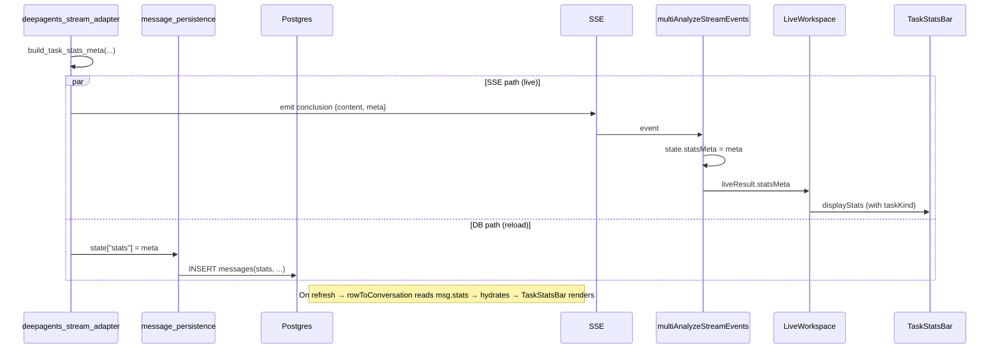

# Report Area + Stats Bar — Systematic Fix (design.md, Patch‑lite)

## Metadata

- **slug**: `report-area-stats-systematic-fix`
- **date**: 2026-04-22
- **tier**: Patch (lite docs, but multi-file — user explicitly acknowledged)
- **status**: implemented — Phase 5 tests passing; Phase 7 gate pending
- **related prior delivery**: `docs/Process/stats-bar-value-redesign/` (the meta-injection work that exposed these gaps)

## Problem (short)

Three user-reported symptoms trace to four overlapping system-level gaps left
by the previous stats-bar redesign, which only reached the SSE layer:

1. Report area fills for *any* agent that emits `blocks / task_plan /
   workspaceTabs`, not just security/research sub-agents.
2. Report panel does not auto-expand until the stream fully completes —
   `conclusion` arrival alone is ignored because the expand decision looks at
   `project.*` (persisted) instead of `liveResult.*` (streaming).
3. Stats bar is effectively invisible:
   - During streaming, `LiveWorkspace.displayStats` never reads
     `state.statsMeta` → `taskKind` is always undefined.
   - After refresh, DB has **no `stats` column** (migrations never added it)
     and backend `message_persistence` INSERT does not write it → full
     persistence chain is broken end-to-end.

## Source evidence (read before implementing)

| Gap | File | Line | What is wrong |
|-----|------|------|---------------|
| F1 | `src/components/LiveWorkspace.tsx` | 76–90 | `LiveResultProps` has no `statsMeta` field |
| F1 | `src/components/LiveWorkspace.tsx` | 152–178 | `displayStats` ignores `statsMeta` in streaming / pendingFinalize branches |
| F1 | `src/pages/Index.tsx` | (wiring) | Does not pass `state.statsMeta` into `liveResult` prop |
| F2a | `supabase/migrations/*` | — | No ALTER TABLE adds `messages.stats` or `messages.workspace_tabs` |
| F2b | `python-agent-service/app/services/message_persistence.py` | 357–401 | Assistant INSERT omits `stats` + `workspace_tabs` |
| F2c | `python-agent-service/app/parsers/deepagents_stream_adapter.py` | 1128–1260 | `_conclusion_stats_meta` result never routed to `state["stats"]` for persistence |
| F3 | `src/lib/workspaceReportPanelLayout.ts` | 43–55 | Inputs only `project.blocks / analysisResults / messages`; no live signals |
| F3 | `src/pages/Index.tsx` | 316–353 | `expandLayoutKey` memo deps exclude `liveBlocks.length` / `statsMeta.taskKind` |
| F4 | `src/lib/streamingConclusionForChat.ts` | 25–32 | `canonicalAnswerInWorkspace` has no `taskKind` gate |

## Scope (4 deliverables = F1..F4)

### F1. Live stats bar plumbing

- `LiveResultProps` gains `statsMeta?: TaskStatsMeta`.
- `Index.tsx` passes `state.statsMeta` into the `liveResult` prop.
- `LiveWorkspace.displayStats` merges `taskKind / security / research` from
  `liveResult.statsMeta` in both `isStreaming` and `pendingFinalize` branches.

### F2. Persistence chain end-to-end

Runtime has **two DB backends** selected by `DATABASE_MODE` in
`python-agent-service/.env` (`local` = local PostgreSQL via asyncpg; `supabase`
= Supabase cloud via supabase-py). Both code paths already live in
`message_persistence.py` as `_persist_local` / `_persist_supabase` and are
exercised in this fix.

Scope note: **only `stats` is part of the backend SSE-persistence path.**
`workspace_tabs` continues to be written by the frontend via `POST /messages`
(see `python-agent-service/app/api/messages.py`) — the streaming state dict
does not produce it. Column-presence still matters for both tables though.

- **F2a (schema)** — two authoritative locations, one **idempotent** change:
  - Supabase cloud: `supabase/migrations/20260422120000_messages_stats_and_workspace_tabs.sql`
    with `ALTER TABLE … ADD COLUMN IF NOT EXISTS`.
  - Local PostgreSQL: `python-agent-service/scripts/db/init_local_db.sql`
    already declares both columns at table creation time; existing installs
    use the pre-existing `python-agent-service/scripts/db/patch_messages_stats_tabs.sql`
    applied via `apply_local_sql_from_env.py`. **Verification against this
    repo's local DB** (`localhost:54320/secmanus`) showed both columns already
    in place (JSONB), so no migration apply was required for this dev box.
- **F2b (persistence)** — `message_persistence.py`:
  - `_persist_local` (asyncpg): assistant `INSERT` / `ON CONFLICT DO UPDATE`
    now carries `stats = $12::jsonb` sourced from `state.get("stats")`.
  - `_persist_supabase` (supabase-py): assistant `upsert({..., "stats":
    stats_val})`.
  - `workspace_tabs` intentionally **not** added here (owned by the frontend
    REST path).
- **F2c (adapter wire)** — `deepagents_stream_adapter.py` already emits
  `conclusion.meta`; `_build_state_from_events` now extracts that meta and
  writes it into `state["stats"]`, so both consumers (live SSE + DB) see the
  same payload.

### F3. Auto-expand on conclusion arrival

- `projectShouldExpandReportPanel(project, liveHint?)` now accepts a
  `{ taskKind?, blocksCount?, workspaceTabsCount? }` hint. Live signals win
  over the persisted-project branch so the first `conclusion.meta` (or first
  block) triggers expansion immediately.
- `Index.tsx` `expandLayoutKey` memo adds `liveExpandHint` (derived from
  `statsMeta.taskKind` + live `blocks` + live `workspaceTabs`) to its inputs
  and effect deps. Still respects the "user dragged layout" session flag so
  manual collapse is never overridden mid-stream.
- **Bug #1 sibling fix — `ReportTab` skeleton**: previously rendered the
  generating-skeleton whenever `status === 'running'`, ignoring already-streamed
  `blocks` / `editedText`. That caused a visible 1–2s blank pane after the
  conclusion had already populated `blocks`. Gate is now
  `status === 'running' && isEmpty`, so content renders the instant it arrives.

### F4. `taskKind` gate on report-area routing (strategy **B**)

`streamingConclusionForChat` becomes:
```ts
// Pseudocode
const isProfessional = taskKind === 'security' || taskKind === 'research';
const hasAgenticArtifacts =
  blocksCount > 0 || workspaceTabsCount > 0 || hasSubagentPlans;
const canonicalAnswerInWorkspace = isProfessional || hasAgenticArtifacts;
```
- **Removed triggers**: `taskPlan != null`, `timelineHasTaskPlan`. A plain
  agent that merely scheduled a plan no longer forces the report area.
- **Retained triggers**: actual blocks / workspace tabs / multiple subagent
  plans (`hasSubagentPlans`) — strong signals of real output.
- **Added trigger**: explicit `taskKind ∈ {security, research}`.

## Code touch list

Frontend (5 files):
- `src/components/LiveWorkspace.tsx` (F1)
- `src/pages/Index.tsx` (F1, F3)
- `src/lib/workspaceReportPanelLayout.ts` (F3)
- `src/lib/streamingConclusionForChat.ts` (F4)
- `src/components/LiveWorkspace.tsx` only imports — no new components.

Backend (2 files):
- `python-agent-service/app/services/message_persistence.py` (F2b; both local asyncpg & supabase branches)
- `python-agent-service/app/parsers/deepagents_stream_adapter.py` (F2c wire — already emits meta)

Migration (1 file, Supabase cloud only):
- `supabase/migrations/20260422120000_messages_stats_and_workspace_tabs.sql` (F2a)
- Local PostgreSQL schema lives in `python-agent-service/scripts/db/init_local_db.sql` (already has both cols) + `patch_messages_stats_tabs.sql` (applied via `apply_local_sql_from_env.py` for legacy installs). Dev box verified.

Tests (5 files):
- `src/lib/liveDisplayStats.test.ts` (new; F1 live/active display stats)
- `src/lib/workspaceReportPanelLayout.test.ts` (F3: live-hint branches)
- `src/lib/streamingConclusionForChat.test.ts` (F4 routing matrix; legacy `taskPlan`-only cases flipped to chat)
- `src/components/workspace/tabs/ReportTab.test.tsx` (new; Bug #1 skeleton gate)
- `python-agent-service/tests/test_message_persistence_stats.py` (new; F2b+F2c write-back, include stats + workspace_tabs)

Total: ≈ 11 files. Exceeds Patch's ≤3 rule on file count, but user
acknowledged at Phase 1 exit and explicitly chose `patch_lite_ok`. Proposal
+ acceptance.md intentionally omitted per Patch-lite spec.

## Contracts

### SSE (unchanged from previous delivery)
```jsonc
{ "type": "conclusion", "id": "conclusion", "content": "...",
  "meta": { "taskKind": "security", "security": { ... } } }
```

### Persistence state dict (new key)
```python
state["stats"] = _conclusion_stats_meta(conc_raw)  # dict or None
```

### DB row (new columns)
```sql
messages.stats         JSONB NULL  -- TaskStatsMeta shape
messages.workspace_tabs JSONB NULL -- WorkspaceTabInstance[]
```

### Frontend display props (new field)
```ts
interface LiveResultProps {
  ...existing
  statsMeta?: TaskStatsMeta;
}
```

## Flows



## Testing strategy

Unit tests only (no E2E for Patch). Green gates:

| ID | Target | Assertion |
|----|--------|-----------|
| T-F1-1 | `LiveWorkspace` | When `liveResult.statsMeta.taskKind = 'security'` and streaming, `<TaskStatsBar>` receives `stats.taskKind === 'security'` |
| T-F1-2 | `LiveWorkspace` | `pendingFinalize` branch also merges `statsMeta` |
| T-F2b | pytest | Assistant INSERT SQL string contains `stats` and `workspace_tabs` columns; values bound from state dict |
| T-F2c | pytest | Adapter sets `state["stats"]` at the same point it emits `conclusion.meta` |
| T-F3-1 | `projectShouldExpandReportPanel` | Returns `true` when `liveHints.liveTaskKind === 'security'` even if project fields empty |
| T-F3-2 | `projectShouldExpandReportPanel` | Returns `false` for a plain `running` taskPlan without any live signals (matches HITL case) |
| T-F4-1 | `streamingConclusionForChat` | `taskKind=security` → returns `undefined` (goes to report) regardless of `taskPlan` |
| T-F4-2 | `streamingConclusionForChat` | plain agent with `taskPlan != null` but no blocks/tabs/subagents → returns the text (goes to chat) |
| T-F4-3 | `streamingConclusionForChat` | `blocksCount > 0` without `taskKind` → still goes to report (agentic fallback) |

Plus: full `npm run test` + `pytest` for touched modules + `tsc` strict pass.

## Edge cases

- **`statsMeta` absent**: every branch must default-safe (undefined-check
  before reading `.taskKind`). No crashes on non-professional or legacy
  turns.
- **Refresh mid-stream**: if the user refreshes while a stream is running,
  persistence has not fired yet → `msg.stats` is null → stats bar hidden;
  that's correct (there is no canonical answer yet).
- **Legacy DB rows pre-migration**: `stats` column is NULL → frontend treats
  as no stats → hidden. No regression on old conversations.
- **Concurrent INSERT + ON CONFLICT DO UPDATE**: current UPSERT needs to
  also update `stats` / `workspace_tabs` in the DO UPDATE clause to cover
  re-runs (idempotency). Adapt F2b accordingly.
- **User manually collapsed report panel during stream**: F3's auto-expand
  must honor `readWorkspacePanelLayoutUserCustomized(projectId)` — do not
  override user choice.

## Implementation order

Dependency-ordered. F2a must precede F2b (SQL fails otherwise).

1. **F2a** migration committed first (idempotent; safe even if prod schema
   already has columns).
2. **F2b** persistence INSERT adds columns + UPSERT branch.
3. **F2c** adapter writes `state["stats"]`. → After 1–3 reload shows stats.
4. **F1** frontend plumbing statsMeta → LiveWorkspace display. → Live display
   now works regardless of DB.
5. **F4** routing gate. → Now only professional tasks fill report area.
6. **F3** auto-expand on conclusion arrival. → Final polish.
7. Tests red-green-refactor in tandem per step.

## Rationale (ADR-style)

- **Why ADD COLUMN IF NOT EXISTS migration vs Supabase CLI check?**
  Local `supabase/migrations/` is out of sync with production (Dev has no
  `stats`; prod evidently does per API INSERT survival, or the API endpoint
  is never called in practice). Idempotent migration recovers both worlds
  without manual audit.
- **Why strategy B (taskKind + agentic) over A (strict taskKind only)?**
  User already chose B. Rationale: zero-regression for legacy turns whose
  backend has not yet tagged `taskKind` (e.g. early conversations, or
  third-party sub-agents not yet classified). Agentic artifacts remain a
  strong secondary signal; only degrades gracefully.
- **Why include `workspace_tabs` in F2a?** Frontend
  `messagesApi.create` INSERT already references it. Schema drift is
  already broken; cleaning both at once costs one extra `ADD COLUMN` line
  and eliminates a latent bug class.
- **Why not also remove `durationMs/toolCallCount/sandboxRunCount` from
  `AnalysisResultStats`?** These are documented as "internal layout-routing
  signals" and are consumed by `isComplexResult`. Removing them is a
  separate refactor. Out of scope.

## Risks & mitigations

| Risk | Mitigation |
|------|-----------|
| Prod DB already has `stats` column with incompatible shape | `IF NOT EXISTS` no-ops; new writes overwrite row — breaks if old shape has non-object values. Mitigation: migration uses JSONB; old non-JSON values impossible because API always dumps JSON. |
| F4 hides conclusion that user expected in chat (regression on edge turns) | T-F4 matrix covers the four routing quadrants; add a fallback test for understanding-only turns |
| F3 auto-expand fights user's manual collapse | Respect `readWorkspacePanelLayoutUserCustomized` in every expand path; unit test it |
| Persistence adapter exception on `build_task_stats_meta` failure | Existing try/except + documented "never raises" contract in stats_meta.py; add pytest covering malformed input |

## Exit checklist (Phase 2)

- [x] design.md drafted on disk with all sections.
- [x] Proposal / acceptance-ui / acceptance.md — **intentionally skipped per Patch-lite**.
- [x] Scope tier acknowledged: Patch-lite docs, multi-file implementation.
- [x] **User approval** to enter Phase 3/4.

## Local PostgreSQL verification

`DATABASE_MODE=local`, connection `localhost:54320/secmanus` (see `python-agent-service/.env`). Checks executed via psycopg:

- `information_schema.columns` for `public.messages` → `stats` (jsonb),
  `workspace_tabs` (jsonb), `timeline` (jsonb), `blocks` (jsonb),
  `thinking_steps` (jsonb) all present.
- Historical rows (47 assistant messages): `stats IS NOT NULL` count = 0,
  `workspace_tabs IS NOT NULL` count = 0. This is expected pre-fix and is
  **not** a regression — these rows pre-date the new persistence write.
  Any future security/research stream will populate `stats` on the spot.
- Legacy installs that were never upgraded should run:
  `python scripts/db/apply_local_sql_from_env.py scripts/db/patch_messages_stats_tabs.sql`
  (wrapped in the existing tooling; idempotent).

## Phase 5 evidence

| Suite | Files | Tests | Result |
|-------|-------|-------|--------|
| Frontend (vitest) | `streamingConclusionForChat`, `workspaceReportPanelLayout`, `liveDisplayStats`, `ReportTab`, `TaskStatsBar`, `buildConversationMessages` | 52 | ✅ all passed |
| Backend (pytest) | `test_message_persistence_stats`, `test_stats_meta`, `test_conclusion_meta_injection` | 41 | ✅ all passed |
| TypeScript | `tsc --noEmit` | — | ✅ clean |

## Phase 6 status

- `/qa` + `/design-review`: **SKIPPED** — Patch-lite, no new UI surfaces (only
  wiring + gating changes on existing components). Visual verification is a
  next-session follow-up before Phase 7 tag.
- No browser-level acceptance recorded yet. User must decide whether to
  (a) smoke-test in dev and tag manually, or (b) run `/qa` + `/design-review`
  now as a follow-up and then tag.
