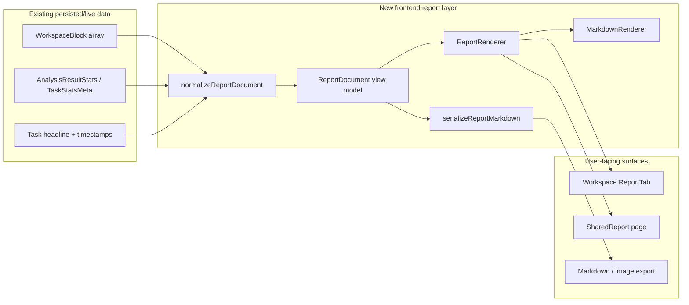
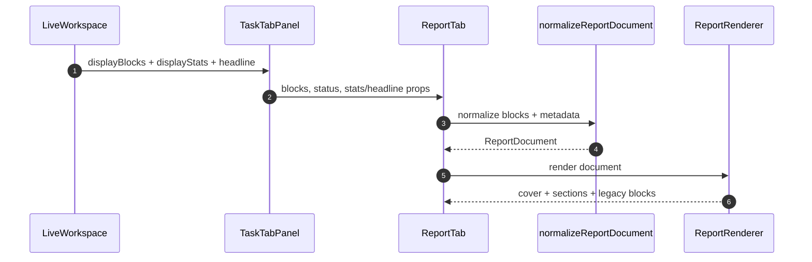
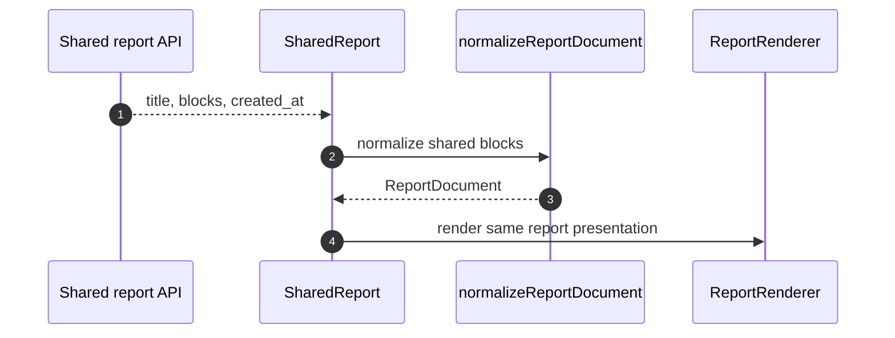
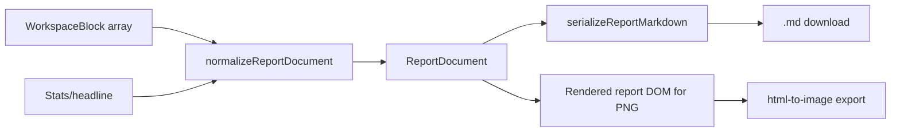

# Design — Report Content & Display Upgrade

## Metadata

- **Slug**: `report-content-display-upgrade`
- **Date**: 2026-04-25
- **Tier**: Standard
- **Proposal**: [`proposal.md`](./proposal.md)
- **Acceptance (backend/data contracts)**: [`acceptance.md`](./acceptance.md)
- **Acceptance (UI)**: [`acceptance-ui.md`](./acceptance-ui.md)
- **Source plan**: N/A (Path B — standalone plan from delivery-pipeline Phase 1 exploration).
- **Scope decision**: This delivery intentionally excludes a standalone report agent.

## Todo list

- [x] `report-renderer-audit` — Confirm all report block renderers used by workspace, shared report, and export paths.
- [x] `report-document-types` — Add a frontend-only normalized report view model that wraps legacy `WorkspaceBlock[]` with cover, template, sections, and markdown fallback.
- [x] `report-normalizer` — Implement pure normalization from `WorkspaceBlock[]` + stats/headline metadata into `ReportDocument`.
- [x] `markdown-renderer-unify` — Create a shared markdown renderer using `react-markdown` and replace the hand-written markdown parsing in `AnalysisBlock`.
- [x] `report-cover-layout` — Add a report cover/header area with title, template label, generated time, task kind, and severity/research chips when available.
- [x] `report-section-layout` — Update `ReportTab` to render professional sections, empty/loading states, and legacy block fallback.
- [x] `shared-report-parity` — Make `SharedReport` use the same renderer and include `analysis` blocks.
- [x] `report-export-normalize` — Route Markdown export through the normalized report serialization instead of duplicating block conversion logic inside `LiveWorkspace`.
- [x] `report-i18n-copy` — Add report template labels to all locale files and pass localized copy into report normalization where rendered.
- [x] `report-unit-tests` — Add/extend Vitest coverage for normalization, markdown rendering, shared report parity, and export serialization.
- [x] `report-e2e-smoke` — Add a focused Playwright smoke scenario for report viewing/share rendering if local auth and backend are available.
- [x] `acceptance-signoff` — Fill `acceptance*.md` sign-off only after Phase 5/6 verification.

## Architecture

The implementation keeps the existing backend and persistence path intact. The frontend introduces a report presentation layer between raw `WorkspaceBlock[]` and visible UI.



### Key design choice

The report protocol is a **frontend view model** in this delivery. It does not require backend migration or a report agent. Existing reports continue to load from `blocks`.

## Flows

### Workspace render flow



### Shared report parity flow



### Export flow



## Contracts

### Frontend `ReportDocument`

This model must be flexible enough not to constrain report content. Stable top-level fields describe common report metadata; arbitrary content remains under `sections[].blocks`.

```typescript
export interface ReportDocument {
  schemaVersion: 1;
  id: string;
  title: string;
  templateId: ReportTemplateId;
  generatedAt?: string;
  cover?: ReportCover;
  summary?: ReportSummary;
  sections: ReportSection[];
  artifacts?: ReportArtifact[];
  markdownFallback: string;
}

export type ReportTemplateId =
  | 'security_analysis'
  | 'research_brief'
  | 'executive_summary'
  | 'generic_analysis';

export interface ReportSection {
  id: string;
  title: string;
  kind:
    | 'executive_summary'
    | 'finding'
    | 'evidence'
    | 'recommendation'
    | 'timeline'
    | 'source'
    | 'appendix'
    | 'custom';
  blocks: ReportContentBlock[];
}

export type ReportContentBlock =
  | { type: 'markdown'; markdown: string }
  | { type: 'legacy_workspace_block'; block: WorkspaceBlock }
  | { type: 'metric_cards'; metrics: ReportMetric[] }
  | { type: 'custom'; renderer: string; payload: unknown };
```

### Normalization rules

- `summary` blocks map to an executive summary section and may also influence cover tone.
- `analysis` blocks remain markdown blocks and must not be dropped.
- `text` heading blocks start or label sections when possible.
- `log`, `decoder`, and `intel` blocks remain legacy workspace blocks for exact rendering.
- Unknown future block types are preserved through `legacy_workspace_block` or a safe fallback section.
- If normalization fails, UI renders the original block list using existing block components.

### Markdown renderer contract

- Use the existing `react-markdown` dependency.
- Apply report-specific prose classes, not chat message classes.
- Support headings, paragraphs, lists, ordered lists, code fences, inline code, links, blockquotes, horizontal rules, and tables if supported by the dependency/runtime.
- Links open safely with `target="_blank"` and `rel="noopener noreferrer"` when customized.

### Template presets

Initial templates are view presets only:

- `security_analysis`: cover emphasizes severity/risk, findings, evidence, recommendations, appendices.
- `research_brief`: cover emphasizes sources/freshness, key findings, recommendations, limitations.
- `executive_summary`: compact summary-first layout.
- `generic_analysis`: neutral layout for non-classified reports.

## Code touch list

Likely frontend files:

- `src/types/analysis.ts` — add `ReportDocument` view-model types.
- `src/lib/reportDocument.ts` — pure normalization and markdown serialization.
- `src/lib/reportDocument.test.ts` — normalization/serialization tests.
- `src/components/workspace/MarkdownRenderer.tsx` — shared markdown renderer.
- `src/components/workspace/ReportRenderer.tsx` — report cover and section rendering.
- `src/components/workspace/AnalysisBlock.tsx` — replace hand-written markdown parsing.
- `src/components/workspace/tabs/ReportTab.tsx` — render normalized report document.
- `src/components/workspace/tabs/ReportTab.test.tsx` — extend component behavior tests.
- `src/components/workspace/TaskTabPanel.tsx` — pass stats/headline metadata if needed.
- `src/components/LiveWorkspace.tsx` — export serialization path and report metadata props.
- `src/hooks/useShareReport.ts` — preserve/share normalized content if needed, but keep API compatible.
- `src/pages/SharedReport.tsx` — shared renderer parity and `analysis` block support.
- `src/pages/SharedReport.test.tsx` or colocated test — shared report rendering.
- `src/i18n/locales/en.ts`, `zh.ts`, `ja.ts`, `ko.ts` — new copy.

Potential backend files:

- No required backend code for MVP. Backend acceptance remains focused on existing shared-report API compatibility.

Risky areas:

- ContentEditable editing currently stores plain `innerText`; this delivery should not expand editing semantics beyond preserving existing behavior.
- Markdown rendering must not introduce unsafe HTML execution.
- Shared reports must remain compatible with existing persisted `blocks` payloads.

## Testing strategy

### Unit/component tests

- `reportDocument.test.ts`
  - Converts an `analysis` block into a markdown section.
  - Preserves log/decoder/intel blocks.
  - Selects security/research/generic templates from metadata.
  - Produces stable markdown export text.
  - Falls back safely on empty/unknown blocks.
- `MarkdownRenderer.test.tsx`
  - Renders headings, lists, links, code blocks, and blockquotes.
- `ReportTab.test.tsx`
  - Keeps current skeleton behavior.
  - Renders cover and analysis markdown when blocks arrive.
  - Keeps edited text behavior stable.
- `SharedReport.test.tsx`
  - Renders `analysis` blocks through the same report renderer.
  - Shows not-found/loading states unchanged.

### Integration tests

- Existing `npm run test` should cover all changed frontend behavior.
- Backend pytest is not required unless shared-report API code changes.

### E2E scenarios

| ID | Scenario | Route / API | Key assertions |
|----|----------|-------------|----------------|
| E2E-01 | Completed security/research result displays as professional report | `/` workspace | Report tab has cover, section hierarchy, markdown body, and no missing analysis content |
| E2E-02 | Shared report renders same main analysis content | `/share/:token` | Shared page shows title, generated metadata, analysis markdown, and legacy blocks |
| E2E-03 | Export markdown uses normalized report content | Workspace export action | Downloaded markdown includes cover title, summary/sections, and analysis body |

If local auth/shared-link setup is unavailable in Phase 5, document the skipped E2E reason and cover with component tests plus Phase 6 exploratory QA.

## Edge cases & errors

- Empty running report keeps the existing skeleton.
- Empty completed report keeps a clear empty state.
- Old shared reports with only legacy blocks still render.
- Reports with only one large `analysis` markdown block still get a cover and readable body.
- Unknown block types do not crash the page.
- Very long headings wrap without breaking layout.
- Long code blocks scroll horizontally inside the content area.
- Export path should not include hidden UI controls.
- Markdown fallback is always available for serialization.

## Implementation order

1. Add tests for normalization and current shared report `analysis` block gap.
2. Add `ReportDocument` types and `normalizeReportDocument`.
3. Add shared `MarkdownRenderer`.
4. Replace `AnalysisBlock` custom parser with shared renderer.
5. Add `ReportRenderer` and upgrade `ReportTab`.
6. Update shared report page to use the same renderer.
7. Update markdown export serialization.
8. Add/adjust i18n keys and accessibility labels.
9. Run unit tests and then E2E/QA per delivery pipeline.

## Pseudocode

```typescript
function normalizeReportDocument(input: NormalizeReportInput): ReportDocument {
  const templateId = chooseTemplate(input.stats, input.blocks);
  const title = input.headline || firstHeading(input.blocks) || defaultTitle(templateId);
  const sections: ReportSection[] = [];

  for (const block of input.blocks) {
    if (block.type === 'summary') {
      appendSection(sections, 'executive_summary', block.title, [
        { type: 'legacy_workspace_block', block },
      ]);
      continue;
    }
    if (block.type === 'analysis') {
      appendSection(sections, 'custom', block.title || 'Analysis', [
        { type: 'markdown', markdown: block.content },
      ]);
      continue;
    }
    appendSection(sections, 'appendix', labelForBlock(block), [
      { type: 'legacy_workspace_block', block },
    ]);
  }

  return {
    schemaVersion: 1,
    id: input.id,
    title,
    templateId,
    generatedAt: input.generatedAt,
    cover: buildCover(templateId, input),
    sections,
    markdownFallback: serializeSectionsToMarkdown(sections),
  };
}
```

## Rationale

- **Why not a report agent now?** The user explicitly scoped this delivery to content and display optimization. A report agent would add latency, cost, prompt drift, and another failure mode. The plan leaves room for a future `report-compiler` but does not require it.
- **Why frontend view model first?** Existing backend already emits and persists enough content for a major UX improvement. A frontend-only normalization layer reduces blast radius and keeps old reports compatible.
- **Why not fixed top-level `findings/evidence/recommendations` arrays?** Fixed report schemas can constrain research and executive reports. A `sections[] + content blocks` design preserves flexibility while still enabling richer rendering.
- **Why keep markdown fallback?** Markdown is the compatibility layer for existing reports, export, and unstructured AI output.

## UI

### Information hierarchy

1. Report cover: title, template label, generated time, high-level task metadata.
2. Primary summary: summary block or first meaningful report section.
3. Main body: markdown sections with strong typographic hierarchy.
4. Evidence/artifacts: logs, decoder output, intel cards, workspace-derived appendices.
5. Footer/export/share controls remain in existing workspace chrome.

### Visual direction

- App UI, not marketing UI: calm surface hierarchy, readable density, minimal decorative gradients.
- Reuse existing shadcn/Tailwind vocabulary: `border`, `muted`, `card`, `primary`, `foreground`, `muted-foreground`.
- Avoid generic AI card grids. Cards are used only for semantically distinct report pieces, such as cover, summary, or evidence.
- Typography should make reports scannable by headings alone.

### Interaction states

| Feature | Loading | Empty | Error | Success | Partial |
|---------|---------|-------|-------|---------|---------|
| Workspace report | Existing animated skeleton | Existing no-report state, improved copy if needed | Render fallback block list if normalization fails | Cover + sections | Streamed blocks render immediately |
| Shared report | Existing spinner | N/A | Existing not-found state | Same renderer as workspace | Legacy blocks render even without metadata |
| Export | Disabled while running | Hidden when no report | Toast/log error through existing path | Download normalized markdown/image | Markdown fallback if section serialization fails |

### Responsive and accessibility

- Report body max width remains readable on desktop.
- On narrow widths, cover metadata stacks vertically.
- All controls keep keyboard focus visibility.
- Main report uses semantic landmarks/headings where possible.
- Touch targets for report actions should stay at least 36px in current desktop chrome; mobile should not introduce smaller targets.

## Design review handoff

- **UI scope**: `ReportTab`, shared report page, markdown rendering, cover/section layout, export/share consistency.
- **Target route**: workspace route with a completed analysis, plus `/share/:token` for shared report rendering.
- **Mockups**: deferred by user confirmation on 2026-04-25.
- **Design completeness self-review**: 7/10 before this plan (visual goal existed but states/protocol were underspecified), 8.5/10 after this plan. Remaining risk is visual polish without reference screenshots; Phase 6 `/design-review` must validate the implemented result.

## Mockups deferred

The user selected "skip mockups" for this delivery on 2026-04-25. Visual acceptance will rely on `acceptance-ui.md`, implementation screenshots from Phase 6, and `/design-review`.

