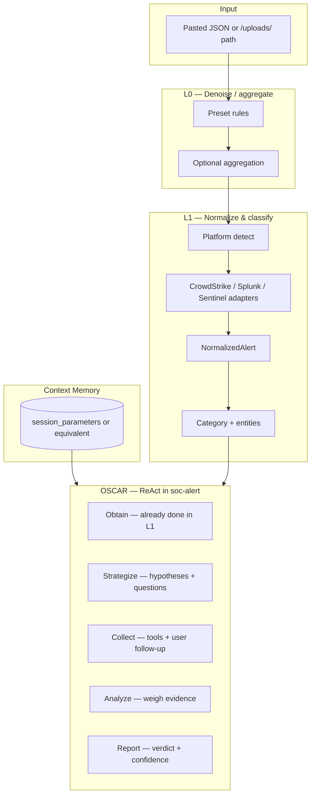
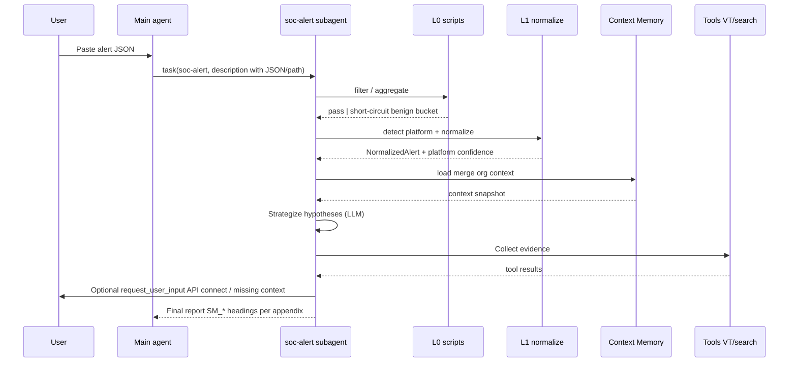
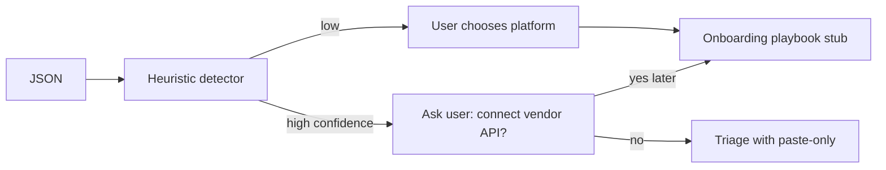

## Metadata

- **Slug:** `soc-alert-oscar-phase1`
- **Related:** [proposal.md](./proposal.md), [acceptance.md](./acceptance.md)

> **Path:** No separate Cursor `*.plan.md` was used for this delivery. **`design.md` is the implementation source of truth.**

## Todo list

Implementation backlog (check off in Phase 4):

- [ ] **l0-rules-module** — Add L0 preset filters + optional time-window aggregation (Python module under bundle `scripts/`, configurable list; English comments).
- [ ] **adapter-registry** — Introduce `AlertPlatformAdapter` protocol + registry; register `crowdstrike`, `splunk`, `sentinel`, `unknown`.
- [ ] **normalize-three-platforms** — Implement normalization for CrowdStrike Falcon, Splunk alert-shaped JSON, Sentinel alert/incident JSON; unit tests with fixtures.
- [ ] **classify-alert** — Map normalized payload to coarse category (`identity` | `endpoint` | `network` | `cloud` | `email` | `unknown`) + entity extraction helpers.
- [ ] **hypothesis-templates** — Script or structured data: per-category default competing hypotheses + investigation question seeds (used by agent + tests).
- [ ] **platform-auto-detect** — Heuristic detector (field signatures); returns `platform` + `confidence`; wire into SKILL workflow.
- [ ] **connector-onboarding-flow** — Document + prompt flow: after detect or user pick, emit “connect API?” branch; stub module listing required env vars / doc links (no secrets in repo).
- [ ] **context-memory-store** — Persist org context: minimal schema + read/write via `session_parameters` (or agreed store); merge into triage prompt context.
- [ ] **rewrite-agent-md** — `subagents/official/soc-alert/AGENT.md`: OSCAR + hypothesis rules + uncertainty gates.
- [ ] **rewrite-skill-md** — `skills/soc-alert/SKILL.md`: L0→L1→OSCAR playbook, platform tables, Context Memory usage, output schema for verdict report.
- [ ] **refactor-parse-scripts** — Replace/extend `parse_siem_alert.py` into layered modules (`normalize`, `l0_filter`, `detect_platform`) without breaking imports used in tests.
- [ ] **master-routing-hints** — Update `MASTER_AGENT.md` / registry description if needed so main agent passes paths + platform hint when obvious.
- [ ] **pytest-coverage** — Fixtures per vendor + L0 + detector + normalization invariants.

## Architecture

The `soc-alert` subagent remains a **standard** registry entry: ReAct loop with **SkillsMiddleware**, **FilesystemMiddleware**, and shared **common tools**. **OSCAR** and **L0/L1** are **behavioral and programmatic**:

- **L0** runs in Python (scripts invoked via `execute` or imported helpers) before or alongside the first LLM reasoning step as directed by SKILL.
- **L1** produces **`NormalizedAlert`** + **`TriageContext`** (includes Context Memory snapshot).
- **LLM** executes **Strategize / Collect / Analyze / Report** using tools (`extract_iocs`, `lookup_threat_intel`, `web_search`, `read_file`, etc.) and SKILL instructions.



## Flows

### End-to-end triage (happy path)



### Platform detection and API prompt



## Pseudocode

### L0 filter (conceptual)

```
function l0_apply(raw_alerts, ruleset):
    out = []
    for a in raw_alerts:
        if ruleset.matches_noise(a):   # e.g. HTTP 403/404 only, empty IOC, duplicate window
            continue
        out.append(a)
    return aggregate_by_key(out, window=ruleset.window)  # optional
```

### L1 normalize

```
function pipeline(raw):
    platform, conf = detect_platform(raw)
    adapter = registry.get(platform) ?? UnknownAdapter
    normalized = adapter.normalize(raw)
    category = classify(normalized)
    return { normalized, platform, platform_confidence: conf, category }
```

### OSCAR (LLM, enforced by SKILL)

```
Strategize:
  H = generate_competing_hypotheses(category, normalized, context_memory)
  Q = investigation_questions(H)
Collect:
  for q in Q prioritized:
    answer = tool_or_user(q)
    evidence.append(answer)
Analyze:
  score each hypothesis against evidence
Report:
  verdict, confidence, gaps, recommended actions
```

## Contracts

### `NormalizedAlert` (logical schema)

Stable fields for downstream prompts and tests (exact Pydantic/TypedDict names in code):

| Field | Type | Description |
|-------|------|-------------|
| `schema_version` | string | e.g. `1` |
| `source_platform` | enum | `crowdstrike` \| `splunk` \| `sentinel` \| `unknown` |
| `alert_id` | string? | Vendor-stable id if present |
| `title` / `alert_name` | string | Human-readable name |
| `description` | string? | Text description |
| `severity_normalized` | enum | `critical` \| `high` \| `medium` \| `low` \| `info` |
| `occurred_at` | string? | ISO 8601 best effort |
| `category` | enum | `identity` \| `endpoint` \| `network` \| `cloud` \| `email` \| `unknown` |
| `entities` | object | Nested: users, hosts, ips, processes, files, urls (arrays / objects as needed) |
| `iocs` | object | ips, domains, hashes, emails, urls |
| `mitre` | object? | tactics[], techniques[] if available |
| `raw_pointer` | string? | Optional reference to `/uploads/...` only — do not duplicate full raw in prompts |
| `vendor_blob` | object | Minimal platform-specific fields needed for hypotheses (e.g. CrowdStrike behaviors slice) |

### Context Memory (Phase 1 minimal)

Stored as JSON (e.g. under a fixed `param_name` in `session_parameters` or single JSON file path in project — **final choice in implementation**):

| Key | Description |
|-----|-------------|
| `org_name` | Optional |
| `critical_assets` | List of hostnames / CIDRs / app names |
| `baseline_notes` | Free-text known-good behaviors |
| `exceptions` | Known FP patterns (short phrases or rule ids) |
| `preferred_locales` | Optional |

### Connector onboarding (Phase 1)

- **Output:** Markdown checklist per platform: required credentials env vars, links to official API docs, **read-only** scope recommendation.
- **No secrets** in git; acceptance verifies **documentation + prompt behavior**, not live keys.

### SSE / API

- No new SSE event types required for Phase 1.
- Existing subagent streaming remains via current adapter.

## Edge cases & errors

| Case | Behavior |
|------|----------|
| Malformed JSON | Return structured error; ask user to fix or paste pretty-printed. |
| Empty after L0 | Short-circuit message: “filtered as low-value”; log rule id. |
| `unknown` platform | User disambiguation; still run generic normalization path. |
| Missing Context Memory | Proceed with **explicit low confidence** on org-specific claims; list missing slots. |
| VT / intel tool missing key | Existing fallback behavior; document in report. |
| Oversized paste | Truncate with warning; suggest file upload path. |

## Operational / rollout

- **Token budget:** Document in runbooks — triage sessions may be **~20–30k+ tokens** per deep case; align with provider **daily** limits where possible (per industry notes).
- **Model safety guardrails:** SOC payloads may trigger generic LLM filters; operators may need **dedicated** API keys / relaxed policies for security agent workloads.
- **Backward compatibility:** Keep `soc-alert` **name** and registry id; existing users still invoke `task(soc-alert, ...)`.

## Implementation order

1. Adapter interface + `unknown` + tests.
2. L1 parsers for three platforms + golden fixtures.
3. L0 rules + aggregation + tests.
4. Platform detector + tests.
5. Context Memory read/write helper + SKILL integration text.
6. Hypothesis template data + SKILL/AGENT rewrite.
7. Connector onboarding stub + user prompt flow in AGENT/SKILL.
8. MASTER_AGENT / registry copy tweaks if needed.

## Rationale (ADR-style)

- **Standard vs compiled subagent:** OSCAR is primarily **prompt + tool discipline**; compiled graph reserved if we later need hard phase gates or custom SSE phases like deep-research.
- **Scripts vs new StructuredTools:** Keeps registry **tool_profile: default** stable; avoids expanding `enhanced_tools.py` until needed.
- **session_parameters for Memory:** Reuses existing persistence patterns for “long memory” without new tables in Phase 1.
- **Three adapters first:** Matches product priority; **registry pattern** avoids one giant `if/elif` file.

## UI

**No new frontend routes or components** in Phase 1. All interaction via **chat**, **file upload**, and optional **`request_user_input`**. Visual verification: **N/A** (see [acceptance-ui.md](./acceptance-ui.md)).

## Code touch list

| Area | Path |
|------|------|
| Subagent bundle | `python-agent-service/subagents/official/soc-alert/AGENT.md` |
| Skill | `python-agent-service/subagents/official/soc-alert/skills/soc-alert/SKILL.md` |
| Scripts | `python-agent-service/subagents/official/soc-alert/skills/soc-alert/scripts/` — add/refactor `normalize_*.py`, `l0_*.py`, `detect_platform.py`, `context_memory.py`, `connector_playbooks.md` or `.py` |
| Legacy parser | `parse_siem_alert.py` — split or wrap (keep backward-compatible exports if referenced) |
| Main prompt | `python-agent-service/app/prompts/MASTER_AGENT.md` (optional row tweaks) |
| Registry | `python-agent-service/config/subagents.registry.yaml` (description only if needed) |
| Tests | `python-agent-service/tests/test_soc_alert_*.py` (new) |
| Optional | `python-agent-service/app/api/` or helpers if session_parameters access needs a thin wrapper |

**Risky areas:** Prompt size growth; platform JSON diversity — mitigate with **fixtures from real samples** (sanitized).

## Testing strategy

- **Unit:** Adapters (per platform), L0 rules, detector, normalization invariants, Context Memory merge helper.
- **Integration:** Optional lightweight “full message” test with mocked LLM **not required** for Phase 1 gate — prefer unit + manual acceptance protocol **A-10**.
- **Regression:** Existing `soc-alert` / subagent tests must remain green.

## Design review handoff

- **Slug:** `soc-alert-oscar-phase1`
- **Mockups:** Deferred — no UI scope (see [acceptance-ui.md](./acceptance-ui.md)).
- **acceptance-ui.md:** Present; criteria N/A for visual work.
- **target.local.yaml:** Not required for Phase 6 **design-review** unless scope expands to UI.
