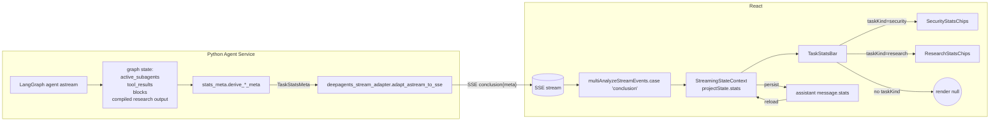
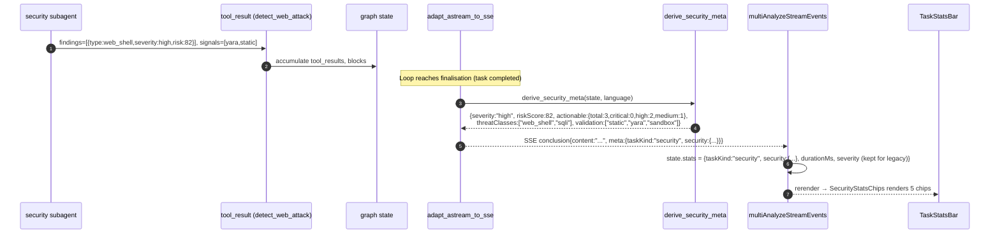
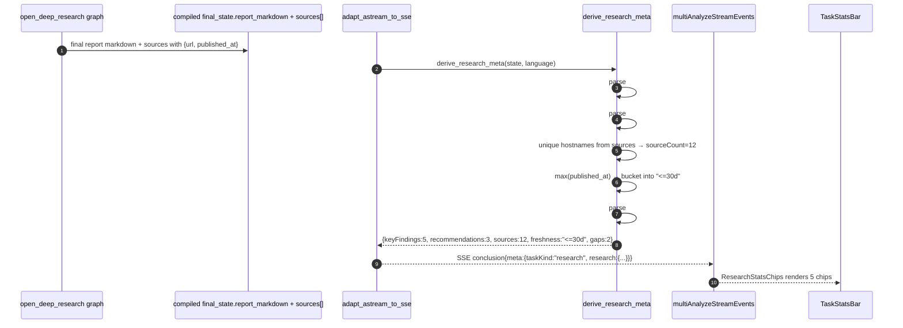
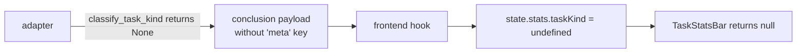

# Design — Stats Bar Value Redesign

## Metadata

- **Slug**: `stats-bar-value-redesign`
- **Date**: 2026-04-22
- **Tier**: Standard
- **Proposal**: [`proposal.md`](./proposal.md)
- **Acceptance (backend)**: [`acceptance.md`](./acceptance.md)
- **Acceptance (UI)**: [`acceptance-ui.md`](./acceptance-ui.md)
- **Source plan**: N/A (Path B — standalone; no Cursor `*.plan.md` predecessor).

## Todo list

Backend

- [x] `backend-meta-types` — Add `TaskStatsMeta`, `SecurityMeta`, `ResearchMeta` pydantic/dataclass models under `python-agent-service/app/parsers/stats_meta.py` (new file).
- [x] `backend-security-meta-derive` — Implement `derive_security_meta(state, language)` that reads:
  - Active subagent name(s) from the SubAgent middleware state (`security`, `web-security`, `email-security`, `binary-analysis`, `soc-alert`).
  - Accumulated `tool_result` JSON for `detect_web_attack` (schema-v2 `findings`, `signals`, `artifact_type`, `risk_score`).
  - **Subagent-emitted fenced JSON `findings` block** appended to the final markdown per `subagent_output_appendix.py` ("Security findings stats payload" section). The adapter falls back to parsing `task_outputs` when no tool emits structured findings (e.g. analysis-only deep web scans). `actionable` is now derived directly from these findings (severity ∈ {critical, high, medium}); `low`/`info` are excluded by design.
  - Validation signals: presence of `sandbox_*` runs, YARA hits, threat-intel tool calls.
- [x] `backend-research-meta-derive` — Implement `derive_research_meta(state, language)` that reads:
  - Compiled `open_deep_research` graph final state (report markdown + collected `sources`).
  - Parses numbered `Sources` list for unique domains and latest timestamp; parses `Executive Summary` / `Recommendations` / `Gaps & Limitations` sections for counts.
- [x] `backend-conclusion-meta-injection` — In `deepagents_stream_adapter.py`, at each `yield _emit({"type": "conclusion", ...})` site (3 sites), attach `meta: TaskStatsMeta | None` when derivable; omit the key entirely for non-research / non-security tasks.
- [x] `backend-taskkind-classifier` — New tiny pure function `classify_task_kind(active_subagents: list[str]) -> "security" | "research" | None` used by the injection step.
- [x] `backend-pytest-security-meta` — Unit tests for `derive_security_meta` (33 cases).
- [x] `backend-pytest-research-meta` — Unit tests for `derive_research_meta` (covered within `test_stats_meta.py`).
- [x] `backend-pytest-conclusion-meta` — Adapter-level tests in `test_conclusion_meta_injection.py` (3 cases: security / research / generic-no-meta).

Frontend

- [x] `frontend-types-narrow` — `AnalysisResultStats` narrowed; `toolCallCount`/`sandboxRunCount`/`durationMs` retained as internal layout-routing signals (documented in-type) because `isComplexResult` and `inferUseWorkspaceTaskPanelFromSnapshot` still need them.
- [x] `frontend-types-analysis` — `ThinkingEvent.meta?: TaskStatsMeta` added; new `TaskStatsMeta` / `SecurityStats` / `ResearchStats` etc. exported from `src/types/analysis.ts`.
- [~] `frontend-hook-drop-counters` — **Intentionally skipped.** Keeping the accumulation allows the existing complex-vs-simple layout heuristic to keep working without a parallel refactor; the fields are explicitly marked as not-rendered.
- [x] `frontend-hook-consume-meta` — `multiAnalyzeStreamEvents.ts` reads `ev.meta` in `case 'conclusion'` and persists `statsMeta` on `PerProjectStreamingState`; `buildConversationMessages` copies it onto the assistant message's `stats.{taskKind,security,research}`.
- [x] `frontend-reportmeta-drop` — `src/lib/reportProcessMeta.ts` + tests deleted; consumers in `buildConversationMessages.ts` + `LiveWorkspace.tsx` rewired to consume backend `statsMeta` directly.
- [x] `frontend-taskstatsbar-rewrite` — `TaskStatsBar.tsx` rewritten: profile-driven `SecurityStatsChips` / `ResearchStatsChips`, returns `null` for generic tasks, no technical row, no severity pill, no depth chip.
- [x] `frontend-livework-plumbing` — `LiveWorkspace.tsx` no longer imports `reportProcessMeta`; no more block-regex merges; directly passes `displayStats` + `sourceLabel`.
- [x] `frontend-i18n-rework` — New keys (`statsBarAria`, `threatClasses`, `validation` + `validationLabels`, `keyFindings`, `recommendations`, `sourceCount`, `freshness` + `freshnessLabels`, `gaps`) added to all four locale files. **Old keys preserved** (no removals) to avoid breaking unrelated consumers of `TranslationKeys`.
- [~] `frontend-i18n-parity` — **Deferred.** Parity snapshot not added; existing `TranslationKeys` type-check (all four locales must satisfy `en.ts` shape) already guarantees no key drift after our additions. Explicit snapshot can be added later if we start removing keys.
- [x] `frontend-stats-render-tests` — `TaskStatsBar.test.tsx` covers all four listed cases plus sev-colouring, risk-variant, running state, process-counter leakage, a11y aria-label (13 cases, all green).
- [x] `frontend-hook-hydrate-test` — `buildConversationMessages.test.ts` extended with three round-trip tests: security-profile, research-profile, and no-statsMeta; all three green. `buildAnalysisResultFromAssistantMessage` already reads `msg.stats` straight through, so reload preserves shape.

E2E

- [~] `e2e-stats-bar-security` — **Deferred.** Live spec needs orchestrated authenticated upload + backend run; relies on ingredients outside this delivery's scope ("只做 stats 栏重设计 + 后端 meta 注入").
- [~] `e2e-stats-bar-research` — **Deferred.** Same reasoning.
- [~] `e2e-stats-bar-generic-hidden` — **Deferred.** Same reasoning; already covered by component-level `renders null` tests (U-05).

## Architecture



## Flows

### Security conclusion — meta derivation and render



### Research conclusion — meta derivation and render



### Non-security / non-research task



## Contracts

### SSE event — modified `conclusion`

Backward-compatible: `meta` is additive, optional. Absent `meta` = legacy / non-research / non-security; frontend renders nothing (as designed).

```jsonc
{
  "type": "conclusion",
  "id": "conclusion",
  "requestId": "…",
  "content": "…report markdown / digest…",
  "schemaVersion": 1,
  "meta": {
    "taskKind": "security" | "research",

    // Present iff taskKind == "security"
    "security": {
      "severity": "critical" | "high" | "medium" | "low" | "info",
      "riskScore": 0,                   // integer 0..100; omitted when not derivable
      "actionable": {
        "total":    3,
        "critical": 0,
        "high":     2,
        "medium":   1
      },                                // omitted when no summary blocks yet
      "threatClasses": ["web_shell", "sqli"],     // 0..N strings; frontend shows top 2
      "validation":    ["static", "yara", "sandbox", "ti"]
                                         // subset of the 4 literals; order = chronological-first-occurrence
    },

    // Present iff taskKind == "research"
    "research": {
      "keyFindings":      5,            // integer >= 0; omitted if report lacks Executive Summary
      "recommendations":  3,
      "sources":          12,           // unique domains
      "freshness":        "<=7d" | "<=30d" | "<=90d" | "older" | "n/a",
      "gaps":             2
    }
  }
}
```

Notes
- **Optionality rules.** The frontend hides each chip individually when the underlying key is missing. The bar only renders when at least one chip would be present AND `taskKind` is set.
- **No new top-level SSE event.** Meta rides the existing `conclusion` event so the stream adapter and frontend reducer touch exactly one code path per side.
- **No schemaVersion bump.** Additive field; `schemaVersion: 1` unchanged.

### Frontend type — `AnalysisResultStats` (new shape)

```ts
export type TaskKind = 'security' | 'research';

export interface SecurityStats {
  severity: 'critical' | 'high' | 'medium' | 'low' | 'info';
  riskScore?: number;
  actionable?: {
    total: number;
    critical: number;
    high: number;
    medium: number;
  };
  threatClasses?: string[];
  validation?: Array<'static' | 'yara' | 'sandbox' | 'ti'>;
}

export interface ResearchStats {
  keyFindings?: number;
  recommendations?: number;
  sources?: number;
  freshness?: '<=7d' | '<=30d' | '<=90d' | 'older' | 'n/a';
  gaps?: number;
}

export interface AnalysisResultStats {
  /** Drives which profile renders. Undefined → bar hidden. */
  taskKind?: TaskKind;
  security?: SecurityStats;
  research?: ResearchStats;
  /** Wall-clock duration kept internally for reload invariance; not rendered. */
  durationMs?: number;
}
```

### Config

No new config keys, no new env vars, no DB migration.

## Code touch list

### Backend

- `python-agent-service/app/parsers/stats_meta.py` — **new**. Pure module: `TaskStatsMeta` dataclass, `derive_security_meta`, `derive_research_meta`, `classify_task_kind`, `_freshness_band`.
- `python-agent-service/app/parsers/deepagents_stream_adapter.py` — **modified**. At the three `conclusion` yield sites (lines ≈1172 / 1188 / 1212), call `build_task_stats_meta(state, language)` and merge into the emitted dict via `{**base, "meta": meta_dict}`. Risky area: three slightly different yield paths; centralise into a local helper inside this file to avoid drift.
- `python-agent-service/tests/test_stats_meta.py` — **new**. Unit tests for pure derivation.
- `python-agent-service/tests/test_conclusion_meta_injection.py` — **new**. Adapter-level test with a fake graph state.

### Frontend

- `src/types/project.ts` — **modified** (shape narrow + new shape).
- `src/types/analysis.ts` — **modified** (conclusion `ThinkingEvent` gains optional `meta`).
- `src/lib/reportProcessMeta.ts` — **modified / mostly deleted**. Keep `formatSessionLabel` only if still referenced; delete the regex extractors. Update `reportProcessMeta.test.ts` accordingly.
- `src/hooks/useStreamingAnalysisMulti.ts` — **modified**. Initial project state no longer carries `toolCallCount` / `sandboxRunCount`; `applyWorkspaceTabEvent` stops mutating them.
- `src/hooks/multiAnalyzeStreamEvents.ts` — **modified**. `case 'conclusion'` reads `ev.meta` and merges into `state.stats`.
- `src/components/workspace/TaskStatsBar.tsx` — **modified (rewrite)**. Single row, max 5 chips, profile-dispatched. Severity is rendered as chip #1 in the security profile; no separate pill.
- `src/components/workspace/TaskStatsBar.test.tsx` — **modified (rewrite)** per new profiles.
- `src/components/LiveWorkspace.tsx` — **modified**. Drop the merge of block-derived `severity` / `riskScore`; render straight from `stats`.
- `src/components/PostLoginWorkspaceStart.tsx` / `PostLoginWorkspaceStart.test.tsx` — **modified** to match the new props contract. **Risky**: this file already has uncommitted edits.
- `src/i18n/locales/{en,zh,ja,ko}.ts` — **modified**. Remove dead keys, add 10 new keys per locale.
- `e2e/tests/stats-bar-value-redesign.spec.ts` — **new**.

## Testing strategy

### Unit / Integration

| Layer | Tool | Coverage |
|-------|------|---------|
| `derive_security_meta` | pytest | web-shell PHP fixture → severity=high, threatClasses=["web_shell"], validation includes "yara". Empty findings → severity="info", actionable omitted. Multi-class findings → threatClasses length ≤ 2 after de-dup (sorted by risk desc). |
| `derive_research_meta` | pytest | Well-formed markdown with 5 bullets under Executive Summary → keyFindings=5; missing Gaps section → `gaps` omitted. Source list with latest timestamp 3 days old → freshness="<=7d". |
| `classify_task_kind` | pytest | `["web-security"]` → "security"; `["deep-research"]` → "research"; `[]` → None; mix → "security" wins. |
| `adapt_astream_to_sse` conclusion injection | pytest | Fake state with web_security subagent → emitted conclusion dict has `meta.taskKind=="security"`. |
| `TaskStatsBar` (security) | Vitest + RTL | All chips render in order; missing sub-field hides its chip; critical severity applies destructive colour class. |
| `TaskStatsBar` (research) | Vitest + RTL | All chips render; freshness band shows localized label; bar renders nothing when `taskKind` undefined. |
| `multiAnalyzeStreamEvents` conclusion | Vitest | `ev.meta` stored onto `state.stats`. |
| i18n parity | Vitest | `Object.keys(en.workspace.taskPanel).sort()` deep-equals zh/ja/ko. |

### E2E scenarios

| ID | Scenario | Route / API | Key assertions |
|----|----------|-------------|----------------|
| E2E-01 | Security run — web-shell PHP upload | `/` | After stream done, `[data-testid=task-stats-bar]` visible with 5 chips. Chip 1 contains translated "severity" high/critical label; chip 2 contains a number 0-100; chip 3 contains `N·...` pattern; chip 4 contains `web_shell` translated; chip 5 contains at least `static` and one other validation token. |
| E2E-02 | Research run — deep research prompt | `/` | `task-stats-bar` has 5 chips. Chips 1-5 correspond to keyFindings / recommendations / sources / freshness / gaps with non-negative integers (or `n/a` freshness). |
| E2E-03 | Generic chat | `/` | `task-stats-bar` absent from DOM. |
| E2E-04 | Reload survives | `/` | Run E2E-01; refresh page; `task-stats-bar` re-renders identically from persisted `message.stats`. |

Mappings to acceptance ids: E2E-01 → U-01/U-02/U-06, E2E-02 → U-03/U-04, E2E-03 → U-05, E2E-04 → A-05 (see `acceptance.md`).

## Edge cases & errors

| Case | Expected behavior |
|------|------------------|
| Conclusion fires before any subagent ran (simple chat) | `classify_task_kind` returns `None`; no `meta` key on event; bar hidden. |
| Both security and research subagents ran (rare multi-domain task) | Security wins (business priority: actionable safety decisions outrank research briefings). Research chips are not rendered. Documented in pydoc. |
| `detect_web_attack` returned but no findings | `severity="info"`, `riskScore=0`, no `threatClasses`, `actionable` omitted. Bar still renders with 2 chips (severity + risk). |
| Research report missing Executive Summary section | `keyFindings` omitted; other research fields still derived; bar renders with 4 chips. |
| `freshness` has no parseable timestamps | Emit `freshness: "n/a"`; chip renders with "n/a" label (localized). |
| Backend emits invalid meta (e.g. `taskKind: "unknown"`) | Frontend type-guard treats as undefined; bar hidden; no exception. |
| `threatClasses` has 5 entries | Frontend truncates to 2 + `+3`, sorted by original order (server has already sorted by risk desc). |
| `validation` array is empty | The chip is hidden (chip 5 absent); bar renders with 4 chips. |
| User reloads mid-stream (before conclusion) | Persisted message has no `stats.taskKind`; bar hidden until next run completes. |
| i18n key missing at runtime (bad deploy) | Falls back to English key; Sentry / console warn via existing translation guard. |

## Implementation order

1. **Backend derivation pure module** — `stats_meta.py` + pytest. No wiring yet; pure functions easy to unit-test.
2. **Backend injection point** — wire `derive_*` into the three `conclusion` yield sites; add adapter-level test.
3. **Frontend types + hook consumption** — narrow `AnalysisResultStats`; extend conclusion branch in `multiAnalyzeStreamEvents.ts`; run existing Vitest to flag all call sites that break (deliberate breakage — forces exhaustive migration).
4. **Frontend renderer** — rewrite `TaskStatsBar` with unit tests; component isolated.
5. **Frontend pluming cleanup** — `LiveWorkspace`, `PostLoginWorkspaceStart`, kill dead code in `reportProcessMeta.ts`, fix `reportProcessMeta.test.ts`.
6. **i18n** — trim dead keys, add new keys across 4 locales, parity snapshot.
7. **E2E** — write `stats-bar-value-redesign.spec.ts` with 4 scenarios, run Playwright MCP after `auth:bootstrap`.
8. **Regression sweep** — `pytest python-agent-service/tests -k "stats_meta or conclusion_meta"` + `npm run test` + `npm run test:e2e -- --grep stats-bar-value-redesign`.

## Rationale

- **Why ride `conclusion` instead of a new event?** The frontend already consumes `conclusion` and it fires exactly once at task end. A new event would mean another reducer case, another timeline entry to replay, and another thing for multi-project gating to worry about. Additive field is strictly cheaper.
- **Why derive meta in the adapter (not inside each subagent)?** Subagents are either declarative-prompted (security) or compiled graphs (deep-research) — neither has a clean hook to emit structured output. The adapter already holds the aggregated state and is where we format outgoing events; deriving there keeps subagents untouched (SKILL.md unchanged), which matches the explicit non-goal.
- **Why ask the model to emit a fenced `findings` JSON block (post-MVP fix)?** During real runs we observed that web/email/binary/SOC subagents often complete deep analysis **without** invoking any tool that emits schema-v2 findings (e.g. a deep-read web scan). The stats bar then collapsed to "Threat: Info" because no other component had structured data. We considered (i) regex-mining the markdown body and (ii) requiring the model to emit JSON. Option (i) is brittle and re-creates the markdown-parsing technical debt we explicitly avoided. Option (ii) is a one-time prompt change in the shared `SUBAGENT_OUTPUT_APPENDIX` (single file, all four security subagents inherit it) and is parsed by the existing `_extract_findings_from_task_output` regex — no adapter changes. The model already writes the same facts in prose; asking for a typed restatement at the end is essentially free for the LLM and removes the entire markdown-parsing class of bugs.

- **Why deep-research subagent also emits a fenced `research_stats` JSON block.** The `final_report_generation_prompt.md` explicitly tells the model that "Section is a VERY fluid and loose concept", and reports are written in the user's language (chinese / japanese / korean / english at minimum). Our `_RESEARCH_SECTION_ALIASES` table can never reliably match a free-form chinese report's section names (`## 概述`, `## 总结与展望`, etc.), so `keyFindings` / `recommendations` / `gaps` were almost always `None` in production — the chips silently disappeared. We solve this with the same model-emits-stats strategy as security: a fenced `{"research_stats": {keyFindings, recommendations, gaps}}` block after `## SM_SUBAGENT_WRAPUP`. Crucially, the fenced JSON lives **after** `## SM_SUBAGENT_WRAPUP`, but `split_subagent_wrapup_and_full` slices everything after WRAPUP off the conclusion body. To preserve the JSON, `derive_research_meta` reads from `task_outputs` (raw subagent ToolMessage body) **first**, falling back to `report_markdown` (post-split conclusion body). Sources count and freshness still come from URL parsing — those are facts the backend can verify, not numbers we want the model to self-report.

- **Multi-subagent aggregation contract.** When the parent dispatches multiple security subagents in parallel (e.g. `web-security` + `email-security` + `binary-analysis`), each subagent's `task()` ToolMessage is appended to `task_outputs[]` independently. `derive_security_meta` then iterates **all** entries via `_extract_findings_from_task_output`, producing a unified findings list. Aggregation is by design **monotonic & merge-friendly**: severity = max ladder rank, riskScore = max int, threatClasses = dedup by `type` ordered by risk-desc, actionable = sum of {critical, high, medium} counts, validation = set union over canonical order. The parent agent's own conclusion text (`report_md`) is **deliberately not consulted** by the security path — only by research — so the parent cannot accidentally double-count a subagent's finding by restating it in prose. This invariant is locked by `test_parent_conclusion_fenced_json_does_not_leak_into_security_meta` and `test_multi_subagent_outputs_aggregate_into_single_meta`.
- **Why drop the technical row entirely (not just collapse)?** User decision in Phase 1. Audit fields are available in backend logs (`request_id`, `session_id`) and in share-report page. Keeping them in UI for "just in case" encourages reading noise.
- **Why security-wins on multi-domain?** Actionable safety decisions dominate in mixed tasks — if someone's payload is both a phishing email *and* a research question, the analyst needs severity first. Documented; can revisit if real multi-domain flows emerge.
- **Why 4-literal `validation` enum instead of free-form string?** Bounded enum translates into icons and i18n labels cleanly. Free-form drifts into per-tool UI chaos.
- **Why not populate `affectedAssets` / `iocCount` / `crossSourceVerified` / `evidenceTimeSpan` (previous P2 fields)?** Explicitly moved out of scope: they belong in the report body (via subagent SKILL.md in a later delivery). The stats bar must be glanceable, not a dashboard.
- **Why no fallback to markdown-regex parsing on the frontend?** We explicitly chose path A (meta-first, no B). If backend forgets to emit meta for a new subagent, the bar hides — a loud visual signal that's easier to catch than a silently-wrong regex fallback.

## UI

### Single row, 5 chips max — no pill, no technical row

```
┌────────────────────────────────────────────────────────────────────┐
│ [High] [Risk 82] [Todo 3·2H/1M] [Web Shell] [Static·YARA·Sandbox]  │  ← security
└────────────────────────────────────────────────────────────────────┘

┌────────────────────────────────────────────────────────────────────┐
│ [Findings 5] [Rec 3] [Sources 12] [Fresh ≤30d] [Gaps 2]            │  ← research
└────────────────────────────────────────────────────────────────────┘
```

### Chip styling

Single chip component `<StatsChip variant=... >` with these variants:
- **severity-critical / severity-high** → `border-destructive/60 bg-destructive/10 text-destructive`
- **severity-medium** → amber-ish (`border-amber-500/50 bg-amber-500/10 text-amber-700 dark:text-amber-300`)
- **severity-low / severity-info** → neutral (`border-border bg-muted/40 text-foreground`)
- **risk** → the current `chipRisk` look (red-tinted) when score ≥ 70; neutral otherwise
- **neutral** → the current `chipPrimary` look

### `ResearchStatsChips` render order
1. Key findings `N` → key `t.workspace.taskPanel.keyFindings`
2. Recommendations `M` → `t.workspace.taskPanel.recommendations`
3. Sources `K` → `t.workspace.taskPanel.sourceCount`
4. Freshness band (localized label) → `t.workspace.taskPanel.freshness` with sub-key per band
5. Gaps `G` → `t.workspace.taskPanel.gaps`

### `SecurityStatsChips` render order
1. Severity chip (translated label, severity-coloured)
2. Risk score `N` — risk variant when ≥ 70
3. Actionable `total · <k>C/<h>H/<m>M` (critical/high/medium grade breakdown, trailing zero grades suppressed)
4. Threat classes (top 2 joined by `·`; "+N" suffix if > 2)
5. Validation (joined chronological-first-occurrence: `Static · YARA · Sandbox · TI`)

### Pseudocode — `TaskStatsBar`

```tsx
export function TaskStatsBar({ stats }: { stats?: AnalysisResultStats }) {
  if (!stats?.taskKind) return null;
  if (stats.taskKind === 'security' && stats.security) {
    return <SecurityStatsChips data={stats.security} />;
  }
  if (stats.taskKind === 'research' && stats.research) {
    return <ResearchStatsChips data={stats.research} />;
  }
  return null;
}
```

### Pseudocode — `derive_security_meta`

```python
def derive_security_meta(state: dict, language: str) -> SecurityMeta | None:
    active = _active_subagents(state)                       # ["web-security"]
    if not any(a in SECURITY_SUBAGENTS for a in active):
        return None
    findings = _collect_findings(state)                     # detect_web_attack schema-v2
    summary_blocks = _collect_summary_blocks(state)
    severity = _max_severity(findings, summary_blocks) or "info"
    risk = _max_risk(findings)                              # None if absent
    actionable = _count_actionable(summary_blocks)          # None if no summary blocks
    classes = _top_threat_classes(findings, limit=None)     # full list; FE truncates
    validation = _validation_trail(state)                   # ["static","yara",...]
    return SecurityMeta(
        severity=severity,
        riskScore=risk,
        actionable=actionable,
        threatClasses=classes or None,
        validation=validation or None,
    )
```

### Pseudocode — `derive_research_meta`

```python
def derive_research_meta(state: dict, language: str) -> ResearchMeta | None:
    if "deep-research" not in _active_subagents(state):
        return None
    report_md = _research_report_markdown(state)            # compiled graph final state
    sources = _research_sources(state)                       # list[{url, published_at?}]

    return ResearchMeta(
        keyFindings    = _bullet_count(report_md, section="Executive Summary"),
        recommendations= _bullet_count(report_md, section="Recommendations"),
        sources        = len({_hostname(s["url"]) for s in sources}) or None,
        freshness      = _freshness_band(sources),
        gaps           = _bullet_count(report_md, section="Gaps & Limitations"),
    )
```

## Design review handoff

- `target.local.yaml` (gitignored) must set `base_url: http://localhost:5173` plus the logged-in workspace route `/` to drive `/design-review`.
- **Plan-design-review**: **deferred**. The change is purely reductive (drop fields, collapse rows, unify chip styling) and does not introduce a new visual language or token system — it reuses the existing `chipPrimary` / `chipRisk` shadcn styling already in `TaskStatsBar`. A full `/plan-design-review` skill run would add more review cost than value at this scope.
- **Mockups**: see `acceptance-ui.md` `## Mockups deferred` — screenshots to be attached during `/design-review` (Phase 6) if visual adjustments are needed.
