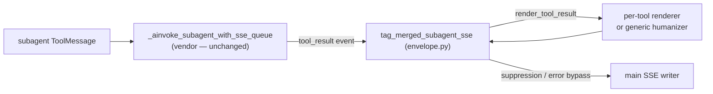

# subagent-sse-tool-result-render — design (Patch tier)

## Metadata

- **slug**: `subagent-sse-tool-result-render`
- **date**: 2026-04-27
- **tier**: Patch (2 files: 1 fix + 1 test; bug fix only)
- **related**: extends `docs/Process/tool-result-humanization/design.md`

## Problem

After landing the per-tool result-rendering dispatcher (commit `c455758`), tool
calls executed **inside a subagent** (via the `task()` tool — e.g. the
`web_security` subagent calling `detect_web_attack`) still surface raw JSON in
the UI. Root cause: the subagent → main SSE bridge in vendored deepagents
middleware (`app/_vendor/deepagents/middleware/subagents.py`) builds the
`tool_result` event using `_tool_output_text_for_sse(_raw_content)` (string
normalization only). The bridge does **not** call `render_tool_result` — that
dispatcher lives in `tag_merged_subagent_sse` (`app/sse/envelope.py`). (The
legacy `_preview_tool_output_for_sse` 4k cap was removed: it broke JSON
humanization for large tool payloads.)

## Goal

Subagent-internal tools (`detect_web_attack`, `grep`, `read_file`, …) emit the
same humanized text in SSE as their main-thread equivalents.

## Non-goals

- Changing research path (`open_deep_research_compiled.py` /
  `open_deep_research_original_adapter.py`). Those use a domain-specific
  formatter (`format_research_tool_output_for_sse`) by design.
- Touching the LangGraph state — `ToolMessage.content` raw JSON stays for the
  LLM exactly as before.

## Design choice: where to humanize

Two candidate fix points were considered.

### Rejected: vendor patch in the SSE bridge helper

Extend the bridge helper with `tool_name=` and route through
`render_tool_result` there (before or after any truncation).

- **Cons**:
  - Increases the SECMANUS PATCH surface in vendored deepagents code.
  - Every upstream rebase has to re-apply it (see
    `docs/Process/history/deepagents-upstream-changelog-*` and the
    `update-deepagents-vendor` skill).
  - Couples vendor code to `app.sse.*` even if via lazy import.

### Chosen: humanize in `tag_merged_subagent_sse` (`app/sse/envelope.py`)

`tag_merged_subagent_sse` is the **centralized post-filter** for events
crossing from any subagent into the main SSE stream. It is invoked at two
points in `app/parsers/deepagents_stream_adapter.py` (lines 369, 1436), it
already inspects `tool_result` events for tool name + `toolOutput` and applies
suppression / error-bypass — the perfect chokepoint to also apply
`render_tool_result`.

- **Pros**:
  - **Zero vendor surface** — deepagents source untouched; future upgrades
    are unaffected.
  - Single location colocated with related logic (suppression policy, error
    bypass).
  - Pure function, trivially unit-testable.
  - Catches **all** subagent event sources that go through the bridge,
    including any future ones.
  - Subagent's vendor helper stays semantically clean: "truncate to
    bandwidth limit", nothing more.

## Touch list

| Path | Change |
|------|--------|
| `python-agent-service/app/sse/envelope.py` | In `tag_merged_subagent_sse`, run `render_tool_result(toolName, toolOutput)` on every `tool_result` event **before** the existing suppression check. The error-bypass `startswith("error:")` test sees humanized text, so JSON `{"error": "..."}` payloads correctly bypass `emit_output=False`. |
| `python-agent-service/tests/test_envelope_subagent_tool_result_render.py` | New tests covering: generic JSON → humanized; per-tool renderer wins; non-JSON pass-through; empty unchanged; suppression for `emit_output=False` still works post-humanize; JSON error payload keeps error bypass; plain `Error: ...` string still bypasses; renderer exception falls back gracefully; non-`tool_result` events untouched. |

## Architecture (delta)

Vendor code path: unchanged. The only patch is in `app/sse/envelope.py`.

## Testing strategy

Pytest unit tests in `tests/test_envelope_subagent_tool_result_render.py`:

| Test | Purpose |
|------|---------|
| `test_subagent_tool_result_json_is_humanized` | Generic JSON → `key: value` lines, no raw `{`. |
| `test_registered_renderer_takes_precedence_in_envelope` | Per-tool renderer (e.g. `detect_web_attack`) wins over generic. |
| `test_non_json_tool_output_is_passed_through` | Plain text untouched. |
| `test_empty_tool_output_unchanged` | Empty stays empty (no crash). |
| `test_humanization_preserves_existing_suppression_for_read_file` | `emit_output=false` tools still get suppressed after humanization. |
| `test_json_error_payload_keeps_error_bypass_after_humanization` | `{"error": "..."}` → `error: ...` bypasses `emit_output=False`. |
| `test_plain_error_string_still_bypasses_suppression` | Existing plain `Error: ...` bypass preserved. |
| `test_renderer_failure_falls_back_to_generic_or_raw` | Exception in registered renderer → SSE never breaks. |
| `test_non_tool_result_events_unaffected` | Only `tool_result` is humanized. |

No E2E required at Patch tier; manual verification: restart Python service and
trigger a subagent that calls `detect_web_attack`; UI must show humanized
"Artifact / Severity / Threats" lines instead of raw JSON.

## Edge cases

- `toolOutput` not a string (LangChain list-of-blocks) — only humanize when
  `isinstance(raw_out, str)`; otherwise leave as-is for downstream code.
- Renderer raises — caught; original `raw_out` retained.
- Empty `toolOutput` — skipped; preserves previous behavior.

## Implementation order

1. Write failing tests in `test_envelope_subagent_tool_result_render.py`.
2. Patch `tag_merged_subagent_sse` to humanize before suppression.
3. Run pytest until green.
4. Regression: `test_llm_timeout_and_sse_status.py`,
   `test_deepagents_stream_adapter.py`, `test_tool_result_*` suites.

## Rationale

The cleaner architectural fix is at the **first point our code controls** in
the event flow, not at the source of the event in vendored code. The vendor
helper continues to do exactly one thing (bound payload size). Humanization
joins the suppression / tag-mapping policy that's already centralized in
`envelope.py`.

Lazy import was considered for `render_tool_result` but kept module-level —
`envelope.py` already imports `should_emit_tool_output` from
`tool_presentation`, so the dependency direction (`envelope → tool_result_*`)
is consistent.

## Sign-off

| Criterion | Evidence |
|-----------|----------|
| Subagent tool output routes through `render_tool_result` | `test_subagent_tool_result_json_is_humanized` + `test_registered_renderer_takes_precedence_in_envelope` passed |
| Per-tool renderer (e.g. `detect_web_attack`) reaches subagent path | `test_registered_renderer_takes_precedence_in_envelope` passed |
| Suppression policy preserved for `emit_output=False` tools | `test_humanization_preserves_existing_suppression_for_read_file` passed |
| JSON error payloads bypass suppression | `test_json_error_payload_keeps_error_bypass_after_humanization` passed |
| Plain `Error: ...` bypass unchanged | `test_plain_error_string_still_bypasses_suppression` passed |
| Renderer exception is fail-safe | `test_renderer_failure_falls_back_to_generic_or_raw` passed |
| Non-`tool_result` events untouched | `test_non_tool_result_events_unaffected` passed |
| No regression in existing envelope behavior | `tests/test_llm_timeout_and_sse_status.py` 4 tests passed |
| No regression in main-thread SSE adapter | `tests/test_deepagents_stream_adapter.py` 71 tests passed |
| No regression in dispatcher / generic humanizer / web_security renderer | 50 tests across `test_tool_result_renderers.py` + `test_tool_result_humanizer.py` + `test_detect_web_attack_renderer.py` passed |
| Vendor code untouched | `git diff python-agent-service/app/_vendor/` shows zero changes |
| `/qa` Playwright MCP | N/A — backend-only fix, no UI surface added or changed |
| `/design-review` | N/A — no visual change |

**Outcome**: DONE — Phase 5 unit tests green (152 / 152 across touched suites);
Phase 6 QA/design-review N/A by scope. Ready for Phase 7 manual checkpoint
commit.
