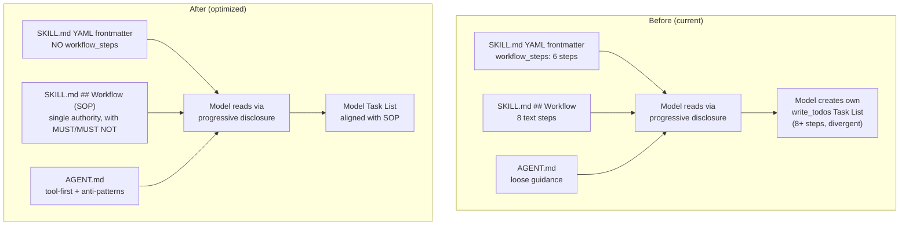
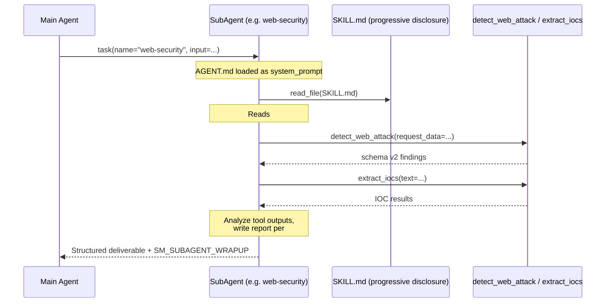

# Design: Subagent Workflow Prompt Optimization

## Metadata

- **Slug**: `subagent-workflow-prompt-optimization`
- **Type**: Prompt / config + dead code cleanup
- **Path B**: No prior Cursor plan; design authored from scratch

---

## Todo list

- [x] **rm-yaml-workflow-web** — Remove `workflow_steps` YAML from `web_security/SKILL.md` frontmatter
- [x] **rm-yaml-workflow-email** — Remove `workflow_steps` YAML from `email_security/SKILL.md` frontmatter
- [x] **rm-yaml-workflow-binary** — Remove `workflow_steps` YAML from `binary_analysis/SKILL.md` frontmatter
- [x] **rm-yaml-workflow-soc** — Remove `workflow_steps` YAML from `soc_alert/SKILL.md` frontmatter
- [x] **rewrite-workflow-web** — Rewrite `## Workflow` in `web_security/SKILL.md` as mandatory SOP with anti-patterns
- [x] **rewrite-workflow-email** — Rewrite `## Workflow` in `email_security/SKILL.md` as mandatory SOP
- [x] **rewrite-workflow-binary** — Rewrite `## Workflow` in `binary_analysis/SKILL.md` as mandatory SOP
- [x] **rewrite-workflow-soc** — Rewrite `## Workflow` in `soc_alert/SKILL.md` as mandatory SOP
- [x] **strengthen-agent-md-web** — Add tool-first constraint + anti-patterns to `web_security/AGENT.md`
- [x] **strengthen-agent-md-email** — Add tool-first constraint to `email_security/AGENT.md`
- [x] **strengthen-agent-md-binary** — Add tool-first constraint to `binary_analysis/AGENT.md`
- [x] **strengthen-agent-md-soc** — Add tool-first constraint to `soc_alert/AGENT.md`
- [x] **refactor-web-skill** — Comprehensive rewrite of `web_security/SKILL.md` to Agent Skills spec standard: clean frontmatter (only spec fields), unified SOP Workflow, tool output guide as concise reference, tighter Output Format, domain knowledge as structured tables not free-text lists
- [x] **rm-skill-doc-read** — Remove `is_skill_doc_read` dead code from `deepagents_stream_adapter.py` and `isSkillDocRead` field from `_skill_event_dict`
- [x] **update-feature-flag-comment** — Update `app/main.py` feature flag comment to reflect removal
- [x] **run-pytest** — Run existing pytest suite to confirm no regression (541 passed, 7 pre-existing failures unrelated to this delivery)

---

## Architecture

This is a pure **prompt-layer** change. No runtime code paths change.



### Prompt authority chain (after)

```
AGENT.md (system_prompt, always loaded)
  ├── Role definition + tool-first mandate
  ├── Anti-pattern rules (MUST NOT)
  └── References SKILL.md for full SOP
        │
        ▼
SKILL.md body (read via progressive disclosure)
  ├── ## Workflow (SOP) — single authoritative workflow
  ├── ## Structured tool output — how to read tool results
  └── ## Output Format — report structure
```

---

## Flows



---

## Code touch list

| File | Change | Risk |
|------|--------|------|
| `subagents/official/web_security/skills/web_security/SKILL.md` | Remove YAML `workflow_steps`; rewrite `## Workflow` | Low — prompt only |
| `subagents/official/email_security/skills/email_security/SKILL.md` | Same | Low |
| `subagents/official/binary_analysis/skills/binary_analysis/SKILL.md` | Same | Low |
| `subagents/official/soc_alert/skills/soc_alert/SKILL.md` | Same | Low |
| `subagents/official/web_security/AGENT.md` | Add tool-first mandate + anti-patterns | Low |
| `subagents/official/email_security/AGENT.md` | Add tool-first mandate | Low |
| `subagents/official/binary_analysis/AGENT.md` | Add tool-first mandate | Low |
| `subagents/official/soc_alert/AGENT.md` | Add tool-first mandate | Low |
| `app/main.py` | Update `FEATURE_FLAGS` comment (1 line) | Trivial |
| `app/parsers/deepagents_stream_adapter.py` | Remove `is_skill_doc_read` detection logic + `isSkillDocRead` field from `_skill_event_dict` | Low — field unused by frontend |

**Risky areas**: `deepagents_stream_adapter.py` change removes an SSE field that no frontend consumer reads. Existing adapter tests should confirm no breakage.

---

## Contracts

### SKILL.md frontmatter — before vs after

**Before** (web-security example):
```yaml
workflow_steps:
  - id: detect_attack
    label: 识别攻击类型 / Detect Attack Type
    tool: detect_web_attack
    required: true
  # ... 5 more steps
```

**After**: `workflow_steps` key completely absent from frontmatter. Retained keys: `name`, `display_name`, `description`, `version`, `author`, `triggers`, `tags`, `priority`, `max_iterations`, `timeout_seconds`.

### `## Workflow` section — new SOP pattern (template)

Each subagent's `## Workflow` follows this structure:

```markdown
## Workflow (mandatory SOP)

**This is the authoritative execution sequence. Follow it in order.**

### Step 1 — [Tool call or action]
[Description. MUST/MUST NOT rules.]

### Step 2 — ...

### Anti-patterns (MUST NOT)
- MUST NOT read/grep input files manually before calling the primary analysis tool
- MUST NOT create >N write_todos items (keep ≤ workflow steps + 1 for report)
- ...
```

### AGENT.md — new constraint block

Added after existing content:

```markdown
## Execution discipline

- **Tool-first**: Always call the primary analysis tool (`detect_web_attack` / `analyze_email_headers` / etc.) as your **first substantive action**. Do NOT manually read, grep, or search the input before the tool call — the tool's multi-layer pipeline already handles parsing, pattern matching, and classification.
- **Lean task planning**: When using `write_todos`, mirror the `## Workflow (mandatory SOP)` steps from SKILL.md. Do NOT add manual file-reading or grep steps that duplicate what the tool does.
- **Evidence from tools**: Base your analysis on structured tool output (`findings[]`, `signals`, `evidence.location`), not on ad-hoc grep results.
```

---

## Edge cases & errors

| Case | Handling |
|------|---------|
| `loader.py` encounters missing `workflow_steps` | Already safe: `frontmatter.get("workflow_steps", [])` returns `[]` |
| Older cached SKILL.md in agent memory | Progressive disclosure re-reads on each session; no stale cache |
| Model still ignores SOP despite prompt | Acceptable for v1; future work could implement programmatic `workflow_steps: True` |
| `WorkflowStep` class in `base.py` becomes unused | Retained for backward compat; mark as reserved in docstring |
| `is_skill_doc_read` removed from SSE events | No frontend consumer; field was always ignored. Safe to remove. |

---

## Operational / rollout

- **Feature flag**: `FEATURE_FLAGS["workflow_steps"]` stays `False`; update comment to note YAML field removed from SKILL.md files.
- **Backward compatibility**: Fully backward compatible. No API, SSE, or frontend changes.
- **Rollback**: Revert the markdown files via git.

---

## Implementation order

1. **Phase 1**: Remove YAML `workflow_steps` from all 4 SKILL.md files (independent, parallelizable)
2. **Phase 2**: Rewrite `## Workflow` sections in all 4 SKILL.md files
3. **Phase 3**: Strengthen all 4 AGENT.md files with execution discipline block
4. **Phase 4**: Update `app/main.py` comment
5. **Phase 5**: Run pytest

Steps 1–3 can be done per-subagent (web → email → binary → soc) or in parallel.

---

## Rationale

### ADR: Why remove YAML `workflow_steps` instead of implementing programmatic step driver

- **Complexity cost**: A programmatic driver would need to coordinate with the model's `write_todos`, creating a dual-control-loop that is harder to debug and test.
- **Current value**: The YAML field provides zero runtime value (flag is `False`, no code consumes it).
- **Cognitive cost**: Its presence in SKILL.md actively confuses the model, causing the opposite of the intended effect.
- **Reversibility**: If a future programmatic driver is implemented, the YAML can be re-added from git history.

### ADR: Why strengthen prompts (Direction A) over programmatic enforcement (Direction B)

- Direction A is zero-code-risk, immediately deployable, and addresses the primary symptom (model divergence from SOP).
- Direction B requires significant engineering investment in a step-driver, state machine, and UI integration — disproportionate to the current problem.
- Direction A is the prerequisite for Direction B: even with a programmatic driver, the prompt must clearly communicate the SOP.

---

## Testing strategy

| Test type | What | Where |
|-----------|------|-------|
| Unit | `loader.py` still parses SKILL.md with missing `workflow_steps` | `pytest` existing suite — `test_common_tools_from_registry.py`, `test_tool_presentation_registry.py` |
| Unit | `deepagents_stream_adapter.py` — `is_skill_doc_read` logic and `isSkillDocRead` SSE field removed; existing adapter tests still pass | `test_deepagents_stream_adapter.py` |
| Integration | Full agent stream with web-security subagent | Manual smoke test (out of pytest scope) |

### Adapter dead code removal

The `deepagents_stream_adapter.py` contains:

1. **`is_skill_doc_read` detection** (lines ~1444-1450): checks if `read_file` output contains both `workflow_steps:` and `display_name:`. This would become permanently `False` after YAML removal — but since it was never consumed by frontend anyway, we delete it entirely.

2. **`is_skill_doc_read` parameter** on `_skill_event_dict` function and the `isSkillDocRead` field in the returned dict: dead SSE field, no consumer. Remove.

3. **All call sites** passing `is_skill_doc_read=...` to `_skill_event_dict`: simplify by removing the kwarg.

**Risk**: Zero functional impact. The field was sent in SSE but never parsed by frontend (`src/` has no references to `isSkillDocRead`).

---

## Appendix: Detailed SKILL.md `## Workflow` rewrite (web-security)

Current (8 text steps, weak guidance):
```
1. Classify: Read artifact_type from detect_web_attack output
2. Parse: Analyze HTTP request/response structure
3. Identify: Use findings[].evidence.location
4. Decode: Handle URL, Base64, Unicode obfuscation
5. Map: Map tool categories to OWASP/MITRE
6. Extract: Pull attacker indicators via extract_iocs
7. Assess: Evaluate impact and exploitability
8. Recommend: Provide mitigation steps
```

Proposed (tool-first SOP with constraints):
```
## Workflow (mandatory SOP)

This is the authoritative execution sequence. Follow it strictly.

### Step 1 — Structured analysis (REQUIRED)
Call `detect_web_attack` with the full input. Use `hint` arg when type is known
(http / code). Read the schema v2 output: `artifact_type`, `findings[]`,
`parse_status.layers`.

### Step 2 — Decode obfuscation (if needed)
If findings reference encoded payloads, call `decode_url` / `decode_base64`.
Skip if findings are already clear-text.

### Step 3 — Extract IOCs (REQUIRED)
Call `extract_iocs` on the input text. Merge with any IOCs from Step 1 findings.

### Step 4 — Synthesize & classify
Using ONLY tool outputs from Steps 1–3:
- Map to OWASP Top 10 / MITRE ATT&CK
- Assess severity and exploitability from findings[].severity and .confidence
- Determine artifact_type narrative (traffic vs webshell/code)

### Step 5 — Report
Write the final report per ## Output Format below.

### Anti-patterns (MUST NOT)
- MUST NOT `read_file` or `grep` the input content before calling `detect_web_attack`
  — the tool already performs YARA (L1), static sinks (L2), syntax check (L3),
  and optional E2B dynamic analysis (L4).
- MUST NOT create manual "search for dangerous functions" tasks — this is
  what the tool pipeline does automatically.
- MUST NOT generate more than 5 write_todos items for a standard analysis.
- MUST NOT duplicate tool analysis with manual pattern matching.
```
