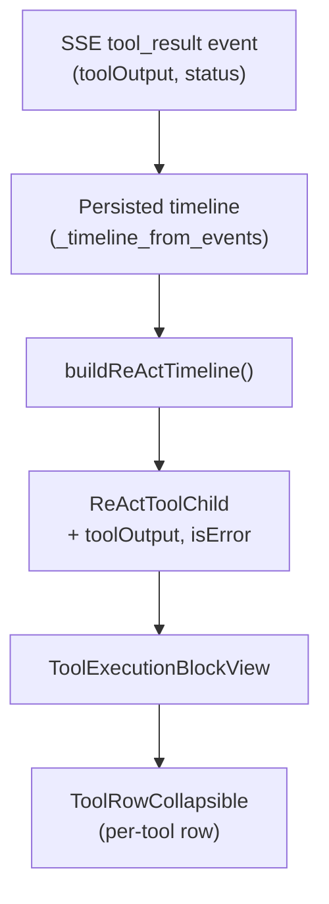
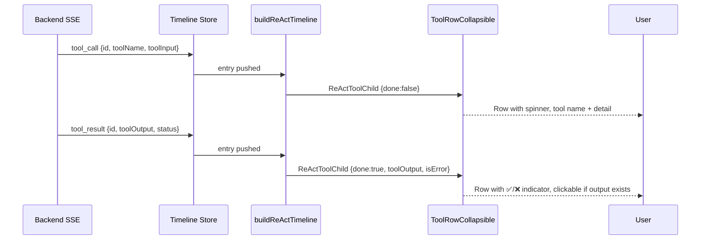
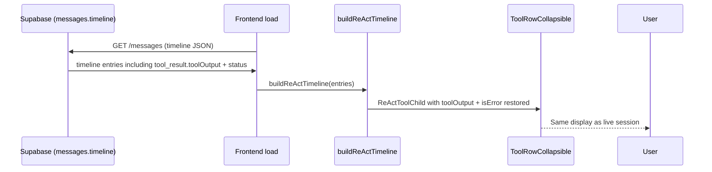

# Design — `tool-execution-cursor-style`

## Metadata

- **Slug:** `tool-execution-cursor-style`
- **Date:** 2026-04-16
- **Related:** [proposal.md](./proposal.md), [acceptance.md](./acceptance.md), [acceptance-ui.md](./acceptance-ui.md)

## Todo list

- [x] **extend-tool-child-type** — Extend `ReActToolChild` with `toolOutput`, `isError` fields
- [x] **consume-tool-result-fields** — Update `markToolCallDone` and `tool_result` handler in `buildReActTimeline` to capture `toolOutput` + `status`
- [x] **backend-stream-events-status** — Add `status` field to `_extract_stream_events` `tool_result` entries (consistency)
- [x] **ui-tool-row-collapsible** — Replace `ToolRowStatus` with `ToolRowCollapsible` component (per-tool collapsible row with status indicator + expandable result)
- [x] **ui-tool-execution-block** — Simplify `ToolExecutionBlockView` to render independent `ToolRowCollapsible` rows (remove grouped header)
- [x] **scroll-limit-result** — Add max-height + overflow-y-auto to expanded result panel
- [x] **unit-tests-data** — Unit tests for `buildReActTimeline` capturing `toolOutput` / `isError`
- [ ] ~~**unit-tests-ui**~~ — Skipped: component tests for `ToolRowCollapsible` require React Testing Library setup not in current scope

## Architecture

The change touches the data → UI pipeline for tool execution blocks in the ReAct timeline.



**No new components** at the page/route level. Change is scoped to:
1. Data model type (`ReActToolChild`)
2. Timeline builder function (`buildReActTimeline`)
3. Two UI components in `ReActTimelineView.tsx`

## Flows

### Live streaming flow



### Page refresh restore flow



## Contracts

### ReActToolChild (extended)

```typescript
export type ReActToolChild = {
  toolCallId: string;
  toolName: string;
  detail: string;
  done: boolean;
  /** Truncated tool output for UI display (max ~500 chars). */
  toolOutput?: string;
  /** True when tool_result.status === 'error'. */
  isError?: boolean;
};
```

### SSE tool_result event (no change — documenting existing)

```json
{
  "type": "tool_result",
  "id": "call_xxx",
  "toolName": "web_search",
  "toolOutput": "Found 5 results...",
  "status": "success",
  "toolPresentation": "action",
  "timestamp": 1713250000000,
  "seq": 42
}
```

### Backend `_extract_stream_events` addition

Add `status` field to `tool_result` entries:

```python
elif t == "tool_result":
    stream_events.append({
        "type": "tool_result",
        "id": ev.get("id") or f"tr-{ev.get('timestamp', 0)}",
        "timestamp": ev.get("timestamp"),
        "toolName": ev.get("toolName"),
        "toolOutput": ev.get("toolOutput"),
        "status": ev.get("status"),      # NEW
    })
```

## Code touch list

| File | Change | Risk |
|------|--------|------|
| `src/lib/buildReActTimeline.ts` | Extend `ReActToolChild` type; update `markToolCallDone` to capture output+status; update `tool_result` handler | Medium — core timeline logic |
| `src/components/reasoning/ReActTimelineView.tsx` | Replace `ToolRowStatus` → `ToolRowCollapsible`; simplify `ToolExecutionBlockView` | Medium — primary UI change |
| `python-agent-service/app/services/message_persistence.py` | Add `"status"` to `_extract_stream_events` tool_result dict | Low |
| `src/lib/buildReActTimeline.test.ts` | Add tests for toolOutput/isError capture | Low |

## Testing strategy

### Unit tests

| Test | File | Description |
|------|------|-------------|
| UT-01 | `buildReActTimeline.test.ts` | `tool_result` with `toolOutput` and `status: 'success'` → `ReActToolChild.toolOutput` populated, `isError` false |
| UT-02 | `buildReActTimeline.test.ts` | `tool_result` with `status: 'error'` → `ReActToolChild.isError` true |
| UT-03 | `buildReActTimeline.test.ts` | `tool_result` without `toolOutput` → `toolOutput` undefined, still `done: true` |
| UT-04 | `buildReActTimeline.test.ts` | Long `toolOutput` (>500 chars) truncated |

### E2E scenarios

| ID | Scenario | Route / API | Key assertions |
|----|----------|-------------|----------------|
| E2E-01 | Tool row shows success indicator after completion | Chat page, live analysis | Green check visible on completed tool row |
| E2E-02 | Tool row expands to show output on click | Chat page | Click tool row → output panel visible with content |
| E2E-03 | Page refresh preserves tool output | Chat page reload | After refresh, tool rows still show status; clicking shows output |

## Edge cases & errors

| Case | Handling |
|------|----------|
| `toolOutput` is empty string | Row shows status indicator but is NOT expandable (no chevron) |
| `toolOutput` is very long (>500 chars) | Truncate in data model; result panel has `max-h-40 overflow-y-auto` |
| `toolOutput` is JSON object (not string) | `JSON.stringify` before storing in `ReActToolChild.toolOutput` |
| `tool_result` arrives before corresponding `tool_call` | Existing `markToolCallDone` traversal handles this (searches committed blocks) |
| `status` field missing on legacy timeline entries | Default to `isError: false` (backward compatible) |
| Multiple tool calls in parallel | Each gets independent row; `activePendingIndex` logic preserved for last-pending spinner |
| `emit_output: false` tools | `toolOutput` will be empty string → row not expandable → correct behavior |

## Implementation order

1. **Data model** (`extend-tool-child-type` + `consume-tool-result-fields`) — no UI break, just adds optional fields
2. **Unit tests** (`unit-tests-data`) — verify data flow before UI change
3. **Backend fix** (`backend-stream-events-status`) — trivial one-line add
4. **UI components** (`ui-tool-row-collapsible` + `ui-tool-execution-block` + `scroll-limit-result`)
5. **UI tests** (`unit-tests-ui`)

## Rationale

- **Why not a completely new component file?** The `ToolRowCollapsible` replaces `ToolRowStatus` in the same file (`ReActTimelineView.tsx`). Keeping it co-located avoids import churn and matches the existing pattern where all ReAct view subcomponents live together.
- **Why truncate toolOutput at data model level?** The SSE output can be arbitrarily large. Storing the full output in React state for every tool call across the timeline would bloat memory. 500 chars provides enough context for quick inspection; users needing full output can check DevModePanel or backend logs.
- **Why keep ToolExecutionBlockView as a container?** Even though each row is now independent, the container provides the `pb-3` spacing and `activePendingIndex` computation shared by all rows. Removing it would duplicate this logic.

## UI

### ToolRowCollapsible states

| State | Icon | Chevron | Clickable | Background |
|-------|------|---------|-----------|------------|
| Running (active pending) | `Loader2` spin, primary color | Hidden | No | None |
| Queued pending | `Circle` muted | Hidden | No | None |
| Done (success, has output) | `CheckCircle2` emerald | `ChevronRight` (rotates on expand) | Yes | `hover:bg-muted/30` |
| Done (success, no output) | `CheckCircle2` emerald | Hidden | No | None |
| Done (error, has output) | `XCircle` destructive | `ChevronRight` | Yes | `hover:bg-muted/30` |
| Done (error, no output) | `XCircle` destructive | Hidden | No | None |

### Expanded result panel

- Background: `bg-muted/20 border border-border/30`
- Font: `font-mono text-[11px]`
- Max height: `max-h-40` (~160px, ~10 lines) with `overflow-y-auto`
- Error text color: `text-destructive/80`
- Normal text color: `text-muted-foreground/70`
- Whitespace: `whitespace-pre-wrap break-all`

### Mockups deferred

No mockup images. Visual spec defined above via component state table + Tailwind classes. Reference: Cursor IDE tool call display pattern.

## Design review handoff

- **target.local.yaml**: `.cursor/design-review-handoff/target.local.yaml` (`base_url: http://127.0.0.1:5173`)
- **Mockups**: Deferred (no images). Visual spec in § UI section above.
- **Focus paths**: `/` (chat page with tool execution timeline)
