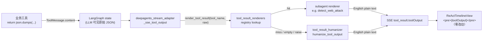

# design.md — tool-result-humanization

## Metadata

- **Slug**: `tool-result-humanization`
- **Tier**: Standard（原 Patch；追加子 Agent 专用渲染器 → 文件数 / 职责边界扩大）
- **Date**: 2026-04-20（v2 2026-04-20 追加分发层）
- **Owner**: chenf
- **Scope note**: 仅后端 SSE 适配层 + 子 Agent 渲染器 + 测试。前端 0 改动；SSE 信封 schema 不变；LLM 上下文不受影响（graph state 里的 `ToolMessage.content` 保持原始 JSON）。所有输出文本**英文**。

## Problem

目前 UI 里 `tool_result` 事件的 `toolOutput` 字段是业务工具（如 `sandbox_run`、`web_search` 等）`json.dumps(...)` 的原始字符串。前端 `ReActTimelineView.tsx` 直接 `<pre>{child.toolOutput}</pre>` 渲染，用户看到一团 JSON，不友好。

## Goal

SSE 适配层把原始 JSON `toolOutput` 变为英文人类可读文本。两层职责分离：

1. **通用 humanizer（零维护）**：`app/sse/tool_result_humanizer.py` 对所有结构化 JSON 做通用渲染；不感知任何具体工具；未来新增子 Agent 不需要改这里。
2. **子 Agent 专用渲染器（按需注册）**：结构复杂、通用渲染效果差的工具，在自己的子 Agent 包里写一个 `tools/result_renderer.py`，通过装饰器 `@register_renderer("<tool_name>")` 向分发层注册。分发层 `app/sse/tool_result_renderers.py` 命中时用专用渲染器，未命中时 fallback 通用 humanizer。

## Non-goals

- 不改 LLM 侧上下文（`ToolMessage.content` 保持 JSON，以便 LLM 解析）。
- 通用 humanizer 不会累积任何工具专属字段知识（避免"污染"）。
- 不改前端组件样式、不改 SSE 信封 schema。
- 不解决 `/large_tool_results/` evict 占位文本的特殊渲染（已经是可读文本，走默认即可）。

## Architecture



注册时机：子 Agent 的 `tools/__init__.py` `from . import result_renderer  # noqa: F401` 副作用导入 → 模块级 `@register_renderer(...)` 写入 `_RENDERERS`。`create_*_tools()` 被调用时链式触发，SSE 事件发出前已完成注册。

## Flows

```mermaid
flowchart TD
  A[raw output_text: str] --> B{已被 should_emit_tool_output 过滤?}
  B -->|是, 返回 ""| Z[return ""]
  B -->|否| C[humanize_tool_output]
  C --> D{能 json.loads?}
  D -->|否| R[return 原文本]
  D -->|是| E{顶层是 dict 或 list?}
  E -->|否<br/>基础类型| R
  E -->|是| F[render dict/list]
  F --> G[摘 error 字段 → 错误: ...]
  F --> H[识别正文字段<br/>stdout/stderr/output/text/content/message/body<br/>→ --- &lt;key&gt; --- 块]
  F --> I[其余字段 → key: value<br/>紧凑展开, 丢 null/empty]
  F --> J[数组: 对象编号列表, 基础类型 join ", "]
  G --> K[return 人类文本]
  H --> K
  I --> K
  J --> K
```

## Contracts

**SSE 事件字段不变**：

```json
{
  "type": "tool_result",
  "id": "<tool_call_id>",
  "toolName": "sandbox_run",
  "toolOutput": "<humanized text>",  // 改动点：原本是 JSON 字符串，现在是纯文本
  "status": "success"
}
```

**`humanize_tool_output` 契约**：

```python
def humanize_tool_output(raw: str) -> str:
    """Convert a tool result text into a human-readable plain-text rendering.

    Rules (idempotent; unknown or non-JSON input is returned as-is):

    - If ``raw`` is falsy → return ``raw``.
    - If ``raw`` parses as JSON and top-level is dict/list → render via rules below.
    - Otherwise → return ``raw`` unchanged.

    Dict rendering:
    - If ``error`` key truthy → first line ``错误: <error>``.
    - Content keys (``stdout``, ``stderr``, ``output``, ``text``, ``content``,
      ``message``, ``body``) → block ``--- <key> ---\\n<value>`` when value is
      non-empty string; skipped if empty/None.
    - Remaining non-empty scalar fields → ``key: value`` joined with 4 spaces,
      wrapped every ~3 fields or long values. ``None`` / ``""`` / ``[]`` /
      ``{}`` fields are dropped.
    - Nested dict → render recursively indented 2 spaces.
    - Array of scalars → ``key: a, b, c`` (soft-wrap if long).
    - Array of dicts → numbered list, each item rendered recursively.

    List rendering (top-level list): apply the same array rule.

    Safety:
    - Never raises on malformed JSON.
    - Long text fields (>4000 chars) truncated with ``\\n... [truncated]``.
    """
```

## Code touch list

| # | Path | Kind | Note |
|---|------|------|------|
| 1 | `python-agent-service/app/sse/tool_result_humanizer.py` | **new** | 通用 JSON→英文渲染，约 170 行。**不含任何工具专属字段**。 |
| 2 | `python-agent-service/app/sse/tool_result_renderers.py` | **new** | 注册表 + 分发函数 `render_tool_result(tool_name, raw)`。约 90 行。 |
| 3 | `python-agent-service/app/parsers/deepagents_stream_adapter.py` | **edit** | `_sse_tool_output` 改调 `render_tool_result`；保留 error bypass 逻辑。 |
| 4 | `python-agent-service/subagents/official/web_security/tools/result_renderer.py` | **new** | `detect_web_attack` 专用英文渲染器（schema v2）。约 210 行。 |
| 5 | `python-agent-service/subagents/official/web_security/tools/__init__.py` | **edit** | 副作用导入 `result_renderer` 触发注册。+3 行。 |
| 6 | `python-agent-service/tests/test_tool_result_humanizer.py` | **new** | 26 条通用 humanizer 测试。 |
| 7 | `python-agent-service/tests/test_tool_result_renderers.py` | **new** | 7 条分发器测试（fallback/raise/empty/malformed/last-wins）。 |
| 8 | `python-agent-service/tests/test_detect_web_attack_renderer.py` | **new** | 10 条 web_security 渲染器测试（含 real-pipeline smoke）。 |

Risky area: `_sse_tool_output` 是主 agent 与 subagent 两条流共用的热路径，分发层必须**永不抛异常**，渲染器 raise → fallback 通用。

## Testing strategy

**Unit tests（pytest）—— `tests/test_tool_result_humanizer.py`**：

| 用例 id | 场景 | 期望行为 |
|---------|------|---------|
| `U-01` | `sandbox_run` 成功，含 stdout+exit_code+sandbox_id | 首行元数据紧凑、`--- stdout ---` 块展示多行 stdout |
| `U-02` | `sandbox_run` 失败，`{"error":"Timed out","exit_code":-1}` | 首行 `错误: Timed out`，下行元数据 |
| `U-03` | `web_search` 含 `results` 对象数组 | `results (2):` + 编号列表 |
| `U-04` | `extract_iocs`：基础数组 | `ips: 1.1.1.1, 2.2.2.2`，空数组字段丢弃 |
| `U-05` | 嵌套 dict（`downloaded_files: [{path:...}]`） | 编号列表递归渲染 |
| `U-06` | 非 JSON（`"['a.txt','b.txt']"`、`"hello"`、空串） | 原样返回 |
| `U-07` | JSON 基础类型（字符串、数字、布尔） | 原样返回 |
| `U-08` | 全字段均 empty | 退化为空字符串或最短非空文本，不抛异常 |
| `U-09` | 超长 stdout（>4000 字符） | 尾部 `... [truncated]` |
| `U-10` | 异常 JSON（截断/畸形） | 原样返回 |

**Integration tests**：

- `tests/test_stream_adapter_path_scrub.py`（已存在）或新建 `test_stream_adapter_humanize.py`：构造一个带 JSON `ToolMessage` 的 mock astream，断言产生的 SSE `tool_result.toolOutput` 是人类文本，并且**完全没有**原始 JSON 的 `{` `}` 成对出现（或简化为"期望文本完全相等"）。

**E2E**：跳过。该改动为纯后端文本转换，E2E 覆盖度等价于 unit（且改 UI=0）。

## Edge cases & errors

| 场景 | 处理 |
|------|------|
| 顶层 JSON 是 `null` / 基础类型 | 原样返回（`_extract_text` 已处理） |
| JSON 解析异常 | `try/except json.JSONDecodeError + ValueError`，返回原文本 |
| 含 `error: null` 或 `error: ""` | 视为无错误，不输出 `错误:` 前缀 |
| `stdout` 值非字符串（如数组） | 不走 content 块，按普通字段处理 |
| 递归深度 | 硬上限 5 层；超出 → `{...}` 占位 |
| 字符串长度 | 单值字段 >2000 字符、content 块 >4000 字符时尾部截断并加 `... [truncated]` |
| 工具返回的本就是人类文本（`task` 的 WRAPUP，`ls` 的 Python repr） | `json.loads` 失败 → 原样返回 |

## Implementation order

1. Phase 4 TDD：先写 `test_tool_result_humanizer.py` 的 `U-01..U-10`（红）。
2. 实现 `tool_result_humanizer.py`（绿）：
   - `humanize_tool_output(raw)` 入口 + guard
   - `_render_value` 递归分发
   - `_render_dict` / `_render_list` / `_render_scalar`
   - 常量：`_CONTENT_KEYS`、`_MAX_VALUE_LEN=2000`、`_MAX_BLOCK_LEN=4000`、`_MAX_DEPTH=5`
3. 接入 `_sse_tool_output`：`return humanize_tool_output(output_text)`。
4. 新增 integration 快照测试（若 unit 已经覆盖就跳过）。
5. 全量 pytest 跑 `python-agent-service/app/parsers` + `python-agent-service/app/sse` + 新文件。

## Rationale

- **为何放在 SSE 适配层、不在工具侧**：工具返回 JSON 是 LLM 的需要，改工具会双刃（LLM 解析退化）。SSE 是纯前端入口，最窄的改动面。
- **为何分成"通用 humanizer + 子 Agent 专用渲染器"而非单一通用函数**：早期版本尝试过纯通用。`detect_web_attack` 的 schema v2 有 `findings[].evidence`、`signals[]`、`parse_status.layers` 等深嵌套结构，通用渲染产出的文本（约 35 行）含大量噪音字段（`schema_version`/`start`/`end`/`id`）且与 legacy 顶层字段重复。用户明确要求"不要污染通用 humanizer"、"未来还会有不少子 Agent 专用工具"，因此采用"通用零维护 + 注册表 opt-in"的双层设计。
- **为何注册表放在 `app/sse/` 而渲染器放在子 Agent 包里**：分发层是全局基础设施（无状态），属于 app 层；具体渲染器与子 Agent 的 schema 强绑定（当 schema 变化时一起演进），应与工具定义同目录。
- **为何用副作用导入注册**：比 `entry_points` 轻量，比维护中心映射表省事；子 Agent 自己已经在 `tools/__init__.py` 里初始化，加一行 import 零成本。
- **为何直接替换 `toolOutput` 而非加新字段**：前端零改动、SSE schema 不变、信息未丢（需要时可恢复 `toolOutputRaw`）。
- **为何输出一律英文**：与 LLM 上下文语言一致（避免多语种 locale 分支）、可直接粘贴到日志/issue、遵循"解析结果都用英文"的用户指示。
- **为何不要 emoji 前缀**：遵循全局规则（用户未明确要求 emoji）。

## Todo list

- [x] **hum-1**: 新增 `python-agent-service/tests/test_tool_result_humanizer.py`，实现 `U-01..U-14` 用例
- [x] **hum-2**: 新增 `python-agent-service/app/sse/tool_result_humanizer.py`，实现 `humanize_tool_output`（通用零维护）
- [x] **hum-3**: `python-agent-service/app/parsers/deepagents_stream_adapter.py` 接入
- [x] **hum-4**: Integration 快照 + 端到端 smoke
- [x] **hum-5**: Phase 5 v1 — 运行 pytest，绿灯（通用 humanizer）
- [x] **hum-6**: Phase 6 v1 — 后端 acceptance
- [x] **disp-1**: 新增 `app/sse/tool_result_renderers.py` 分发层（注册表 + `render_tool_result`）
- [x] **disp-2**: 新增 `tests/test_tool_result_renderers.py` 覆盖 fallback / raise / empty / malformed / last-wins
- [x] **web-1**: 新增 `subagents/official/web_security/tools/result_renderer.py`，`@register_renderer("detect_web_attack")`（英文、schema v2-aware）
- [x] **web-2**: `tools/__init__.py` 副作用导入触发注册
- [x] **web-3**: 新增 `tests/test_detect_web_attack_renderer.py` — happy/empty/parse-fail/截断/missing-conf/real-pipeline smoke
- [x] **hum-eng**: 通用 humanizer `错误:` → `error:`；更新 U-02
- [x] **hum-adapter**: `_sse_tool_output` 切换到 `render_tool_result(tool_name, raw)`
- [x] **verify**: 47/47 pytest green + 端到端 smoke via `_sse_tool_output`
- [ ] **commit**: Phase 7 — 用户确认后 commit + tag

## Sign-off

| 项目 | 证据 | 状态 |
|------|------|------|
| `test_tool_result_humanizer.py` | 26/26 passed（通用 humanizer 覆盖 sandbox 成功/失败、web_search、iocs、嵌套、非 JSON、JSON scalar、全空、长文本截断、畸形 JSON、顶层 list、bool/数值、嵌套 dict；U-02 改 `error:` 前缀英化） | PASS |
| `test_tool_result_renderers.py` | 7/7 passed（分发器 fallback / raise-safety / empty-string-fallback / 非 object payload / 畸形 JSON / last-wins） | PASS |
| `test_detect_web_attack_renderer.py` | 10/10 passed（含 happy-path 精确字符串、空 findings、parse-failure、findings 截断 `_MAX_FINDINGS=10`、snippet/location 长度截断、缺失 confidence 用 `—`、分发器 routing 等价于直调、non-dict 返回空、real-pipeline smoke） | PASS |
| `test_stream_adapter_path_scrub.py` | 4/4 passed（确认 SSE 适配层既有行为未回归） | PASS |
| `_sse_tool_output` 端到端 smoke | `detect_web_attack` → 8 行英文摘要（Artifact/Severity/Findings/Layers），`sandbox_run` → 通用 humanizer 英文输出，均无原始 JSON 字符 | PASS |
| `/qa` | N/A — 无 UI 改动 | SKIP |
| `/design-review` | N/A — 无 UI 改动 | SKIP |

### Pre-existing failures（非本 delivery 影响，不阻塞）

| Test | Root cause |
|------|-----------|
| `test_direct_dispatch_execution.py::test_analyze_stream_injects_files_into_initial_state` | FileData content 被按字符拆分；git stash 掉本次改动后仍失败，判定为预存在缺陷。 |
| `test_e2e_full_stream.py::test_e2e_analyze_stream_full_flow` | Gemini `gemini-3-flash-preview` HTTP 429（月度配额超限），环境问题。 |
| `test_e2e_full_stream.py::test_e2e_agentic_main_agent_direct_tools` | 同上，环境配额。 |

### Outcome: **DONE**
