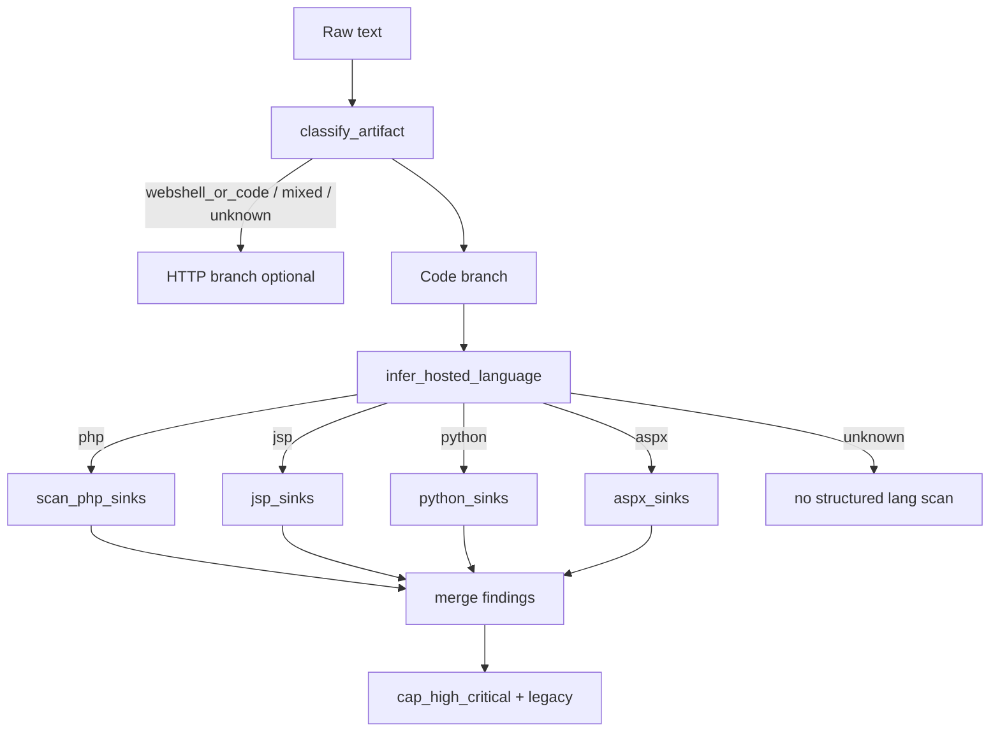
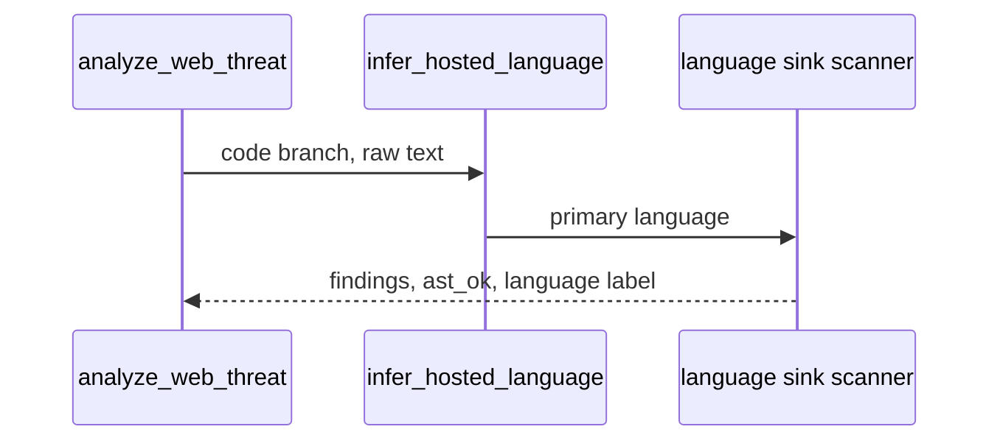

## Metadata

- **Slug:** `web-security-multilang-static`
- **Status:** Implemented (Phase 4–6)
- **Related:** [proposal.md](./proposal.md), [acceptance.md](./acceptance.md)
- **UI:** N/A（纯后端工具能力；无 mockups）

本交付为 **Path B**（无独立 Cursor `*.plan.md`）；**`design.md` 为实现与验收的单一事实来源**。

## Todo list

- [x] **ml-01** — 新增 `code_language.infer_hosted_language`：歧义时按 **PHP → JSP → Python → ASPX** 取主语言。
- [x] **ml-02** — 实现 `jsp_sinks.py` / `python_sinks.py` / `aspx_sinks.py`（高信号危险 sink，证据片段 + `ast_sink`）。
- [x] **ml-03** — 实现 `code_scanners.scan_hosted_code`：聚合 PHP 既有 `scan_php_sinks` 与上述扫描器。
- [x] **ml-04** — 更新 `classify.py`：除 PHP 外识别 JSP / Python / ASPX 标记，使 `artifact_type` 能进入代码分支。
- [x] **ml-05** — 更新 `pipeline.py` 接入 `scan_hosted_code`；保持 `parse_status.code` 语义。
- [x] **ml-06** — 测试：`tests/test_web_security_pipeline.py` 与各语言 fixture；全量相关 pytest。

## Architecture



## Flows



## Contracts

| Item | Contract |
|------|-----------|
| `parse_status.code.language` | 主语言：`php` \| `jsp` \| `python` \| `aspx` \| `unknown`（空字符串表示无代码扫描）。 |
| `Finding.evidence.location` | 前缀约定：`php:ast:Call:*`（既有）、`jsp:sink:*`、`python:sink:*`、`aspx:sink:*`。 |
| `Signal.type` | 继续使用 `ast_sink` 表示结构化 sink 命中（与 PHP 一致，便于 `cap_high_critical`）。 |

## Edge cases & errors

- **混合片段**：若同时含多种标记，按 **ml-01** 优先级只选 **一种** 主语言扫描，避免重复计数；必要时在后续迭代改为多语言并列。
- **unknown**：不进行新的 per-lang 扫描（保留既有 `weak_signals` / traffic 逻辑）。
- **截断**：沿用 `MAX_INPUT_BYTES`；`truncated` 不变。

## Operational / rollout

- 无 feature flag；行为扩展对调用方向后兼容（新增 `language` 取值与 findings）。

## Implementation order

1. `code_language.py` + 单元测试  
2. 各 `*_sinks.py` + `code_scanners.py`  
3. `classify.py` + `pipeline.py`  
4. 集成测试与 fixture  

## Rationale

- 与现有 **PHP 基于正则的“结构化”sink** 一致，先交付 **证据链一致** 的多语言覆盖；完整 AST 可作为后续迭代。

## Code touch list

| Path | Change |
|------|--------|
| `python-agent-service/app/tools/web_security/code_language.py` | New |
| `python-agent-service/app/tools/web_security/jsp_sinks.py` | New |
| `python-agent-service/app/tools/web_security/python_sinks.py` | New |
| `python-agent-service/app/tools/web_security/aspx_sinks.py` | New |
| `python-agent-service/app/tools/web_security/code_scanners.py` | New |
| `python-agent-service/app/tools/web_security/classify.py` | Extend |
| `python-agent-service/app/tools/web_security/pipeline.py` | Wire |
| `python-agent-service/tests/test_web_security_pipeline.py` | Extend |
| `python-agent-service/tests/fixtures/web_security/` | New snippets |

## Testing strategy

- 单元：`infer_hosted_language` 边界（优先级、ASPX vs JSP）。
- 集成：`analyze_web_threat` 对各语言 fixture 至少一条 `ast_sink` finding。

## Pseudocode

```
infer_hosted_language(text):
  if has_php_tag: return php
  if has_jsp_markers and not stronger_aspx: return jsp  # refine with C# Page directive
  if has_aspx_markers: return aspx
  if shebang_python or python_webshell_heuristic: return python
  return unknown

scan_hosted_code(text):
  lang = infer_hosted_language(text)
  switch lang:
    php: return scan_php_sinks(text)
    jsp: return scan_jsp_sinks(text)
    ...
    default: return [], False, unknown
```
