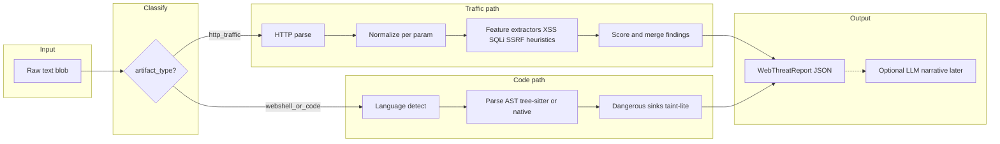
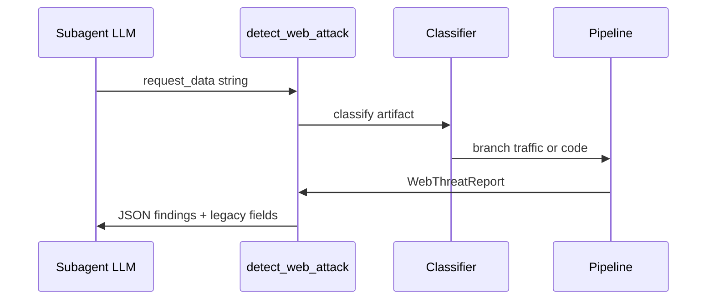

## Metadata

- **Slug:** `web-security-semantic-pipeline`
- **Status:** Implemented (Phase 4)
- **Related:** [proposal.md](./proposal.md), [acceptance.md](./acceptance.md)

This document is the **implementation source of truth** for the next-generation web security analysis path. There is no separate Cursor `*.plan.md` for this delivery (**Path B**).

## Todo list

Implementation backlog (Phase 4); ordered by dependency.

- [x] **ws-01** — Add module `app/tools/web_security/` (or `app/analysis/web_security/`) with **HTTP text parser** (method, path, headers dict, body string, query params) and **normalization** (URL decode layers, safe truncation hooks).
- [x] **ws-02** — Define **Pydantic models** for `WebThreatReport` / `Finding` (see Contracts); wire to tool entrypoint.
- [x] **ws-03** — Implement **traffic semantic layer**: per-parameter **injection context** (html_attr, html_text, js_string, raw, unknown); run **existing** `detect_xss` / `detect_sqli` logic as **feature extractors** on decoded parameter values, not on whole blob — merge scores with **confidence** rules.
- [x] **ws-04** — Implement **code / webshell branch**: detect language by extension or shebang; **AST-based** or **tree-sitter** parse for PHP (minimum); map **dangerous sinks** (eval, assert, system, preg_replace `/e`, dynamic include) to findings with **node span** evidence.
- [x] **ws-05** — Implement **regex bank** only as **labeled weak signals** (e.g. `log4j` jndi string) feeding confidence — never the only reason for `critical` without structured corroboration (see Edge cases).
- [x] **ws-06** — Refactor legacy `detect_web_attack` in `enhanced_tools.py` to **delegate** to the new pipeline; keep deprecated flat fields for one release or bump `schema_version` with migration notes.
- [x] **ws-07** — Update `subagents/official/web-security/skills/web-security/SKILL.md` + bundle `AGENT.md`: mandate **`artifact_type`** first step, branch playbooks, cite JSON schema.
- [x] **ws-08** — **Tests:** golden files under `python-agent-service/tests/fixtures/web_security/`; unit tests for parser, AST smoke, and report schema validation.
- [x] **ws-09** — **Labels / tool_presentation.yaml** — user-facing descriptions for evolved tool output (per `LABELS.md` workflow).

## Architecture

**Principle:** “Semantic” means **structure before pattern**: requests become **parts**; source becomes **AST** (or explicit parse-failure fallback). **Regular expressions** supplement weak signals and legacy compatibility, not the core definition of severity.



### Components

| Component | Responsibility |
|-----------|------------------|
| **Classifier** | Infer `http_traffic` vs `webshell_or_code` from content hints (HTTP verb line, `GET /`, `HTTP/1.`, `<?php`, shebang) and optional user hint in tool args (future). |
| **HTTP parser** | Best-effort RFC-like split; tolerate malformed logs; output **parts** not one string. |
| **Normalizers** | Layered decode, charset note, size cap with explicit `truncated: true`. |
| **Traffic analyzers** | Context-aware XSS/SQLi/SSRF **features** + confidence; use shared libraries from `detect_xss` / `detect_sqli` after refactor into importable package. |
| **Code analyzer** | AST + sink list + optional **taint-lite** (string flow within snippet only). |
| **Scoring** | Merge features; cap severity when only regex-like signals fire without structure. |

## Flows

### Sequence: tool invocation



## Contracts

### Tool input (evolved)

| Field | Type | Required | Notes |
|-------|------|----------|--------|
| `request_data` | `string` | yes | Raw log, raw request, or source file content (unchanged for compat). |
| `hint` | `enum` | no | `auto` (default), `http`, `code` — optional override when classifier uncertain. |

### `WebThreatReport` (v2, illustrative)

| Field | Type | Description |
|-------|------|-------------|
| `schema_version` | `string` | e.g. `"2.0"`. |
| `artifact_type` | `enum` | `http_traffic` \| `webshell_or_code` \| `mixed` \| `unknown`. |
| `parse_status` | `object` | `http`: `{ ok: bool, errors: [] }`; `code`: `{ language, ast_ok: bool }`. |
| `findings` | `array` | See **Finding** below. |
| `legacy` | `object` | Optional: mirror old `attacks_detected` / `severity` for transition. |

### `Finding`

| Field | Type | Description |
|-------|------|-------------|
| `id` | `string` | Stable slug, e.g. `sqli-union-query-param`. |
| `category` | `enum` | `sqli`, `xss`, `ssrf`, `rce`, `webshell`, `traversal`, `other`. |
| `severity` | `enum` | `critical` \| `high` \| `medium` \| `low` \| `info`. |
| `confidence` | `float` | `0.0`–`1.0`. |
| `evidence` | `object` | `snippet`, `start`, `end`, `location` (e.g. `query:foo`, `body:json:$.a`, `ast:Call:name:eval`). |
| `signals` | `array` | `{ "type": "ast_sink" \| "param_context" \| "pattern", "name": "...", "weight": 0.0-1.0 }`. |

**Rule:** `severity` >= `high` requires **at least one** `ast_sink` or `param_context` signal, **or** two independent `pattern` signals with `confidence` >= threshold (config constant). Document threshold in code.

## Pseudocode

```
function analyze(request_data, hint=auto):
  artifact = classify(request_data, hint)
  findings = []
  if artifact in (http_traffic, mixed, unknown):
    http = parse_http(request_data)
    if http.ok:
      for (name, value, ctx) in iter_params_with_context(http):
        findings += xss_features(value, ctx)
        findings += sqli_features(value, ctx)
        findings += ssrf_features(value)
    else:
      findings += fallback_weak_signals(request_data)  # low confidence only
  if artifact in (webshell_or_code, mixed, unknown):
    lang = detect_language(request_data)
    tree = parse_ast(lang, request_data)
    if tree.ok:
      findings += sink_scan(tree, WEB_SHELL_SINKS[lang])
    else:
      findings += obfuscation_heuristics(request_data)  # capped severity
  report = merge_and_score(findings)
  report.legacy = adapt_legacy(report)
  return report
```

## Code touch list

| Area | Paths (expected) |
|------|-------------------|
| Core pipeline | `python-agent-service/app/tools/web_security/` (new package) |
| Tool entry | `python-agent-service/app/tools/enhanced_tools.py` — `detect_web_attack` delegates here |
| Existing scripts | `python-agent-service/subagents/official/web-security/skills/web-security/scripts/*.py` — refactor to **importable** modules or symlink/copy under `app/tools/web_security/extractors/` |
| Models | `python-agent-service/app/tools/web_security/models.py` |
| Tests | `python-agent-service/tests/test_web_security_pipeline.py`, `tests/fixtures/web_security/*` |
| Skill docs | `python-agent-service/subagents/official/web-security/skills/web-security/SKILL.md`, `AGENT.md` |
| Registry / labels | `python-agent-service/config/tool_presentation.yaml`, `config/LABELS.md` |

**Risk:** Adding Tree-sitter or PHP parsers increases native/build complexity — gate behind optional extra or pure-Python fallback (`ast_ok: false`, lower cap).

## Testing strategy

| Layer | Tests |
|-------|--------|
| Unit | HTTP parser edge cases (chunked log lines, malformed headers), classifier branches |
| Unit | Finding schema validation; severity/confidence rules |
| Golden | Fixed inputs → snapshot JSON (strip volatile fields) |
| Integration | Subagent e2e still invokes tool; update `test_e2e_web_file_flow.py` expectations if JSON shape changes |

## Edge cases & errors

- **Oversized input:** refuse full AST beyond N KB; set `truncated`, downgrade confidence.
- **Binary / non-text:** `artifact_type=unknown`, minimal findings.
- **Polyglot content:** `mixed`; run both branches; **dedupe** findings by evidence span.
- **Legacy callers:** If only old clients exist, `legacy.attacks_detected` populated from merged categories.

## Operational / rollout

- **Feature flag** (optional): `WEB_THREAT_SCHEMA_VERSION=2` or config in app settings.
- **Deprecation:** One release with dual fields; log when legacy path used.
- **Telemetry:** Count `parse_status.http.ok`, `ast_ok`, finding counts (no raw secrets).

## Rationale

- **Why not “LLM detects attacks”:** Latency, auditability, and nondeterminism — LLM is a **narrator** on top of structured `findings`, not the ground truth.
- **Why Tree-sitter / AST:** Webshell detection without syntax structure confuses **obfuscated** and **legitimate** code; AST gives **evidence anchors**.
- **Why keep any regex:** Fast recall for known signatures (e.g. JNDI prefix) as **weak signals**, merged into confidence — aligns with hybrid industry practice without claiming proprietary ML.

## Design review handoff

- **UI:** N/A (backend / tool pipeline only).
- **Mockups:** N/A.
