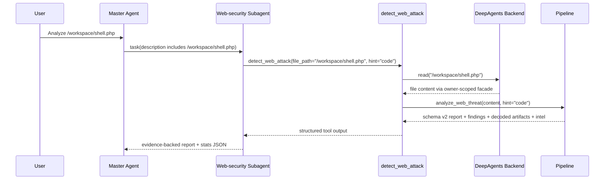
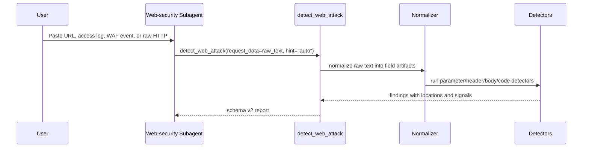

# Design: Web security subagent quality upgrade

## Metadata

- **Slug:** `web-security-subagent-quality-upgrade`
- **Status:** Phase 6 verification complete with E2E blocked by external model quota
- **Updated:** 2026-04-25
- **Related:** [proposal.md](./proposal.md), [acceptance.md](./acceptance.md)
- **`design.md` is the implementation source of truth** for this delivery.

## Todo list

Implementation backlog (stable ids). Order by dependency.

- [x] **websec-contract-tests-red** — Add failing tests for `detect_web_attack(file_path=...)`, URL-only/log/JSON inputs, stricter subagent routing, and stats metadata.
- [x] **websec-tool-runtime-file-input** — Upgrade `DetectWebAttackInput` and `detect_web_attack` to support `file_path` via DeepAgents `ToolRuntime` backend, preserving `request_data`.
- [x] **websec-source-metadata-schema** — Add source/input metadata and structured error shape to schema v2 without breaking legacy top-level fields.
- [x] **websec-normalized-artifacts** — Introduce a lightweight normalization layer for raw HTTP, URL-only, access-log/WAF-log, JSON body, headers, cookies, and form data.
- [x] **websec-traffic-detectors** — Route normalized fields through XSS/SQLi/SSRF/traversal/open-redirect style detectors with field-level evidence locations.
- [x] **websec-code-branch-js-html** — Add first-pass JavaScript/TypeScript/HTML hosted-code scanning for DOM XSS and server-side execution sinks.
- [x] **websec-risk-scoring** — Add deterministic `risk_score`, OWASP/CWE hints where available, and actionable counts from severity/confidence/signals.
- [x] **websec-sop-update** — Update `web_security/AGENT.md` and `skills/web_security/SKILL.md` so file inputs must call `detect_web_attack(file_path=...)` and reports use tool evidence.
- [x] **websec-e2e-tighten** — Tighten E2E/subagent-flow tests so PHP/Web files must use `web-security`, call `detect_web_attack`, and preserve detailed findings.
- [x] **websec-upload-manifest-file-path** — Convert uploaded `/uploads/<owner>/<stored_filename>` paths in the main-agent manifest to `/workspace/<stored_filename>` when they belong to the active workspace, and instruct web/security analysis to pass that `file_path` directly to `detect_web_attack`.
- [x] **websec-non-utf8-file-read** — Fall back from UTF-8 text `read()` failures to raw byte `download_files()` reads inside `detect_web_attack`, then decode with safe web-source encodings before analysis.
- [x] **websec-deterministic-webshell-analysis** — Move PHP deobfuscation, decoded payload scanning, multi-language behavior/capability extraction, IOC extraction, MITRE mapping, and remediation hints into `detect_web_attack` structured output.
- [x] **websec-regression-docs** — Update relevant docs/context if architecture or prompt contracts changed.

## Architecture

The delivery keeps the existing single `web-security` subagent and makes `detect_web_attack` the deterministic entrypoint for both raw content and workspace files.

```mermaid
flowchart TB
  UserInput[User text / upload / path] --> Main[Master Agent routing]
  Main --> Task[task: web-security]
  Task --> Tool[detect_web_attack]
  Tool --> Mode{Input mode}
  Mode -->|request_data| Raw[Raw text]
  Mode -->|file_path| Backend[ToolRuntime backend.read]
  Backend --> Facade[/workspace facade + owner scope]
  Facade --> Raw
  Raw --> Normalize[Artifact normalizer]
  Normalize --> Classify[classify_artifact]
  Classify --> Traffic[Traffic / app branch]
  Classify --> Code[Webshell / hosted-code branch]
  Traffic --> Findings[Schema v2 findings]
  Code --> Decode[Static PHP deobfuscation]
  Code --> Intel[Multi-language webshell intel]
  Decode --> Findings
  Decode --> Intel
  Findings --> Risk[Risk + metadata enrichment]
  Intel --> Report[LLM analyst synthesis]
  Risk --> Report
```

### Responsibilities

| Component | Responsibility |
|-----------|----------------|
| Master agent | Route clear Web files/traffic/logs to `web-security`; pass the manifest `file_path`, not the original filename, in task descriptions. |
| Web-security subagent | Call `detect_web_attack` first for analysis; synthesize evidence into analyst report. |
| `detect_web_attack` | Acquire input content (`request_data` or backend-read `file_path`), fall back to raw bytes for non-UTF-8 web files, normalize artifacts, decode common PHP payload layers, recursively scan decoded artifacts, and emit structured multi-language findings/intelligence for PHP, Python, JSP, ASPX, and JS/HTML. |
| Workspace backend | Resolve virtual `/workspace/...` paths to owner-scoped physical storage; enforce tenant isolation. |
| LLM | Interpret, correlate, deduplicate, classify impact, and produce remediation; not manually detect with ad-hoc grep/regex. |

## Flows

### F1 — File upload / workspace path analysis



### F2 — Raw URL/log/request analysis



### Pseudocode — `detect_web_attack` input acquisition

```text
function detect_web_attack(request_data=None, file_path=None, hint="auto", runtime=None):
  if request_data and file_path:
    return structured_error("ambiguous_input", "Provide request_data or file_path, not both")
  if not request_data and not file_path:
    return structured_error("missing_input", "Provide request_data or file_path")

  if file_path:
    if runtime missing or backend unavailable:
      return structured_error("backend_unavailable", file_path)
    content_result = runtime_backend.read(file_path, offset=0, limit=internal_full_read_limit)
    if read failed:
      return structured_error("file_read_failed", file_path, error)
    text = extract_text_content(content_result)
    source = {kind: "file", path: file_path}
  else:
    text = request_data
    source = {kind: "inline"}

  report = analyze_web_threat(text, hint=hint, source=source)
  return enrich_with_source_and_risk(report, source)
```

## Contracts

### Tool input contract

`detect_web_attack` remains the canonical tool name.

| Field | Type | Required | Notes |
|-------|------|----------|-------|
| `request_data` | `str | None` | conditional | Raw HTTP, URL, log line, WAF event, code snippet, or pasted text. |
| `file_path` | `str | None` | conditional | Absolute virtual workspace path, normally `/workspace/<name>`. |
| `hint` | `auto | http | code` | no | Existing hint semantics retained. |

Exactly one of `request_data` or `file_path` must be provided.

### Tool runtime contract

- `file_path` reads must use DeepAgents runtime backend, not local filesystem APIs.
- `/workspace/...` must pass through `CompositeBackend` and `WorkspaceFacadeBackend` so current owner scope is enforced.
- Tool results must never reveal physical owner-scoped paths such as `<upload_dir>/u_<uid>/p_<pid>/...`.

### Schema v2 additions

Existing fields remain:

- `schema_version`
- `artifact_type`
- `parse_status`
- `findings[]`
- legacy top-level `attacks_detected`, `severity`, `attack_count`, `requires_immediate_action`

Add compatible optional fields:

| Field | Purpose |
|-------|---------|
| `source.kind` | `inline` or `file`. |
| `source.path` | Virtual `/workspace/...` path for file mode. |
| `source.truncated` | Whether input was truncated before analysis. |
| `findings[].risk_score` | 0–100 deterministic score derived from severity/confidence/signals. |
| `findings[].owasp` | Optional OWASP category hint. |
| `findings[].cwe` | Optional CWE ids when confidently mapped. |
| `findings[].evidence.decoded` | Optional decoded payload or decode chain summary. |

### Evidence location format

Use stable, machine-readable locations:

- `file:/workspace/shell.php:L12`
- `query:q`
- `body.form:password`
- `body.json:user.profile.name`
- `header:user-agent`
- `cookie:session`
- `log.request_uri:q`
- `js:dom:innerHTML`
- `php:ast:Call:eval`

### Prompt/SOP contract

- File inputs: call `detect_web_attack(file_path=..., hint=...)` directly.
- Inline text/log/URL inputs: call `detect_web_attack(request_data=..., hint=...)`.
- Do not manually `read_file`, `grep`, or create ad-hoc dangerous-function searches before the scanner.
- The LLM may ask clarification only when target/scope remains materially ambiguous after the input is known.

## Code touch list

Likely files:

- `python-agent-service/subagents/official/web_security/tools/tools.py`
- `python-agent-service/subagents/official/web_security/tools/pipeline.py`
- `python-agent-service/subagents/official/web_security/tools/models.py`
- `python-agent-service/subagents/official/web_security/tools/scoring.py`
- `python-agent-service/subagents/official/web_security/tools/http_parse.py`
- `python-agent-service/subagents/official/web_security/tools/traffic_analyzer.py`
- `python-agent-service/subagents/official/web_security/tools/classify.py`
- `python-agent-service/subagents/official/web_security/tools/code_language.py`
- New: `python-agent-service/subagents/official/web_security/tools/normalizer.py`
- New or updated: `python-agent-service/subagents/official/web_security/tools/js_html_sinks.py`
- `python-agent-service/subagents/official/web_security/AGENT.md`
- `python-agent-service/subagents/official/web_security/skills/web_security/SKILL.md`
- `python-agent-service/config/tool_presentation.yaml`
- `python-agent-service/tests/test_web_security_pipeline.py`
- `python-agent-service/tests/test_web_threat_yara_sandbox.py`
- `python-agent-service/tests/test_e2e_web_file_flow.py`
- New: `python-agent-service/tests/test_web_security_file_input.py`
- New or updated fixtures under `python-agent-service/tests/fixtures/web_security/`

Risky areas:

- Tool runtime injection into `StructuredTool.from_function` must match LangChain/DeepAgents expectations.
- Backend read output may be `str`, `ReadResult`, `ToolMessage`, or formatted line-number text depending on call path; the tool should call backend directly and parse backend-native result, not reuse the public `read_file` display formatter.
- `risk_score` additions must remain optional or defaulted so existing renderers/tests do not break.

## Testing strategy

### Unit tests

- Input validation:
  - both `request_data` and `file_path` returns structured `ambiguous_input` error.
  - neither returns structured `missing_input` error.
  - `request_data` path preserves current behavior.
- Backend file mode:
  - `/workspace/shell.php` is read through a fake/runtime backend and detects PHP sink.
  - failed backend read returns structured error and does not fall back to `ls`/`glob`.
  - physical paths are not returned in tool output.
- Normalization:
  - URL-only encoded XSS produces `query:<param>` finding.
  - Apache/Nginx log line extracts request URI and source IP metadata.
  - JSON body SQLi produces `body.json:<path>` finding.
  - cookie/header payloads produce `cookie:<name>` / `header:<name>` findings.
- Hosted code:
  - benign PHP escaping does not escalate to high.
  - JS/HTML DOM XSS sample produces location with `js:dom:*` or `html:*`.
- Scoring:
  - high-confidence ast/yara findings produce high risk score.
  - weak full-blob patterns remain capped and lower risk.

### Integration / agent-flow tests

- Uploaded `.php` file must route to `web-security`, not `binary-analysis` or `general-purpose`.
- The web-security task result must include a `detect_web_attack` tool call.
- File-based task should pass `file_path` to `detect_web_attack`, not require a prior `read_file`.
- Final conclusion meta can derive security severity, risk score, threat classes, validation, and actionable counts.

### E2E scenarios

Backend-only delivery; no Playwright UI E2E required unless the implementation changes user-visible frontend behavior. Existing stream-level tests should cover `/analyze` flow.

| ID | Scenario | Route / API | Key assertions |
|----|----------|-------------|----------------|
| E2E-01 | Upload PHP webshell and ask for analysis | `stream_analyze_request` / `/analyze` | Routes to `web-security`; calls `detect_web_attack(file_path=...)`; reports PHP sink evidence. |
| E2E-02 | Paste access log with encoded XSS | `stream_analyze_request` / `/analyze` | No file read; detects XSS with log/request URI location. |
| E2E-03 | Paste JSON API request with SQLi | `stream_analyze_request` / `/analyze` | Detects SQLi in `body.json:*`; final stats include security metadata. |

## Edge cases & errors

- `file_path` outside `/workspace/` returns structured `path_out_of_scope`.
- Backend unavailable returns `backend_unavailable`.
- Backend read failure returns `file_read_failed` with the virtual path only.
- Large files are truncated at the pipeline input cap and mark `source.truncated=true` / `parse_status.truncated=true`.
- Binary or unsupported multimodal files return `unsupported_file_type` instead of running text detectors on corrupted bytes.
- Mixed artifacts run both traffic and code branches and deduplicate findings by category/location/root cause.
- Prompt injection inside analyzed files is treated as untrusted artifact content, not instruction.
- No secrets are logged; snippets are truncated and should avoid dumping full cookies/tokens.

## Implementation order

1. Add failing tests for the new contract.
2. Add tool input schema fields and runtime/backend plumbing.
3. Add structured source/error metadata to models and renderer tolerance.
4. Add normalization layer and route traffic analyzer over normalized fields.
5. Add JS/HTML hosted-code branch.
6. Add risk score and stats JSON mapping.
7. Update subagent prompt and skill SOP.
8. Tighten E2E/flow tests.
9. Run focused pytest, then broader backend tests for touched areas.

## Rationale

- `detect_web_attack(file_path=...)` is preferred over a separate `detect_web_attack_file` tool because it keeps one canonical scanner and avoids LLM tool-choice ambiguity.
- Keeping one `web-security` subagent is safer than splitting `web` and `webshell`; many artifacts are ambiguous or mixed until the scanner classifies them.
- Runtime backend reads preserve the existing workspace sandbox and owner isolation model. Direct local path conversion would bypass those invariants.
- The LLM should not be the detector. It should interpret structured evidence, correlate root causes, assess exploitability, and write remediation guidance.

## UI

No UI component changes are planned. Existing `TaskStatsBar` can consume improved `conclusion.meta.security` if backend metadata includes `riskScore`, severity, threat classes, validation dimensions, and actionable counts.
