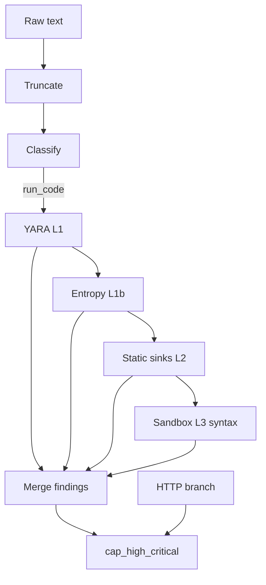
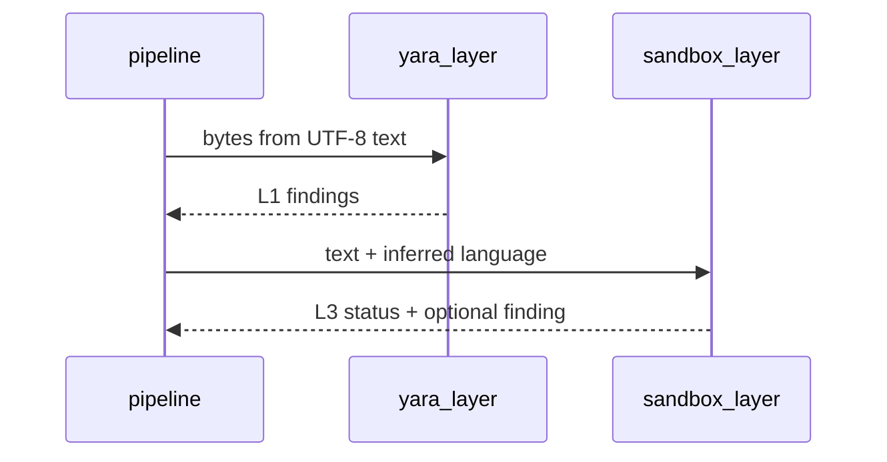

## Metadata

- **Slug:** `web-threat-yara-sandbox`
- **Status:** Implemented (Phase 4–6)
- **Related:** [proposal.md](./proposal.md), [acceptance.md](./acceptance.md)
- **UI:** N/A

**Path B** — `design.md` 为实现单一事实来源。

## Todo list

- [x] **yss-01** — `resolve_web_security_yara_dir()`：固定相对 `SERVICE_ROOT` 的 skill 路径；支持 `WEB_THREAT_YARA_RULES_DIR` 覆盖。
- [x] **yss-02** — `yara_layer`：编译 `.yar` / `.yara`，`match(data=bytes)` → `Finding`（`layer=L1`, `Signal.type=yara_rule`）。
- [x] **yss-03** — `entropy_layer`：滑动窗口 Shannon 熵，超阈产生 **pattern**、**info/low** finding，`layer=L1`，`evidence.location` 前缀 `L1:entropy:`。
- [x] **yss-04** — `sandbox_layer`：PHP `php -l`、Python `python -m py_compile`；超时/无解释器时写入 `AnalysisLayersStatus`。
- [x] **yss-05** — 扩展 `models.py`：`SignalType` 含 `yara_rule`、`sandbox_trace`；`Finding.layer`；`ParseStatus.layers`（`AnalysisLayersStatus`）。
- [x] **yss-06** — `pipeline.py`：在 `run_code` 分支顺序 **L1 YARA → L1b 熵 → L2 scan_hosted_code → L3 沙箱**；合并 findings；L2 findings 标记 `layer=L2`。
- [x] **yss-07** — `scoring.cap_high_critical`：`yara_rule` 与 `sandbox_trace` 视为结构化证据。
- [x] **yss-08** — Skill 目录下默认 `yara/*.yar`；更新 `SKILL.md` 说明规则维护方式。
- [x] **yss-09** — `requirements.txt` 增加 `yara-python`；`.env.example` 开关说明。
- [x] **yss-10** — 单元/集成测试与 `acceptance.md` 验收。

## Architecture



## Flows



## Contracts

| Field / config | 说明 |
|----------------|------|
| `WEB_THREAT_YARA_ENABLED` | 默认 `true`；`false` 跳过 L1。 |
| `WEB_THREAT_YARA_RULES_DIR` | 可选绝对或相对 `SERVICE_ROOT` 的目录覆盖。 |
| `WEB_THREAT_ENTROPY_ENABLED` | 默认 `true`。 |
| `WEB_THREAT_SANDBOX_ENABLED` | 默认 `true`；`false` 跳过 L3。 |
| `WEB_THREAT_SANDBOX_TIMEOUT_SEC` | 默认 `8`。 |
| `Finding.layer` | `L1` \| `L2` \| `L3` 或省略（兼容旧客户端）。 |
| `parse_status.layers` | `AnalysisLayersStatus`：YARA 编译数、错误、沙箱结果摘要。 |
| YARA 规则路径 | 默认 `subagents/official/web-security/skills/web-security/yara/`（仓库内真实目录）。 |

## Edge cases

- `yara` 未安装：L1 标记 `yara_status=unavailable`，不产生异常中断工具。
- 无 `.yar` 文件：`yara_status=no_rules`。
- PHP 不在 PATH：L3 对 PHP 标记 `skipped_no_interpreter`。
- 输入过大：沿用 `MAX_INPUT_BYTES`；熵窗口仅扫描截断后文本。

## Rationale

- **语法沙箱**而非任意执行：满足「动态」解释器调用且符合服务安全边界。
- **规则随 skill**：运维可复制 bundle，路径以 `SERVICE_ROOT` 解析，避免虚拟路径 `/subagent-skills/...` 直接编译。

## Code touch list

- `python-agent-service/app/tools/web_security/yara_loader.py`
- `python-agent-service/app/tools/web_security/yara_layer.py`
- `python-agent-service/app/tools/web_security/entropy_layer.py`
- `python-agent-service/app/tools/web_security/sandbox_layer.py`
- `python-agent-service/app/tools/web_security/models.py`
- `python-agent-service/app/tools/web_security/pipeline.py`
- `python-agent-service/app/tools/web_security/code_scanners.py`（L2 layer tag）
- `python-agent-service/app/tools/web_security/scoring.py`
- `python-agent-service/subagents/official/web-security/skills/web-security/yara/*.yar`
- `python-agent-service/subagents/official/web-security/skills/web-security/SKILL.md`
- `python-agent-service/requirements.txt`, `python-agent-service/.env.example`
- `python-agent-service/tests/test_web_threat_yara_sandbox.py`

## Testing strategy

- Mock 或最小 `.yar` fixture；熵用固定字符串断言；沙箱用合法/非法语法样本。

## Pseudocode

```
if run_code:
  if yara_enabled and yara_available:
    findings += yara_scan(text.encode('utf-8'))
  if entropy_enabled:
    findings += entropy_scan(text)
  findings += tag_layer(scan_hosted_code(text), L2)
  if sandbox_enabled and lang in (php, python):
    status, extra = syntax_sandbox(text, lang)
    findings += extra
  parse_status.layers = build_layers_status(...)
```
