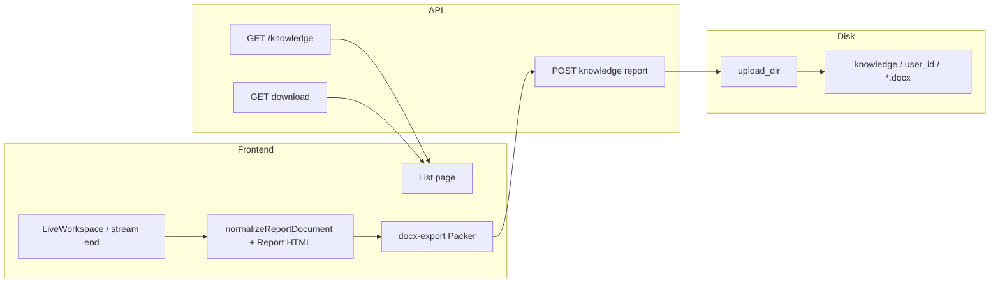
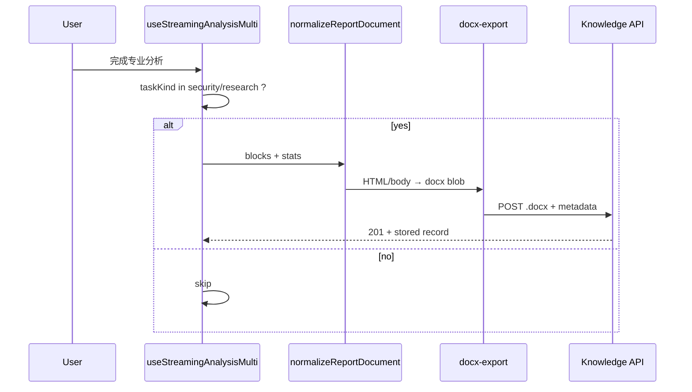
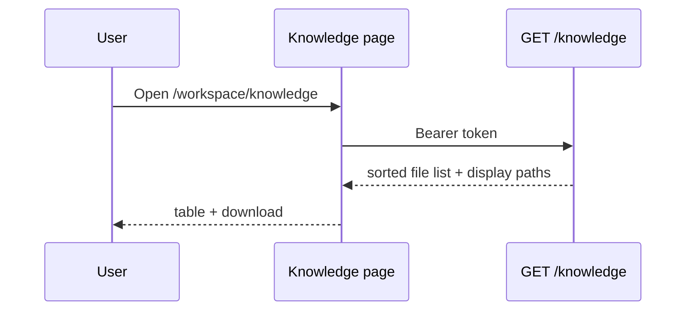

# Design — Workspace 知识库

## Metadata

- **Slug**: `workspace-knowledge-base`
- **Date**: 2026-04-28
- **Tier**: Standard
- **Proposal**: [`proposal.md`](./proposal.md)
- **Acceptance (backend/API)**: [`acceptance.md`](./acceptance.md)
- **Acceptance (UI)**: [`acceptance-ui.md`](./acceptance-ui.md)
- **Source plan**: Path B — 由本对话需求直接落档（无外部 `*.plan.md` 归档）。本文档为实施 SoT。

## Todo list

- [x] `kb-path-convention` — `app/services/knowledge_paths.py`：`{upload_dir|KNOWLEDGE_STORAGE_ROOT}/knowledge/<uid>/`；API `display_path`：`Workspace/knowledge/<filename>`。
- [x] `kb-api-store` — `POST /knowledge/reports` multipart，幂等文件名 `report-{message_id}.docx`。
- [x] `kb-api-list` — `GET /knowledge`。
- [x] `kb-api-download` — `GET /knowledge/download?filename=`。
- [x] `fe-sidebar-route` — 侧栏 + 路由 `/knowledge`。
- [x] `fe-knowledge-page` — `KnowledgeBase.tsx`。
- [x] `fe-auto-archive` — `knowledgeArchive.ts` + `Index` 完成回调；`useStreamingAnalysisMulti` 注入 `completedRequestId`。
- [x] `fe-i18n` — `sidebar.navKnowledgeBase`、`knowledgeBase.*`。
- [x] `tests-unit` — `tests/test_knowledge_paths.py`；前端 `npm run test` 通过。
- [x] `tests-e2e` — `e2e/tests/workspace-knowledge-base.spec.ts`（需本地前后端 + auth setup）。
- [ ] `acceptance-signoff` — Phase 6 人工验收后填写。

## Architecture

知识库文件落在 **与项目上传同一 `upload_dir` 根** 下，**硬编码**布局为顶层目录 **`knowledge/<user_id>/`**（与 `u_<uid>/p_<pid>/` **并列**，不位于 `u_` 子树内），仅存放知识库 .docx。

### 路径约定（重要）

| 层级 | 值 |
|------|-----|
| **磁盘（硬编码布局）** | `{upload_dir}/knowledge/<sanitized_user_id>/<generated>.docx` — 相对「上传根」下第一级目录名固定为 **`knowledge`**，第二级为 **用户 id**（经 `sanitize_path_segment`，与 uploads 侧 uid 规则一致）。 |
| 逻辑虚拟路径（协议/API，草案） | `/workspace/knowledge/<file>.docx` 或带 owner 的内部 id（实现以 API 契约为准；用户可见仍折叠为 `Workspace/...`） |
| **用户界面展示路径** | `Workspace/knowledge/<file>.docx` |

需求原文「实际路径 knowleage/用户 id」：`knowleage` 为拼写误差，**目录名采用 `knowledge`**。本交付**不**使用 `u_<uid>/knowledge/` 布局。

### 存档时机

建议在**前端**检测到以下条件后触发一次存档（防抖、每 `project_id` + `analysis_result_id` 或消息 id 幂等键去重）：

1. SSE/流结束且会话状态 `done`/等价成功。
2. 持久化或内存中的 `stats.taskKind`（或 `conclusion.meta.taskKind`）为 `security` 或 `research`。
3. 报告主体非空（`normalizeReportDocument` 后有关键内容或可序列化 Markdown/HTML）。

后端**可选**：若日后要把生成移到服务端，再在 `design.md` 追加 ADR；本交付以前端生成 .docx + 上传为主，避免重复实现两套排版。

## Flows

### 自动存档

### 浏览知识库

## Contracts

### 配置 / 环境

- `KNOWLEDGE_MAX_FILE_BYTES`（可选，默认对齐 `max_upload_bytes_per_file`）。
- **落盘根：** 默认 **`settings.upload_dir`**（与现有上传一致），其下 **硬编码** `knowledge/<user_id>/`。若部署需将知识库单独挂卷，可新增可选 `KNOWLEDGE_STORAGE_ROOT` 覆盖「含 `knowledge/` 这一段的根」；未设置时仍以 `upload_dir` 为准。

### HTTP（草案）

| Method | Path | 说明 |
|--------|------|------|
| `POST` | `/api/knowledge/reports`（前缀以现有 FastAPI `router` 挂载为准） | `multipart/form-data`：`file`（.docx）、`project_id`、`message_id`、`task_kind` |
| `GET` | `/api/knowledge` | 返回 `{ items: [{ filename, size_bytes, updated_at, display_path, download_path }] }` |
| `GET` | `/api/knowledge/download?path=` 或 RESTful `.../files/{id}` | 鉴权后 `FileResponse` |

**错误：** 413 超大、401 未登录、404 不属于当前用户、`409`/`200` 幂等策略按实现选用（同一 `message_id` 重复 POST 覆盖或跳过）。

### SSE / DB

- **本版本不要求**新建 DB 表；若仅依赖文件系统，`GET` 通过枚举目录 + `mtime` 即可。**可选增强**：PostgreSQL 表存储元数据便于排序与去重索引（defer）。

## Code touch list

| 区域 | 路径（预期） |
|------|----------------|
| 侧栏 | `src/components/ProjectSidebar.tsx` |
| 路由 | `src/App.tsx` |
| 新页面 | `src/pages/KnowledgeBase.tsx`（或 `Knowledge/` 子目录） |
| 存档调用 | `src/pages/Index.tsx` 或与 `useStreamingAnalysisMulti`/会话完成回调协作的 hooks |
| 导出复用 | `src/lib/docx-export.ts`、`src/lib/reportDocument.ts` |
| API client | `src/lib/api-client.ts` |
| i18n | `src/i18n/locales/*.ts` |
| 后端 | `python-agent-service/app/api/` 新知识库路由；**独立** `knowledge_paths.py`（或等价）实现 `knowledge/<user_id>/` 解析与鉴权，避免与 legacy `/uploads/` 虚拟路径混用；`main` 挂载 |
| E2E | `e2e/tests/workspace-knowledge-base.spec.ts` |

**风险：** 存档钩子若绑在过早的流事件会导致重复写入 — 必须使用稳定 id 幂等。**风险：** .docx 体积与频率 —— 对齐上传上限与节流。

## Testing strategy

- **单元**：路径净化、后端 `authorize` 与用户 id 一致性；前端归档条件（taskKind gated）。
- **集成**：Mock API：`POST` 后以 `glob`/`os.listdir` 断言文件存在。
- **E2E scenarios**（Standard）

### E2E scenarios

| ID | Scenario | Route / API | Key assertions |
|----|----------|-------------|----------------|
| E2E-01 | 已登录用户打开侧栏「知识库」进入列表页 | `/workspace/knowledge`（以最终实现为准） | 页面标题/空状态可见；无控制台致命错误 |
| E2E-02 | （可选）Mock 存档后列表出现一条记录 | `GET /api/knowledge` | 行数 ≥ 1；展示路径包含 `Workspace/knowledge` |

## Edge cases & errors

- **非专业任务完成**：不写知识库。
- **重复完成事件**：幂等键（`message_id` 或 `project_id + result_id`）。
- **归档失败**：Toast 文案 + 不重试滥用（限量重试）。
- **仅匿名会话**：不调用存档 API 或在 UI 静默跳过。
- **下载鉴权**：按 `knowledge/<user_id>/` 专用解析器校验「当前登录用户 id == 目录段 user_id」，禁止 `..` 与跨用户路径；**不**依赖 legacy `authorize_virtual_path` 对 `/uploads/` 的规则，除非封装复用其 `Path` 防穿越子方法。

## Implementation order

1. 后端路径常量 + POST/GET/download + 单测。
2. 前端 API client + 知识库页面 + 侧栏 + 路由 + i18n。
3. 前端存档钩子 + 幂等。
4. Vitest + pytest + Playwright grep。

## Rationale

- **为何采用顶层 `knowledge/<user_id>/`：** 与产品表述一致（物理上「知识」与「按用户分桶」一目了然）；与 uploads 的 `u_<uid>/p_<pid>/` **解耦**，避免与项目沙箱路径混淆。
- **为何前端生成 .docx：** 与当前用户导出 Word 体验一致，减少 Python 侧重复模板。
- **用户可见 `Workspace/knowledge`：** 与 `WORKSPACE_VIRTUAL_ROOT` 及 `scrubVirtualPathsForDisplay` 心智模型一致。

## UI

- 侧栏项：与「专业子 Agent」「专项技能」同级视觉权重的第三项或插入在技能下方；折叠态仅图标 + Tooltip。
- 列表页：深色主题与 `ProjectSidebar` token 一致；空状态说明「完成安全或研究类任务后自动归档」。

## Design review handoff

- **target:** `.cursor/design-review-handoff/target.local.yaml`（`base_url` 指向本地 Vite，如 `http://127.0.0.1:8080`）
- **priority paths:** 新知识库路由、侧栏展开/折叠
- **mockups:** 见 [`acceptance-ui.md`](./acceptance-ui.md)（本版 **Mockups deferred**）

## Mockups deferred

本版无独立视觉稿；实现遵循现有 Workspace 侧栏与表格/列表密度。若后续补充 PNG，放入 `mockups/` 并更新 `acceptance-ui.md` 参考表。
