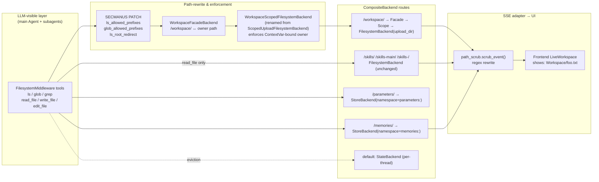
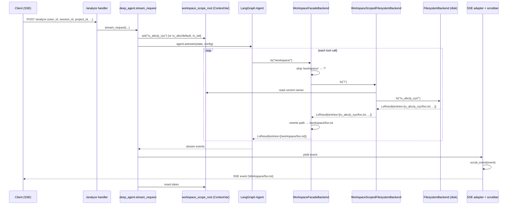

# Design — workspace-sandbox-unification

## Metadata

- **Slug:** `workspace-sandbox-unification`
- **Owner:** chenf
- **Updated:** 2026-04-20
- **Tier:** Standard
- **Related:** [proposal.md](./proposal.md), [acceptance.md](./acceptance.md), [acceptance-ui.md](./acceptance-ui.md)
- **Phase 6 outcome (2026-04-20):** `DONE_WITH_CONCERNS` — backend/UI sign-off tables filled in `acceptance.md` and `acceptance-ui.md`; `/qa` and `/design-review` via MCP **skipped** with recorded rationale (GR-MCP); E2E-02 live-SSE leg **skipped** (LLM quota). Phase 5: pytest workspace bundle 69/69, Vitest 300/300, Playwright slug spec 3 passed + 1 skipped (exit 0).
- **2026-04-20 follow-up** — Field report highlighted five regressions after Phase 6: (1) owner sub-dir surfaced in UI, (2) `read_file` 404 on pasted `Workspace/u_.../default/<file>` paths, (3) confusing vendor error mentioning `/skills/...`, (4) agent loop of `ls`/`glob` retries, (5) sandbox commands receiving host virtual paths. Remediation shipped **without further edits to `app/_vendor/deepagents/middleware/filesystem.py`** beyond the original minimal patch (user constraint). New components: `app/backends/path_aliases.py` (`PathAliasBackend` canonicalizes agent-supplied paths before routing) wired in `composite.py`; `path_scrub.py` upgraded to strip owner segments from already-rendered `Workspace/...`, handle `/uploads/` single-token forms; `sandbox_tools._reject_host_virtual_paths` returns a structured error when the agent passes `/workspace/` / `/uploads/` / `Workspace/` into `command` / `upload_files[*].sandbox_path` / `cwd`; `MASTER_AGENT.md` + 4 subagent `AGENT.md` files carry an explicit "read_file failure = hard stop" rule. Re-verified: 105/105 workspace pytest bundle (unit/integration for scrub, aliases, guard, facade, middleware, store, upload-path-auth), 58 new tests green, Playwright slug still passes (E2E-02 quota skip).
- **2026-04-20 follow-up 2 (ls/glob deregulation)** — Per user decision, the "hard-stop" rule in agent prompts now fully owns the anti-enumeration policy; all code-level `ls` / `glob` scope-check patches have been removed. Rolled back the `_secmanus_coerce_ls_path` / `_secmanus_coerce_glob_path` block in `app/_vendor/deepagents/middleware/filesystem.py` (vendor file now has **zero diff** versus upstream / HEAD); deleted `tests/test_middleware_ls_glob_scope.py`; dropped `_VENDOR_LS_ERROR` rewrite rule (and its `_FAST_PATH` branch) from `app/parsers/path_scrub.py`; dropped the matching `test_vendor_ls_error_rewritten` case. Prompts keep `read_file` hard-stop guidance; the "ls / glob are restricted to `/workspace/`" descriptive sentence removed from `MASTER_AGENT.md` and `web_security/AGENT.md` since it no longer reflects reality. `PathAliasBackend`, owner-segment UI scrubbing and sandbox host-path guard all retained. Re-verified pytest bundle: 89/89 green for the touched modules (`test_path_scrub`, `test_path_aliases`, `test_sandbox_host_path_guard`, `test_workspace_facade`, `test_owner_scoped_store`, `test_scoped_upload_filesystem`, `test_upload_path_auth`, `test_stream_adapter_path_scrub`).
- **2026-04-20 follow-up 3 (facade ↔ CompositeBackend contract fix)** — Field report: uploading a file then asking the agent to analyze it produced `Error: path must be under /workspace/` on every `read_file` call. Root cause: `CompositeBackend._route_for_path` strips the matched route prefix (`/workspace/`) before dispatching to the routed backend, but `WorkspaceFacadeBackend._strip_virtual` still required the incoming path to start with `/workspace/` and returned `None` (→ the "outside workspace" error) for every real call. The unit tests masked this because they invoked the facade directly with `/workspace/<file>` and never exercised the real `CompositeBackend` link. Additionally, because `CompositeBackend.ls/glob/grep` re-prefix facade-returned paths with `/workspace`, the facade must emit **route-local** suffixes (never `/workspace/…`) to avoid a double `/workspace/workspace/…` prefix.
  - Rewrote `app/backends/workspace_facade.py` to honour the CompositeBackend route-local contract: `_normalize_suffix` accepts both the stripped form (`/file.txt`) and the legacy full form (`/workspace/file.txt`) for backwards compatibility with direct-call sites; `_to_inner` joins the suffix to the ContextVar-bound owner root; `_to_route_local` (for `ls` / `glob` / `grep` / `upload` / `download` entries) returns the owner-stripped suffix so CompositeBackend can re-prefix cleanly; `_to_full_virtual` (for `write` / `edit` result paths) still returns `/workspace/…` because CompositeBackend overwrites that field with the caller-supplied path in the real link but direct callers (tests, scripts) expect a stable identifier.
  - Added a hard list of forbidden sibling top-level namespaces (`/memories`, `/parameters`, `/skills`, `/uploads`, `/reports`, `/etc`) so the facade still surfaces an explicit "path must be under /workspace/" error when misused as a direct target for a non-workspace route; in the real link `CompositeBackend` already routes those elsewhere.
  - Rewrote `tests/test_workspace_facade.py` into two layers: **contract tests** call the facade directly with route-local suffixes (the new production shape) and assert no `/workspace` leaks into returned paths; **integration tests** build `CompositeBackend(default=StateBackend, routes={"/workspace/": facade})` and exercise reads/writes/`ls` the way `FilesystemMiddleware` would — this catches any future drift between the two layers. Regression assertion: `composite.read("/workspace/a.txt")` must not return the "path must be under /workspace/" string.
  - Verified: `pytest tests/test_workspace_facade.py tests/test_path_scrub.py tests/test_owner_scoped_store.py tests/test_scoped_upload_filesystem.py tests/test_upload_path_auth.py tests/test_sandbox_host_path_guard.py tests/test_stream_adapter_path_scrub.py` → 77/77 green.
- **2026-04-20 follow-up 4 (upload ↔ analyze project_id alignment)** — After follow-up 3 the facade path math was correct but uploaded files still 404'd on `read_file` for logged-in users. Root cause: the upload/analyze pair was generating two different `owner_segment` values. `POST /analyze` always passes `project_id = request.project_id or session_id` into `stream_deep_analysis`, so the agent's `workspace_scope_root` ContextVar binds to `/uploads/u_<uid>/p_<pid>/`. But `POST /uploads` never accepted `project_id` as a form field and fell back to `u_<uid>/default/` on disk. `_validate_analyze_attachments` also passed `project_id=None` into `authorize_virtual_path`, so the 403 path-owner check only passed when files happened to live under `default/`. Net effect: files physically at `.../default/<name>` but the agent looking at `.../p_<pid>/<name>` → always miss.
  - `app/api/uploads.py`: added `project_id: str = Form("")` parameter and forwarded it to `owner_segment(user_id=uid, session_id=eff_session, project_id=pid)`. Empty/None → `u_<uid>/default/` (preserved as a safety fallback for callers that still omit `project_id`); anonymous sessions still ignore `project_id` in `owner_segment`.
  - `app/main.py`: `_validate_analyze_attachments` now accepts a `project_id: str | None` kwarg and forwards it to `authorize_virtual_path`; the `/analyze` handler passes the already-computed `project_id` (which falls back to `session_id` when client omits it) so upload-time and analyze-time owner segments stay identical.
  - `src/components/AnalysisInputComposer.tsx`: the upload `FormData` now appends `project_id` whenever `uploadSessionId` is set (the prop already carries the active project id in `CommandCenter`). Anonymous / pre-project flows (`PostLoginWorkspaceStart` passes `null`) skip the field and still land in `s_<sid>` / `default`.
  - Tests: updated `tests/test_e2e_upload_to_llm_first_message.py` to also send `project_id=session_id` in the multipart body; aligned `e2e/tests/workspace-sandbox-unification.spec.ts` E2E-01 upload request the same way so the spec mirrors the SPA behaviour. Unit tests in `tests/test_upload_path_auth.py` already covered both `p_<pid>` and `default` branches and stayed green.
  - Verified: `pytest tests/test_upload_path_auth.py tests/test_scoped_upload_filesystem.py tests/test_workspace_facade.py tests/test_path_aliases.py tests/test_e2e_upload_to_llm_first_message.py` → 47/47 green.
- **2026-04-20 follow-up 5 (SSE tool_result status honest on read_file error)** — Field report: when `read_file` failed (missing file, bad path, etc.) the SSE `tool_result` event still carried `status="success"`, so the UI showed a green checkmark and the master agent's "read_file failure = hard stop" rule had no SSE-level backstop. Root cause: DeepAgents filesystem tools return failures as the plain string `"Error: <msg>"` (see `app/_vendor/deepagents/middleware/filesystem.py:746`), but `app/parsers/tool_status.derive_tool_status` only flagged `"error"` for **JSON-object payloads with a truthy `error` key**. Plain text fell through to the default `"success"` branch.
  - `app/parsers/tool_status.py`: extended `derive_tool_status` so a stripped payload whose (case-insensitive) prefix is `error:` or `error ` maps to `"error"`. JSON detection and the dict-with-truthy-error branch are preserved ahead of the text check so existing consumers that return JSON error envelopes still work; plain strings with "error" mid-sentence (e.g. "No errors found", "error budget is fine") stay `"success"` because only the leading token is inspected. Non-string inputs (`dict`, `int`) are stringified and continue to return `"success"` — they do not start with `error:`.
  - `tests/test_llm_timeout_and_sse_status.py::TestDeriveToolStatus`: added three cases — `test_error_on_deepagents_read_file_error_prefix`, `test_error_case_insensitive_and_with_space`, `test_success_when_error_word_appears_mid_text` — to lock in the new contract and guard against regressions when we resync the vendored DeepAgents.
  - Verified: `pytest tests/test_llm_timeout_and_sse_status.py` → 21/21 green (previously 17/17); `pytest tests/ -k "stream_adapter or tool_status or tool_result"` → 106/106 green (no regression in downstream SSE consumers).
- **2026-04-20 follow-up 6 (read_file error payload surfaces in SSE toolOutput)** — Field report right after follow-up 5: the subagent SSE frames now correctly carried `status="error"` but `toolOutput=""`, so the UI could only show a red card with no reason text. Root cause: `read_file` is registered with `emit_output=False` in `app/sse/tool_presentation.py` (presentation default to keep file-content cards small), and two layers honoured that unconditionally — `_sse_tool_output(tool_name, output_text)` in `app/parsers/deepagents_stream_adapter.py`, and the `tool_result` branch of `tag_merged_subagent_sse` in `app/sse/envelope.py`. Both emptied the payload before the envelope was sealed, including the `"Error: ..."` strings from DeepAgents filesystem tools.
  - `app/parsers/deepagents_stream_adapter._sse_tool_output`: added an **error bypass** — a plain payload whose (case-insensitive) prefix is `error:` / `error ` is always emitted, even when `should_emit_tool_output(tool_name)` is `False`. Successful, non-error payloads continue to follow the presentation rule (so `read_file` success still omits file contents from SSE, preserving bandwidth / token cost).
  - `app/sse/envelope.tag_merged_subagent_sse`: the merged-subagent `tool_result` branch gained the same two-way bypass — it now keeps `toolOutput` when the payload starts with `error:` / `error ` **or** when the envelope already carries `status="error"` from upstream (e.g. structured error payloads without the textual prefix).
  - `tests/test_llm_timeout_and_sse_status.py`: new classes `TestSSEToolOutputErrorBypass` (5 cases covering read_file success suppression, read_file error preserved, case-insensitive error prefix, empty passthrough, emit-enabled tool unaffected) and `TestTagMergedSubagentSSEErrorBypass` (3 cases covering success clear, plain-error preserved, and `status="error"` without the text prefix still preserved) to lock the contract from both paths.
  - Verified: `pytest tests/test_llm_timeout_and_sse_status.py` → 29/29 green (previously 21/21); broader `pytest tests/ -k "stream_adapter or tool_status or tool_result or envelope or sse"` → 239/239 green (no regression in downstream SSE consumers, tool-output humanizer, researcher subgraph, sandbox path guard, etc.).

## Todo list

Phase 4 backlog — check **`- [x]`** when done. Ordered by dependency.

- [ ] **owner-segment-extend** — Extend `owner_segment()` in `app/services/upload_path_auth.py` to accept optional `project_id` and emit two-level path (`u_<uid>/p_<pid>` or `u_<uid>/default`). Keep anonymous `s_<sid>` unchanged.
- [ ] **owner-segment-tests** — Unit tests for `owner_segment()` covering four shapes (user+project / user only / anon+session / all sanitization paths).
- [ ] **workspace-ctxvar** — Rename `upload_stripped_root` `ContextVar` to `workspace_scope_root` in `app/backends/upload_scope.py`. Keep a deprecated alias for two imports that reference it, remove in same change since we are not preserving historical compatibility.
- [ ] **workspace-facade** — New module `app/backends/workspace_facade.py` implementing `WorkspaceFacadeBackend` decorator. Rewrites `/workspace/…` ↔ internal owner path on every Backend protocol method. Mirrors `ScopedUploadFilesystemBackend` deny-rules for non-workspace paths.
- [ ] **workspace-facade-tests** — Exhaustive unit tests for facade: read/write/edit/ls/glob/grep round-trips; outside-workspace path returns error; anon fallback works.
- [ ] **composite-routes** — Update `app/backends/composite.py::create_layered_backend` and `create_middleware_backend`: rename `/uploads/` route to `/workspace/`, wrap with `WorkspaceFacadeBackend`; pass owner segment into `StoreBackend` namespace for `/memories/` and `/parameters/`.
- [ ] **middleware-patch** — Add SECMANUS PATCH block to `app/_vendor/deepagents/middleware/filesystem.py` introducing constructor arguments `ls_allowed_prefixes: set[str] | None`, `glob_allowed_prefixes: set[str] | None`, plus `ls_root_redirect: str | None`. Enforced in sync and async tool bodies before backend call.
- [ ] **middleware-patch-tests** — Unit tests for the patch behaviour with StateBackend: `ls("/")` redirected to `/workspace/` when `ls_root_redirect='/workspace/'`; non-allowed prefix returns structured error; `read_file` path unaffected.
- [ ] **deep-agent-wire-project** — `app/agents/deep_agent.py` `stream_request` + `stream_resume_request` read `project_id` from request context and pass into `owner_segment()`; also instantiate `FilesystemMiddleware` (or its constructor args path) with `ls_allowed_prefixes={'/workspace/'}`, `glob_allowed_prefixes={'/workspace/'}`, `ls_root_redirect='/workspace/'`.
- [ ] **path-scrubber** — New module `app/parsers/path_scrub.py` exporting `scrub_paths_for_ui(text: str) -> str` and `scrub_event(event: dict) -> dict`. Regex table covers `/workspace/…`, `/skills[-main|-<id>]*/…`, `/memories/…`, `/parameters/…`, absolute Windows/POSIX host paths, relative `./` / `../`.
- [ ] **path-scrubber-tests** — Property-style table tests: 12+ cases covering each mapping rule, idempotency, no-op for non-path text.
- [ ] **stream-adapter-wire** — `app/parsers/deepagents_stream_adapter.py`: apply `scrub_event` in `adapt_astream_to_sse` and `adapt_subagent_astream_to_skill_events` before yielding downstream. Keep raw content for internal tool chain (scrub only on the UI-bound yield path).
- [ ] **stream-adapter-tests** — Integration test using a captured stream fixture asserting that raw internal paths do not appear in any emitted chunk.
- [ ] **prompts-master** — Update `python-agent-service/app/prompts/MASTER_AGENT.md`: replace every `/uploads/` reference with `/workspace/`; add "Your workspace is rooted at `/workspace/`. You cannot `ls` or `glob` outside it. Read individual skill files directly by their known paths."
- [ ] **prompts-subagents** — Update 5 × `subagents/official/<id>/AGENT.md` with the same wording and any bundle-specific path updates.
- [ ] **settings-const** — Add `workspace_virtual_root = "/workspace/"` constant to `app/config/settings.py` (or a new `app/backends/constants.py`) so paths are not hard-coded across facade, middleware, adapter.
- [ ] **e2e-scrub** — Add `e2e/tests/workspace-sandbox-unification.spec.ts` driving an analyze session with an upload, asserting that no rendered text on the main page matches the internal path regex.
- [ ] **project-context-update** — Update `project_context.md` Architecture + Development Guidelines sections per new invariants.

## Architecture



### Layer responsibilities

| Layer | Responsibility | What never changes |
|-------|---------------|--------------------|
| LLM tools | Work on virtual paths: `/workspace/foo.txt`, `/skills-<id>/name/SKILL.md`, `/memories/note.md` | The seven-tool contract |
| Middleware patch | Enforces `ls`/`glob` prefix whitelist; redirects bare `ls("/")` to `/workspace/` | `read_file` path policy |
| WorkspaceFacadeBackend | Translates virtual ↔ scoped path on every protocol method; rewrites `path` field in `LsResult` / `GlobResult` / `GrepResult` | `ScopedUploadFilesystemBackend` deny semantics |
| CompositeBackend routes | Per-route namespaces now include owner segment | skill routes, default StateBackend |
| SSE adapter scrubber | One-way UI-bound text rewriting | Raw content returned to LLM |

## Source plan (traceability)

No prior Cursor `*.plan.md` document exists for this work. This `design.md` is the sole plan of record and is the source of truth for Phase 4 implementation.

## Flows

### Analyze-request path scoping



### `ls` / `glob` enforcement decision

```mermaid
flowchart TD
    START[Tool call: ls(path) or glob(pat, path)] --> NORM[validate_path]
    NORM --> BARE{path == '/' and tool == ls?}
    BARE -->|yes| REDIR[Redirect to ls_root_redirect<br/>default /workspace/]
    BARE -->|no| CHECK{path startswith any<br/>ls_allowed_prefixes?}
    CHECK -->|yes| INVOKE[Call backend]
    CHECK -->|no| ERR[Return 'Error: Enumeration restricted to /workspace/']
    REDIR --> INVOKE
    INVOKE --> DONE[return ToolMessage]
```

## Contracts

### Internal virtual path contract (LLM-facing)

| Path shape | Who may access | Tools allowed |
|------------|---------------|---------------|
| `/workspace/<any>` | Main agent + all subagents | `ls`, `glob`, `grep`, `read_file`, `write_file`, `edit_file` |
| `/skills/<name>/…` | Main agent (if included via route) | `read_file` only |
| `/skills-main/<name>/…` | Main agent | `read_file` only |
| `/skills-<subagent_id>/<name>/…` | That subagent only | `read_file` only |
| `/memories/<key>` | Main agent + subagents of current owner | `read_file`, `write_file`, `edit_file` |
| `/parameters/<key>` | Agent (read/write via dedicated tools) | `read_file`, `write_file` |
| anything else | Nobody | All tools return `Error: path outside permitted scope` |

### `owner_segment()` extended signature

```python
def owner_segment(
    *,
    user_id: str | None,
    session_id: str,
    project_id: str | None = None,
) -> str:
    """
    Shapes:
      logged-in + project   -> "u_<hash>/p_<hash>"
      logged-in, no project -> "u_<hash>/default"
      anonymous             -> "s_<hash>"
    """
```

### `StoreBackend` namespace contract

| Route | Old namespace | New namespace |
|-------|---------------|---------------|
| `/memories/` | `"memories"` | `f"memories:{owner_segment}"` |
| `/parameters/` | `"parameters"` | `f"parameters:{owner_segment}"` |

Namespace is computed at factory time using the currently-bound owner via `workspace_scope_root.get()`; an empty/unset owner raises `RuntimeError` to fail loud during development but is never reached in production because `deep_agent.stream_request` always binds before agent execution.

### Middleware constructor additions

```python
FilesystemMiddleware(
    *,
    backend=...,
    ls_allowed_prefixes: set[str] | None = None,        # None == no restriction (backward compatible)
    glob_allowed_prefixes: set[str] | None = None,
    ls_root_redirect: str | None = None,                # e.g. "/workspace/"
    # existing args unchanged
)
```

Patch is wrapped with `# --- SECMANUS PATCH: workspace-ls-scope (start) ---` / `... (end) ---`, consistent with the existing SECMANUS PATCH conventions in this vendored file.

### Scrub rule table (UI-bound only)

| Internal shape | UI rendering |
|----------------|--------------|
| `/workspace/<rest>` | `Workspace/<rest>` |
| `/workspace` | `Workspace` |
| `/skills/<name>/<rest>` | `System Skill: <name>` (path tail removed) |
| `/skills-main/<name>/<rest>` | `System Skill: <name>` |
| `/skills-<sid>/<name>/<rest>` | `System Skill: <name>` |
| `/memories/<key>` | `Memory: <basename>` |
| `/parameters/<key>` | dropped from displayable content (`Parameters`) |
| Windows abs path `X:\…\foo` | `foo` (basename) |
| POSIX abs path `/home/…/foo`, `/tmp/foo` | `foo` (basename) |
| Relative `./foo.txt`, `../bar/baz.txt` | `foo.txt`, `baz.txt` |

### SSE event fields subject to scrub

`thinking.text`, `agent_response.text`, `agent_response.reasoning`, `tool_start.tool_input` (shallow JSON walk), `tool_result.content`, all block payloads in `blocks[*].payload` that are rendered text. Binary / base64 payloads skipped.

## Code touch list

| File | Change type | Risk |
|------|-------------|------|
| `python-agent-service/app/services/upload_path_auth.py` | Extend function signature; keep helpers | Low |
| `python-agent-service/app/backends/upload_scope.py` | Rename ContextVar + class; constrain ls/glob deny semantics | Medium (renamed public helpers used in deep_agent) |
| `python-agent-service/app/backends/workspace_facade.py` | **New module** | Medium |
| `python-agent-service/app/backends/composite.py` | Route rename `/uploads/` → `/workspace/`; wrap facade; owner-qualified StoreBackend namespace | **High** — central wiring |
| `python-agent-service/app/_vendor/deepagents/middleware/filesystem.py` | SECMANUS PATCH adding ls/glob prefix control + root redirect | **High** — vendored file |
| `python-agent-service/app/agents/deep_agent.py` | Plumb `project_id`; construct middleware with new args | Medium |
| `python-agent-service/app/parsers/path_scrub.py` | **New module** | Low |
| `python-agent-service/app/parsers/deepagents_stream_adapter.py` | Apply scrubber on UI-bound emit path | Medium |
| `python-agent-service/app/config/settings.py` (or new `app/backends/constants.py`) | Add `WORKSPACE_VIRTUAL_ROOT = "/workspace/"` | Low |
| `python-agent-service/app/prompts/MASTER_AGENT.md` | Text updates | Low |
| `python-agent-service/subagents/official/binary_analysis/AGENT.md` | Text updates | Low |
| `python-agent-service/subagents/official/email_security/AGENT.md` | Text updates | Low |
| `python-agent-service/subagents/official/web_security/AGENT.md` | Text updates | Low |
| `python-agent-service/subagents/official/soc_alert/AGENT.md` | Text updates | Low |
| `python-agent-service/subagents/official/deep_research/AGENT.md` | Text updates | Low |
| `python-agent-service/tests/test_owner_segment.py` | New or extended | Low |
| `python-agent-service/tests/test_workspace_facade.py` | **New** | Medium |
| `python-agent-service/tests/test_workspace_scope.py` (renamed from `test_upload_scope.py` if present; otherwise new) | New or extended | Low |
| `python-agent-service/tests/test_filesystem_middleware_patch.py` | New | Medium |
| `python-agent-service/tests/test_path_scrub.py` | New | Low |
| `python-agent-service/tests/test_stream_adapter_scrub.py` | New | Medium |
| `python-agent-service/tests/test_memories_owner_namespace.py` | New | Low |
| `e2e/tests/workspace-sandbox-unification.spec.ts` | New | Medium |
| `project_context.md` | Architecture & Development Guidelines updates | Low |

## Testing strategy

### Unit / integration (pytest)

| File | Coverage focus |
|------|----------------|
| `test_owner_segment.py` | All four shapes, sanitization edge cases (empty / special chars / >128 chars) |
| `test_workspace_facade.py` | Path rewrite on read/write/edit/ls/glob/grep; outside-workspace path denied; rewrite of result `path` field back to virtual form |
| `test_workspace_scope.py` | ContextVar binding, anon fallback, cross-owner denial |
| `test_filesystem_middleware_patch.py` | Prefix whitelist enforcement; `ls("/")` redirect; sync + async parity; fallback when no args passed (backward compat) |
| `test_path_scrub.py` | 12 rule-table cases + idempotency + false-positive guard |
| `test_stream_adapter_scrub.py` | Captured SSE stream fixture produces zero internal-path matches post-scrub |
| `test_memories_owner_namespace.py` | Two-owner interleaved write/read; second owner cannot see first owner's memory |

### E2E scenarios

| ID | Scenario | Route / API | Key assertions |
|----|----------|-------------|----------------|
| E2E-01 | Logged-in user uploads a file via `/uploads`; composer/DOM stays clean | `/` main page via authenticated session | Upload response preserves original `filename`; rendered DOM contains no `/uploads/u_…`, `/workspace/u_…`, or raw `u_<hex>`/`p_<hex>`/`s_<hex>` tokens |
| E2E-02 | Live `/analyze` SSE stream for a trivial prompt | `POST /analyze` stream=true | Full SSE body has zero matches for the owner-token regexes. Skips gracefully on 429 / 5xx / `RESOURCE_EXHAUSTED` so LLM quota does not block the delivery |
| E2E-03 | Homepage bootstrap after login | `GET /` rendered DOM | Visible `body.innerText` has zero owner tokens. (Non-SSE JSON wire payloads — e.g. `/messages`, `/projects` history — are intentionally *not* asserted: `file_path` there is an internal handle the frontend never renders.) |

Specs live in `e2e/tests/workspace-sandbox-unification.spec.ts`. Use `e2e/fixtures/authenticated.ts` for logged-in setup.

## Edge cases & errors

| Case | Handling |
|------|----------|
| `ls("/")` by a misconfigured agent with no `ls_root_redirect` | Falls through to normal `validate_path` + allowed_prefixes check; returns error listing allowed prefixes |
| `glob("**/*.py", path="/")` | Currently interpreted as full-workspace glob. Facade rewrites path to owner root before invoking; results filtered to `/workspace/` shape |
| LLM attempts `read_file('/skills/foo/../../etc/passwd')` | Blocked by pre-existing `validate_path()` traversal check; no new surface |
| LLM requests `ls('/skills-web-security/')` | Rejected: not in `ls_allowed_prefixes`. LLM must `read_file` a known SKILL.md path instead |
| Anonymous session (no `user_id`) | `owner_segment` returns `s_<hash>`; single flat layer; isolation still holds across sessions |
| Concurrent analyze requests for different owners | ContextVar is per-asyncio-task; each request binds independently. Verified by existing `upload_scope` pattern |
| A new SSE event type is added in the future and forgotten | Scrub is applied in the central adapter function on every event dict; new fields only need adding to the text-walk rules if they contain paths |
| `/memories/` pre-existing data written before owner namespacing | Not migrated (non-goal); anonymous InMemoryStore contents lost on restart anyway |
| Execute-tool output containing host absolute paths | Scrubber rewrites Windows/POSIX host paths to basename; does not inspect E2B sandbox paths since those are ephemeral per-task |
| `tool_start.tool_input` contains a path argument the user typed | User-typed input is preserved raw — scrub only targets path shapes; a legitimate string like "I want to analyze C:\\file.exe" becomes `file.exe` after scrub. Acceptable trade-off; agent still has the raw value internally |
| Subagent writes large file triggering `/large_tool_results/` eviction | Evicted paths live in StateBackend default route; not user-visible; LLM-facing reference is scrubbed if it ever reaches UI |

## Implementation order

1. **Prep** (independent, can be done in any order): `owner-segment-extend` + tests; new `path-scrubber` + tests; settings constant.
2. **Backend facade + scope** together: `workspace-ctxvar` rename → `workspace-facade` + tests → `composite-routes` wiring.
3. **Middleware patch**: `middleware-patch` + tests.
4. **Wiring**: `deep-agent-wire-project` picks up the three above.
5. **SSE adapter**: `stream-adapter-wire` + tests after scrubber is ready.
6. **Prompts**: `prompts-master` + `prompts-subagents` (pure text, low risk, done in one commit).
7. **E2E**: `e2e-scrub` after everything else green.
8. **Docs**: `project-context-update` last.

Each step must leave `pytest` green before moving on.

## Rationale (ADR-style)

- **Why a dedicated Facade module instead of extending `ScopedUploadFilesystemBackend`?** The scoped backend's job is "enforce ContextVar-bound denial". The facade's job is "translate virtual ↔ owner path and rewrite result `path` fields". Combining them grew into a 250-line class last iteration and hid two responsibilities. Keeping them separate also lets us unit-test the rewrite logic without ContextVar setup.
- **Why route-level StoreBackend namespaces instead of a per-owner CompositeBackend?** A fresh `CompositeBackend` per analyze request would force the agent graph to be rebuilt per request — defeating LangGraph caching. Mutating the namespace string at runtime via `ContextVar` with one shared `StoreBackend` keeps graph construction amortized while still enforcing separation.
- **Why keep `read_file` globally reachable?** Anthropic's skills design expects `read_file('/skills/x/SKILL.md')` to always work. Breaking it to add a second enforcement layer would force us to reimplement skills discovery. Restricting enumeration (`ls`/`glob`) is sufficient to prevent LLM from browsing the filesystem without consent, which is the actual user requirement.
- **Why scrub in the SSE adapter, not at tool-result time?** Tool results must stay in raw form when flowing back to the LLM (so the next tool call can reference a path the model just saw). Scrubbing at the UI boundary keeps model ↔ tool chain functional while user-visible text stays path-free.
- **Why not alias `/uploads/` for backward compatibility?** Per user directive no historical data migration is needed; adding an alias costs code and tests while creating a permanent deprecation tail we'd eventually pay to remove. Clean break is cheaper.

## UI

No new React components, routes, or visual states are introduced. UI impact is content-only:

- Any component that renders SSE event text (`AnalysisBlock`, `SummaryBlock`, `TimelineActivity`, `UnderstandingCard`, `NextActions`, `TaskSummary`, etc.) receives already-scrubbed strings. No change needed in these components.
- A Playwright test (`E2E-01`) is sufficient to catch any future path-leaking content.

## Design review handoff

Not applicable for this delivery — the change is content-level, not visual. No `/design-review` pass is required; `acceptance-ui.md` carries a single `U-01` criterion verified by `E2E-01`.

## Pseudocode — critical logic

### `WorkspaceFacadeBackend.ls`

```python
class WorkspaceFacadeBackend(BackendProtocol):
    VIRTUAL_ROOT = "/workspace/"

    def __init__(self, inner: WorkspaceScopedFilesystemBackend) -> None:
        self._inner = inner

    def _strip_virtual(self, path: str) -> str:
        p = path if path.startswith("/") else f"/{path}"
        if p == "/workspace" or p == "/workspace/":
            return "/"
        if p.startswith("/workspace/"):
            return p[len("/workspace") :]
        raise ValueError("outside_workspace")

    def _add_virtual(self, path: str) -> str:
        p = path if path.startswith("/") else f"/{path}"
        return f"/workspace{p}" if p != "/" else "/workspace/"

    def ls(self, path: str) -> LsResult:
        try:
            inner_path = self._strip_virtual(path)
        except ValueError:
            return LsResult(error="Path outside /workspace/")
        result = self._inner.ls(inner_path)
        if result.error:
            return result
        rewritten = [
            {**entry, "path": self._add_virtual(entry["path"])}
            for entry in (result.entries or [])
        ]
        return LsResult(entries=rewritten)

    # read / write / edit / glob / grep follow the same pattern:
    # 1) strip /workspace/ from inputs
    # 2) delegate to inner (which owns ContextVar-bound owner path)
    # 3) rewrite any path strings in the result back to /workspace/ form
```

### Middleware patch — `ls` tool body (SECMANUS PATCH scope)

```python
def sync_ls(runtime, path):
    resolved_backend = self._get_backend(runtime)
    # --- SECMANUS PATCH: workspace-ls-scope (start) ---
    if self._ls_root_redirect and path in ("/", ""):
        path = self._ls_root_redirect
    if self._ls_allowed_prefixes:
        if not any(path.startswith(p) for p in self._ls_allowed_prefixes):
            allowed = ", ".join(sorted(self._ls_allowed_prefixes))
            return f"Error: ls is restricted to {allowed}"
    # --- SECMANUS PATCH: workspace-ls-scope (end) ---
    try:
        validated_path = validate_path(path)
    except ValueError as e:
        return f"Error: {e}"
    ls_result = resolved_backend.ls(validated_path)
    # ... existing logic
```

### `scrub_paths_for_ui`

```python
# Rules are ordered; first match wins.
_RULES = [
    (re.compile(r"/workspace/([^\s'\"<>]+)"),        r"Workspace/\1"),
    (re.compile(r"/workspace\b"),                     "Workspace"),
    (re.compile(r"/skills(?:-main|-[\w-]+)?/([\w-]+)/[^\s'\"<>]*"),
                                                      r"System Skill: \1"),
    (re.compile(r"/memories/([^\s'\"<>]+)"),          lambda m: f"Memory: {m.group(1).rsplit('/', 1)[-1]}"),
    (re.compile(r"/parameters/[^\s'\"<>]*"),          "Parameters"),
    (re.compile(r"\b[A-Za-z]:\\(?:[^\\\s'\"<>]+\\)*([^\\\s'\"<>]+)"),
                                                      r"\1"),
    (re.compile(r"(?<!/)\b(?:/(?:home|tmp|var|etc|root)(?:/[^\s'\"<>]+)+)"),
                                                      lambda m: m.group(0).rsplit("/", 1)[-1]),
    (re.compile(r"(?<![\w.])\.\.?/([^\s'\"<>]+)"),    r"\1"),
]

def scrub_paths_for_ui(text: str) -> str:
    if not text:
        return text
    out = text
    for pat, repl in _RULES:
        out = pat.sub(repl, out)
    return out
```

### `scrub_event`

```python
def scrub_event(event: dict) -> dict:
    """Walk known text-bearing fields; scrub inline. Never mutate input dict."""
    if not isinstance(event, dict):
        return event
    out = dict(event)
    for field in ("text", "reasoning", "content", "output", "message"):
        if field in out and isinstance(out[field], str):
            out[field] = scrub_paths_for_ui(out[field])
    if "tool_input" in out and isinstance(out["tool_input"], dict):
        out["tool_input"] = {
            k: scrub_paths_for_ui(v) if isinstance(v, str) else v
            for k, v in out["tool_input"].items()
        }
    if "blocks" in out and isinstance(out["blocks"], list):
        out["blocks"] = [_scrub_block(b) for b in out["blocks"]]
    return out
```
