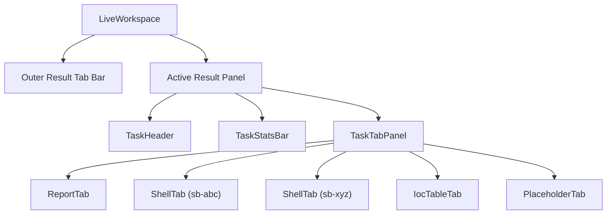
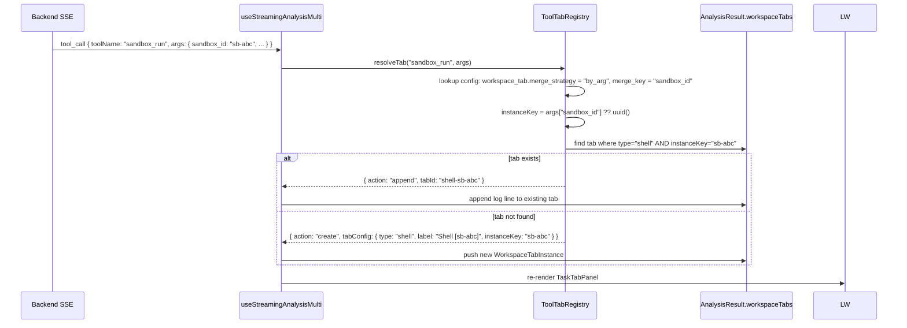
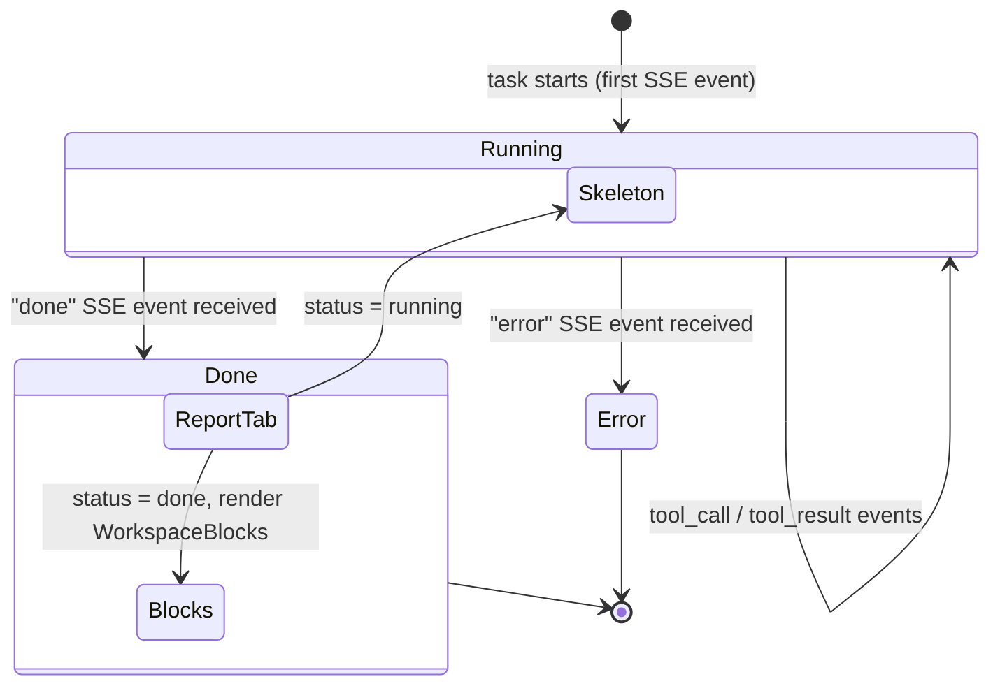

# Design: workspace-task-panel

## Metadata

| Field   | Value                    |
|---------|--------------------------|
| Slug    | `workspace-task-panel`   |
| Date    | 2026-04-14               |
| Status  | Draft                    |

> `design.md` is the implementation source of truth. No Cursor plan file was used; this is a Path B greenfield design based on Phase 1 exploration dialogue.

---

## Todo list

- [x] **yaml-workspace-tab-field** — Add `workspace_tab` config block to `tool_presentation.yaml` for `sandbox_run`, `sandbox_pty_run`, `extract_iocs`
- [x] **type-analysis-result-extend** — Extend `AnalysisResult` in `src/types/project.ts` with `status`, `stats`, `workspaceTabs`
- [x] **type-workspace-tab** — Add `WorkspaceTabConfig`, `WorkspaceTabInstance`, `TabMergeStrategy` types to `src/types/analysis.ts`
- [x] **lib-tool-tab-registry** — Create `src/lib/tool-tab-registry.ts`: loads config from `/api/tool-tab-config`, resolves merge decisions on each `tool_call`
- [x] **backend-tool-tab-config-endpoint** — Add `GET /tool-tab-config` endpoint in Python backend that reads `workspace_tab` fields from `tool_presentation.yaml`
- [x] **component-task-header** — Create `src/components/workspace/TaskHeader.tsx`: title + status badge + share/export buttons
- [x] **component-task-stats-bar** — Create `src/components/workspace/TaskStatsBar.tsx`: execution stats row (threat level, duration, tool call count, sandbox count)
- [x] **component-task-tab-panel** — Create `src/components/workspace/TaskTabPanel.tsx`: dynamic inner tab container (shadcn Tabs)
- [x] **component-report-tab** — Create `src/components/workspace/tabs/ReportTab.tsx`: renders existing blocks; shows pulse skeleton when `status === 'running'`
- [x] **component-shell-tab** — Create `src/components/workspace/tabs/ShellTab.tsx`: terminal-style output viewer with ANSI color support, auto-scroll, status badge
- [x] **component-placeholder-tabs** — Create stub `BinaryPipelineTab.tsx` and `InvestigationTab.tsx` (placeholder with "Coming soon" message)
- [x] **hook-streaming-update** — Update `useStreamingAnalysisMulti.ts` to: (a) track `workspaceTabs` from `tool_call` events, (b) accumulate `toolCallCount`/`sandboxRunCount`/`resultStartTime`, (c) expose via streaming state
- [x] **live-workspace-restructure** — Restructure `LiveWorkspace.tsx` to render 3-layer layout: outer result tabs → `TaskHeader` → `TaskStatsBar` → `TaskTabPanel`
- [x] **vitest-tab-registry** — Unit tests for `tool-tab-registry.ts` merge logic (`by_arg` with same/different/absent key) — 9 tests passing
- [x] **vitest-stats-bar** — Unit tests for `TaskStatsBar` rendering with various stats combinations — 8 tests passing

---

## Architecture

```
LiveWorkspace (outer container)
│
├── ScrollArea: AnalysisResult Tab Bar  [existing outer tabs — unchanged]
│     Tab[0] Tab[1*] Tab[2] ...
│
└── Active AnalysisResult Panel
      │
      ├── TaskHeader                    [NEW]
      │     title · status badge · share/export
      │
      ├── TaskStatsBar                  [NEW]
      │     threat-level · duration · tool-calls · sandbox-runs · ...
      │
      └── TaskTabPanel                  [NEW — shadcn Tabs]
            │
            ├── Tab "报告" (always first, always present)
            │     └── ReportTab: skeleton | rendered WorkspaceBlocks
            │
            ├── Tab "Shell [sb-xxx]"    (if sandbox_run called)
            │     └── ShellTab: ANSI log lines, auto-scroll, status
            │
            ├── Tab "Shell [sb-yyy]"    (if different sandbox_id)
            │     └── ShellTab: ...
            │
            ├── Tab "IOC 提取"          (if extract_iocs called)
            │     └── IocTableTab: structured IOC table
            │
            └── Tab "..."               (future: binary, graph, browser)
```

### Mermaid — Component hierarchy



---

## Flows

### SSE tool_call → Tab resolution flow



### Task lifecycle → Report Tab state



---

## Contracts

### 1. `tool_presentation.yaml` — new `workspace_tab` field

```yaml
# Schema for workspace_tab (optional; omit = no tab generated)
workspace_tab:
  type: string          # tab component type: "shell" | "ioc_table" | "binary_pipeline" | "investigation" | ...
  label: string         # display label in tab strip
  icon: string          # lucide-react icon name (e.g. "terminal", "shield", "cpu")
  merge_strategy:       # "by_arg" | "always" | "never"
    by_arg:             # merge when merge_key arg value matches (null/absent → always new)
    always:             # always merge into one tab of this type per task
    never:              # always create new tab on each tool call
  merge_key: string     # (required when merge_strategy = "by_arg") tool arg field name

# Applied to tools:
sandbox_run:
  workspace_tab:
    type: shell
    label: "Shell"
    icon: terminal
    merge_strategy: by_arg
    merge_key: sandbox_id

sandbox_pty_run:
  workspace_tab:
    type: shell
    label: "Shell"
    icon: terminal
    merge_strategy: by_arg
    merge_key: sandbox_id

extract_iocs:
  workspace_tab:
    type: ioc_table
    label: "IOC 提取"
    icon: shield
    merge_strategy: always
```

### 2. Extended `AnalysisResult` type

```typescript
// src/types/project.ts
export type AnalysisResultStatus = 'running' | 'done' | 'error';

export interface AnalysisResultStats {
  durationMs?: number;       // wall-clock from first to last SSE event
  toolCallCount?: number;    // total tool_call events
  sandboxRunCount?: number;  // tool_call events where toolName matches sandbox_*
  severity?: 'critical' | 'high' | 'medium' | 'low' | 'info';
}

export interface WorkspaceTabInstance {
  id: string;                // stable tab id (e.g. "shell-sb-abc")
  type: string;              // matches workspace_tab.type
  label: string;             // display label (may include instanceKey suffix)
  icon: string;              // lucide icon name
  instanceKey: string;       // merge discriminator value (sandbox_id or uuid for one-shots)
  data: WorkspaceTabData;    // type-discriminated payload
}

export type WorkspaceTabData =
  | { kind: 'shell'; lines: ShellLine[] }
  | { kind: 'ioc_table'; iocs: IntelCard[] }
  | { kind: 'placeholder'; message: string };

export interface ShellLine {
  ts: number;       // epoch ms
  stream: 'stdout' | 'stderr';
  text: string;     // raw line (may contain ANSI codes)
}

export interface AnalysisResult {
  id: string;
  title: string;
  userInput: string;
  blocks: WorkspaceBlock[];
  timestamp: Date;
  // --- NEW ---
  status: AnalysisResultStatus;
  stats: AnalysisResultStats;
  workspaceTabs: WorkspaceTabInstance[];
}
```

### 3. `GET /tool-tab-config` response

```json
{
  "tools": {
    "sandbox_run": {
      "workspace_tab": {
        "type": "shell",
        "label": "Shell",
        "icon": "terminal",
        "merge_strategy": "by_arg",
        "merge_key": "sandbox_id"
      }
    },
    "sandbox_pty_run": { "...": "..." },
    "extract_iocs": { "...": "..." }
  }
}
```

---

## Edge Cases & Errors

| Case | Handling |
|------|----------|
| `sandbox_id` absent in `sandbox_run` args | `instanceKey = uuid()` → always new tab (one-shot mode) |
| Same tool, `merge_strategy: always`, called N times | Single tab, all output appended |
| SSE `error` event before any blocks | `status = 'error'`; ReportTab shows error state instead of skeleton/blocks |
| `tool-tab-config` fetch fails at startup | `ToolTabRegistry` falls back to empty map — no tabs generated, only Report tab shown |
| Very long shell output (> 10k lines) | ShellTab virtualizes or caps at last 5000 lines with "truncated" notice |
| `label` collision (two tabs same label) | Append instanceKey suffix: `"Shell [sb-abc]"` vs `"Shell [sb-xyz]"` |

---

## Operational / Rollout

- **Backward compatibility**: `AnalysisResult` changes are additive. Old persisted records in Supabase `messages.blocks` lack `status`/`workspaceTabs`; frontend defaults `status = 'done'`, `workspaceTabs = []` when absent → renders Report tab only (existing behavior).
- **Feature flag**: None required — no existing tab behavior is removed; new tabs only appear when `workspace_tab` is declared in YAML and the corresponding tool is called.
- **YAML changes**: `tool_presentation.yaml` is loaded at backend startup; no restart required if served via the new `/tool-tab-config` endpoint (hot-readable). If bundled at build time, restart required.

---

## Implementation Order

1. **YAML + backend endpoint** (`yaml-workspace-tab-field` + `backend-tool-tab-config-endpoint`) — foundation; frontend cannot resolve tabs without this
2. **Types** (`type-analysis-result-extend` + `type-workspace-tab`) — required before any component work
3. **ToolTabRegistry** (`lib-tool-tab-registry`) + unit tests (`vitest-tab-registry`) — core merge logic
4. **Hook update** (`hook-streaming-update`) — wires SSE events to new state shape
5. **Components** (`component-task-header` → `component-task-stats-bar` → `component-task-tab-panel` → `component-report-tab` → `component-shell-tab` → `component-placeholder-tabs`)
6. **LiveWorkspace restructure** (`live-workspace-restructure`) — final wiring
7. **StatsBar unit tests** (`vitest-stats-bar`)

---

## Rationale (ADR notes)

| Decision | Rationale |
|----------|-----------|
| Config-driven tab declaration in YAML | Adding a new tool tab requires zero frontend code changes — only YAML. Consistent with existing `presentation` / `emit_output` pattern. |
| `merge_strategy: by_arg` + `merge_key` | Generic enough to handle sandbox_id, future browser session ids, etc. without a per-tool switch. |
| Report tab always first, always present | Preserves existing block-rendering behavior as the "baseline" — no regression risk. New tabs are additive. |
| No new SSE event types | Avoids protocol versioning complexity. Frontend reads existing `tool_call` events and consults local config to decide tab behavior. |
| `status` on `AnalysisResult` (not on Block) | Status is a task-level concept, not a block-level one. Driving skeleton animation from result status is simpler than per-block streaming state. |
| ShellTab ANSI rendering | Sandbox output often contains colors/formatting. `ansi-to-html` or equivalent needed for readable output. |

---

## UI Breakdown

### TaskHeader

```
┌─────────────────────────────────────────────────────────┐
│ 📋  二进制恶意分析 — sample.exe        [● 分析中]  [导出▼] │
└─────────────────────────────────────────────────────────┘
```

- `title`: from `AnalysisResult.title`
- Status badge: `running` = pulse dot + "分析中" / `done` = green "完成" / `error` = red "失败"
- Export / share buttons moved here from LiveWorkspace header (only shown when `status !== 'running'`)

### TaskStatsBar

```
┌──────────────────────────────────────────────────────────┐
│  🔴 威胁: Critical  │  ⏱ 2m 34s  │  🔧 12次工具调用  │  📦 2次沙箱  │
└──────────────────────────────────────────────────────────┘
```

- Only shown when `status === 'done'` (hidden while running to avoid layout jump)
- Stats sourced from `AnalysisResult.stats`

### TaskTabPanel — inner tabs

```
[ 📄 报告 ] [ 💻 Shell [sb-abc] ] [ 💻 Shell [sb-xyz] ] [ 🛡 IOC 提取 ]
─────────────────────────────────────────────────────────────────────
  (tab content area)
```

- Tab order: Report always first, then tabs in order of first appearance
- Active tab indicator: bottom border accent color

### ReportTab — running state

```
┌───────────────────────────────────────────┐
│  ████████████████████  ← pulse skeleton   │
│  ████████████  ← pulse skeleton           │
│                                           │
│  Agent 正在分析，结果将在完成后展示...       │
└───────────────────────────────────────────┘
```

### ShellTab

```
┌───────────────────────────────────────────────────────┐
│  沙箱: sb-abc   ubuntu:22.04   [● 运行中]              │
├───────────────────────────────────────────────────────┤
│  [00:00.12] $ ./sample.exe --test                     │
│  [00:00.34] Starting execution...                     │
│  [00:02.11] ⚠ Registry write attempt detected         │
│  [00:04.50] Process exited with code 1                │
└───────────────────────────────────────────────────────┘
```

- Monospace font, dark background regardless of theme
- Auto-scroll to bottom; pause on manual scroll up
- Status badge in header reflects final exit code

---

## Code Touch List

| Path | Action | Risk |
|------|--------|------|
| `python-agent-service/config/tool_presentation.yaml` | Add `workspace_tab` blocks | Low — additive YAML |
| `python-agent-service/app/main.py` or router | Add `GET /tool-tab-config` | Low — read-only endpoint |
| `src/types/project.ts` | Extend `AnalysisResult` | Medium — touches streaming hook |
| `src/types/analysis.ts` | Add new types | Low — additive |
| `src/lib/tool-tab-registry.ts` | New file | Low |
| `src/hooks/useStreamingAnalysisMulti.ts` | Update state population | **High** — core streaming hook |
| `src/components/LiveWorkspace.tsx` | Restructure layout | **High** — main workspace component |
| `src/components/workspace/TaskHeader.tsx` | New file | Low |
| `src/components/workspace/TaskStatsBar.tsx` | New file | Low |
| `src/components/workspace/TaskTabPanel.tsx` | New file | Low |
| `src/components/workspace/tabs/ReportTab.tsx` | New file | Low |
| `src/components/workspace/tabs/ShellTab.tsx` | New file | Low |
| `src/components/workspace/tabs/BinaryPipelineTab.tsx` | New stub | Low |
| `src/components/workspace/tabs/InvestigationTab.tsx` | New stub | Low |

---

## Testing Strategy

| Layer | What | Tool |
|-------|------|------|
| Unit | `ToolTabRegistry.resolveTab()` — all merge_strategy cases | Vitest |
| Unit | `TaskStatsBar` — renders correctly with partial stats | Vitest + React Testing Library |
| Unit | `ReportTab` — skeleton shown when `status=running`, blocks shown when `done` | Vitest + RTL |
| Integration | SSE `tool_call` → `workspaceTabs` populated correctly in hook | Vitest (mock SSE) |
| E2E (Phase 6) | Sandbox task → Shell tab appears; two sandbox_ids → two Shell tabs | Playwright MCP |
| E2E (Phase 6) | Task running → skeleton visible; task done → blocks visible | Playwright MCP |

---

## Design Review Handoff

- **Slug**: `workspace-task-panel`
- **Mockup status**: TBD (user to confirm or skip)
- **`acceptance-ui.md`**: to be written after user provides UI criteria
- **`target.local.yaml`**: already present at `.cursor/design-review-handoff/target.local.yaml`
